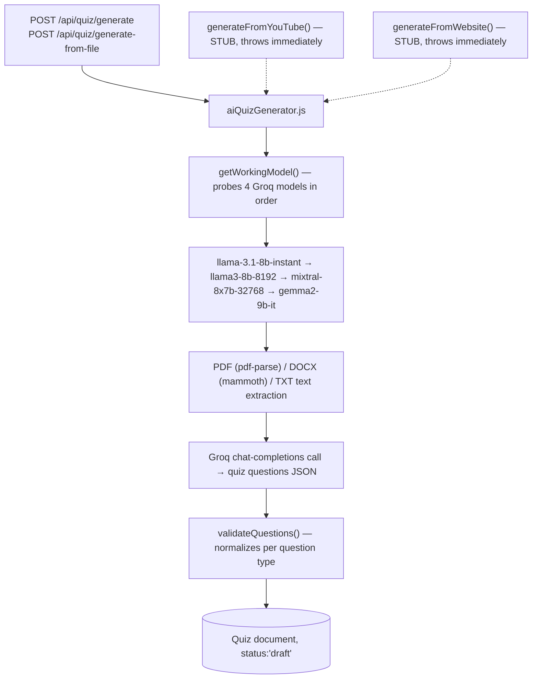
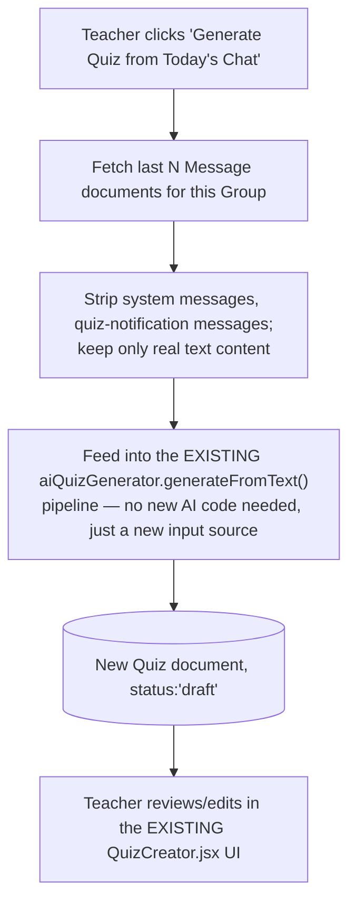
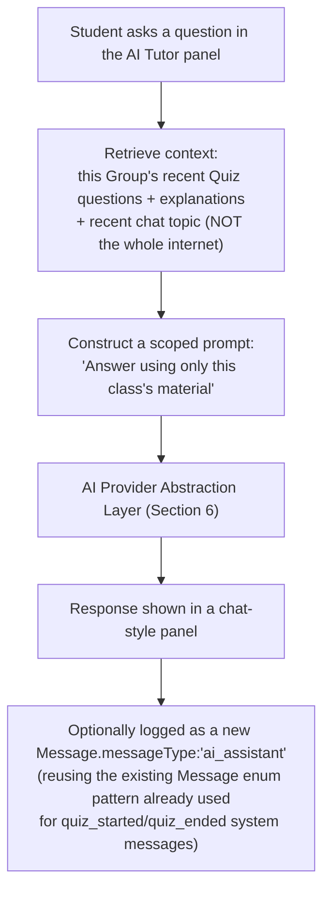
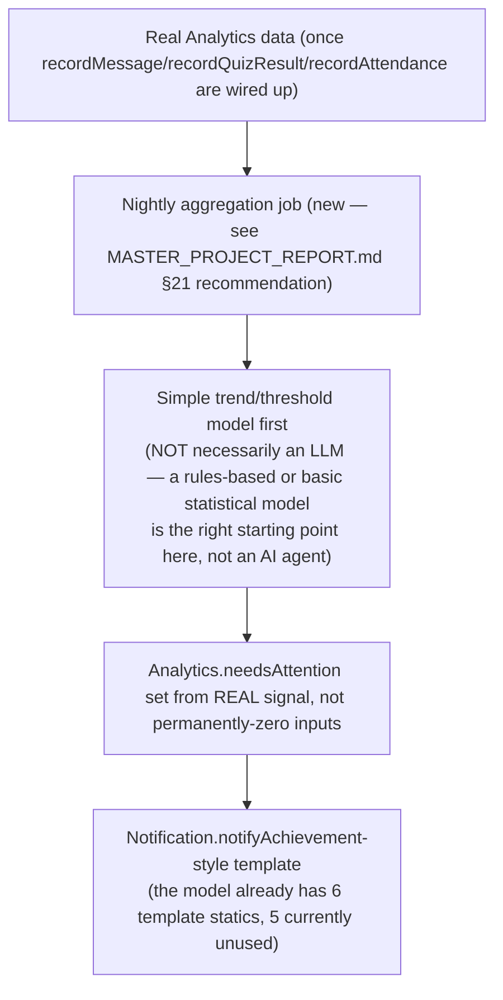
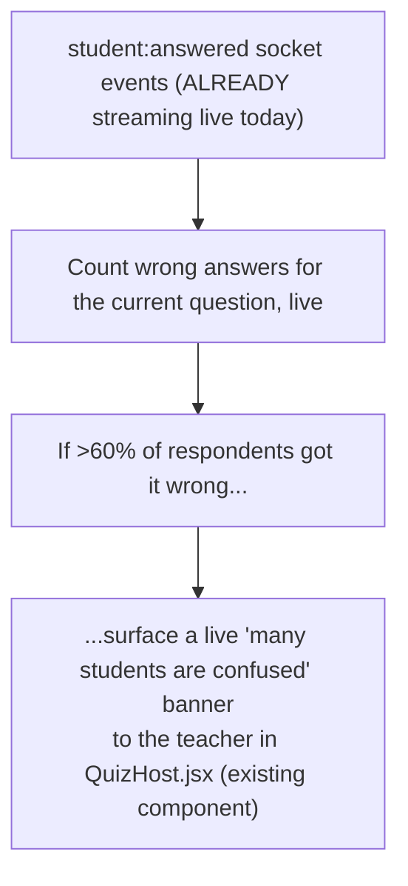
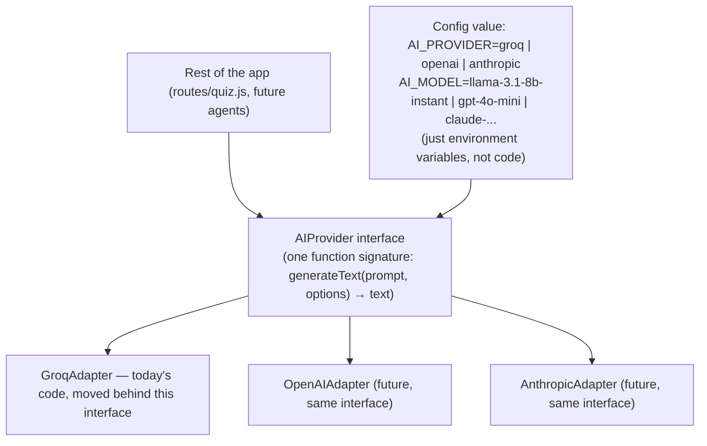

# ClassVibe — AI_ROADMAP.md

**Every future AI feature. Every AI workflow. Every AI agent. Every automation.**

This document builds on the 100-feature list already sketched in `MASTER_PROJECT_REPORT.md` §22, but organizes it into actual **workflows** (input → processing → output), named **agents** (a persona with a defined job, tools, and boundaries), and **automations** (trigger → action rules), plus a concrete answer to "how do we avoid rewriting code every time we change AI models or providers" (Section 6 — directly relevant to the project owner's question about swapping Groq for another provider).

Grounded in what exists today: `backend/services/aiQuizGenerator.js` (Groq Cloud, 4-model fallback chain, PDF/DOCX/TXT parsing, quiz-question generation) is the **only** AI integration currently in the codebase. Everything else in this document is proposed, not built.

---

## Table of Contents

1. Current AI Footprint (what exists today)
2. AI Feature Catalog by Audience
3. AI Workflow Diagrams (input → processing → output)
4. AI Agent Roster
5. Automation Rule Catalog (trigger → action)
6. Model-Agnostic AI Architecture (the "never rewrite code again" design)
7. Phased Rollout Plan
8. Risks & Guardrails

---

# 1. Current AI Footprint

This is a single, narrow, one-shot "generate quiz questions from text" capability — no chat-style AI, no agents, no memory/context beyond a single request, no multi-modal (image/audio) input despite `Quiz.aiSource.type` reserving an `'image'` enum value for future use.

---

# 2. AI Feature Catalog by Audience

*(This restates and organizes the 100-idea list from `MASTER_PROJECT_REPORT.md` §22 — see that section for the full flat list; here each idea is grouped by who uses it and what existing system it would hook into.)*

## 2.1 Teacher-facing
| Feature | Hooks into (existing system) |
|---|---|
| Auto-summarize a chat session into a lesson recap | `Message` collection (read-only) |
| Auto-generate a follow-up quiz from today's chat discussion | `aiQuizGenerator.js` (reuse the existing generation pipeline, new input source: chat transcript instead of uploaded file) |
| Live difficulty-adjustment suggestions based on real-time quiz accuracy | `QuizSession.participants[].answers[]` (already streaming live) |
| Disengagement flagging | `Analytics` model — **but only works once its write-path gap is fixed** (see `DATABASE_BIBLE.md` §11) |
| AI co-teacher answering routine student chat questions | New: a chat-embedded AI participant (see Section 4, Teaching Copilot Agent) |
| Auto-generate session agenda from a syllabus upload | Reuses the existing PDF/DOCX text-extraction pipeline already in `aiQuizGenerator.js` |
| Chat sentiment/tone analysis | New: a lightweight classifier pass over `Message.content` |
| AI-suggested discussion prompts from quiz miss-patterns | `QuizResult` (once populated) |
| Auto-translate teacher announcements | New: a translation pass, reusing the same provider-abstraction layer (Section 6) |
| AI grading assistant for open-ended answers | New question type not yet in `Quiz.questions[].questionType` enum |

## 2.2 Student-facing
| Feature | Hooks into |
|---|---|
| Personalized study plan from quiz history | `QuizResult` (once populated) |
| AI tutor chatbot scoped to class material | New: retrieval over the group's own `Message`/`Quiz` content (a simple RAG pattern, not full internet access) |
| Auto-flashcards from missed questions | `QuizResult.answers[]` (once populated) |
| Spaced-repetition scheduler | New scheduling logic layered on top of `QuizResult` |
| AI-explained answer rationales | Already has a field for this — `Quiz.questions[].explanation` is generated today but under-surfaced in the review UI |
| Voice-input answers | New: speech-to-text pass before submitting to the existing `student:submitAnswer` socket flow |
| AI study-buddy matching | New: a matching algorithm over `Analytics`/`QuizResult` (once populated) |
| Gamified encouragement nudges from streak data | `QuizSession.participants[].streak` (already tracked, currently display-only) |

## 2.3 AI Quiz Builder (extends the existing service directly)
| Feature | Status relative to today |
|---|---|
| Implement the stubbed YouTube/website generation | The frontend UI and `Quiz.aiSource.type:'url'` enum value already exist — only the backend route + `generateFromYouTube`/`generateFromWebsite` implementations are missing |
| Auto-detect optimal question-type distribution per subject | Today's 60/20/10/10 MC/FIB/TF/multi-select split is a fixed prompt instruction — this would make it dynamic |
| Image-based question generation | `Quiz.aiSource.type:'image'` is already a reserved enum value, unimplemented |
| Auto-difficulty-calibration from historical class performance | Needs `QuizResult`/`Analytics` populated first |
| Duplicate-question detection across a teacher's history | New: embedding-similarity check across a teacher's `Quiz` collection |
| Better distractor (wrong-answer) generation | Prompt-engineering improvement to the existing `generateFromText` prompt |
| Multi-language quiz generation | Same generation pipeline, added `language` parameter |

## 2.4 Attendance / Engagement / Learning-gap detection
All of these are **blocked on the same prerequisite**: `Analytics.recordMessage`/`recordQuizResult`/`recordAttendance` need to actually be called somewhere (see `DATABASE_BIBLE.md` §11.2) before any AI layered on top of them would have real data to reason over. Building AI features on the current data would just produce confident-sounding conclusions from permanently-zero inputs — this is flagged prominently because it's the single most important sequencing dependency in this entire roadmap.

## 2.5 Parent / School / Predictive / Digital Twin / Voice / Vision / Multilingual
See `MASTER_PROJECT_REPORT.md` §22 for the full itemized list (items 34–100) — all of these are additive, none require re-architecting the current AI service, and most explicitly depend on the `Organization`/`ParentLink` schemas proposed in `DATABASE_BIBLE.md` §17.

---

# 3. AI Workflow Diagrams

## 3.1 Workflow: "Auto-generate a follow-up quiz from today's chat" (proposed)

**Why this is a good "phase 1" feature**: it requires zero new AI infrastructure — it reuses the exact same generation function that already works today, just with chat messages instead of an uploaded file as the source text.

## 3.2 Workflow: AI Tutor Chatbot (proposed)

## 3.3 Workflow: Disengagement / Needs-Attention Flagging (proposed — post-Analytics-fix)

**Important scoping note**: "AI" doesn't have to mean "call an LLM" for every feature — engagement flagging from real, populated `Analytics` data is better served by simple threshold/statistical logic first; save LLM calls for genuinely generative tasks (summarization, question generation, conversational tutoring), not for things a `if score < threshold` check already does well and cheaply.

## 3.4 Workflow: Real-time "Confusion Detector" (proposed)

**Why this is a good "phase 1" feature**: the data (`student:answered` counts) is already flowing through the existing socket architecture today — this needs **zero new AI model calls at all**, just a new UI element reacting to data that already exists.

---

# 4. AI Agent Roster

An "agent" here means: a named AI persona with a defined job, a defined set of tools/data it's allowed to touch, and defined boundaries (what it must NOT do).

```mermaid
flowchart TD
    subgraph Agents["Proposed AI Agents"]
        A1["Teaching Copilot Agent<br/>Job: help teachers prep/run class<br/>Tools: read Quiz/Message history, generate quizzes<br/>Boundary: never posts to chat without teacher approval"]
        A2["Student Tutor Agent<br/>Job: answer student questions about class material<br/>Tools: read THIS group's Quiz/explanation content only<br/>Boundary: cannot see other students' scores/private data"]
        A3["Grading Agent<br/>Job: evaluate open-ended answers (future question type)<br/>Tools: read the question, the rubric, the student's answer<br/>Boundary: always shows its reasoning; teacher can override any grade"]
        A4["Scheduling Agent<br/>Job: suggest optimal session times from attendance history<br/>Tools: read ScheduledSession + Analytics history<br/>Boundary: only suggests, never auto-schedules without teacher confirmation"]
        A5["Moderation Agent<br/>Job: flag (not auto-delete) concerning chat content<br/>Tools: read Message.content as it's sent<br/>Boundary: never silently deletes — always surfaces to a human teacher first"]
        A6["Analytics Insight Agent<br/>Job: turn raw Analytics numbers into a plain-language summary<br/>Tools: read Analytics/QuizResult (once populated)<br/>Boundary: clearly labels itself as AI-generated commentary, not fact"]
        A7["Parent Communication Agent<br/>Job: draft a weekly progress digest for parents<br/>Tools: read one specific student's Analytics/QuizResult<br/>Boundary: requires the ParentLink relationship to exist and be verified first"]
    end
```

## 4.1 Why boundaries matter more than capability here
Every agent above is deliberately scoped to **read specific data and either draft something for human review or take a clearly-labeled, reversible action** — none of them are designed to autonomously delete content, change grades, or contact parents without a human in the loop. This is a deliberate design choice for a K-12 education product: the cost of an AI mistake (a wrong grade shown to a parent, an inappropriately auto-deleted message) is much higher in a classroom context than in, say, a marketing tool, so "agent drafts, human approves" should be the default pattern for anything student-facing or parent-facing until there's a long track record of reliability.

---

# 5. Automation Rule Catalog (trigger → action)

| # | Trigger | Action | New or reuses existing system? |
|---|---|---|---|
| 1 | Quiz question answered incorrectly by >60% of the class, live | Show teacher a "many students confused" banner | Reuses existing `student:answered` stream |
| 2 | Student's `Analytics.needsAttention` flips to true (once real) | Send teacher a `Notification` (reusing the already-defined-but-unused `notifyAchievement`-style template pattern) | Reuses `Notification` model |
| 3 | A `ScheduledSession` is 20 minutes away (already implemented, non-AI) | Reminder notification | **Already exists today** — `jobs/sessionReminder.js` |
| 4 | A quiz completes | Auto-generate a plain-language class recap for the teacher | New — reuses the existing `aiQuizGenerator.js` Groq connection, different prompt |
| 5 | A student's quiz score drops significantly vs. their own history | Auto-suggest a remediation flashcard set | New — depends on `QuizResult` history existing |
| 6 | A chat message is flagged by the Moderation Agent | Surface to teacher for one-click delete/dismiss (never auto-delete) | New — teacher still makes the final call, consistent with the "no teacher moderation override exists yet" gap noted in `MASTER_PROJECT_REPORT.md` §12 — this automation would be the natural moment to finally add that override too |
| 7 | A new AI model becomes available from the current or a different provider | Ops team flips a config value; **no code change required** (see Section 6) | New — this is the direct answer to the project owner's "will I have to rewrite code every time" question |

---

# 6. Model-Agnostic AI Architecture ("never rewrite code again" design)

This section directly answers: *"If I use Groq now but want to switch providers or upgrade models later, do I have to change code every time? Can it just update automatically?"*

## 6.1 The problem with today's code
`aiQuizGenerator.js` today calls Groq's API URL and model names **directly, hardcoded, inside the same file that also does prompt-building, PDF-parsing, and answer-validation.** If you wanted to add OpenAI or Anthropic as an option tomorrow, you'd have to edit this same file and risk breaking the parts that already work.

## 6.2 The fix: a thin "provider adapter" layer

**How this answers the question, in plain terms**: today, the app's business logic (build the prompt, validate the questions, save the quiz) is tangled together with "which AI company and which exact model to call." If those two things are separated — so that "call the AI" is always the same one simple instruction no matter which company is behind it — then switching providers, or upgrading to a newer model from the *same* provider, becomes **changing one line in a settings file, not editing code.** The fallback-chain idea already in today's code (`getWorkingModel()` trying 4 models in order) is actually a great starting point for this — it just needs to be generalized so the list can include models from *different companies*, not only Groq's own models, and so that list can be updated without touching the surrounding code.

## 6.3 What this buys you concretely
- **New Groq model released** → update one config value, done, no code change.
- **Groq has an outage / price increase** → flip `AI_PROVIDER` to a backup provider, done, no code change (assuming that provider's adapter was already built once, ahead of time).
- **Want to A/B test two models for quality** → route a percentage of requests to each provider via config, no code change.
- **What still DOES require a small code change**: if a brand-new provider has a genuinely different way of doing things (e.g., a feature the current interface doesn't have, like native image understanding) — you'd write one new adapter file, once, for that provider. But you would **never** need to touch the quiz-generation logic, the prompt templates, or the validation code again after that adapter exists.

## 6.4 One caveat worth being honest about
Different AI models are not perfectly interchangeable in *quality* — a cheaper/older model may produce worse quiz questions than a newer one, even through the exact same adapter interface. Switching providers/models without code changes solves the *engineering* problem (not having to rewrite code), but someone still has to periodically **check that the output quality is still good** after a switch — that's a review/QA task, not a coding task, and it's a genuinely sensible thing to keep doing by hand even once the technical swapping is automatic.

---

# 7. Phased Rollout Plan

| Phase | Focus | Depends on |
|---|---|---|
| **Phase 1 (near-term)** | Confusion-detector banner (§3.4), chat-to-quiz generation (§3.1), implement the already-stubbed YouTube/website generation, build the provider-abstraction layer (§6) | Nothing new — all reuse existing systems |
| **Phase 2** | AI Tutor chatbot (scoped, read-only over class content), AI-drafted class recaps, better distractor generation | Provider abstraction layer from Phase 1 |
| **Phase 3** | Disengagement flagging, personalized study plans, parent digests | **Requires the `Analytics`/`QuizResult` write-path fix first** — this is a hard blocker, not a preference |
| **Phase 4** | Grading agent for open-ended questions, adaptive difficulty, marketplace-quality-scoring | New question types, `Organization`/marketplace schemas from `DATABASE_BIBLE.md` §17 |
| **Phase 5** | Voice/vision AI, full multilingual support, predictive analytics, digital twin | Largest lift — genuinely new capability, not just new prompts over existing data |

---

# 8. Risks & Guardrails

- **Cost risk**: today, AI-generation calls are completely uncapped per user (no rate limiting exists at all — see `MASTER_PROJECT_REPORT.md` §14). Every new AI feature added multiplies this exposure. A per-organization usage quota (proposed in `DATABASE_BIBLE.md` §17.1, `Organization.aiGenerationQuotaPerMonth`) should land **before**, not after, adding more AI features.
- **Trust risk**: AI-generated content (quiz questions, tutor answers, grading) should always be clearly labeled as AI-generated and, for anything shown to a parent or used in grading, reviewable/overridable by a human — consistent with the agent-boundary design in Section 4.
- **Data-privacy risk**: any AI feature that reads student data (chat, quiz results, analytics) needs to be scoped tightly (the Student Tutor Agent should never see another student's data) and, once the `Organization`/multi-tenant model exists, must never leak data across organization boundaries.
- **Quality-drift risk**: as covered in Section 6.4, automatic provider/model swapping solves the code-change problem but not the "is the output still good" problem — this needs an ongoing, lightweight human-review process, not a one-time check.

---

*End of AI_ROADMAP.md. For the full flat 100-feature idea list, see `MASTER_PROJECT_REPORT.md` §22. For how this roadmap's data dependencies (Analytics, Organization, ParentLink) are structured, see `DATABASE_BIBLE.md`. For how this fits the overall growth stages, see `SAAS_EVOLUTION.md`.*
