# ClassVibe — DATABASE_BIBLE.md

**Database-only reference.** Every schema, every field, every relationship, every index, every instance/static method, every lifecycle transition, every piece of data-layer technical debt, and every proposed future schema — for all 10 Mongoose models in the system. This document deliberately excludes API/route documentation (see `MASTER_PROJECT_REPORT.md` §9) and architecture-level concerns (see `SYSTEM_ARCHITECTURE.md` §7) except where needed to explain how a schema is actually used in practice.

Stack: **Mongoose 7.8.8** (declared `^7.0.3`), MongoDB driver `mongodb` `7.0.0` (both mongoose's vendored copy and a redundant direct `^6.3.0` dependency in `backend/package.json`). Connection via `backend/config/db.js` — a bare `mongoose.connect(MONGODB_URI, {useNewUrlParser, useUnifiedTopology})` (both options are deprecated no-ops under this driver version), no retry/backoff, no `maxPoolSize` tuning, `process.exit(1)` on connection failure, called from `server.js` without being awaited at the call site.

All field names, types, defaults, and line-level behavior below are taken directly from the model source files under `backend/models/`.

---

## Table of Contents

1. Conventions & How to Read This Document
2. Master Entity-Relationship Diagram
3. Model: `User`
4. Model: `Group`
5. Model: `Message`
6. Model: `Notification`
7. Model: `Quiz`
8. Model: `QuizSession`
9. Model: `QuizResult`
10. Model: `ScheduledSession`
11. Model: `Analytics`
12. Model: `Poll` (dead)
13. Cross-Model Relationship Matrix
14. Index Catalog & Query Pattern Analysis
15. Data Integrity & Consistency Audit
16. Schema Evolution History (reconstructed from in-code evidence)
17. Proposed Future Schemas (SaaS expansion)
18. Data Retention & Lifecycle Policy (current vs. recommended)
19. Appendix: Quick-Reference Field Tables

---

# 1. Conventions & How to Read This Document

For each model, this document provides, in order:
- **Purpose** — what real-world concept the collection represents.
- **Complete field table** — every field, its type, default, required/validation rules, and any Mongoose-level quirks.
- **Indexes** — every explicit index, noting redundancy with field-level `unique`/`index` declarations where it exists.
- **Instance & static methods** — every method defined on the schema, and whether it is actually called anywhere in the live codebase (a large fraction are not).
- **Hooks** — pre/post middleware.
- **Relationships** — every ObjectId reference, in both directions.
- **Lifecycle diagram** — a Mermaid state diagram showing every transition the document actually goes through in the live system, explicitly marking unreachable states.
- **Where used** — concrete file:function call sites.
- **Technical debt** — schema-level issues found.
- **Future field proposals** — concrete, additive suggestions.

---

# 2. Master Entity-Relationship Diagram

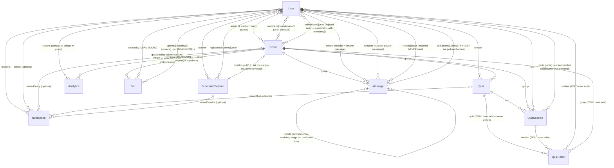

**Hub analysis**: `User` is referenced by all 9 other models (13 distinct reference points total, counting each array/field separately) — it is the structural center of the entire schema. `Group` is the second-most-referenced entity. `QuizResult`, `Analytics`, `Poll`, and `Notification` are **terminal/leaf nodes** — nothing in the schema graph references *them*; they exist purely to be read (or, in three of those four cases, to never actually be populated with real data at all).

---

# 3. Model: `User`

**File**: `backend/models/User.js` (168 lines)
**Purpose**: The single polymorphic identity table for every human actor — teachers, students, guests, and (unused in practice) admins.

## 3.1 Field table

| Field | Type | Required | Default | Validation / notes |
|---|---|---|---|---|
| `username` | String | yes | — | `unique: true`, `trim`, `minlength: 1`, `maxlength: 60` |
| `name` | String | yes | — | `trim`, `maxlength: 100` |
| `email` | String | yes | — | `unique: true`, `trim`, `lowercase`, regex `/^\S+@\S+\.\S+$/` |
| `password` | String | no | — | `minlength: 6` when present; **optional** to support guest students with no password |
| `role` | String (enum) | no | `'student'` | `['teacher', 'student', 'admin']` — **`'admin'` is never assigned anywhere in the live code**, a reserved-but-unused value |
| `isOnline` | Boolean | no | `false` | |
| `lastSeen` | Date | no | `Date.now` | |
| `socketId` | String | no | `null` | Current Socket.IO connection id — used for direct private-message delivery |
| `profilePhoto` | String | no | `null` | Base64 data URI or URL; no size/content validation at the schema level |
| `createdAt` / `updatedAt` | Date | — | — | via `timestamps: true` |

## 3.2 Indexes
`{username: 1}`, `{email: 1}` — **both are redundant** with the field-level `unique: true` declarations, which already create equivalent unique indexes. Harmless, but doubled index maintenance overhead on every write.

## 3.3 Hooks
- **`pre('save')`**: if `isModified('password')` and a password is set, hash it with `bcrypt` (10 salt rounds). Guests with no password entirely skip this hook's hashing branch.
- **`pre('validate')`**: custom business rule — if `role === 'teacher'` and no `password` is set, calls `this.invalidate('password', 'Teachers must have a password')`. This is the *only* place server-side that a teacher account is guaranteed to have a password; there is no equivalent guarantee enforced anywhere for `role === 'admin'`.

## 3.4 Instance methods
- `comparePassword(enteredPassword)` — `bcrypt.compare`; returns `false` immediately (no compare attempted) if no password is stored, correctly handling the guest-no-password case without throwing.
- `toJSON()` (overridden) — strips `password` and `__v` from every JSON serialization automatically, meaning any `res.json({user})` call is safe by default without each route needing to remember to redact the password field manually.

## 3.5 Static methods
- `findByEmailOrUsername(identifier)` — a single `$or` query across both fields.

## 3.6 Relationships (reverse — every other model that points here)
`Group.admin`, `Group.members[].user`, `Group.onlineUsers[]`, `Message.sender`, `Message.recipient`, `Message.readBy[].user`, `Message.pollOptions[].votes[]`, `Notification.recipient`, `Notification.sender`, `Quiz.creator`, `QuizSession.host`, `QuizSession.participants[].user`, `QuizResult.student`, `ScheduledSession.teacher`, `ScheduledSession.registeredStudents[].user`, `Analytics.student`, `Poll.createdBy`, `Poll.options[].votedBy[]`, `Poll.answers[].user`.

## 3.7 Lifecycle diagram

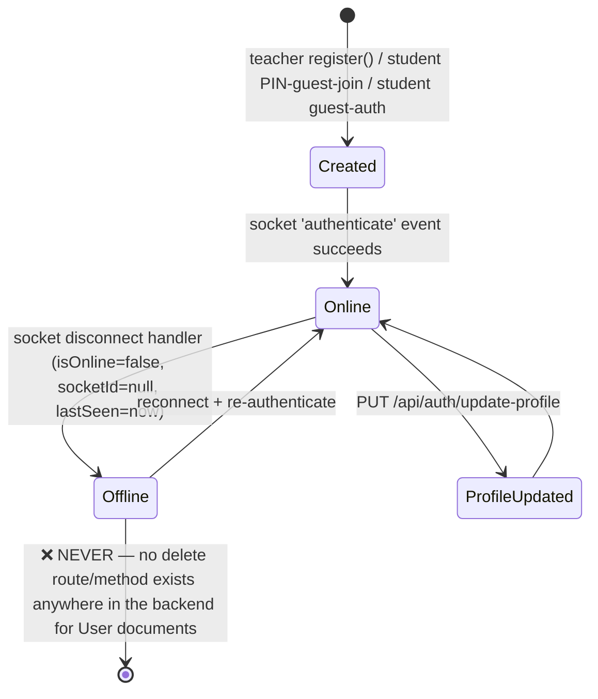

## 3.8 Where used (concrete call sites)
- **Three separate account-creation code paths** exist, all writing to this one collection:
  1. `POST /api/auth/register` (`server.js`) — requires password, honors `pre('validate')`'s teacher-password rule.
  2. `POST /api/groups/join` guest branch (`server.js`) — creates a `User` with a `crypto.randomBytes(8).toString('hex')` **random password the guest is never shown or told**, meaning this exact account can never again be logged into via any password-based flow (including guest-auth for the same email later).
  3. `POST /api/auth/student-guest-auth` (`server.js`) — creates a `User` with a password **the student chose themselves** in the form.
  - **Paths 2 and 3 are mutually incompatible for the same email address** — if a student uses both flows at different times, the second attempt will fail password verification against whatever the first flow stored. This is a confirmed, live account-integrity bug (see also `MASTER_PROJECT_REPORT.md` §19 issue #9).
- **Socket auth handler** (`server.js`, `authenticate` event): updates `socketId`, `isOnline: true`, `lastSeen`.
- **Socket `disconnect` handler**: resets `isOnline: false`, `socketId: null`, `lastSeen`.
- **Private-message delivery** (`server.js`, `sendMessage` handler, private branch): looks up `recipient.socketId` and does a **direct-to-socket-id emit**, not a room-based emit — if `socketId` is stale (multiple tabs, a reconnect not yet reflected in Mongo), the message silently fails to render for the recipient even though `isOnline` may still read `true`.
- **`middleware/auth.js`'s canonical `authenticateToken`** does a real `User.findById(...).select('-password')` — but this file's only consumer is the dead `routes/groupRoutes.js`, so this is the *unused* path. Every live route uses one of five duplicated local copies that trust the JWT payload's `userId` claim without re-querying whether the user still exists.

## 3.9 Technical debt
- Two incompatible guest-account creation flows (Section 3.8).
- Redundant explicit indexes duplicating field-level `unique: true`.
- `role: 'admin'` is a reserved enum value with zero code paths that assign or check for it — dead schema surface.
- No account-deletion path anywhere (no GDPR-style "right to be forgotten" support).
- `profilePhoto` as an inline base64 string risks hitting MongoDB's 16MB document size ceiling if a user uploads a large image (there is no size cap enforced at the schema level; the client-side cap in `Sidebar.js`'s Settings panel is 5MB, enforced only in the browser, not the database).

## 3.10 Future field proposals
- `organizationId` (for multi-tenant SaaS — see Section 17).
- `deletedAt` / `isDeleted` (soft-delete support, since there is currently no delete path at all).
- `emailVerifiedAt` (no email-verification flow exists today).
- `lastPasswordChangeAt` (for security auditing).

---

# 4. Model: `Group`

**File**: `backend/models/Group.js` (151 lines)
**Purpose**: The live classroom/session aggregate — the central real-time "room" entity.

## 4.1 Field table

| Field | Type | Required | Default | Notes |
|---|---|---|---|---|
| `groupName` | String | yes | — | `trim`, `maxlength: 100` |
| `admin` | ObjectId ref `User` | yes | — | The creating teacher |
| `members[]` | subdocument array | — | `[]` | `{ user: ObjectId ref User (required), joinedAt: Date (default now) }` |
| `pin` | String | yes | — | `unique: true`; **`length: 6` is declared but this is not a real Mongoose string validator** (only `minlength`/`maxlength`/`match` are real) — it is silently ignored; actual 6-digit-ness is enforced only by the application-level `generatePIN()` helper, not the schema |
| `qrCode` | String | yes | — | Base64 data-URL image generated via the `qrcode` npm package |
| `isActive` | Boolean | no | `true` | |
| `endedAt` | Date | no | `null` | |
| `onlineUsers[]` | ObjectId[] ref `User` | — | `[]` | A **raw array**, not a subdocument — structurally asymmetric with `members[]`, which uses a richer `{user, joinedAt}` shape for a conceptually similar "who's here" list |
| `allowedEmails[]` | String[] | — | `[]` | `lowercase`, `trim` — an email whitelist; empty array means "allow anyone with the PIN" |
| `createdAt` / `updatedAt` | Date | — | — | `timestamps: true` |

## 4.2 Indexes
`{pin: 1}` (redundant with field-level `unique: true`), `{admin: 1}`, `{isActive: 1}`, `{'members.user': 1}`, `{allowedEmails: 1}`.

## 4.3 Instance methods
- `isMember(userId)`, `isAdmin(userId)` — membership/ownership checks.
- `addMember(userId)` — pushes `{user, joinedAt: now}` if not already present, saves.
- `getJoinedAt(userId)` — looks up a member's join timestamp.
- `endSession()` — sets `isActive=false`, `endedAt=now`, saves. **This is the only status-transition method on the model** — there is no un-end/reactivate method.
- `isEmailAllowed(email)` — empty `allowedEmails` array means allow-all.
- `addAllowedEmail(email)` / `removeAllowedEmail(email)`.

## 4.4 Lifecycle diagram

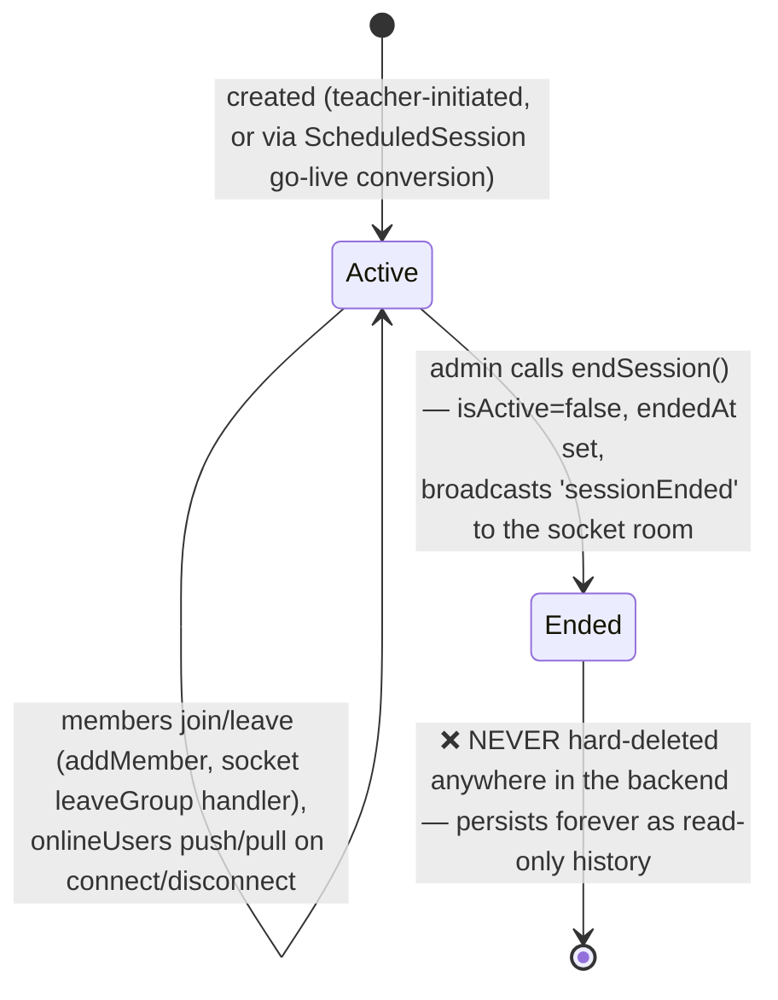

## 4.5 Where used
- **Creation** (`server.js`, `POST /api/groups/create`): loops `Group.findOne({pin})` until a non-colliding 6-digit PIN is found, builds a QR code pointing at `${FRONTEND_URL}?pin=${pin}`, seeds the creating teacher as the first member, then (side-effect, non-fatal on failure) bulk-notifies every student who was ever a member of any of this teacher's past groups.
- **Joining** (`server.js`, `POST /api/groups/join`): three sub-flows (authenticated existing member, authenticated new member with email-whitelist check, unauthenticated guest) — see `User` Section 3.8 for the account-creation side of the guest path.
- **Ending** (`server.js`, `POST /api/groups/:groupId/end`): admin-only, calls `endSession()`, broadcasts `sessionEnded`.
- **Presence tracking** (socket handlers): `joinGroup`/`leaveGroup` events push/pull `onlineUsers`; the `disconnect` handler runs `Group.updateMany({onlineUsers: socket.userId}, {$pull:{onlineUsers: socket.userId}})` to scrub a disconnecting user from **every** group at once in a single query.
- **ScheduledSession → Group conversion** (`routes/schedule.js`, `POST /:sessionId/start`): the exact code path that creates a `Group` from a `ScheduledSession` — but it **only** maps `sessionName → groupName`, `teacher → admin`, and `allowedEmails`; every other `ScheduledSession` field (subject, description, duration, maxStudents, requireApproval, per-student passwords, registrations) is **not** transferred and has no `Group`-side equivalent.
- **`groupController.js`/`groupRoutes.js`** — confirmed **dead code**: `groupRoutes.js` is never mounted in `server.js`; `groupController.js` only exports `joinGroup` (the other four referenced functions — `createGroup`, `getMyGroups`, `getGroupDetails`, `endSession` — don't exist in the file). The one function that *is* defined, `joinGroup`, would itself corrupt data if ever invoked: it does `group.members.push(mongoose.Types.ObjectId(userIdStr))` — pushing a **raw ObjectId**, whereas the live schema defines `members` as an array of `{user, joinedAt}` subdocuments. This confirms the dead controller was written against an earlier, incompatible version of the schema.

## 4.6 Technical debt
- `pin: {length: 6}` is a schema no-op.
- `onlineUsers` (raw ObjectId array) vs. `members` (richer subdocument array) is an inconsistent modeling choice for two conceptually similar "who's present" lists.
- No full-text/name-based search index (`{groupName: 'text'}`) — groups are only ever looked up by PIN or by admin/member ObjectId.
- Orphaned, actively-dangerous dead code (`groupController.js`) that would corrupt the `members` array shape if ever accidentally resurrected without noticing the mismatch.

## 4.7 Future field proposals
- `organizationId` (multi-tenant scoping — Section 17).
- `subject`/`gradeLevel` (currently only `ScheduledSession` carries a `subject` field; live `Group`s created directly, not via scheduling, have no equivalent).
- `archivedAt` distinct from `endedAt` (to distinguish "session ended normally" from "administratively archived/hidden from dashboards").

---

# 5. Model: `Message`

**File**: `backend/models/Message.js` (258 lines) — note a **stale duplicate** exists at the repo root (`C:\ClassVibe\Message.js`), missing `metadata`, `pollOptions`, and the `poll`/`quiz_started`/`quiz_ended` enum values; it is dead weight, not imported by anything.

**Purpose**: The single collection backing group chat, private 1:1 messages, file/media sharing, **embedded** polls, and system-generated quiz-lifecycle chat notifications.

## 5.1 Field table

| Field | Type | Notes |
|---|---|---|
| `group` | ObjectId ref `Group`, required, `index: true` | |
| `sender` | ObjectId ref `User`, default `null` | `null` = system-generated message |
| `content` | String, `maxlength: 5000` | |
| `messageType` | enum, default `'text'` | `['text','system','private','file','poll','quiz_started','quiz_ended']` |
| `metadata` | Mixed, default `null` | Holds `{quizId, sessionId, quizTitle, winnerId, winnerName, winnerScore}` for the two quiz-notification types |
| `recipient` | ObjectId ref `User`, default `null` | Set only for `messageType:'private'` |
| `fileUrl` / `fileName` / `fileSize` / `fileType` | String / Number, default `null` | |
| `pollOptions[]` | subdocument array | `{text: String, votes: [ObjectId ref User]}` — **this is the entire live poll implementation**; there is no separate `Poll` collection wired in |
| `isEdited` / `editedAt` | Boolean / Date | |
| `isDeleted` / `deletedAt` | Boolean / Date | Soft-delete flag |
| `readBy[]` | subdocument array | `{user: ObjectId ref User, readAt: Date default now}` — **modeled, never populated by any live code path** |
| `replyTo` | ObjectId ref `Message`, default `null` | Self-referential; no confirmed live UI for threaded replies in the reviewed frontend |
| `createdAt` / `updatedAt` | via `timestamps: true` | |

## 5.2 Indexes
`{group: 1, createdAt: -1}` (compound — the primary chat-pagination index, though the only live query using it is a hard `limit(100)` fetch, not real cursor pagination), `{sender: 1}`, `{recipient: 1}`, `{isDeleted: 1}`, `{messageType: 1}`.

## 5.3 Instance methods
- `markAsRead(userId)` — **defined, never called anywhere**.
- `editMessage(newContent)` — **defined, but the live socket handler for `editMessage` hand-rolls the equivalent mutation directly rather than calling this method.**
- `deleteMessage()` — sets `deletedAt` in addition to the soft-delete flag. **The live socket `deleteMessage` handler bypasses this method too**, and its own hand-rolled version does **not** set `deletedAt` — meaning the model's own method and the actually-executed code diverge in a small but real way (any future code that trusts `deletedAt` being set whenever `isDeleted` is true would be wrong).
- `canEdit(userId)` / `canDelete(userId)` — ownership checks (sender-only; there is no admin/teacher-override branch anywhere in this model or its consumers).

## 5.4 Static methods
- `createQuizNotification(groupId, type, quizData)` — **defined, never called**; the actual quiz-chat-notification code (`quiz-socket-handlers.js`'s `sendChatNotification`) creates `Message` documents directly with hand-inlined field values instead of calling this static, duplicating the same intent in two places.
- `getRecentMessages`, `getUnreadMessages`, `searchMessages` — all **defined, none called** from any reviewed route or socket handler; the live search feature (`ChatArea.js`) does client-side in-memory filtering instead of using `searchMessages`.

## 5.5 Lifecycle diagram

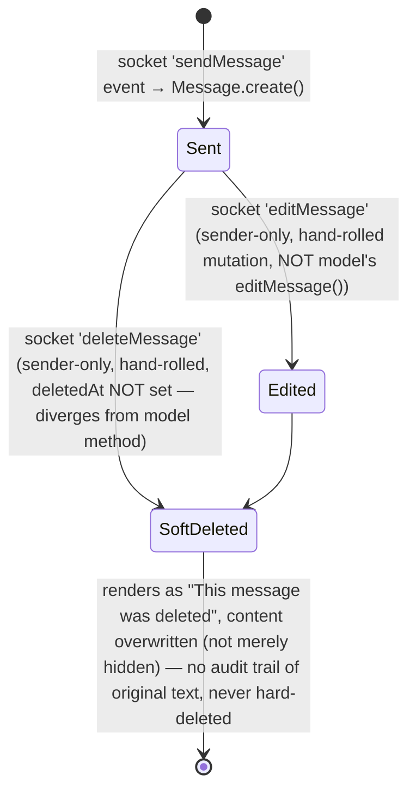

## 5.6 Where used
Exclusively `server.js`'s socket handlers (`sendMessage`, `votePoll`, `editMessage`, `deleteMessage`) and `quiz-socket-handlers.js`'s `sendChatNotification`. The only REST read path is `GET /api/groups/:groupId/messages` (`server.js`), a flat `find().populate('sender').sort({createdAt:1}).limit(100)` with no pagination cursor.

## 5.7 Technical debt
- Read-receipt feature (`readBy`, `markAsRead`) fully modeled, entirely dormant.
- Model-level `editMessage()`/`deleteMessage()` methods exist but are bypassed by hand-rolled equivalents in the live socket handlers, with a confirmed small divergence (`deletedAt` not set on the live path).
- No teacher/admin moderation override anywhere — `canDelete`/`canEdit` are sender-only by design, with no path for a group admin to remove another user's message.
- `searchMessages` static exists and duplicates what `ChatArea.js` does client-side in-memory — dead server-side capability.
- No hard cap enforcement preventing very-long single-line content (e.g. a URL with no whitespace) from overflowing the UI, though the 5000-char `maxlength` does bound total size.

## 5.8 Future field proposals
- `moderatedBy` / `moderationReason` (to support the currently-absent teacher-delete-any-message capability).
- `reactions[]` (emoji reactions — not present in any form today).
- `threadId` (if `replyTo` is ever surfaced as real threaded conversations in the UI, a denormalized `threadId` would make thread queries efficient without walking `replyTo` chains).

---

# 6. Model: `Notification`

**File**: `backend/models/Notification.js` (273 lines)
**Purpose**: A persistent, per-user notification inbox, decoupled from the ephemeral chat/socket layer.

## 6.1 Field table

| Field | Type | Notes |
|---|---|---|
| `recipient` | ObjectId ref `User`, required | |
| `sender` | ObjectId ref `User`, optional | |
| `type` | String enum, required | `['session_scheduled','session_starting','session_started','quiz_started','quiz_result','message','poll_created','session_ended','session_cancelled','attention_needed','achievement']` |
| `title` / `message` | String, required | |
| `relatedGroup` | ObjectId ref `Group`, optional | |
| `relatedQuiz` | ObjectId ref `Quiz`, optional | |
| `relatedSession` | ObjectId ref `ScheduledSession`, optional | |
| `actionUrl` | String | Intended client-side navigation target |
| `isRead` | Boolean, default `false` | |
| `readAt` | Date | |
| `priority` | enum, default `'medium'` | `['low','medium','high','urgent']` |
| `icon` | String | Emoji |
| `expiresAt` | Date | **No TTL index exists on this field** — despite `Poll.expiresAt` having a real `expireAfterSeconds:0` TTL index, this field's counterpart is purely decorative |
| `metadata` | Mixed, default `{}` | Ad hoc payload (`groupId`, `pin`, `sessionId`, `sessionName`, etc.) |

## 6.2 Indexes
`{recipient: 1, isRead: 1, createdAt: -1}` (compound — matches the primary "my unread notifications, newest first" query), `{type: 1}`, `{createdAt: -1}`.

## 6.3 Instance methods
`markAsRead()`, `isExpired()` — the latter is **defined and never called anywhere**, consistent with `expiresAt` having no enforcement.

## 6.4 Static methods (template factories) — usage audit
| Static | Called from | Status |
|---|---|---|
| `getUnreadCount(userId)` | `routes/notifications.js` | ✅ Live |
| `getRecent(userId, limit)` | (not confirmed called by any reviewed route) | ⚠️ Likely dormant |
| `markAllAsRead(userId)` | `routes/notifications.js` | ✅ Live |
| `deleteOldRead(daysOld=30)` | Nowhere — `routes/notifications.js`'s `/clear-read` reimplements a simpler inline `deleteMany` instead | ❌ Dead |
| `createNotification(data)` / `createBulkNotifications(recipients, data)` | Multiple call sites across `server.js` and `routes/schedule.js` | ✅ Live — both emit over `global.io` |
| `notifySessionScheduled` | **Not called** — `routes/schedule.js`'s `/create` route duplicates the same notification-building logic inline instead | ❌ Dead |
| `notifyQuizStarted` | **Not called anywhere** — quiz-start only produces a chat `Message`, never a `Notification` | ❌ Dead |
| `notifyQuizResult` | **Not called anywhere** — moot regardless, since `QuizResult` (its natural trigger) is never created | ❌ Dead |
| `notifySessionStartingSoon` | `jobs/sessionReminder.js` | ✅ **The only template static actually used as designed** |
| `notifyAchievement` | **Not called anywhere** — no achievement-detection logic exists in the codebase at all | ❌ Dead |

**Finding**: of 6 dedicated "notify*" template statics, only **1 of 6** is used as designed. The rest are either dead code entirely, or their intent is duplicated ad hoc at the call site instead of being reused.

## 6.5 Lifecycle diagram

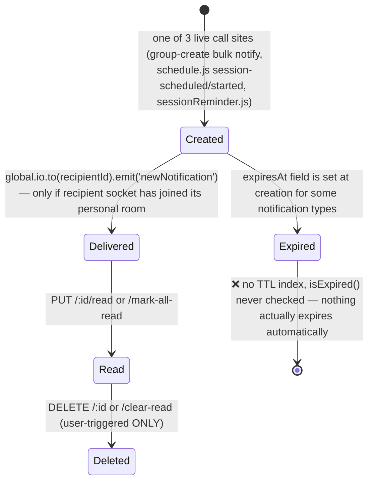

## 6.6 Technical debt
- 5 of 6 template statics dead; notification-creation logic is duplicated inline at several call sites instead of centralized.
- `expiresAt` unenforced (no TTL index, unlike `Poll`, the one model in the app that gets this right).
- Asymmetric persistence: session-scheduled/session-started events get durable `Notification` documents; session-cancelled and unauthorized-join-attempt events are **socket-only**, vanishing if the recipient is offline at the moment of emission.

## 6.7 Future field proposals
- A real TTL index on `expiresAt` (mirroring `Poll`'s pattern) to close the "never expires" gap without needing a cron job.
- `groupBatchId` (to collapse bulk notifications from the same event into a single UI entry rather than N separate rows for N recipients — though this is a UI concern more than a data one, since each recipient already only sees their own row).
- `channel` enum (`in_app | email | push`) once multi-channel delivery is ever built.

---

# 7. Model: `Quiz`

**File**: `backend/models/Quiz.js` (226 lines)
**Purpose**: The reusable quiz **template** — either AI-generated or manually authored, owned by a teacher, scoped to a group.

## 7.1 Field table

| Field | Type | Notes |
|---|---|---|
| `title` | String, required, trim | |
| `description` | String, trim | |
| `creator` | ObjectId ref `User`, required | |
| `group` | ObjectId ref `Group`, required | |
| `source` | enum, default `'ai'` | `['ai','manual','template']` — **`'template'` is never produced by any code path today**, a forward-looking reserved value (see Section 17, Marketplace) |
| `aiSource.type` | enum | `['text','image','pdf','url']` — **`'image'` and `'url'` are unreachable** (their generator methods immediately throw); **the file-upload route sets `aiSource.type:'file'`, a value NOT in this enum at all** — a live schema/route mismatch that risks a `ValidationError` on save for every file-based AI generation |
| `aiSource.content` | String | The source text/URL used for generation |
| `questions[]` | subdocument array | See 7.2 |
| `settings.totalTimeLimit` | Number, default `0` | `0` = no overall limit |
| `settings.shuffleQuestions` | Boolean, default `false` | |
| `settings.shuffleOptions` | Boolean, default `true` | |
| `settings.showCorrectAnswer` | Boolean, default `true` | **Saved, never read by any gameplay code** — inert configuration |
| `settings.showLeaderboard` | Boolean, default `true` | **Same — inert** |
| `settings.allowLateJoin` | Boolean, default `true` | **Same — inert; late joins are always allowed regardless of this value** |
| `status` | enum, default `'draft'` | `['draft','ready','archived']` — `'archived'` is a reserved value no route ever sets |
| `timesUsed` | Number, default `0` | Only incremented by `updateAverageScore()`, which is never called — **permanently stuck at 0** |
| `averageScore` | Number, default `0` | Same — **permanently stuck at 0** |

## 7.2 `questions[]` subdocument fields

| Field | Type | Notes |
|---|---|---|
| `questionText` | String, required | |
| `questionType` | enum, default `'multiple_choice'` | `['multiple_choice','fill_in_blank','true_false','multiple_select']` |
| `options[]` | String[] | Empty for `fill_in_blank` |
| `correctAnswer` | Mixed, required | Number (MC/TF index) / String (FIB) / Number[] (multiple_select) |
| `explanation` | String | |
| `points` | Number, default `10` | |
| `timeLimit` | Number, default `30` | **⚠️ Schema default is 30, but every consumer's runtime fallback (`QuizCreator.jsx`, `QuizHost.jsx`, `QuizPlayer.jsx`, `quiz-socket-handlers.js`) uses `\|\| 45`** — a real default-value inconsistency between the schema and the application code |
| `difficulty` | enum, default `'medium'` | `['easy','medium','hard','expert']` |

## 7.3 Indexes
`{creator: 1, createdAt: -1}`, `{group: 1}`, `{status: 1}`.

## 7.4 Instance methods
- `getTotalPoints()`, `getQuestionCount()` — simple aggregations.
- `shuffleArray()` — Fisher-Yates helper.
- `getSessionQuiz()` — applies `settings.shuffleQuestions`/`shuffleOptions`, correctly skipping option-shuffling for `fill_in_blank` questions (which have no `options` array to shuffle) — a small, correctly-handled edge case.
- `updateAverageScore(sessionScore)` — **defined, never called**. This is the method that, if wired in, would finally make `timesUsed`/`averageScore` real.

## 7.5 Lifecycle diagram

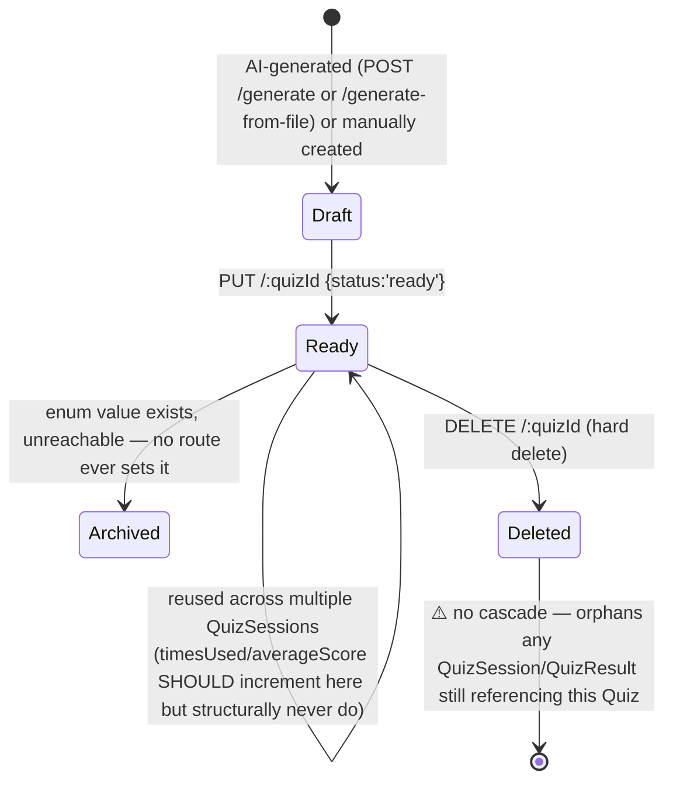

## 7.6 Where used
`routes/quiz.js` (generation, edit, delete, recent-topics, start-session bridge), `quiz-socket-handlers.js` (reads `questions[]` for gameplay/scoring/timers), `services/aiQuizGenerator.js` (produces the exact shape needed for `questions[]` via `validateQuestions()`).

## 7.7 Technical debt
- `aiSource.type` enum/route mismatch (`'file'` not in the enum) — a live validation risk on every file-based generation.
- `timesUsed`/`averageScore` permanently zero.
- Three of five `settings.*` flags (`showCorrectAnswer`, `showLeaderboard`, `allowLateJoin`) are inert — stored, surfaced in the UI as configurable, but never actually enforced by gameplay code.
- `timeLimit` schema default (30) vs. universal application-code fallback (45) — an easy-to-miss inconsistency for anyone reasoning about "what happens if this field is unset."
- No cascade-delete or reference-check when a `Quiz` is deleted.

## 7.8 Future field proposals
- `tags[]` / `standardsAlignment[]` (curriculum-standard tagging, useful for the future Marketplace and School Dashboard concepts in Section 17).
- `isPublic` / `licenseType` (to actually support `source:'template'`/Marketplace sharing).
- `version`/`parentQuizId` (to track edits/forks of a quiz over time, rather than in-place mutation).

---

# 8. Model: `QuizSession`

**File**: `backend/models/QuizSession.js` (280 lines)
**Purpose**: The live, ephemeral **gameplay** instance of a `Quiz` — the real, working engine behind the entire quiz feature.

## 8.1 Field table

| Field | Type | Notes |
|---|---|---|
| `quiz` | ObjectId ref `Quiz`, required | |
| `group` | ObjectId ref `Group`, required | |
| `host` | ObjectId ref `User`, required | The teacher who started it |
| `status` | enum, default `'waiting'` | `['waiting','active','paused','completed']` |
| `currentQuestionIndex` | Number, default `0` | |
| `participants[]` | subdocument array | `{user, joinedAt, score:0, answers:[{questionIndex, selectedAnswer:Mixed, isCorrect, points, answeredAt, timeTaken}], streak:0, completedAt}` |
| `questionStartTimes[]` | subdocument array | `{questionIndex, startedAt}` |
| `startedAt` / `pausedAt` / `resumedAt` / `completedAt` | Date | |
| `sessionSettings` | plain object | `{totalTimeLimit, showCorrectAnswer, showLeaderboard, allowLateJoin}` — a **deliberate snapshot copy** of `Quiz.settings` taken at session-creation time, so a later edit to the `Quiz` template doesn't retroactively alter an in-progress session — the one clearly intentional, well-reasoned denormalization in the whole schema |

## 8.2 Indexes
`{group: 1, status: 1}` (compound — powers `findActiveSession`), `{quiz: 1}`, `{'participants.user': 1}`.

## 8.3 Instance methods
- `start()`, `nextQuestion()`, `pause()`, `resume()`, `complete()` — status-transition helpers. **`pause()`/`resume()` are defined but no confirmed UI/socket path calls them** — the live socket handlers only ever move `waiting → active → completed`, never touching `paused`.
- `addParticipant(userId)`.
- `submitAnswer(userId, questionIndex, selectedAnswer, isCorrect, points, timeTaken)` — includes a proper idempotency guard (throws if already answered). **This exact method is never called by the live socket handler**, which reimplements equivalent (but independently-maintained) logic inline instead — a real duplication risk: a future correctness fix applied to this model method would have zero effect on the actual running system unless also applied to `quiz-socket-handlers.js`.
- `getLeaderboard()`, `getParticipantStats(userId)`.
- `areAllFinished()` — loads the parent `Quiz` fresh to compare against total question count.
- `getSummary()` — computes `totalParticipants`, `finishedParticipants`, `averageScore`, `duration`. **Note**: `routes/quiz.js`'s `/group/:groupId/history` route reads a field literally named `s.averageScore` directly off the `QuizSession` document — but `averageScore` is **not a schema field on `QuizSession`** (it only exists as a computed return value of `getSummary()`, which this route never calls) — so that field always evaluates to `undefined`/`null` in the history view, a confirmed, concrete display bug.

## 8.4 Lifecycle diagram

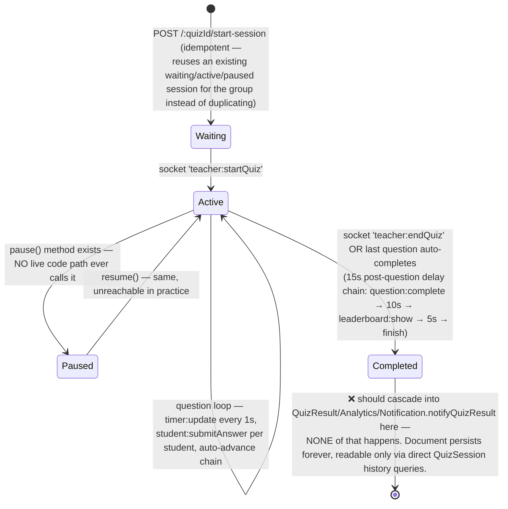

## 8.5 Where used
Almost entirely `backend/socket-handlers/quiz-socket-handlers.js` (the real-time gameplay engine — see `SYSTEM_ARCHITECTURE.md` §6 for the full event-driven architecture) plus `routes/quiz.js` (`start-session`, `/group/:groupId/active`, `/group/:groupId/history`, `/batch-history`).

**Confirmed scoring defect, reproduced here for schema-level completeness**: in `student:submitAnswer`, `fill_in_blank` gets a proper case/whitespace-insensitive string comparison; every other question type — **including `multiple_select`** — falls into a single `else` branch doing strict `===` comparison. Since `multiple_select`'s `correctAnswer` and the student's `selectedAnswer` are both **arrays**, `===` compares object references and is **always `false`**, even for a perfectly correct answer. `multiple_select` questions can therefore never be scored correct in the live system, regardless of what the student picks.

## 8.6 Technical debt
- `pause()`/`resume()` fully modeled, entirely unreachable.
- Model's own `submitAnswer()` (with correct idempotency handling) is dead code, duplicated (with drift risk) by the live socket handler.
- `getSummary().averageScore` is read by a route as if it were a persisted field, which it is not — confirmed display bug.
- The `multiple_select` scoring defect (above) lives structurally at the intersection of this model's `correctAnswer: Mixed` typing and the socket handler's comparison logic — fixing it requires touching the handler, not the schema, but the schema's permissive `Mixed` typing is exactly what allowed the type-mismatch bug to go unnoticed (a stricter, question-type-discriminated schema might have surfaced this earlier).

## 8.7 Future field proposals
- `disconnectedParticipants[]` (currently, a disconnected student is never removed from `participants[]` — the teacher's live view has no way to distinguish "still connected" from "dropped mid-quiz" at the data level).
- `pausedDurationMs` (if `pause()`/`resume()` are ever wired up live, tracking total paused time would matter for fair per-question timing).

---

# 9. Model: `QuizResult`

**File**: `backend/models/QuizResult.js` (232-233 lines)
**Purpose**: Intended to be the **permanent, one-row-per-student-per-attempt** durable analytics record, decoupled from the ephemeral `QuizSession`. **This is the single largest "fully designed, never wired up" model in the entire codebase — confirmed via exhaustive grep: there is no `new QuizResult(...)` or `QuizResult.create(...)` anywhere in the backend.**

## 9.1 Field table

| Field | Type | Notes |
|---|---|---|
| `quiz` | ObjectId ref `Quiz`, required | |
| `session` | ObjectId ref `QuizSession`, required | |
| `student` | ObjectId ref `User`, required | |
| `group` | ObjectId ref `Group`, required | |
| `score` | Number, required, default `0` | |
| `maxScore` | Number, required | |
| `percentage` | Number (0–100), required | |
| `correctAnswers` | Number, default `0` | |
| `totalQuestions` | Number, required | |
| `answers[]` | subdocument array | `{questionIndex, questionText, selectedAnswer: **Number** (⚠️ schema bug — should be Mixed, since fill_in_blank answers are strings and multiple_select answers are arrays; the in-code comment `// 🔥 THIS FIXES EVERYTHING` next to the adjacent `correctAnswer: Mixed` field suggests a hasty partial fix that upgraded one field but missed the sibling), correctAnswer: Mixed (required), isCorrect, points, timeTaken, answeredAt}` |
| `startedAt` / `completedAt` | Date, required | |
| `duration` | Number (seconds) | |
| `rank` | Number | |
| `averageTimePerQuestion` / `fastestAnswer` / `slowestAnswer` | Number (seconds) | |
| `badge` | enum, default `null` | `['gold','silver','bronze','participant', null]` |

## 9.2 Indexes
`{student: 1, createdAt: -1}`, `{quiz: 1}`, `{group: 1}`, `{session: 1}`, `{percentage: -1}`.

## 9.3 Instance methods
`calculateMetrics()` (derives `averageTimePerQuestion`/`fastestAnswer`/`slowestAnswer` from `answers[]`, computes `duration` and `percentage`), `assignBadge(totalParticipants)` (rank 1→gold, 2→silver, 3→bronze, else participant), `getPerformanceLevel()` (percentage-threshold → Excellent/Good/Average/Below Average/Needs Improvement). **All three are fully implemented and entirely unexercised — no document ever exists for them to run against.**

## 9.4 Static methods
`getStudentHistory(studentId, limit)`, `getQuizAnalytics(quizId)` (aggregate totalAttempts/averageScore/highest/lowest/averagePercentage/passRate), `getGroupPerformance(groupId)`, `getGlobalLeaderboard(groupId, limit)` — the last of these has a **confirmed latent bug**: it calls `mongoose.Types.ObjectId(groupId)` **without the `new` keyword**, which throws `TypeError: Class constructor ObjectId cannot be invoked without 'new'` under the installed Mongoose 7.8.8 / MongoDB driver combination. This is currently moot (the method is never called from any route), but it means the method would fail immediately even if someone wired it up without first fixing this line.

## 9.5 Lifecycle diagram

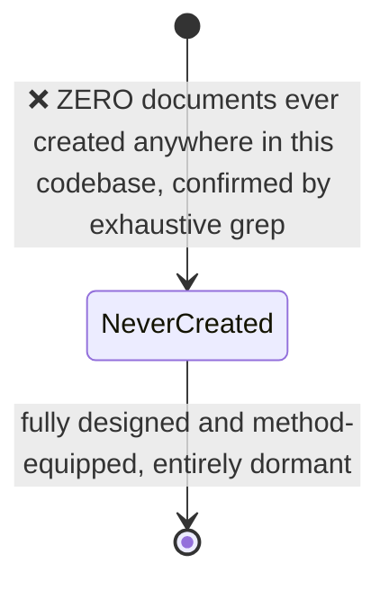

## 9.6 Where used
**Read-only, and only two call sites, both of which always return empty results in practice**: `routes/analytics.js`'s `GET /student/:studentId/group/:groupId` and `GET /my-analytics/:groupId` both do a simple `QuizResult.find({student, group}).populate('quiz','title').sort({createdAt:-1}).limit(N)` for a "Recent Quizzes" UI panel — since no document ever exists, this panel is permanently empty in any real deployment of the code as currently written.

## 9.7 Technical debt (the highest-value fix in the entire database layer)
Wiring `quiz-socket-handlers.js`'s completion branch (`handleQuestionComplete`'s final-question path, or `teacher:endQuiz`) to iterate `session.participants` and, for each, construct a `QuizResult` document using the model's own already-correct `calculateMetrics()`/`assignBadge()` methods, then call `Quiz.updateAverageScore()`, `Analytics.recordQuizResult()`, and `Notification.notifyQuizResult()` would **simultaneously activate four other currently-dormant integrations** across `Quiz`, `Analytics`, and `Notification` in a single change. Alongside this: fix `answers[].selectedAnswer` to `Mixed`, and fix the missing `new` in `getGlobalLeaderboard`.

## 9.8 Future field proposals
(Beyond the two bug-fixes above, which aren't "future fields" but corrections to existing ones)
- `improvementFromLastAttempt` (percentage-point delta vs. the student's previous `QuizResult` for the same `Quiz`, once history exists to compare against).
- `flaggedForReview` (Boolean — surfacing unusually fast/suspicious completion times for teacher review, addressing the client-trusted-timing concern noted in `SYSTEM_ARCHITECTURE.md` §10).

---

# 10. Model: `ScheduledSession`

**File**: `backend/models/ScheduledSession.js` (326 lines)
**Purpose**: A teacher-planned future classroom session — the "calendar entry" that, when started, converts into a live `Group`.

## 10.1 Field table

| Field | Type | Notes |
|---|---|---|
| `sessionName` | String, required, trim | |
| `subject` / `description` | String, trim | |
| `teacher` | ObjectId ref `User`, required | |
| `scheduledDate` | Date | **Not required** — relaxed specifically to support drafts (explicit in-code comment confirms this was deliberately loosened from `required:true`) |
| `scheduledTime` | String | Not required, same reason; free-text ("HH:MM" or "HH:MM AM/PM"), parsed ad hoc via regex in `shouldStartNow()` — **not a real Date field**, a structural fragility point |
| `endTime` | String | |
| `duration` | String, default `'1 Hour'` | **Stored as a display string** ("45 Min"), not a Number — cannot be used directly in date/duration arithmetic without parsing |
| `accessType` | enum, default `'private'` | `['public','private']` |
| `allowedStudents[]` | subdocument array | `{email (lowercase,trim), password (⚠️ PLAINTEXT — not hashed, unlike User.password), name}` |
| `allowedEmails[]` | String[] | A **denormalized projection** of `allowedStudents[].email`, manually kept in sync by application code on every create/update — no schema-level guarantee they stay consistent |
| `registeredStudents[]` | subdocument array | `{user: ObjectId ref User, email, registeredAt: Date default now}` |
| `status` | enum, default `'scheduled'` | `['draft','scheduled','live','completed','cancelled']` — **`'completed'` is never set by any code path**; the session that goes `live` and later has its derived `Group.endSession()` called never reports back to flip this status |
| `liveGroupId` | ObjectId ref `Group` | Set exactly once, at go-live conversion |
| `reminderSent` | Boolean, default `false` | |
| `enableReminders` | Boolean, default `true` | |
| `autoStartEnabled` | Boolean, default `true` | **Stored, never read or enforced** — no auto-start job exists anywhere |
| `requireApproval` | Boolean, default `false` | **Stored, no approval workflow implemented anywhere** |
| `maxStudents` | Number, default `100` | Enforced in `registerStudent()` |
| `customPin` | String | Optional teacher-chosen PIN override |
| `joinCode` | String, unique, sparse | `crypto.randomBytes(4).toString('hex').toUpperCase()` — a **second, independent PIN-like identifier**, distinct in both format and purpose from the `Group.pin` generated at go-live time |
| `unauthorizedAttempts[]` | subdocument array | `{email, attemptedAt: Date default now, notifiedTeacher: Boolean default false}` |

## 10.2 Indexes
`{teacher: 1, scheduledDate: 1}`, `{status: 1, scheduledDate: 1}`, `{joinCode: 1}`, `{allowedEmails: 1}`.

## 10.3 Instance methods
`isEmailAllowed(email)`, `verifyStudentPassword(email, password)` (returns `{allowed, reason}` — `'email_not_registered'` or `'wrong_password'`), `shouldStartNow()` (±5-minute window check, handles both 12h/24h time-string formats via regex — a genuinely fragile parsing approach for something that could have been a single combined `Date` field), `registerStudent(userId, email)` (dedup + allowlist + `maxStudents` capacity checks), `addAllowedEmail`/`removeAllowedEmail`.

## 10.4 Static methods
`getTeacherSessions`, `getTeacherDrafts`, `getAvailableSessions`, `findSessionsToStart()` — the last is **defined and never called**; `jobs/sessionReminder.js` reimplements its own overlapping-but-not-identical query (a 20-minute lookahead window, not this static's presumed logic) instead of reusing it.

## 10.5 Lifecycle diagram

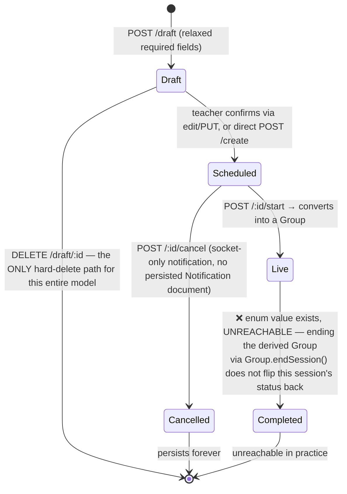

## 10.6 Where used
Almost entirely `routes/schedule.js` (649 lines — full draft/create/edit/start/cancel/register/access-control CRUD) and `jobs/sessionReminder.js`.

## 10.7 Technical debt
- **Plaintext per-student passwords** — the single most concrete security finding tied to this schema (bcrypt is used for `User.password` but pointedly not here).
- `duration` as a display string blocks real duration arithmetic.
- `autoStartEnabled`/`requireApproval` are fully inert stored configuration.
- `status:'completed'` is structurally unreachable.
- `findSessionsToStart()` is dead, duplicated by a divergent inline query in the reminder job.
- Two independent PIN-like identifiers (`joinCode` here vs. `Group.pin` post-conversion) with different formats/generation algorithms and no cross-reference between them — a genuine source of confusion for anyone reasoning about "which code does a student actually type in."

## 10.8 Future field proposals
- Replace `scheduledTime`/`endTime` (free-text strings) with real `Date` fields (`scheduledStart`, `scheduledEnd`), eliminating the fragile regex-parsing in `shouldStartNow()`.
- `recurrenceRule` (RRULE-style string) for repeating weekly sessions — no recurring-session support exists today at all.
- `timezone` (IANA string) — currently all date/time math implicitly assumes the server's local timezone, with no per-teacher/per-student timezone awareness.

---

# 11. Model: `Analytics`

**File**: `backend/models/Analytics.js` (320 lines)
**Purpose**: Intended per-student-per-group rollup of engagement/performance metrics for teacher dashboards. **Cosmetically complete, functionally hollow** — this is the second-largest "designed but dormant" gap in the codebase, and its consequences are the most user-visible of any finding in this document.

## 11.1 Field table

| Field | Type | Notes |
|---|---|---|
| `student` | ObjectId ref `User`, required | |
| `group` | ObjectId ref `Group`, required | |
| `sessionAttendance[]` | subdocument array | `{sessionDate, joinedAt, leftAt, duration(min), wasPresent}` — **never populated**; the method that would push to it, `recordAttendance()`, is never called |
| `messageStats` | object | `totalMessages, textMessages, fileUploads, pollsCreated, pollsParticipated, lastMessageAt` — all stuck at defaults since `recordMessage()` is never called |
| `quizStats` | object | `totalQuizzesTaken, averageScore, highestScore, lowestScore, totalPoints, correctAnswers, totalQuestions, averageTimePerQuestion, badges:{gold,silver,bronze}` — all stuck at defaults since `recordQuizResult()` is never called |
| `engagement.participationRate` | Number (0–100) | Computed by `calculateParticipation()`, but from an always-empty `sessionAttendance` — always evaluates to `0` |
| `engagement.consistencyScore` | Number (0–100) | **No method anywhere computes this at all** — a pure schema placeholder with zero code path even attempting to set it |
| `engagement.responseTime` | Number (minutes) | **Same — no computation logic exists anywhere** |
| `engagement.lastActive` | Date | |
| `weeklyTrends` | object | `messagesThisWeek, quizzesThisWeek, attendanceThisWeek` — incremented only inside the (unused) `recordMessage`/`recordQuizResult`; `resetWeeklyTrends()` exists for an intended weekly cron that doesn't exist anywhere in `backend/jobs/` |
| `performanceLevel` | enum, default `'Average'` | `['Excellent','Good','Average','Below Average','Needs Attention']` — computed by `evaluatePerformance()`, which **is** called live from `routes/analytics.js` |
| `needsAttention` | Boolean, default `false` | Set by `checkAttentionFlags()`, called internally by `evaluatePerformance()` |
| `attentionReasons[]` | String[] | Populated by `checkAttentionFlags()` |

## 11.2 The core finding, stated precisely
`evaluatePerformance()` **is** wired up and **is** called on every analytics-route hit — but its three inputs (`averageScore`, `participationRate`, `totalMessages`) are permanently `0` because nothing ever calls `recordMessage()`/`recordQuizResult()`/`recordAttendance()` anywhere in `server.js` or `quiz-socket-handlers.js`. The weighted formula therefore always produces an `overallScore` of `0`, which the threshold logic in `checkAttentionFlags()` deterministically maps to **`needsAttention: true`, `performanceLevel: 'Needs Attention'`, for every single student, unconditionally, regardless of how much they actually participate.** This is not a bug that sometimes misfires — it is a guaranteed, 100%-reproducible outcome given the current write-path gap.

## 11.3 Indexes
`{student: 1, group: 1}` **unique compound** (correctly enforces one `Analytics` document per student-per-group pair at the database level — this part of the design is sound), `{group: 1, needsAttention: 1}`, `{performanceLevel: 1}`.

## 11.4 Instance methods
`recordAttendance(joinedAt, leftAt)`, `recordMessage(messageType)`, `recordQuizResult(result)` — **all three unused**, all three are exactly the methods that would need to be called from `server.js`'s chat handlers, the join/leave handlers, and `quiz-socket-handlers.js`'s completion logic respectively to make this model real. `calculateParticipation()`, `evaluatePerformance()`, `checkAttentionFlags()` — all **live**, but operating on permanently-zero inputs. `resetWeeklyTrends()` — unused, no weekly cron exists.

## 11.5 Static methods
`getOrCreate(studentId, groupId)` (the only creation path — lazy, find-or-create), `getGroupSummary`, `getTopPerformers`, `getNeedsAttention` — all live, all reading the same permanently-zeroed underlying data.

## 11.6 Lifecycle diagram

```mermaid
stateDiagram-v2
    [*] --> LazilyCreated: getOrCreate() on first analytics-route touch for a student+group pair
    LazilyCreated --> Recalculated: EVERY read-route recalculates AND saves<br/>(calculateParticipation, evaluatePerformance) — a read-triggers-write anti-pattern
    Recalculated --> Recalculated: recordMessage()/recordQuizResult()/recordAttendance()<br/>NEVER CALLED — underlying counters permanently 0
    Recalculated --> [*]: ❌ never deleted; deterministically ALWAYS evaluates to<br/>"Needs Attention" / 0% participation regardless of true classroom activity
```

## 11.7 Where used
Exclusively `routes/analytics.js` (443 lines — the full teacher/student dashboard REST API) — see `MASTER_PROJECT_REPORT.md` §9 for the endpoint list. Every one of these endpoints returns real-shaped, plausible-looking JSON that is nonetheless **entirely disconnected from actual classroom behavior**.

## 11.8 Technical debt
This is, alongside `QuizResult`, the highest-priority data-layer fix in the codebase — not because the schema is wrong, but because the schema's own correctly-implemented aggregation logic (`evaluatePerformance`) has never been given real inputs to work with. `engagement.consistencyScore`/`engagement.responseTime` are worse than merely unused — there isn't even a stub method that attempts to compute them, unlike every other dormant field in this document which at least has a defined-but-uncalled method.

## 11.9 Future field proposals
- Given the observation (Section 3.10 elsewhere) that instrumenting every socket handler with `record*()` calls is exactly the maintenance burden that likely caused this gap to exist in the first place, a **materialized nightly aggregation job** (reading directly from `Message`/`QuizResult` counts rather than requiring scattered inline `record*()` calls) may be a more robust long-term design than the current "instrument every event" approach — worth proposing as an alternative architecture, not just a "wire up the missing calls" fix.
- `lastComputedAt` (to make the read-triggers-write recalculation pattern explicit/auditable, and to support a future move to a cached/batch model).

---

# 12. Model: `Poll` (dead)

**File**: `backend/models/poll.js` (244 lines)
**Purpose (as designed)**: A dedicated, richer polling system — `mcq`/`open`/`yesno` types, anonymity, multi-vote toggles, and genuine auto-expiry. **Confirmed via exhaustive grep: never `require()`'d anywhere in the backend.** 100% dead code.

## 12.1 Field table

| Field | Type | Notes |
|---|---|---|
| `group` | ObjectId ref `Group`, required, `index: true` | |
| `createdBy` | ObjectId ref `User`, required | |
| `pollType` | enum, default `'mcq'` | `['mcq','open','yesno']` |
| `question` | String, required, `maxlength: 500` | |
| `options[]` | subdocument array | `{text (required, maxlength:200), votes: Number default 0, votedBy: [ObjectId ref User]}` |
| `answers[]` | subdocument array | `{user: ObjectId ref User required, answer: String required maxlength:1000, submittedAt: Date default now}` — for `open`-type polls |
| `allowMultipleVotes` | Boolean, default `false` | |
| `isAnonymous` | Boolean, default `false` | |
| `isActive` | Boolean, default `true` | |
| `expiresAt` | Date, default `() => now + 24h` | |
| `totalVotes` / `totalAnswers` | Number, default `0` | |

## 12.2 Indexes
`{group: 1, createdAt: -1}`, `{createdBy: 1}`, `{isActive: 1}`, and — uniquely in this entire schema set — **`{expiresAt: 1}` with `{expireAfterSeconds: 0}`: a genuine MongoDB TTL index.** This is the *only* model in the entire application with real, working, database-level auto-expiry. It sits entirely unused.

## 12.3 Instance methods
`hasUserVoted(userId)`, `vote(userId, optionIndex)` (validates poll type, prevents double-vote unless `allowMultipleVotes`), `submitAnswer(userId, answerText)`, `getResults()` (formats percentages, nulls out voter identity if `isAnonymous`), `close()`.

## 12.4 Static methods
`getActivePolls(groupId)`, `getAllPolls(groupId)`.

## 12.5 Lifecycle diagram

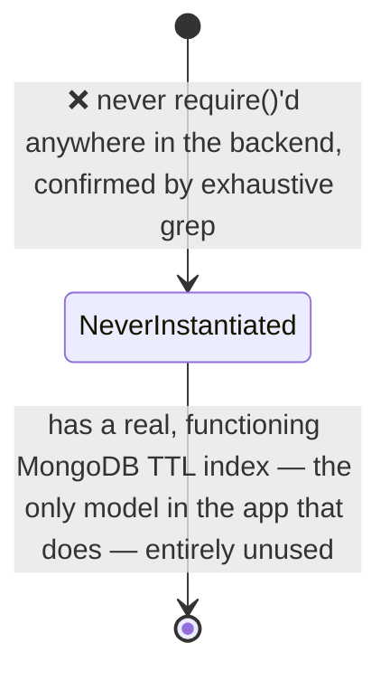

## 12.6 Where used
Nowhere in the live backend. On the frontend, `components/PollComponent.js` targets this model's conceptual shape (and a matching-but-unimplemented socket protocol: `getPolls`/`createPoll`/`answerPoll`/`closePoll`/`pollsUpdate`/`newPoll`) but `PollComponent.js` itself is never imported/rendered anywhere in `App.js` — confirming this is a **fully coherent, fully dead vertical slice**, model through component, superseded entirely by the much simpler `Message.pollOptions` embedded mechanism actually in production.

## 12.7 Technical debt / recommendation
This model represents the clearest "delete or resurrect" fork in the codebase: it is strictly more capable than the live `Message.pollOptions` mechanism (open-ended text answers, anonymity, real auto-expiry, multi-vote control) — a future team should either (a) delete `poll.js` + `PollComponent.js` outright as historical cruft, or (b) invest in actually wiring this model in to replace the more limited embedded-poll mechanism, since most of the hard design work is already done and simply unconnected.

## 12.8 Future field proposals
If resurrected: `groupChatMessageId` (to still surface poll results inline in chat, matching the current UX, rather than requiring a wholly separate poll UI surface).

---

# 13. Cross-Model Relationship Matrix

| From ↓ / To → | User | Group | Message | Quiz | QuizSession | QuizResult | ScheduledSession | Analytics | Notification | Poll |
|---|---|---|---|---|---|---|---|---|---|---|
| **User** | — | admin, members[], onlineUsers[] | sender, recipient, readBy[].user, pollOptions[].votes[] | creator | host, participants[].user | student | teacher, registeredStudents[].user | student | recipient, sender | createdBy, options[].votedBy[], answers[].user |
| **Group** | (reverse of above) | — | group | group | group | group | liveGroupId (reverse) | group | relatedGroup | group |
| **Message** | | | — | | | | | | | |
| **Quiz** | | group (reverse) | | — | quiz | quiz | | | relatedQuiz | |
| **QuizSession** | | | | | — | session | | | | |
| **QuizResult** | | | | | | — | | | | |
| **ScheduledSession** | | | | | | | — | | relatedSession | |
| **Analytics** | | | | | | | | — | | |
| **Notification** | | | | | | | | | — | |
| **Poll** | | | | | | | | | | — |

**Terminal/leaf models (nothing references them back)**: `QuizResult`, `Analytics`, `Notification`, `Poll` — all four are pure "read/report" endpoints of the graph, never themselves a foreign key target from any other model.

**Most-referenced model**: `User` (13 distinct reference points across the other 9 models — the structural center of the schema).

---

# 14. Index Catalog & Query Pattern Analysis

| Model | Index | Backing query pattern | Notes |
|---|---|---|---|
| User | `{username:1}` | Login by username | Redundant with field-level `unique` |
| User | `{email:1}` | Login by email, registration dup-check | Redundant with field-level `unique` |
| Group | `{pin:1}` | PIN-based join lookup | Redundant with field-level `unique` |
| Group | `{admin:1}` | "My groups" (as creator) | |
| Group | `{isActive:1}` | Filtering live vs. ended sessions | |
| Group | `{'members.user':1}` | "My groups" (as member) | Powers the actual live `GET /api/groups/my-groups` query |
| Group | `{allowedEmails:1}` | Email-whitelist membership check | |
| Message | `{group:1, createdAt:-1}` | Chat history fetch | Compound index correctly matches the query shape, but the query itself (`limit(100)`, no `skip`/cursor) never exploits the index for anything beyond the first page |
| Message | `{sender:1}` / `{recipient:1}` | Private-message and per-sender lookups | |
| Message | `{isDeleted:1}` / `{messageType:1}` | Filtering | |
| Notification | `{recipient:1, isRead:1, createdAt:-1}` | "My unread notifications, newest first" | Well-matched compound index |
| Quiz | `{creator:1, createdAt:-1}` | "Recent topics" / teacher's quiz list | |
| Quiz | `{group:1}` / `{status:1}` | Group-scoped and status-filtered listing | |
| QuizSession | `{group:1, status:1}` | `findActiveSession` — powers the idempotent session-reuse check | Well-matched |
| QuizSession | `{quiz:1}` / `{'participants.user':1}` | History/lookup by quiz or by participant | |
| QuizResult | `{student:1,createdAt:-1}`, `{quiz:1}`, `{group:1}`, `{session:1}`, `{percentage:-1}` | All five are well-designed for the intended analytics queries — **entirely unexercised, since the collection is always empty** | |
| ScheduledSession | `{teacher:1,scheduledDate:1}`, `{status:1,scheduledDate:1}`, `{joinCode:1}`, `{allowedEmails:1}` | Teacher's schedule, status-filtered upcoming sessions, join-code lookup, email-based availability | |
| Analytics | `{student:1,group:1}` unique | Enforces one document per pair — correctly designed | |
| Analytics | `{group:1,needsAttention:1}`, `{performanceLevel:1}` | Teacher "needs attention" / performance-filtered views | Well-matched to the query shape, though the underlying data is always the same deterministic value (Section 11.2) |
| Poll | `{group:1,createdAt:-1}`, `{createdBy:1}`, `{isActive:1}`, `{expiresAt:1, expireAfterSeconds:0}` | All well-designed — entirely unexercised, collection is never populated | |

## 14.1 N+1 / inefficient query patterns found (data-layer view; see `SYSTEM_ARCHITECTURE.md` §15 for the performance-architecture framing)
- `routes/analytics.js`'s `/group/:groupId/students` recalculates-and-saves **every** student's `Analytics` document on a single GET request — a read endpoint with O(n) write side effects.
- `routes/analytics.js`'s `/group/:groupId/refresh` loops over all group members with **sequential `await`s inside a `for...of` loop** rather than `Promise.all` — O(n) sequential round trips.
- `routes/analytics.js`'s `/my-analytics/:groupId` computes a student's rank by fetching **all** `Analytics` documents for the group and sorting in application memory on every single request, rather than a database-level `$sort`/`$rank` aggregation — fine at classroom scale (dozens of students), not designed for hundreds/thousands per group.

---

# 15. Data Integrity & Consistency Audit

| Risk | Model(s) | Detail |
|---|---|---|
| Denormalization drift | `ScheduledSession.allowedEmails[]` vs. `allowedStudents[].email` | Manually kept in sync by application code on create/update; nothing at the schema level prevents them from diverging if a future code path updates one without the other |
| Orphaned references on delete | `Quiz` → `QuizSession`/`QuizResult` | `DELETE /:quizId` has no cascade — deleting a `Quiz` leaves any `QuizSession`/`QuizResult` documents pointing at a now-nonexistent `Quiz._id` |
| Schema/enum mismatch | `Quiz.aiSource.type` vs. the file-upload route's `'file'` value | A live `ValidationError` risk on every file-based AI generation, since `'file'` is not a member of the declared enum |
| Type-mismatch enabling a scoring bug | `QuizSession.participants[].answers[].selectedAnswer: Mixed` compared via `===` against `Quiz.questions[].correctAnswer: Mixed` for `multiple_select` | The permissive `Mixed` typing on both sides allowed an array-vs-array reference-equality bug to ship undetected |
| Method/handler divergence | `Message.editMessage()`/`deleteMessage()` vs. the live socket handlers' hand-rolled equivalents | The live `deleteMessage` socket handler does not set `deletedAt`, unlike the model's own method — a small, confirmed inconsistency in what "deleted" means depending on which code path you're reading |
| Unenforced uniqueness of intent | Two independent PIN-like identifiers (`ScheduledSession.joinCode` vs. `Group.pin`) | Not a data-integrity bug per se, but a source of confusion — no field cross-references the other, and they use different generation algorithms (hex vs. numeric) |
| Silent-failure notification asymmetry | `Notification` | Some lifecycle events (session-scheduled, session-started) get durable documents; others (session-cancelled, unauthorized-join-attempt) are socket-only and vanish if the recipient is offline — an inconsistent durability guarantee across conceptually similar events |

---

# 16. Schema Evolution History (reconstructed from in-code evidence)

No formal migration files exist anywhere in the repository (no `migrations/` directory, no versioned schema history) — evolution has happened purely by editing schema files in place. Evidence of past evolution found directly in code comments and enum shapes:

- **`Message.messageType`** clearly grew over time: the stale root-level `Message.js` backup shows an earlier enum of `['text','system','private','file']`; the live `backend/models/Message.js` has grown it to `['text','system','private','file','poll','quiz_started','quiz_ended']` — confirming polls and quiz-notifications were embedded into chat *after* the base messaging model was first built, rather than being part of the original design.
- **`QuizResult.answers[].correctAnswer`** carries an explicit in-code comment `// 🔥 THIS FIXES EVERYTHING` next to its `Mixed` typing — strong evidence that this field was originally more narrowly typed (likely `Number`, matching its still-unfixed sibling `selectedAnswer`) and was loosened specifically to fix a bug, with the fix only applied to one of the two fields that needed it.
- **`quiz-socket-handlers.js`'s own header comments** (not part of the schema files, but directly evidencing schema-adjacent behavior changes) document a historical rename from `participantJoined` to `student:joined`, and a historical inconsistency between `quiz:ended` and `quiz:finished` that was resolved in favor of `quiz:finished` — both are socket-protocol changes, not schema changes, but they demonstrate the same "fix one call site, miss the others" pattern that recurs at the schema level too (e.g., the `selectedAnswer` Mixed-typing fix).
- **`ScheduledSession.scheduledDate`/`scheduledTime`** being explicitly documented in-code as "relaxed from required:true" is direct evidence that the draft-saving feature was added *after* the initial required-fields version of this schema — drafts were not part of the original design.

---

# 17. Proposed Future Schemas (SaaS expansion)

None of the following exist today. These are concrete, field-level proposals extending `MASTER_PROJECT_REPORT.md` §21's narrative and `SYSTEM_ARCHITECTURE.md` §21's placement diagram.

## 17.1 `Organization`
```
Organization {
  name: String (required)
  slug: String (unique, for subdomain/URL use)
  billingEmail: String
  planTier: enum ['free','starter','school','district']
  seatLimit: Number
  aiGenerationQuotaPerMonth: Number
  createdAt, updatedAt
}
```
Every existing model (`User`, `Group`, `Quiz`, `Analytics`, etc.) would gain an `organizationId: ObjectId ref Organization, required, index: true` field — this is the single largest, most invasive schema migration implied by the SaaS roadmap, since it touches all 10 existing collections.

## 17.2 `Subscription`
```
Subscription {
  organization: ObjectId ref Organization (required)
  stripeCustomerId: String
  stripeSubscriptionId: String
  status: enum ['trialing','active','past_due','canceled']
  currentPeriodEnd: Date
  seatsPurchased: Number
  createdAt, updatedAt
}
```

## 17.3 `ParentLink`
```
ParentLink {
  parent: ObjectId ref User (a new 'parent' value added to User.role enum)
  student: ObjectId ref User (required)
  organization: ObjectId ref Organization
  relationship: enum ['parent','guardian']
  verifiedAt: Date
  createdAt
}
```
A many-to-many join model (one parent can link to multiple students; one student can have multiple linked parents/guardians) — deliberately kept as its own collection rather than an array field on `User`, since the read pattern ("show me everything for this student") is symmetric regardless of which side initiates the query.

## 17.4 `AuditLog` (currently entirely absent — no audit trail exists anywhere in the system)
```
AuditLog {
  organization: ObjectId ref Organization
  actor: ObjectId ref User
  action: String (e.g. 'quiz.deleted', 'session.ended', 'role.escalated')
  targetType: String
  targetId: ObjectId
  metadata: Mixed
  createdAt
}
```
Directly addresses the observation (Section 5.3, `Message` soft-delete overwriting original content) that the current system has **no way to reconstruct what happened** after a destructive action — deleted message content is gone, not merely hidden; a group's `endSession()` leaves no record of who triggered it beyond the implicit admin-check at request time.

## 17.5 `QuizTemplate` (formalizing the already-reserved `Quiz.source:'template'` enum value)
```
QuizTemplate {
  originalQuiz: ObjectId ref Quiz
  organization: ObjectId ref Organization (null = public/global marketplace)
  publishedBy: ObjectId ref User
  isPublic: Boolean
  price: Number (0 = free)
  downloadCount: Number
  ratingAverage: Number
  createdAt
}
```

---

# 18. Data Retention & Lifecycle Policy (current vs. recommended)

| Model | Current retention | Recommended |
|---|---|---|
| User | Forever, no delete path | Add a soft-delete (`deletedAt`) + a hard-delete job honoring data-retention/GDPR-style requests |
| Group | Forever after `endSession()`, no archival/cleanup | Add an `archivedAt` distinct from `endedAt`, and a policy for purging very old ended groups' chat history if storage becomes a concern |
| Message | Soft-deleted messages retain a destructive overwrite forever; non-deleted messages retained forever, unbounded by any TTL | Consider a configurable retention window (e.g., 1 year) with export-before-purge, once real usage volume makes this a storage concern |
| Notification | `expiresAt` field exists, **unenforced** — retained forever until user-deleted | Add the TTL index that already exists (and works) on `Poll.expiresAt` |
| QuizSession | Forever, no archival | Fine as-is at current scale; revisit once `QuizResult` is the canonical historical record and `QuizSession` documents could be pruned after result-extraction |
| Analytics | Forever, continuously recalculated | No retention concern once the write-path gap (Section 11) is fixed — this is a rollup, not an event log |
| ScheduledSession | Drafts are the only hard-deletable state; everything else persists forever, including `cancelled` sessions | Add a scheduled cleanup for old cancelled/completed sessions once `completed` is actually reachable (Section 10.1) |

---

*End of DATABASE_BIBLE.md. For architecture-level data-flow framing, see `SYSTEM_ARCHITECTURE.md` §7. For the full feature-level audit connecting these schemas to user-facing behavior, see `MASTER_PROJECT_REPORT.md`. For UI states that consume this data, see `UI_UX_ARCHITECTURE.md`.*
