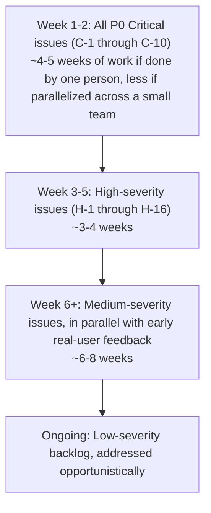

# ClassVibe — FINAL_PROJECT_AUDIT.md

**The final technical audit before production.** Assumes a launch target of up to 1,000,000 users. Read-only inspection of the entire repository at `C:\ClassVibe` — no code was modified or created to produce this report.

This document is the synthesis point for everything found across `MASTER_PROJECT_REPORT.md`, `SYSTEM_ARCHITECTURE.md`, `UI_UX_ARCHITECTURE.md`, `DATABASE_BIBLE.md`, `SAAS_EVOLUTION.md`, and `AI_ROADMAP.md`, reorganized into a single scored issue register plus a dedicated "what breaks at what scale" analysis. Every issue below carries: **Severity, Category, Where, Why, Impact, Likelihood, Recommended Solution, Priority, Time Estimate, and Now-vs-Later**.

---

## Table of Contents

1. Executive Summary & Launch Verdict
2. Audit Methodology
3. Critical Issues (P0 — block production launch)
4. High-Severity Issues (P1 — fix before meaningful scale)
5. Medium-Severity Issues (P2 — fix within first quarter post-launch)
6. Low-Severity Issues (P3 — backlog)
7. Category Deep-Dives (Security / Performance / Scalability / Code Quality / Testing / DevOps / SaaS Readiness)
8. What Breaks At Each Scale (100 → 10,000,000 users)
9. Vendor Lock-In & Migration Risk Register
10. Production Readiness Scorecard
11. Recommended Fix Order (with cumulative time estimate)
12. Final Verdict

---

# 1. Executive Summary & Launch Verdict

**Verdict: NOT production-ready for a 1,000,000-user launch in its current state. IS ready for a small, supervised pilot (dozens to low hundreds of concurrent users) with a short list of urgent fixes applied first.**

The codebase is a genuinely functional MVP with a working real-time core (chat + live quiz). It was built by a single developer, quickly, with no CI/CD, no automated tests beyond a stale boilerplate file, no rate limiting, no centralized authentication, no monitoring, and several fully-designed-but-never-wired data pipelines (`QuizResult`, `Analytics`). None of these gaps are unusual for an MVP at this stage — they are unusual to still have *unaddressed* at the point of planning a 1-million-user launch.

**Top 10 issues that must be fixed before any public/scaled launch:**
1. No rate limiting anywhere (login, registration, AI generation, file upload) — direct cost and abuse exposure.
2. Self-service role escalation — anyone can register as `role:'teacher'` with no verification.
3. Uploaded files are publicly accessible with zero access control, forever.
4. Single in-memory Socket.IO instance with no Redis adapter — cannot run more than one server process.
5. In-memory quiz-timer state (`activeQuizTimers`) — a server restart permanently freezes every live quiz.
6. `Analytics` and `QuizResult` are fully built but never populated — the flagship reporting feature is decorative, not real.
7. `multiple_select` quiz questions can never be scored correct — a live, deterministic scoring bug.
8. Five duplicated JWT authentication implementations — a security fix applied to one is not applied to the other four.
9. Zero automated tests, zero CI/CD — every deploy is an unverified leap of faith.
10. `node_modules` (99% of tracked files) and 9.5MB+ of zip backups are committed to git — not a launch blocker by itself, but a symptom of the same "nothing gates what ships" problem as #9.

**None of these require a rewrite.** Every one is a scoped, addable fix on top of an architecture that is fundamentally sound (see Section 10).

---

# 2. Audit Methodology

This audit is based on a full, systematic reading of the repository: every backend model, route, controller, middleware, service, socket handler, and job file; every frontend page, component, and the routing/state architecture; the full git history; every `package.json`; every `.env` file (names only — no secret values appear anywhere in this document); and the deployment configuration (or lack thereof). No assumptions were made about intended-but-unbuilt behavior — every finding traces to a specific, cited file and, where relevant, a specific line-level behavior. Findings are cross-validated against the five companion documents in this repository, all produced from the same underlying research.

---

# 3. Critical Issues (P0 — block production launch)

Each entry follows: **Severity | Where | Why | Impact | Likelihood | Solution | Priority | Time | Now/Later**

### C-1. No rate limiting anywhere in the API
- **Severity**: Critical
- **Where**: Every route in `server.js`, `routes/quiz.js`, `routes/schedule.js`, `routes/analytics.js`, `routes/notifications.js`
- **Why it happens**: `express-rate-limit` (or equivalent) was never added; no middleware of this kind exists anywhere in the stack
- **Impact**: Unlimited login/register attempts (credential stuffing), unlimited AI quiz-generation calls (direct, unbounded cost against the Groq API bill — potentially thousands of dollars in a single bad night), unlimited file uploads (disk exhaustion)
- **Risk / How likely**: Very high — this requires zero sophistication to exploit; a single script kiddie or a misbehaving bot can trigger it accidentally
- **Recommended solution**: Add `express-rate-limit` with per-route tiers: strict on `/auth/*` and `/quiz/generate*`, moderate elsewhere; add a per-organization/per-user AI-generation quota once multi-tenancy exists
- **Priority**: P0
- **Time estimate**: 1–2 days
- **Now or later**: **NOW** — before any public traffic, at any scale

### C-2. Self-service privilege escalation to `role:'teacher'`
- **Severity**: Critical
- **Where**: `POST /api/auth/register` (`server.js`)
- **Why it happens**: The registration endpoint accepts a client-supplied `role` field and writes it directly to the new `User` document with no server-side restriction
- **Impact**: Any anonymous visitor can become a "teacher" — creating groups, hosting quizzes, seeing group-admin-only analytics endpoints, at will
- **Risk / How likely**: High — trivial to discover (any request-inspection of the register call reveals the `role` field), no special skill needed
- **Recommended solution**: Ignore/strip client-supplied `role` on public registration; default everyone to `student`; introduce a separate, verified teacher-onboarding flow (invite code, email domain verification, or manual approval) before granting `teacher`
- **Priority**: P0
- **Time estimate**: 0.5–1 day
- **Now or later**: **NOW**

### C-3. Uploaded files are publicly accessible forever, with zero access control
- **Severity**: Critical
- **Where**: `express.static('/uploads', ...)` in `server.js`, backing `POST /api/upload`
- **Why it happens**: The static file route has no authentication middleware in front of it at all — it's the only "route" in the entire app with zero gating
- **Impact**: Any chat image/document/video ever uploaded is fetchable by anyone with (or capable of guessing) the URL, indefinitely — a real student-privacy exposure if any uploaded content is sensitive (screenshots of student work, personal photos, etc.)
- **Risk / How likely**: Medium-high — URLs aren't indexed/discoverable by search engines by default, but they are not access-controlled, and any URL leak (shared link, browser history, referrer header) exposes the file permanently
- **Recommended solution**: Move to signed, time-limited URLs (either via object storage like S3 + signed URLs, or an authenticated proxy route that checks group membership before streaming the file)
- **Priority**: P0
- **Time estimate**: 3–5 days (includes migrating off local disk storage, which is also required for horizontal scaling — see C-4)
- **Now or later**: **NOW** for a public launch; acceptable to defer only for a closed, trusted pilot

### C-4. No Socket.IO Redis adapter — cannot run more than one server process
- **Severity**: Critical (for any launch beyond a single-server pilot)
- **Where**: `server.js` Socket.IO initialization; `global.io` pattern used throughout
- **Why it happens**: The realtime layer was built for a single Node process from day one; no `@socket.io/redis-adapter` (or equivalent) was ever added
- **Impact**: The moment traffic requires a second server instance (for capacity or reliability), a teacher and their students landing on different instances will silently stop seeing each other's chat messages and quiz events — the core product experience breaks invisibly, with no error shown to the user
- **Risk / How likely**: Certain to occur the moment horizontal scaling is attempted without this fix — not a matter of "if," but "when you add server #2"
- **Recommended solution**: Add a Redis instance and the official Socket.IO Redis adapter; verify with a two-instance local test that rooms broadcast correctly across both
- **Priority**: P0 (blocks any multi-instance deployment)
- **Time estimate**: 2–4 days including testing
- **Now or later**: **NOW if scaling beyond one server is planned within the next few months; otherwise can wait until Stage 1 of `SAAS_EVOLUTION.md`**

### C-5. In-memory quiz-timer state has no persistence or recovery
- **Severity**: Critical
- **Where**: `activeQuizTimers` Map in `backend/socket-handlers/quiz-socket-handlers.js`
- **Why it happens**: Live quiz question timers are held as `setInterval` handles in a plain JS `Map`, scoped to the process's memory — there is no persistence layer and no boot-time recovery sweep
- **Impact**: Any server restart (a deploy, a crash, or — on free-tier hosting — an automatic sleep/wake cycle) while quizzes are in progress **permanently freezes every one of them** — `QuizSession.status` stays `'active'` in the database forever with no running timer, and no student or teacher can do anything except the teacher manually clicking Next/End (which does still work, since it doesn't depend on the frozen timer)
- **Risk / How likely**: High — this will happen on every single deploy that lands during active class hours, and is close to certain on any free-tier host that sleeps after inactivity
- **Recommended solution**: Either move timer state into Redis with a lightweight per-session lock, or add a boot-time recovery sweep that finds stuck `active` sessions and gracefully force-completes or resumes them
- **Priority**: P0
- **Time estimate**: 3–5 days
- **Now or later**: **NOW** — this directly damages the core, flagship feature's reliability

### C-6. `Analytics` and `QuizResult` are fully built but never populated
- **Severity**: Critical (product-integrity issue, not a security issue)
- **Where**: `backend/models/Analytics.js`, `backend/models/QuizResult.js`; the write-path calls (`recordMessage`, `recordQuizResult`, `recordAttendance`) are never invoked anywhere in `server.js` or `quiz-socket-handlers.js`
- **Why it happens**: The schema and its computation methods were built ahead of the integration work, and the integration work was never finished
- **Impact**: The teacher-facing "Analytics" dashboard **deterministically shows every single student as "Needs Attention" with 0% participation, regardless of actual behavior.** A teacher relying on this to identify at-risk students is being actively misled by their own tool. Quiz history/badges/percentiles are permanently empty.
- **Risk / How likely**: Certain — this is not a "sometimes" bug, it happens on 100% of requests to these endpoints, today, in the current codebase
- **Recommended solution**: Wire `quiz-socket-handlers.js`'s completion logic to create `QuizResult` documents per participant and call the existing (correct) `Analytics.recordQuizResult()`/`recordMessage()`/`recordAttendance()` methods at the appropriate chat/join/leave/quiz-complete moments
- **Priority**: P0 (this is misleading a teacher about a real student's wellbeing — a trust and product-integrity issue, arguably worse than a pure bug)
- **Time estimate**: 5–8 days (touches multiple call sites; needs careful testing since it changes what teachers will start seeing)
- **Now or later**: **NOW** — do not market/ship "Analytics" as a real feature until this is fixed; either fix it or clearly label the feature as beta/incomplete

### C-7. `multiple_select` quiz questions can never be scored correct
- **Severity**: Critical (feature-breaking, not security)
- **Where**: `quiz-socket-handlers.js`, `student:submitAnswer` handler — strict `===` comparison applied to arrays
- **Why it happens**: `multiple_select` answers are compared with the same generic `===` branch used for numeric answer types; JavaScript array comparison by `===` checks object-reference identity, which is always false across a network round-trip
- **Impact**: Any teacher who uses this question type gets systematically, silently wrong results for every student, every time — no error is thrown, it just always scores as incorrect
- **Risk / How likely**: Certain, every time this question type is used
- **Recommended solution**: Replace the comparison with a proper set/array-equality check (sort both arrays, compare element-by-element, or use a Set-based comparison)
- **Priority**: P0
- **Time estimate**: 0.5 day (small, well-isolated fix — but must ship with a regression test given how easy this was to miss the first time)
- **Now or later**: **NOW**

### C-8. Five duplicated, inconsistent JWT authentication implementations
- **Severity**: Critical (structural security risk)
- **Where**: `server.js`, `routes/quiz.js`, `routes/schedule.js`, `routes/notifications.js` (each with its own local copy), plus a fifth, unused "canonical" version in `middleware/auth.js`
- **Why it happens**: Incremental, single-developer feature-by-feature development without a refactor pass to centralize shared logic
- **Impact**: A future security fix (e.g., adding token-revocation checking, fixing the inconsistent 401-vs-403 status codes, adding stricter claim validation) applied to one copy has no effect on the other four — this is exactly the class of bug that produces silent, partial security fixes that look complete in code review but aren't
- **Risk / How likely**: Medium likelihood of a *future* incident (this is a structural risk, not an active exploit today) but high severity if it does occur, since auth is the base of every other security control in the app
- **Recommended solution**: Delete the four duplicated copies; mount and use the one real, DB-verifying implementation in `middleware/auth.js` everywhere
- **Priority**: P0 (structural — fix before the codebase grows further and the duplication multiplies)
- **Time estimate**: 2–3 days (touching every route file, careful regression testing of all auth-gated endpoints)
- **Now or later**: **NOW**

### C-9. Zero automated tests, zero CI/CD
- **Severity**: Critical (production-readiness, not a single bug)
- **Where**: Entire repository — confirmed only one stale test file exists (`frontend/src/App.test.js`, asserting text that no longer exists in the app), no backend tests at all, no `.github/workflows` or any other CI configuration
- **Why it happens**: Solo-developer MVP velocity; testing and CI were never prioritized
- **Impact**: Every deploy is unverified — there is no automated gate preventing a broken build, a failing auth check, or a regression from reaching production. Combined with C-8 (5 auth copies) and C-6/C-7 (silent data-integrity bugs), the absence of tests is exactly why these issues shipped unnoticed and would continue to
- **Risk / How likely**: Certain to cause future incidents; the only question is when, not if
- **Recommended solution**: Start with a minimal but real safety net — auth middleware tests, quiz-scoring unit tests (would have caught C-7 immediately), and one end-to-end smoke test (login → join → send message → host a quiz) — wired into a CI pipeline that blocks merges on failure
- **Priority**: P0
- **Time estimate**: 1–2 weeks for a meaningful initial suite + CI wiring
- **Now or later**: **NOW** — this is a prerequisite for safely fixing every other issue in this document without introducing new regressions

### C-10. `node_modules` and 9.5MB+ of zip backups committed to git
- **Severity**: High (operational, not a security exploit — but severe enough to belong near the top)
- **Where**: Repository root (`node_modules/`, no `.gitignore` entry for it), `backend.zip`, `frontend/src.zip`
- **Why it happens**: `.gitignore` was never updated to exclude `node_modules`; historical backups were committed instead of using proper version control (branches/tags)
- **Impact**: 10,343 of 10,449 tracked files (99%) are inside `node_modules`; the `.git` directory is 79MB; every clone, every CI checkout, every deploy pulls all of this unnecessarily, slowing everything down and bloating storage costs at scale
- **Risk / How likely**: Certain — this is already true today, it doesn't get worse, but it also never fixes itself
- **Recommended solution**: Add `node_modules` to `.gitignore`, run `git rm -r --cached node_modules`, delete the `.zip` files, commit; if history size matters, consider a history-rewrite (e.g., `git filter-repo`) as a one-time cleanup
- **Priority**: P0 (cheap, high-value, do it immediately — it also unblocks faster CI once C-9 is built)
- **Time estimate**: 1–2 hours
- **Now or later**: **NOW**

---

# 4. High-Severity Issues (P1 — fix before meaningful scale)

| # | Issue | Where | Impact | Likelihood | Solution | Time |
|---|---|---|---|---|---|---|
| H-1 | Client-supplied `timeTaken` trusted for quiz score multiplier | `quiz-socket-handlers.js`, `student:submitAnswer` | A modified client can always claim the maximum speed bonus | Medium (requires deliberate client tampering, but trivial once discovered) | Cross-check reported `timeTaken` against the server's own `activeQuizTimers` state | 1 day |
| H-2 | `/uploads/*` and generic file uploads accept audio client-side but reject it server-side | `MessageInput.js` vs. `server.js` multer `fileFilter` | Confusing silent failures for users trying to send voice notes | High (any user who tries) | Align allowed MIME types on both sides | 0.5 day |
| H-3 | Dangling no-auth debug route one edit away from being live | `routes/quiz-test.js` (imported, never mounted) | If ever accidentally mounted, exposes free unauthenticated AI generation, directly burning API budget | Low likelihood, catastrophic-if-it-happens impact | Delete the file entirely | 0.25 day |
| H-4 | Stack traces leaked to API clients on error | `POST /api/quiz/generate` (self-flagged "temporary" in code) | Information disclosure (internal file paths, library versions) to any client that triggers an error | Medium | Remove `stack` from the JSON error response | 0.25 day |
| H-5 | No membership check on quiz history endpoint | `GET /api/quiz/group/:groupId/history` | Any authenticated user who knows/guesses a `groupId` can view that group's full quiz history and scores | Medium (requires knowing/guessing a valid ObjectId, which is not brute-forceable in practice but also not access-controlled by design) | Add a membership check before returning data | 0.5 day |
| H-6 | No teacher moderation override in chat | `server.js` `deleteMessage`/`editMessage` handlers | A teacher cannot remove an inappropriate student message; no reporting mechanism exists at all | High (will happen the first time a student posts something inappropriate) | Add an admin-override branch to the delete handler; add a basic report/flag mechanism | 2–3 days |
| H-7 | Plaintext per-student passwords for private scheduled sessions | `ScheduledSession.allowedStudents[].password` | A database read/leak exposes these directly, unlike `User.password` which is bcrypt-hashed | Low likelihood of a breach, high severity if one occurs | Hash with bcrypt, same as `User.password` | 1 day |
| H-8 | XSS vector in the notification toast | `NotificationBell.jsx`'s `showToast()`, raw `innerHTML` interpolation | If any notification-generating code path ever includes unsanitized user-influenced text (e.g., a teacher-chosen session name), this becomes stored XSS against every recipient | Medium — currently no confirmed live injection path, but the *mechanism* is present and waiting for one | Rebuild the toast as a real React component using JSX (auto-escaped) instead of `innerHTML` | 0.5 day |
| H-9 | CSV export has no field escaping (CSV injection risk) | `routes/analytics.js`, `GET /group/:groupId/export` | A comma/quote/leading `=`/`+`/`-`/`@` in a student name corrupts the export or, in some spreadsheet apps, triggers formula execution | Low-medium | Use a proper CSV library with field quoting/escaping | 0.5 day |
| H-10 | Fully orphaned, broken dead-code router (`groupRoutes.js`/`groupController.js`) that would corrupt data if resurrected | `backend/routes/groupRoutes.js`, `backend/controllers/groupController.js` | A future developer "fixing" this thinking it's the real code path would push a raw ObjectId into the `members` subdocument array, corrupting `Group.members` shape | Low likelihood (requires someone to not read this audit first), high impact if triggered | Delete outright | 0.5 day |
| H-11 | Reminder job's env-configurable interval/advance vars are dead — hardcoded values used instead | `jobs/sessionReminder.js` vs. `backend/.env`'s `REMINDER_INTERVAL_MINUTES`/`REMINDER_ADVANCE_MINUTES` | Operators believe they can tune reminder timing; they cannot — silent misconfiguration | Medium | Wire the env vars into the job, or remove them from `.env` and document the fixed behavior | 0.5 day |
| H-12 | No teacher rehydration on reconnect mid-quiz | `QuizHost.jsx` | A teacher who refreshes mid-quiz loses their entire live student list/progress view with no recovery path except waiting for the next broadcast | High (refreshes happen constantly in real usage) | Add a state-rehydration request on `teacher:joinSession`, mirroring what `student:joinQuiz` already does correctly | 1–2 days |
| H-13 | Live poll vote updates likely don't reach other viewers in real time | `ChatArea.js` / `App.js` — no confirmed listener for the `pollUpdated` socket event | Other students may not see updated poll tallies without an unrelated re-render or reload | Medium-high | Add the missing `pollUpdated` listener | 0.5 day |
| H-14 | Two incompatible guest-account creation flows for the same email | `User` creation via PIN-join guest path (random unrecoverable password) vs. guest-auth path (student-chosen password) | A student who uses both flows gets locked out of one — a real, reproducible account-lockout bug | High (will happen to real users organically) | Unify into a single guest-account creation path | 1–2 days |
| H-15 | Two redundant, one-broken teacher quiz-hosting UIs open concurrently | `QuizHost.jsx` (works) vs. `QuizControlPanel.jsx` (all actions 404) | Confusing, broken UX for teachers who reach the quiz via the floating button instead of quiz creation | High (whichever entry point a teacher happens to use first) | Delete `QuizControlPanel.jsx`'s dead REST calls, redirect its entry point to `QuizHost.jsx` | 1–2 days |

---

# 5. Medium-Severity Issues (P2 — fix within first quarter post-launch)

| # | Issue | Category | Where | Solution | Time |
|---|---|---|---|---|---|
| M-1 | No `express-validator` usage despite being a declared dependency; validation is manual and inconsistent | Backend / Code Quality | All route files | Adopt it consistently, or remove the unused dependency | 3–5 days |
| M-2 | `PUT /api/quiz/:quizId` accepts a wholesale `questions[]` array with zero shape validation | Backend / Data Integrity | `routes/quiz.js` | Add schema validation matching `validateQuestions()`'s rigor | 1 day |
| M-3 | No cascade delete when a `Quiz` is removed — orphans `QuizSession`/`QuizResult` | Database | `routes/quiz.js` DELETE handler | Add a cleanup step or soft-delete instead | 1 day |
| M-4 | `Quiz.aiSource.type` enum doesn't include `'file'`, which the upload route sets | Database | `models/Quiz.js` vs `routes/quiz.js` | Add `'file'` to the enum | 0.25 day |
| M-5 | N+1-style sequential writes in analytics refresh endpoint | Performance | `routes/analytics.js` `/group/:groupId/refresh` | Parallelize with `Promise.all` | 0.5 day |
| M-6 | Read-triggers-write pattern on every analytics GET | Performance / Architecture | `routes/analytics.js` | Separate read-only endpoints from a distinct recompute trigger | 2 days |
| M-7 | No pagination on chat history (hard `limit(100)`) | Performance / UX | `GET /api/groups/:groupId/messages` | Add cursor-based pagination | 2–3 days |
| M-8 | Client-side chat search re-filters entire in-memory array on every keystroke, no debounce | Performance | `ChatArea.js` | Add debounce (won't matter until pagination changes the scale of the array) | 0.5 day |
| M-9 | No code-splitting/lazy-loading — entire app (including 1,841-line `QuizCreator.jsx`) ships in one bundle | Performance | `frontend/src` | Adopt `React.lazy`/`Suspense` for major feature surfaces | 2–3 days |
| M-10 | `App.js` is a 2,412-line God component with no Context/state-management layer | Code Quality / Architecture | `frontend/src/App.js` | Introduce Context or a lightweight store; extract feature-scoped components | 1–2 weeks |
| M-11 | `react-router-dom` installed, never used — no URL-based navigation, no deep links, no back-button support | UX / Architecture | Entire frontend | Adopt real routing | 1 week |
| M-12 | Fake upload-progress bar (simulated, not real network progress) | UX | `MessageInput.js` | Use `axios` upload progress events or `XMLHttpRequest.upload.onprogress` | 0.5 day |
| M-13 | No `aria-live` region on any quiz countdown timer | Accessibility | `QuizPlayer.jsx`, `QuizHost.jsx`, `QuizControlPanel.jsx` | Add `aria-live="polite"` region announcing time remaining at intervals | 0.5 day |
| M-14 | No `htmlFor`/`id` label pairing on form inputs | Accessibility | `StudentJoin.jsx`, `TeacherLogin.jsx` | Add proper label associations | 0.5 day |
| M-15 | Nested double-clickable-target pattern (`
` wrapping `<button onClick>`) | Accessibility | `StudentJoin.jsx` role-selection cards | Simplify to a single interactive element | 0.5 day |
| M-16 | Two competing color palettes in production simultaneously (indigo/slate vs. legacy WhatsApp-green) | UI Consistency | `NotificationCenter.jsx`, `Login.js`, analytics fragments vs. rest of app | Migrate remaining legacy-palette components to the current design language | 2–3 days |
| M-17 | `window.alert()`/`window.confirm()` used pervasively instead of in-app UI | UX | Dozens of call sites | Build and roll out a shared Toast/ConfirmDialog component | 1 week |
| M-18 | Socket event names are string literals duplicated across 6+ files with no shared constants | Code Quality | Backend + frontend socket consumers | Extract a shared event-name constants module, imported by both sides | 1–2 days |
| M-19 | 5 declared statics on `Notification` model are dead code; notification-building logic duplicated inline instead | Code Quality / Database | `models/Notification.js` vs. call sites | Refactor call sites to use the model's own statics | 1–2 days |
| M-20 | `express.json()`/`urlencoded()` and CORS handling are the only global middlewares; no Helmet/security-headers middleware | Security | `server.js` | Add `helmet` for standard security headers (CSP, X-Frame-Options, etc.) | 0.5 day |
| M-21 | No structured logging, no correlation IDs, no log levels | Observability | Entire backend | Adopt `pino`/`winston`; add a request-ID middleware | 2–3 days |
| M-22 | No error-monitoring/APM integration | Observability | Entire stack | Integrate Sentry (or equivalent) on both frontend and backend | 1–2 days |
| M-23 | `GET /health` doesn't check the actual MongoDB connection — it's a liveness check pretending to be a readiness check | DevOps | `server.js` | Add a real DB ping to the health check, or add a separate `/ready` endpoint | 0.5 day |
| M-24 | `connectDB()` is fired but not awaited at the call site in `server.js` | Backend | `server.js` | Await it before `server.listen()`, or explicitly document the buffering behavior it relies on | 0.25 day |
| M-25 | Two separate `io.on('connection')` blocks in `server.js`, ~850 lines apart | Code Quality | `server.js` | Consolidate into one connection handler | 1 day |
| M-26 | Two independent Multer configurations with inconsistent rules (different dirs, different allowed types, different filename schemes) | Code Quality / Architecture | `server.js` vs `routes/quiz.js` | Extract a shared upload-configuration factory | 1 day |
| M-27 | `Analytics`/`QuizResult` even once fixed will need a decision: instrument every socket event, or run nightly aggregation | Architecture | `models/Analytics.js`, `models/QuizResult.js` | Recommend nightly aggregation over scattered inline `record*()` calls — lower future maintenance burden | Included in C-6 estimate |
| M-28 | `getGlobalLeaderboard()` static has a confirmed latent bug (`mongoose.Types.ObjectId()` called without `new`) | Database | `models/QuizResult.js` | Fix before this method is ever wired up (currently unreachable, so non-urgent, but must be fixed as part of C-6) | 0.1 day |

---

# 6. Low-Severity Issues (P3 — backlog)

| # | Issue | Category |
|---|---|---|
| L-1 | Redundant explicit `.index()` declarations duplicating field-level `unique:true` (User, Group models) | Database |
| L-2 | Two unrelated, redundant `Footer` component implementations (one dead) | Code Quality |
| L-3 | Two unrelated Login implementations (`Login.js` legacy vs `TeacherLogin.jsx` current) | Code Quality |
| L-4 | Fully dead `Poll` model + `PollComponent.js` (superseded by embedded `Message.pollOptions`) | Code Quality |
| L-5 | ~9 of `api.js`'s ~19 exported functions never imported anywhere | Code Quality |
| L-6 | `App.js` reimplements ~6+ raw `fetch()` calls duplicating unused `api.js` wrapper functions | Code Quality |
| L-7 | `reportWebVitals()` called with no callback — effectively a no-op | Code Quality |
| L-8 | Stale `App.test.js` asserts CRA boilerplate text that no longer exists in the app | Testing |
| L-9 | Hardcoded developer credit ("ClassVibe - sai") in `TeacherLogin.jsx`'s production UI | UX polish |
| L-10 | Leftover "ClassConnect" brand-name typo on `Home.jsx` | UX polish |
| L-11 | Broken `#faq` anchor link with no matching section on `Home.jsx` | UX polish |
| L-12 | Placeholder social links (`YOUR_USERNAME` etc.) in the dead Footer | UX polish |
| L-13 | `Quiz.timesUsed`/`averageScore` permanently stuck at 0 (method exists, never called) | Database |
| L-14 | `ScheduledSession.status:'completed'` enum value is structurally unreachable | Database |
| L-15 | `ScheduledSession.duration` stored as a display string, blocking real duration math | Database |
| L-16 | Root-level stale `Message.js` backup file, and two committed `.zip` backups | Repo hygiene (also covered in C-10) |
| L-17 | `FloatingQuizButton.jsx`'s draggable position isn't reclamped on window resize | UI |
| L-18 | `spin`/`pulse`/`bounce` CSS keyframes independently redeclared with slightly different values in 4+ files | Code Quality |
| L-19 | `Leaderboard.jsx` fetches a nonexistent endpoint and isn't even mounted anywhere | Dead code |
| L-20 | `ManageStudents.jsx`/`UpcomingSessions.jsx` fully functional backend + frontend, but frontend never mounted | Dead code (feature-level, not bug-level) |

---

# 7. Category Deep-Dives

## 7.1 Security
Summary posture: **reactive, not defense-in-depth.** No centralized policy-enforcement point (Section on Authorization below), no rate limiting, no security-headers middleware, no secrets-scanning in CI (because there is no CI), no dependency-vulnerability scanning found configured. The specific, ranked findings are C-2, C-3, C-8, H-1, H-6, H-7, H-8, H-9, H-10, M-20. **Authentication**: JWT-based, reasonable in principle (stateless, horizontally-scalable-friendly), undermined by the 5-copy duplication (C-8). **Authorization**: flat role string, checked ad hoc per-route; no RBAC/ABAC framework; ownership checks (`isAdmin`, `creator===userId`) are generally well-applied where they exist, but role checks are duplicated 3+ times independently.

## 7.2 Performance
No caching layer anywhere (no Redis, no in-memory LRU). No code-splitting on the frontend. Several N+1/sequential-write patterns in analytics endpoints (M-5, M-6). The AI-generation pipeline makes 2–5 API calls per quiz-generation request due to its model-probing strategy — a deliberate reliability tradeoff, not a bug, but worth knowing as a per-request cost multiplier. Chat pagination is entirely absent (M-7) — fine today, a hard wall the moment any group accumulates a real conversation history.

## 7.3 Scalability
See Section 8 for the full breakdown by user count. The single biggest structural scalability blocker is the lack of a Redis adapter for Socket.IO (C-4) combined with in-memory quiz-timer state (C-5) — both must be fixed before running more than one server process is viable at all.

## 7.4 Code Quality
The dominant pattern across the whole codebase is **duplication without a shared source of truth**: 5 auth implementations, 2 poll systems, 2 quiz-hosting UIs, 2 Footers, 2 Logins, socket event names repeated as literals in 6+ files, CSS keyframes redeclared 4 times. None of these individually is severe; together they represent the single largest source of future-bug risk in the project, because a fix applied to one copy silently does not apply to its siblings.

## 7.5 Testing
Effectively zero. One stale, broken default test file. No backend tests. No integration tests. No end-to-end tests. This is a P0 finding (C-9) precisely because it's the root cause that let several other Critical/High findings (C-6, C-7, H-13, H-14) ship and go unnoticed.

## 7.6 DevOps / CI-CD
No pipeline exists. Deploys are inferred to be manual push-to-deploy on Vercel (frontend) and Render (backend), with zero automated gating between a commit and production. No `render.yaml`/Dockerfile/Procfile exists in-repo — backend deployment configuration lives entirely outside version control, in a hosting dashboard, which is itself a reproducibility/disaster-recovery risk (see Section 9).

## 7.7 SaaS Readiness / Multi-Tenancy / Billing Readiness
None of these exist today. No `Organization` model, no billing integration, no plan tiers, no per-tenant usage quotas. This is not a defect (the product wasn't built as a SaaS from day one), but it is the largest single body of *new* work required before a real multi-school launch — full detail in `SAAS_EVOLUTION.md` and the proposed schemas in `DATABASE_BIBLE.md` §17.

---

# 8. What Breaks At Each Scale

| Users (concurrent-ish) | What breaks first | Why | What must exist by this point |
|---|---|---|---|
| **100** | Nothing structural — but every Critical (C-1 through C-10) issue is already live and exploitable at this scale, it's just less likely anyone has noticed yet | Single server handles this load fine | Fix all P0 issues (Section 3) — this is the "before any real users at all" bar |
| **1,000** | Local disk storage starts filling; a single server's memory/CPU starts to feel real-quiz-timer restart pain more often (more concurrent quizzes = higher chance a deploy lands mid-quiz) | Still one process, but load is now high enough that C-5's restart-freezes-quizzes risk becomes a near-weekly occurrence rather than a theoretical one | Object storage for uploads; Redis for quiz-timer persistence; basic monitoring (M-22) so you find out about incidents before users complain |
| **10,000** | The single-process ceiling is reached — CPU-bound requests (heavy analytics aggregations) start measurably delaying Socket.IO event delivery for everyone, since they share one event loop | No worker-thread offload exists anywhere; everything (HTTP + sockets + the reminder job) competes for the same event loop | A second server instance becomes necessary — which requires C-4 (Redis adapter) to already be done, or this is the point where the product visibly breaks for real users, not hypothetically |
| **100,000** | Single MongoDB instance read/write capacity becomes a real constraint; the free/shared-tier database ceiling (Atlas) is long since exceeded | One database, one connection pool, no read replicas, no sharding | Paid, dedicated-resource database tier at minimum; likely read replicas for analytics-heavy queries; a real `Organization` multi-tenant model becomes commercially necessary (schools want to pay as an org, not per-teacher) |
| **1,000,000** | Everything in `SAAS_EVOLUTION.md` Stage 2–3 becomes mandatory, not optional: database sharding/partitioning (likely by `organizationId`), a dedicated realtime infrastructure separate from API servers, a dedicated SRE/infra team (this can no longer be run by the current level of tooling/process), formal compliance program (COPPA/FERPA/GDPR-equivalent, given this is education software touching minors' data) | The current architecture's design is not conceptually wrong at this scale, but the current *operational maturity* (no CI, no tests, no monitoring, no on-call process) absolutely cannot support this scale safely | Full `SAAS_EVOLUTION.md` Stage 3 checklist; this is no longer a "codebase" problem, it's an organizational one |
| **10,000,000** | Global data-residency law compliance becomes mandatory in most target markets; a single-region deployment introduces unacceptable latency for distant users; the current lack of any i18n/localization infrastructure blocks non-English-speaking markets entirely | Same architecture, now needs true multi-region operation | Full `SAAS_EVOLUTION.md` Stage 4 — multi-region deployment, localization, enterprise SSO, a dedicated platform organization (not just an engineering team — legal, compliance, regional operations) |

**The single most important takeaway from this table**: the architecture does not need a full rewrite at any point in this curve — every stage's blockers are specific, addable infrastructure and process investments (Redis, object storage, sharding, a real ops team), not "the code is fundamentally wrong." The risk is entirely in **sequencing** — attempting to skip ahead to 100,000 users without first doing the 1,000-user-stage fixes (especially C-4/C-5, the realtime-layer blockers) will produce a very public, very embarrassing outage rather than a graceful scale-up.

---

# 9. Vendor Lock-In & Migration Risk Register

| Dependency | Lock-in risk | Migration difficulty if needed | Mitigation |
|---|---|---|---|
| Groq (AI provider) | Medium — model names and API shape are hardcoded directly into `aiQuizGenerator.js` | Low-medium if a provider-abstraction layer is built first (see `AI_ROADMAP.md` §6); high if not | Build the provider-abstraction layer proactively, before it's urgently needed |
| Render.com (backend hosting) | Medium — zero in-repo deployment configuration means the *actual* deploy setup only exists in a dashboard outside version control | High — a new team inheriting this repo would have to reverse-engineer the working deploy configuration from scratch, since nothing is codified | Add a `render.yaml`/Dockerfile capturing the real deploy configuration in-repo, even if you don't switch hosts, purely for disaster-recovery/reproducibility |
| Vercel (frontend hosting) | Low — CRA static builds are portable to almost any static host | Low | No action needed unless a specific reason to migrate arises |
| MongoDB / Mongoose | Low-medium — the schema design itself isn't exotic, but 10 collections' worth of relationships and Mongoose-specific method conventions (instance/static methods on schemas) would need re-implementation on a different database technology | Medium | Not an urgent concern; MongoDB is a reasonable long-term choice for this data shape |
| Socket.IO | Low-medium — the room/event model is somewhat portable in concept but the exact event-name protocol is deeply embedded across 6+ frontend files with no abstraction layer | Medium-high | The same "shared event-constants module" fix recommended for M-18 would also reduce this risk as a side benefit |

**Disaster-recovery gap, called out explicitly**: because backend deployment configuration lives entirely in Render's dashboard rather than in this repository, **there is currently no way to stand up a working copy of this backend from the git repository alone** — a new engineer would need dashboard access, not just repo access, to reproduce the production environment. This should be treated as a standalone finding: **add H-16: codify deployment configuration in-repo (Dockerfile or platform-native config file)** — Severity: High, Time estimate: 1–2 days, Now/Later: **NOW**, because this is exactly the kind of gap that turns a routine incident into a prolonged outage.

---

# 10. Production Readiness Scorecard

| Area | Score (1–5, 5=ready) | Rationale |
|---|---|---|
| Core feature functionality (chat + live quiz) | 4/5 | Genuinely works, well-designed real-time engine, minus the multiple_select bug and a few reconnect gaps |
| Security | 2/5 | No rate limiting, self-service role escalation, public file access, duplicated auth — all fixable, none fixed yet |
| Scalability | 2/5 | Hard-blocked at "more than one server instance" until Redis adapter + persisted timer state land |
| Data integrity / correctness | 2/5 | Two flagship-adjacent features (Analytics, quiz history) are silently non-functional |
| Code quality / maintainability | 3/5 | Sound schema design, messy but not unrecoverable duplication throughout the app layer |
| Testing | 1/5 | Essentially none |
| DevOps / CI-CD | 1/5 | None exists |
| Observability | 1/5 | `console.log` only, no monitoring, no alerting |
| Accessibility | 2/5 | A few genuine positives (some `aria-label`s), many gaps |
| SaaS/multi-tenancy readiness | 1/5 | Doesn't exist yet, by design (not a defect, a gap) |
| Documentation | 5/5 | This document and its five companions are, as of this audit, comprehensive |

**Overall**: **2.2 / 5** — a real, working product with a genuinely good core, held back almost entirely by operational and hardening gaps rather than fundamental design flaws.

---

# 11. Recommended Fix Order (with cumulative time estimate)

**Rough total time to reach a genuinely production-hardened state (all P0 + P1 fixed)**: **7–9 weeks of focused work** for a small team (2–3 engineers), or roughly **double that** for a single developer working alone — consistent with the pace visible in the existing git history. This is a *hardening* estimate, not a rewrite estimate — the underlying architecture does not need to change shape, only to be reinforced.

---

# 12. Final Verdict

**ClassVibe is a well-conceived, partially-hardened product.** Its core real-time experience — the thing users actually feel — already works and works well. Its data model is thoughtfully designed. Its biggest problems are not "the idea is wrong" or "the architecture is wrong" — they are the entirely normal, entirely fixable gaps of an MVP that hasn't yet gone through a hardening pass: no tests, no rate limiting, some unfinished integrations, some duplicated code.

**Do not launch to 1,000,000 users today.** Do fix the 10 Critical (P0) issues in Section 3 before any public or scaled launch — that is achievable in a matter of weeks, not months, and does not require rearchitecting anything. After that, the High-severity list (Section 4) should be cleared before aggressive growth, and the Medium/Low lists can reasonably be worked through in parallel with real user growth, guided by actual usage data rather than speculation.

This audit, together with `MASTER_PROJECT_REPORT.md`, `SYSTEM_ARCHITECTURE.md`, `UI_UX_ARCHITECTURE.md`, `DATABASE_BIBLE.md`, `SAAS_EVOLUTION.md`, and `AI_ROADMAP.md`, is intended to be sufficient for a new engineering team to pick this project up with zero prior context and execute the fix list above with confidence.

---

*End of FINAL_PROJECT_AUDIT.md.*
