# ClassVibe — Master Project Report

**The Project Bible: Complete Technical, Architectural, and Product Documentation**

Generated: 2026-07-05
Scope: 100% read-only inspection of the repository at `C:\ClassVibe`. Every statement below is grounded in actual code, actual commit history, or actual configuration found in the repo. Where something is missing, unfinished, broken, or dead, this document says so explicitly rather than assuming intent.

---

## How to read this document

This report is organized into 23 sections matching a full project audit: overview, architecture, folder structure, features, frontend pages, backend, database, realtime, API, auth, quiz system, chat system, UI/UX, security, performance, code quality, dependencies, deployment, known issues, roadmap, SaaS expansion, future AI features, and a final architect review.

A theme recurs throughout: **ClassVibe is a working, single-developer-built MVP with a genuinely functional real-time core (chat + live quiz), sitting on top of several fully-designed-but-never-wired subsystems** (analytics, quiz results, a richer polling engine, a cleaner group/auth refactor). The most valuable thing this document does is tell a future team, precisely, which parts are real and which parts only look real.

---

# SECTION 1 — PROJECT OVERVIEW

## Vision
ClassVibe is a real-time virtual classroom platform: a teacher creates a "Group" (a classroom session), students join via a 6-digit PIN or QR code, and the room becomes a live chat space that can be augmented with AI-generated or manually authored live quizzes (Kahoot-style), in-chat polls, file sharing, and post-session analytics.

## Purpose / problem being solved
Teachers running any kind of remote or hybrid class need a lightweight way to (a) get every student into the same room instantly without account provisioning overhead, and (b) run interactive, gamified formative assessment (quizzes) without leaving the classroom chat. ClassVibe's PIN/QR join model and guest-auth flow are explicitly built to minimize the friction of getting a student from "link click" to "in the room" — no class rosters, no LMS integration, no pre-registration required for public sessions.

## Target users
- **Teachers** (`role: 'teacher'`): create/host groups, author and run quizzes, schedule future sessions, view analytics.
- **Students** (`role: 'student'`): join via PIN/QR/guest-auth, participate in chat, play quizzes, view their own performance.
- Both roles live in a single polymorphic `User` collection distinguished only by a `role` field — there is no separate "Admin"/"School"/"Organization" tenant concept yet (see Section 21).

## Business model
None is implemented in code. There is no billing, subscription, plan-tier, or payment integration anywhere in the repository (no Stripe/Paddle/LemonSqueezy SDK in either `package.json`). The product today is a free, single-tenant tool.

## SaaS readiness
Low, as currently built — see Section 21 for the gap analysis. There is no organization/tenant model, no seat/plan limits, no billing, and the deployment is a single Node process with in-memory Socket.IO state (no horizontal scaling path without an adapter — see Section 8).

## Current development stage
**Working MVP / active solo development.** Evidence: the git history is a mix of real feature commits (`fix: complete Live Quiz system — FIB schema, socket rooms, answer evaluation, UX`) and many placeholder `:wq` commits (accidental Vim-exit commits — 10+ of them in recent history), a `README.md` that is corrupted/near-empty (18 bytes, garbled encoding, literally just the word "chat"), and a repo checked in with `node_modules` and two historical `.zip` backups (`backend.zip`, `frontend/src.zip`) — all signals of a single developer iterating quickly without CI, code review, or release process.

## Long-term vision
Not documented anywhere in the repository (no ROADMAP.md, no product spec, no design docs). This report's Section 20/21/22 propose a long-term vision based on what the codebase's own half-finished subsystems (Analytics, QuizResult, Poll, ScheduledSession approval workflow) suggest the original developer was already reaching toward.

---

# SECTION 2 — HIGH-LEVEL ARCHITECTURE

## Layer summary

| Layer | Technology | Notes |
|---|---|---|
| Frontend | React 18 (Create React App, `react-scripts` 5), no router library | Single ~2,412-line `App.js` acts as a hand-rolled router/state store |
| Backend | Node.js + Express 4 | One 1,350-line `server.js` contains most routes and both Socket.IO connection handlers |
| Realtime | Socket.IO 4.6 (server) / 4.8 (client) | Single in-memory instance, no Redis adapter |
| Database | MongoDB via Mongoose 7 | 10 collections/models, one (`Poll`) fully unused, one (`QuizResult`) never written to |
| Auth | Custom JWT (jsonwebtoken), bcrypt password hashing | 5 duplicated implementations of the same middleware across the codebase |
| File storage | Local disk (`backend/public/uploads`), served statically, no access control | Not object storage (no S3/GCS) |
| AI | Groq API (Llama 3.1/3, Mixtral, Gemma2 fallback chain) | Used for AI quiz generation from text/PDF/DOCX/TXT |
| Deployment | Frontend: Vercel (static build). Backend: implied Render.com (hardcoded fallback URL `https://classvibe-backend.onrender.com` throughout the code; no Render config file exists in-repo) | No CI/CD pipeline found (no `.github/workflows`) |

## System architecture diagram

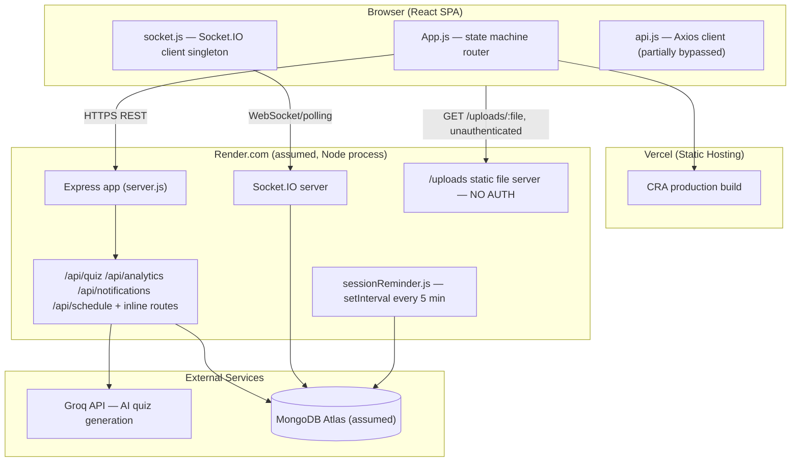
```mermaid
flowchart TB
    subgraph Client["Browser (React SPA)"]
        UI["App.js — state machine router"]
        Socket["socket.js — Socket.IO client singleton"]
        API["api.js — Axios client (partially bypassed)"]
    end

    subgraph Vercel["Vercel (Static Hosting)"]
        Build["CRA production build"]
    end

    subgraph Render["Render.com (assumed, Node process)"]
        Express["Express app (server.js)"]
        SIO["Socket.IO server"]
        Routes["/api/quiz /api/analytics /api/notifications /api/schedule + inline routes"]
        Jobs["sessionReminder.js — setInterval every 5 min"]
        Static["/uploads static file server — NO AUTH"]
    end

    subgraph External["External Services"]
        Groq["Groq API — AI quiz generation"]
        Mongo[("MongoDB Atlas (assumed)")]
    end

    UI -->|HTTPS REST| Express
    Socket -->|WebSocket/polling| SIO
    Express --> Routes
    Routes --> Mongo
    Routes --> Groq
    SIO --> Mongo
    Jobs --> Mongo
    UI --> Build
    Client -->|GET /uploads/:file, unauthenticated| Static
```

## Notes on the architecture as actually implemented
- **No API gateway, no reverse proxy layer, no CDN configuration** beyond whatever Vercel/Render provide by default.
- **`global.io` / `app.set('io', io)` pattern**: Socket.IO instance is stashed globally so REST route handlers (`schedule.js`, model statics in `Notification.js`) can emit socket events from inside an Express request — this only works because everything runs in one process; it is the reason horizontal scaling is currently a hard blocker (Section 8, Section 23).
- **Two separate `io.on('connection', ...)` registrations** exist in `server.js` (one thin one at the top wiring up quiz socket handlers, one large one near the bottom wiring up chat/presence handlers) — functionally fine (Socket.IO allows multiple listeners) but a maintainability smell.
- **No message queue, no background worker process, no cron system** — the only "scheduled" behavior is a plain `setInterval` in `sessionReminder.js`.

---

# SECTION 3 — COMPLETE FOLDER STRUCTURE

```
C:\ClassVibe
├── .env.local                  # Vercel-CLI-generated, frontend env (REACT_APP_* + VERCEL_OIDC_TOKEN)
├── .gitignore                  # only ignores .vercel, .env*.local, backend/.env, frontend/.env — NOT node_modules
├── .vercel/                    # Vercel project link (root — actually unused; frontend/.vercel is the real one)
├── Message.js                  # STALE ROOT-LEVEL BACKUP of backend/models/Message.js (pre quiz/poll fields). Dead file.
├── README.md                   # 18 bytes, garbled encoding — effectively empty
├── backend.zip                 # 9.5MB committed zip backup of an old backend state (includes its own node_modules!)
├── package.json                # ROOT package.json — unrelated grab-bag deps (axios, mongodb, react-qr-reader, socket.io-client), no scripts
├── package-lock.json
├── node_modules/                # ROOT node_modules — tracked in git (see Section 16)
│
├── backend/
│   ├── .env                    # MONGODB_URI, PORT, JWT_SECRET, FRONTEND_URL, ENABLE_SESSION_REMINDERS, REMINDER_INTERVAL_MINUTES, REMINDER_ADVANCE_MINUTES
│   ├── package.json             # express, mongoose, socket.io, bcryptjs, jsonwebtoken, multer, qrcode, pdf-parse, mammoth, axios, cors, dotenv, express-validator
│   ├── server.js                # 1,350 lines — Express app, both Socket.IO connection handlers, ~20 inline REST routes (auth/groups/messages/upload), CORS, multer config, graceful shutdown
│   ├── testAI.js                 # Broken standalone debug script — references undefined vars, would crash if run
│   ├── config/
│   │   └── db.js                # mongoose.connect wrapper, deprecated no-op options, no retry logic, process.exit(1) on failure
│   ├── controllers/
│   │   └── groupController.js   # DEAD — only exports joinGroup, which itself references undefined getIo/makeUniqueUsername
│   ├── middleware/
│   │   └── auth.js              # DEAD IN PRODUCTION — the "canonical" authenticateToken/isTeacher, used only by the also-dead groupRoutes.js
│   ├── models/                  # 10 Mongoose schemas — see Section 7
│   │   ├── Analytics.js         # Fully built, always computes "Needs Attention" because nothing ever writes real activity into it
│   │   ├── Group.js             # The live classroom/session entity
│   │   ├── Message.js           # Chat + embedded polls + quiz notifications (current, richer than root Message.js)
│   │   ├── Notification.js       # Notification inbox; 5 of 6 template statics are dead code
│   │   ├── Quiz.js              # Reusable quiz template (AI or manual)
│   │   ├── QuizResult.js        # NEVER WRITTEN — fully designed, zero documents ever created
│   │   ├── QuizSession.js       # Live gameplay instance — the real engine behind the quiz feature
│   │   ├── ScheduledSession.js  # Future-dated sessions, drafts, private-access passwords (stored in PLAINTEXT)
│   │   ├── User.js              # Teachers/students/guests, bcrypt-hashed passwords
│   │   └── poll.js              # DEAD — richer poll model, never required anywhere in the app
│   ├── routes/
│   │   ├── analytics.js         # /api/analytics/* — teacher dashboards, CSV export (unescaped, CSV-injection-risk)
│   │   ├── groupRoutes.js       # DEAD — never mounted in server.js
│   │   ├── notifications.js     # /api/notifications/* — bell/inbox CRUD
│   │   ├── quiz.js              # /api/quiz/* — AI generation, quiz CRUD, session bridge, history
│   │   ├── quiz-test.js         # DEAD/DANGEROUS — no-auth AI-generation test route, imported but never mounted
│   │   └── schedule.js          # /api/schedule/* — drafts, scheduling, go-live conversion, registration
│   ├── services/
│   │   └── aiQuizGenerator.js   # Groq API client, PDF/DOCX/TXT parsing, model-fallback probing, question validation/normalization
│   ├── socket-handlers/
│   │   └── quiz-socket-handlers.js # The entire live-quiz real-time engine: rooms, timers, scoring, leaderboard
│   ├── jobs/
│   │   └── sessionReminder.js   # setInterval(5 min) reminder job; env-configurable interval/advance vars exist but are NEVER READ (hardcoded 20-min window instead)
│   └── public/uploads/          # Generic file uploads — served with ZERO ACCESS CONTROL at /uploads/*
│
└── frontend/
    ├── .env                     # REACT_APP_API_URL, REACT_APP_SOCKET_URL
    ├── src.zip                  # Committed stale zip backup of an old src/ state
    ├── package.json             # react 18, react-router-dom (installed but UNUSED), socket.io-client, react-icons, axios
    ├── public/                  # CRA public assets, favicon, manifest
    └── src/
        ├── App.js                # 2,412 lines — the entire app shell: auth screens, teacher/student dashboards, chat view, all top-level state (no Context, no Redux)
        ├── api.js                # Axios wrapper; ~9 of ~19 exported functions are dead code; hardcoded prod API URL (ignores env var)
        ├── socket.js             # Socket.IO client singleton, autoConnect:false
        ├── index.js, index.css, reportWebVitals.js (no-op), setupTests.js, App.test.js (STALE — asserts CRA boilerplate text)
        ├── assets/               # teacher.png, student.png (used on Home page)
        ├── pages/
        │   ├── Home.jsx (+ .css)         # Public landing page — broken #faq anchor, "ClassConnect" brand typo
        │   ├── TeacherLogin.jsx (+ .css) # Teacher register/login — hardcodes "ClassVibe - sai" developer credit in the UI
        │   ├── StudentJoin.jsx (+ .css)  # PIN join / QR scan (BarcodeDetector API, Chromium-only) / guest auth
        │   └── Footer.jsx (+ .css)       # ACTUALLY-RENDERED footer (on the 3 pages above only)
        └── components/
            ├── Footer.jsx        # A SECOND, DIFFERENT, DEAD footer — imported in App.js with an eslint-disable comment, never rendered
            ├── Login.js           # Older/simpler generic login, still wired into App.js, visually inconsistent with TeacherLogin.jsx
            ├── Header.js, Sidebar.js  # App chrome; Sidebar embeds a full Settings panel + an HTML5 Canvas Whiteboard
            ├── ChatArea.js, MessageInput.js  # Real, live chat — text/file/private messages, embedded polls, quiz notifications
            ├── PollComponent.js   # DEAD — orphaned, richer poll UI never imported by App.js, targets a poll socket protocol the backend never implements
            ├── NotificationBell.jsx, NotificationCenter.jsx  # Real-time (socket-pushed) + REST-backed notification inbox; toast built via innerHTML (XSS risk)
            ├── StudentAnalytics.jsx, StudentProfile.jsx  # Teacher-facing dashboards over the (always-zeroed) Analytics model — no charting library used
            ├── ManageStudents.jsx  # DEAD — orphaned, never imported; its backend routes work fine though
            ├── ScheduleSession.jsx, UpcomingSessions.jsx  # Scheduling UI; UpcomingSessions is DEAD/orphaned
            ├── QuizCreator.jsx (1,841 lines)     # Quiz authoring + AI generation (URL/YouTube path is a confirmed dead end)
            ├── QuizHost.jsx, QuizControlPanel.jsx # TWO PARALLEL, REDUNDANT teacher-hosting UIs — only QuizHost's socket-based actions actually work; QuizControlPanel's REST actions 404
            ├── QuizPlayer.jsx, QuizWaitingRoom.jsx # Student-side live quiz play
            └── Leaderboard.jsx    # Standalone leaderboard — fetches an endpoint that DOES NOT EXIST on the backend; not even mounted in App.js
```

### Notable dead/hidden folders and files
- **`node_modules/` is committed to git at the root, and `backend/node_modules/` is committed inside `backend.zip`.** `.gitignore` has no `node_modules` entry. Of 10,449 total tracked files in the repo, **10,343 (99%) are inside `node_modules`.** This is the single biggest repo-hygiene issue (Section 16).
- **`backend.zip` (9.5MB) and `frontend/src.zip`** are committed, full point-in-time backups of earlier source states (pre-quiz-system, pre-poll-embedding). They are not referenced by any build process — pure historical clutter.
- **Root-level `Message.js`** is a stale duplicate of an older `backend/models/Message.js` (missing `metadata`, poll fields, quiz-notification enum values) — dead weight, not imported anywhere.
- **No `.github/` folder** — no CI, no issue templates, no PR templates.
- **No test directory of substance** — only CRA's default `App.test.js` (asserting text that no longer exists in the app) and `setupTests.js`. No backend tests at all.

---

# SECTION 4 — COMPLETE FEATURE INVENTORY

| # | Feature | Status | Files | DB | Sockets |
|---|---|---|---|---|---|
| 1 | Teacher register/login | ✅ Working | `TeacherLogin.jsx`, `server.js` inline routes | `User` | `authenticate` |
| 2 | Student PIN join | ✅ Working | `StudentJoin.jsx`, `server.js` `/api/groups/join` | `User`, `Group` | `joinGroup` |
| 3 | Student QR-code join | ⚠️ Partial — Chromium-only (`BarcodeDetector` API), graceful fallback on Firefox/Safari | `StudentJoin.jsx` | — | — |
| 4 | Student guest auth ("continue without joining") | ✅ Working, but produces accounts **incompatible** with the PIN-join guest flow's auto-generated-password accounts (two different guest creation paths, not reconciled) | `StudentJoin.jsx`, `server.js` `/api/auth/student-guest-auth` | `User` | — |
| 5 | Real-time group chat | ✅ Working | `ChatArea.js`, `MessageInput.js`, `server.js` socket handlers | `Message`, `Group` | `sendMessage`, `newMessage`, `typing`, etc. |
| 6 | File/image/video/PDF sharing in chat | ✅ Working, but **publicly accessible with no access control** once uploaded; fake progress bar (not real upload progress) | `MessageInput.js`, `server.js` `/api/upload` | `Message` | — |
| 7 | Private (1:1) messages in chat | ⚠️ Works but fragile — depends on a possibly-stale `User.socketId`; can silently drop if recipient reconnected | `ChatArea.js`, `server.js` | `Message` | `sendMessage` (private branch) |
| 8 | Message edit/delete | ⚠️ Partial — sender-only, **no teacher moderation override at all**, hard-delete of content (not just flag) | `ChatArea.js`, `server.js` | `Message` | `editMessage`, `deleteMessage` |
| 9 | In-chat polls (MCQ only) | ⚠️ Partial — voting works, but **live vote-count updates likely never reach other clients** (no frontend listener for `pollUpdated` found wired into the live UI) | `MessageInput.js`, `ChatArea.js` | `Message.pollOptions` | `votePoll`, `pollUpdated` |
| 10 | Standalone rich poll system (MCQ/yes-no/open-text, anonymity, TTL expiry) | ❌ Fully dead — model + component + socket protocol all built, none wired together or to the live app | `PollComponent.js`, `models/poll.js` | `Poll` (empty collection) | dead events |
| 11 | Typing indicators | ✅ Working | `MessageInput.js`, `ChatArea.js`, `server.js` | — | `typing`, `stopTyping` |
| 12 | Online presence | ✅ Working | `Sidebar.js`, `server.js` | `Group.onlineUsers`, `User.isOnline` | `onlineUsersUpdate` |
| 13 | AI quiz generation (topic / pasted text) | ✅ Working (requires `GROQ_API_KEY`, absent from the checked-in `.env`) | `QuizCreator.jsx`, `routes/quiz.js`, `aiQuizGenerator.js` | `Quiz` | — |
| 14 | AI quiz generation (file upload: PDF/DOCX/TXT) | ✅ Working | same as above | `Quiz` | — |
| 15 | AI quiz generation (YouTube/website URL) | ❌ Dead end — frontend UI fully built, backend route `/generate-from-file`'s sibling `/generate-from-url` **does not exist**; generator's `generateFromYouTube`/`generateFromWebsite` are unimplemented stubs | `QuizCreator.jsx` | — | — |
| 16 | Manual quiz authoring/editing | ✅ Working (MCQ, true/false, fill-in-blank, multiple-select) | `QuizCreator.jsx`, `routes/quiz.js` | `Quiz` | — |
| 17 | Quiz question types | ⚠️ Partial — **multiple-select questions can never be scored correct** (array `===` comparison bug in `quiz-socket-handlers.js`) | `quiz-socket-handlers.js` | `Quiz` | — |
| 18 | Live quiz hosting (teacher) — socket path | ✅ Working | `QuizHost.jsx`, `quiz-socket-handlers.js` | `QuizSession` | `teacher:startQuiz`, `teacher:nextQuestion`, `teacher:endQuiz` |
| 19 | Live quiz hosting (teacher) — REST control-panel path | ❌ Dead end — calls `session/:id/begin|next|end`, none of which exist on the backend; only reachable via `FloatingQuizButton` | `QuizControlPanel.jsx` | — | mismatched event names, several never emitted |
| 20 | Live quiz play (student) | ✅ Working, including late-join and mid-quiz refresh resume | `QuizPlayer.jsx`, `quiz-socket-handlers.js` | `QuizSession` | `student:joinQuiz`, `student:submitAnswer`, `timer:update`, `answer:summary` |
| 21 | Quiz scoring with speed bonus | ✅ Working for MC/TF/FIB; ❌ broken for multiple-select | `quiz-socket-handlers.js` | `QuizSession` | — |
| 22 | Live leaderboard (in-quiz) | ✅ Working (via `leaderboard:show`, rendered inside `QuizPlayer`/`ChatArea` mini-bar) | `QuizPlayer.jsx`, `ChatArea.js` | `QuizSession` | `leaderboard:show` |
| 23 | Standalone leaderboard component | ❌ Dead — fetches a non-existent endpoint (`GET /api/quiz/session/:id/leaderboard`), not even mounted in `App.js` | `Leaderboard.jsx` | — | — |
| 24 | Quiz history / past results | ⚠️ Partial — reads directly off `QuizSession` (since `QuizResult` is never populated); no per-student badge/analytics ever computed | `routes/quiz.js` (`/group/:groupId/history`) | `QuizSession` | — |
| 25 | Durable per-student quiz result records (badges, percentile, fastest/slowest answer) | ❌ Fully dead — `QuizResult` model fully designed, **zero documents ever created** | `models/QuizResult.js` | `QuizResult` (empty collection) | — |
| 26 | Scheduled sessions (future classes) | ✅ Working (draft → scheduled → live/cancelled) | `ScheduleSession.jsx`, `routes/schedule.js` | `ScheduledSession` | `sessionStarted`, `sessionCancelled` |
| 27 | Scheduled session private access (per-student email+password) | ⚠️ Working but **passwords stored in plaintext**, no hashing | `ScheduleSession.jsx`, `ScheduledSession.js` | `ScheduledSession` | — |
| 28 | Scheduled session reminders | ⚠️ Partial — works, but env-configurable interval/advance vars are dead (hardcoded values used instead); comments say "15 min," code says 20 | `jobs/sessionReminder.js` | `ScheduledSession`, `Notification` | — |
| 29 | Session roster management (add/remove allowed emails) | ⚠️ Backend works; frontend component (`ManageStudents.jsx`) is **never mounted** — feature is unreachable from the UI | `ManageStudents.jsx`, `routes/schedule.js` | `ScheduledSession` | — |
| 30 | Student "browse available sessions" | ❌ Frontend component (`UpcomingSessions.jsx`) built and functional but **never mounted** in `App.js` | `UpcomingSessions.jsx`, `routes/schedule.js` | `ScheduledSession` | — |
| 31 | Notifications (bell + center) | ✅ Working for session-start/schedule events; ❌ **not** wired for quiz-start/quiz-result/achievement events (5 of 6 template statics dead) | `NotificationBell.jsx`, `NotificationCenter.jsx`, `Notification.js` | `Notification` | `newNotification` |
| 32 | Teacher analytics dashboard | ❌ **Cosmetically complete, functionally hollow** — every student will show "Needs Attention" with 0% participation regardless of real activity, because nothing ever calls the model's `recordMessage`/`recordQuizResult`/`recordAttendance` methods | `StudentAnalytics.jsx`, `StudentProfile.jsx`, `routes/analytics.js` | `Analytics` (always-zero collection) | — |
| 33 | CSV analytics export | ⚠️ Working but **no CSV escaping** — a comma/quote in a student name corrupts the file | `routes/analytics.js` | `Analytics` | — |
| 34 | Dark mode | ✅ Working, but implemented via ad hoc `document.body.classList.contains('dark-mode')` checks duplicated across a dozen components (no theme Context) | many | — | — |
| 35 | Whiteboard (canvas drawing) | ✅ Working, teacher-only, embedded inside `Sidebar.js` | `Sidebar.js` | — | — |
| 36 | Profile settings (name/photo) | ⚠️ Photo stored as base64 directly on the `User` document (risk of large documents, no CDN) | `Sidebar.js` | `User` | — |
| 37 | "Quiz Assign" (assign to specific students/sections) | ❌ Stubbed — a permanently-disabled tab in `QuizCreator.jsx`, never implemented | `QuizCreator.jsx` | — | — |

---

# SECTION 5 — PAGE-BY-PAGE ANALYSIS

There is **no client-side router** (`react-router-dom` is installed in `package.json` but never imported/used anywhere in `frontend/src`). All "pages" are conditionally rendered React components swapped via state in `App.js`. Refreshing the browser always re-derives state from `localStorage` (`token`, `user`, `theme`) rather than from a URL.

## Home.jsx (`src/pages/Home.jsx`)
- **Purpose**: public landing page, first screen for unauthenticated visitors.
- **Route-equivalent**: rendered when `authScreen === 'home'` (the default).
- **State/hooks**: only `darkMode` (seeded from `localStorage.theme`); one `useEffect` that persists theme and dispatches a custom `window` event `classvibe-theme` so `App.js` can sync in real time without a page reload.
- **API/socket calls**: none.
- **Navigation**: "Start as Teacher" / "Join as Student" buttons set `authScreen` in the parent.
- **Issues found**: broken `#faq` anchor link (no matching section exists), mismatched `alt="qr code"` text on a non-QR icon, leftover "ClassConnect" brand-name typo in body copy, theme toggle implemented as a non-keyboard-accessible `<span onClick>` instead of a button.

## TeacherLogin.jsx (`src/pages/TeacherLogin.jsx`)
- **Purpose**: combined register/sign-in for teachers; register mode is the default view.
- **State/hooks**: form fields, `loading`, `message`/`messageType`, `isRegisterMode`.
- **API calls**: `register()`, `login()` from `api.js`.
- **Socket usage**: directly calls `socket.connect()` + `socket.emit('authenticate', token)` on successful login (bypassing `App.js` for the initial connect), then races a hand-rolled `waitForSocketAuth(3000)` promise against the `authenticated`/`authError` events.
- **Error handling**: sophisticated Render-cold-start detection — a network error with no `err.response` triggers "Server is starting up… retrying in 12 seconds" and one automatic retry.
- **Issues found**: hardcodes `"ClassVibe - sai"` (a developer credit) directly in the production UI header; no dark-mode toggle control on this page (state is read-only); combined, non-field-specific error messaging.

## StudentJoin.jsx (`src/pages/StudentJoin.jsx`)
- **Purpose**: three parallel student entry paths — PIN entry, QR scan, or guest "continue without joining."
- **State/hooks**: large, duplicated state surface — PIN-join form and guest-login form are two fully parallel, independently-implemented state shapes rather than a shared component/hook.
- **API calls**: `joinGroup()`, `studentGuestAuth()`.
- **QR scanning**: uses the native `window.BarcodeDetector` API (Chromium-only) with a manual `setInterval(500ms)` polling loop against a hidden `<canvas>`; gracefully falls back to a text message on Firefox/Safari.
- **Deep linking**: reads `?pin=` from the URL on mount to auto-populate and auto-open the PIN form (this is the app's only URL-query-param-driven behavior).
- **Issues found**: no pre-check for whether a PIN belongs to a private session before submitting (the `verifySessionAccess` API function exists but is never called from here — dead integration point); nested nested clickable `<div onClick>` wrapping a `<button>` (accessibility anti-pattern); no `htmlFor`/`id` label association on any input.

## Footer (two implementations — `pages/Footer.jsx` vs `components/Footer.jsx`)
`pages/Footer.jsx` is the one actually rendered (on Home/TeacherLogin/StudentJoin only — never inside the authenticated app shell). `components/Footer.jsx` is imported into `App.js` behind an `// eslint-disable-next-line no-unused-vars` comment specifically to silence the "unused import" warning, but its JSX tag never appears anywhere in `App.js`'s render tree — confirmed dead code with unfilled placeholder social links (`YOUR_USERNAME`, etc.).

## App.js — the de facto router/shell (2,412 lines)
- **Top-level state** (all `useState`, no Context/Redux/reducer): `user`, `isAuthenticated`, `authScreen`, `groups`, `currentGroup`, `messages`, `typingUsers`, `isSidebarOpen`, `isDark`, three modal-visibility flags, `activeQuizSession` + related quiz-flow state, `scheduledSessions`, `teacherView`/`studentView` (the "internal router" for the two role-specific dashboards), plus ~15 more granular pieces of UI state.
- **Persistence keys**: `localStorage['token']`, `localStorage['user']` (JSON), `localStorage['theme']`. No cookies, no sessionStorage used by app logic.
- **"Routing"**: `authScreen` (`home|teacher|student`) pre-auth; `teacherView`/`studentView` post-auth — pure component-swap, not URL-addressable. One dead branch exists (an unreachable fallback rendering the old `Login.js` component).
- **Notifications**: all "toasts" in `App.js` are native `alert()`/`window.confirm()` — no in-app toast library.
- **Cross-component signaling**: three custom `window` CustomEvents (`openWaitingRoom`, `startQuiz`, `joinSession`) are dispatched from notification-click handlers and consumed via `window.addEventListener` in `App.js` — an escape hatch outside normal React props/state, used because deeply nested components (quiz cards inside chat messages, notification center items) need to trigger top-level state changes.
- **No polling** — all "live" updates are socket-driven; the only intervals are the session-duration display timer and one-shot fallback timeouts.

## api.js — the API client layer
- Axios instance with request/response interceptors (auto-attach Bearer token from `localStorage`; auto-clear-and-reload on 401/403).
- **Base URL is hardcoded** to `https://classvibe-backend.onrender.com`, ignoring `process.env.REACT_APP_API_URL` — inconsistent with `socket.js` and `App.js`, which both correctly read the env var. This means `api.js` always talks to production regardless of environment.
- **~9 of ~19 exported functions are dead code** (`createGroup`, `createScheduledSession`, `saveSessionDraft`, `getSessionDrafts`, `deleteSessionDraft`, `getMySessions`, `verifySessionAccess`, `getAvailableSessions`, `getUnauthorizedAttempts`) — never imported anywhere. `App.js` instead re-implements equivalent logic via raw `fetch()` calls at least 6 separate times, each duplicating the `localStorage.getItem('token')` + env-var-fallback pattern independently.

---

# SECTION 6 — BACKEND ANALYSIS

## Middleware stack (in exact registration order, `backend/server.js`)
1. `dotenv.config()`
2. Explicit `app.options('*', cors(...))` preflight handler
3. `cors()` — custom `corsHandler` allows: no-Origin requests, exact `FRONTEND_URL` match, any `localhost`/`127.0.0.1`, any `192.168.x.x` (LAN dev)
4. Socket.IO server construction (same CORS handler), `app.set('io', io)` + `global.io = io`
5. `GET /health` — liveness probe, registered before body parsers
6. `express.json()` / `express.urlencoded()`
7. Router mounts: `/api/quiz`, `/api/analytics`, `/api/notifications` (in that order — **`/api/schedule` is mounted much later**, after ~400 more lines of inline routes)
8. Session-reminder job bootstrap (conditional on `ENABLE_SESSION_REMINDERS`)
9. Quiz socket handler wiring (first `io.on('connection')` block)
10. `SIGTERM` handler registered (**twice** — once here, once again near the bottom; both fire)
11. Request logging middleware — **only affects routes registered after this point in the file**, i.e., does NOT log `/api/quiz`, `/api/analytics`, `/api/notifications` traffic (mounted earlier)
12. Uploads directory bootstrap + `express.static('/uploads', ...)` — **no auth on this static mount**
13. Multer config for generic `/api/upload`
14. `connectDB()` call (not awaited at call site)
15. ~20 inline REST routes (auth, groups, messages, upload)
16. Multer error-handling middleware
17. `/api/schedule` router mount
18. More inline group/message routes
19. Second `io.on('connection')` block — chat/presence socket events
20. `server.listen(PORT, "0.0.0.0", ...)`
21. `SIGTERM` graceful shutdown (second registration)

## Controllers
- **`groupController.js`** — dead code. Only exports `joinGroup`, which itself references undefined `getIo`/`makeUniqueUsername` and would throw if ever called. `createGroup`, `getMyGroups`, `getGroupDetails`, `endSession` are referenced by `groupRoutes.js` but don't exist in this file at all.
- All *actual* group logic lives inline in `server.js`, not in any controller — the MVC-style controller layer that exists in the repo is entirely disconnected from the live request path.

## Routes (full inventory in Section 9)
Five route files are mounted (`analytics.js`, `notifications.js`, `quiz.js`, `schedule.js`, plus inline routes in `server.js` itself). Two route files exist but are **never mounted**: `groupRoutes.js` (dead, broken if resurrected) and `quiz-test.js` (a self-labeled "remove after testing" no-auth AI-generation debug route).

## Services
- **`aiQuizGenerator.js`**: Groq API client (`https://api.groq.com/openai/v1/chat/completions`), 4-model fallback chain (`llama-3.1-8b-instant → llama3-8b-8192 → mixtral-8x7b-32768 → gemma2-9b-it`), probes each model with a trivial request before every real generation call (adds latency + API call volume on every single quiz generation), extracts text from PDF (`pdf-parse`)/DOCX (`mammoth`)/TXT, truncates source content to 8,000 characters, and normalizes/validates the LLM's JSON output per question type. `generateFromYouTube`/`generateFromWebsite` are unimplemented stubs that immediately throw.

## Middleware (auth)
**Five separate, near-identical implementations of JWT verification exist**: the "canonical" one in `middleware/auth.js` (async, does a real `User.findById`, attaches full `req.user`, used only by dead `groupRoutes.js`) and four independently copy-pasted inline versions (`server.js`, `routes/quiz.js`, `routes/schedule.js`, `routes/notifications.js` — all synchronous, no DB lookup, attach only `req.userId`). Status codes are inconsistent between them (401 in the canonical version, 403 in the live copies) and role-checking (`isTeacher`) is separately re-implemented ad hoc in `analytics.js`/`schedule.js`/`quiz.js` via a manual `User.findById(req.userId)` rather than a shared middleware.

## Validation
`express-validator` is a listed dependency but **not used anywhere found in the reviewed route files** — validation is entirely manual (regex checks, `if (!field) return res.status(400)`), inconsistently applied (e.g., `PUT /api/quiz/:quizId` accepts a wholesale `questions` array with zero shape validation, unlike the AI-generation path's `validateQuestions()` normalizer).

## Authentication / Authorization
See Section 10. Notably: `POST /api/auth/register` accepts a **client-supplied `role`** field with no server-side restriction — any anonymous client can self-register directly as `role: 'teacher'`.

## File uploads
Two independent Multer configurations (generic `/api/upload`, and quiz-file `/api/quiz/generate-from-file`) — see Section 3 and Section 14 for full detail. The generic one is publicly, permanently, unauthenticated-ly servable at `/uploads/*`.

## Error handling
Inconsistent across the codebase: some routes leak `error.stack` to the client (`POST /api/quiz/generate`, explicitly flagged in its own code comment as "temporary"), most return a generic `{error: message}`, and Mongoose `CastError`s from malformed ObjectId route params fall through to generic 500s instead of 400s in several places.

## Rate limiting
**None exists anywhere in the backend.** No `express-rate-limit` or equivalent. AI quiz generation, login attempts, and file uploads are all uncapped per-user/per-IP.

## Logging
`console.log`/`console.error` only, with emoji prefixes (e.g. `📥 REQUEST BODY:`, `🔑 GEMINI KEY:`) — several of these log full request bodies and confirm presence/absence of API keys directly to server logs, which look like debug statements left in from development rather than intentional structured logging. No log aggregation/APM tool integrated (no Sentry/Datadog/Winston).

---

# SECTION 7 — DATABASE

MongoDB via Mongoose 7.8.8 (declared `^7.0.3`). Connection via `backend/config/db.js` — a bare `mongoose.connect(MONGODB_URI, {useNewUrlParser, useUnifiedTopology})` (both options are deprecated no-ops under Mongoose 7), no retry/backoff, `process.exit(1)` on failure, no `maxPoolSize`/timeout tuning.

## Entity-relationship diagram

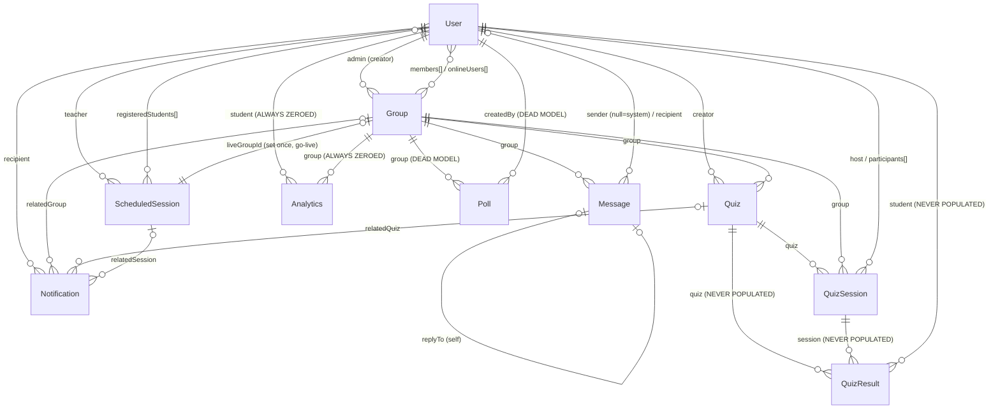
```mermaid
erDiagram
    User ||--o{ Group : "admin (creator)"
    User }o--o{ Group : "members[] / onlineUsers[]"
    Group ||--o{ Message : "group"
    User |o--o{ Message : "sender (null=system) / recipient"
    Message |o--o| Message : "replyTo (self)"
    User ||--o{ Notification : "recipient"
    Group |o--o{ Notification : "relatedGroup"
    Quiz |o--o{ Notification : "relatedQuiz"
    ScheduledSession |o--o{ Notification : "relatedSession"
    User ||--o{ Quiz : "creator"
    Group ||--o{ Quiz : "group"
    Quiz ||--o{ QuizSession : "quiz"
    Group ||--o{ QuizSession : "group"
    User ||--o{ QuizSession : "host / participants[]"
    Quiz ||--o{ QuizResult : "quiz (NEVER POPULATED)"
    QuizSession ||--o{ QuizResult : "session (NEVER POPULATED)"
    User ||--o{ QuizResult : "student (NEVER POPULATED)"
    User ||--o{ ScheduledSession : "teacher"
    User }o--o{ ScheduledSession : "registeredStudents[]"
    Group |o--|| ScheduledSession : "liveGroupId (set once, go-live)"
    User ||--o{ Analytics : "student (ALWAYS ZEROED)"
    Group ||--o{ Analytics : "group (ALWAYS ZEROED)"
    Group ||--o{ Poll : "group (DEAD MODEL)"
    User ||--o{ Poll : "createdBy (DEAD MODEL)"
```

## Model reference table

| Model | Purpose | Status | Key gap |
|---|---|---|---|
| `User` | Teachers/students/guests | ✅ Live, most-referenced model (13 reverse refs) | Two incompatible guest-account creation flows (random-hex-password via PIN-join vs student-chosen-password via guest-auth) produce accounts that can't cross-authenticate |
| `Group` | Live classroom/session | ✅ Live | `pin: {length:6}` schema declaration is a silent no-op (not a real Mongoose validator); PIN-ness only enforced in app code |
| `Message` | Chat + embedded polls + quiz notices | ✅ Live | Read-receipts (`readBy`) modeled but never used; `createQuizNotification` static dead, bypassed by hand-inlined logic |
| `Notification` | Notification inbox | ⚠️ Partially live | 5 of 6 "notify*" template statics never called; `expiresAt` has no TTL index so it never actually expires |
| `Quiz` | Reusable quiz template | ✅ Live | `aiSource.type` enum doesn't include `'file'`, which the file-upload route actually sets (live schema-mismatch risk); `timesUsed`/`averageScore` never update |
| `QuizSession` | Live gameplay instance | ✅ Live (the real quiz engine) | Model's own `submitAnswer()` method (with proper idempotency) is unused — socket handler reimplements the same logic separately |
| `QuizResult` | Durable per-attempt result record | ❌ **Never written** — zero documents ever created anywhere | The single largest "designed but dormant" gap in the codebase |
| `ScheduledSession` | Future-dated sessions | ✅ Live | Per-student passwords stored in **plaintext**; `status:'completed'` enum value unreachable; `autoStartEnabled`/`requireApproval` stored but never enforced |
| `Analytics` | Per-student engagement rollup | ❌ **Cosmetically live, functionally hollow** — recalculates on every read but the underlying counters are never incremented by real activity | Every student will show "Needs Attention," 0% participation, regardless of true behavior |
| `Poll` | Rich standalone poll system | ❌ Fully dead — never `require`d anywhere | Superseded by the much simpler `Message.pollOptions`; only model in the app with a real MongoDB TTL index |

## Indexing
Most models have sensible single/compound indexes (`Message: {group,createdAt}`, `Notification: {recipient,isRead,createdAt}`, `Analytics: {student,group}` unique compound). Several models also declare **redundant explicit `.index()` calls that duplicate a field-level `unique:true` index** (`User.username`, `User.email`, `Group.pin`) — harmless but sloppy.

## Suggested normalization / future-field improvements (see full detail from research in the model deep-dive)
1. Wire quiz completion to actually create `QuizResult` documents, call `Quiz.updateAverageScore()`, `Analytics.recordQuizResult()`, `Notification.notifyQuizResult()` — this single change would retroactively activate ~5 currently-dormant integrations at once.
2. Fix `QuizResult.answers[].selectedAnswer` (currently `Number`, should be `Mixed` like its `QuizSession` counterpart).
3. Fix the `multiple_select` scoring bug (array `===` comparison never evaluates true).
4. Consolidate the 5 duplicated JWT middlewares into the one that already exists (`middleware/auth.js`) and actually mount it everywhere.
5. Either delete `models/poll.js` + `PollComponent.js`, or invest in wiring the richer `Poll` model in to replace the limited `Message.pollOptions` mechanism.
6. Hash `ScheduledSession.allowedStudents[].password` with bcrypt.
7. Normalize `ScheduledSession.duration` from a display string to a number.

---

# SECTION 8 — REALTIME SYSTEM

## Architecture
Single in-memory Socket.IO 4.6 server, **no Redis adapter** (`@socket.io/redis-adapter`/`socket.io-redis` absent from `package.json`). CORS mirrors the Express CORS handler. `transports: ["polling","websocket"]` on both client and server.

Two independent room families, both string-keyed by MongoDB ObjectId:
- **`groupId`** rooms — chat, presence, poll votes.
- **`sessionId`** rooms — quiz gameplay (`QuizSession._id`).
- Plus a **personal room** per user (`socket.userId`), joined on `authenticate`, used to target `newNotification` and per-user scheduling events (`sessionStarted`, `sessionCancelled`, `unauthorizedJoinAttempt`).

## Socket event catalogue (consolidated — full per-event detail was captured during research)

| Event | Direction | Purpose | Status |
|---|---|---|---|
| `authenticate` / `authenticated` / `authError` | C→S / S→C | JWT verify, join personal room | ✅ Live |
| `joinGroup` / `joinedGroup` | C→S / S→C | Enter chat room | ✅ Live (`joinedGroup` ack is emitted but never listened for — harmless orphan) |
| `userJoined`, `leaveGroup`, `onlineUsersUpdate` | S→C / C→S / S→C | Presence | ✅ Live |
| `sessionEnded` | S→C | Kicks everyone out when a teacher ends a group | ✅ Live |
| `sendMessage` / `newMessage` | C→S / S→C | Chat (text/file/private/poll/quiz-notice) | ✅ Live |
| `editMessage`/`messageEdited`, `deleteMessage`/`messageDeleted` | C→S / S→C | Moderation (sender-only, no teacher override) | ✅ Live |
| `typing`/`stopTyping`, `userTyping`/`userStopTyping` | C→S / S→C | Typing indicator | ✅ Live |
| `votePoll` (real shape `{messageId,optionIndex,groupId}`) | C→S | Chat-embedded poll vote | ⚠️ Live but **no frontend listener for the resulting `pollUpdated` broadcast** was found wired into the mounted UI — live vote counts likely don't reach other viewers in real time |
| `votePoll` (orphan shape `{pollId,optionIndex}`), `getPolls`, `createPoll`, `answerPoll`, `closePoll`, `pollsUpdate`, `newPoll` | — | Dead protocol — only exists inside the never-mounted `PollComponent.js`, zero backend handlers | ❌ Dead |
| `teacher:joinSession` / `teacher:sessionJoined` | C→S / S→C | Teacher enters quiz room | ✅ Live (ack never consumed — harmless) |
| `teacher:startQuiz` → `quiz:started` | C→S / S→C | Begin quiz | ✅ Live, host-verified server-side |
| `teacher:nextQuestion` → `quiz:nextQuestion` | C→S / S→C | Advance question (also auto-fires server-side after the 15s post-question delay chain) | ✅ Live |
| `teacher:endQuiz` → `quiz:finished` | C→S / S→C | End quiz, compute final leaderboard | ✅ Live |
| `student:joinQuiz` → `quiz:joined`, `student:joined` | C→S / S→C | Student enters quiz room, late-join support | ✅ Live |
| `student:submitAnswer` → `answer:summary`, `student:answered` | C→S / S→C | Answer submission, server-authoritative scoring | ⚠️ Live but **exploitable** — client-supplied `timeTaken` is trusted for the speed-bonus multiplier with no cross-check against the server's own timer state |
| `timer:update` | S→C | Per-second countdown broadcast | ✅ Live (highest-frequency event in the system) |
| `question:complete`, `leaderboard:show` | S→C | Reveal + leaderboard display (auto-timed, ~15s total dead time between questions) | ✅ Live |
| `participantJoined`, `answer:submitted`, `leaderboard:update`, `quizBegan`, `quizEnded`, `quiz:ended` | S→C (listened) | Legacy event names from a prior naming scheme — **never emitted** by the current backend | ❌ Dead listeners in `QuizControlPanel.jsx` / `FloatingQuizButton.jsx` |

## Room architecture / cleanup
No explicit `socket.leave(sessionId)` anywhere — quiz rooms rely entirely on Socket.IO's automatic disconnect cleanup. **No "student left" event is ever emitted**, so a teacher's live student list is never pruned when a student disconnects mid-quiz.

## Reconnection behavior
- Client config: `reconnection:true, reconnectionAttempts:5, reconnectionDelay:2000, timeout:20000`.
- `App.js` re-runs `authenticate` on socket `connect` (rejoining the personal room) — but **does not re-join `groupId` or `sessionId` rooms** after a reconnect. A dropped-then-restored connection silently stops receiving `newMessage`/`timer:update`/etc. until the user navigates away and back.
- `QuizPlayer.jsx` does correctly rehydrate full quiz state on **remount** (re-emits `student:joinQuiz`), so a full page refresh mid-quiz works — but a bare socket-level reconnect (same mount) does not re-trigger this.
- `QuizHost.jsx` has **no rehydration path at all** for a reconnecting teacher — a teacher refresh mid-quiz loses their entire student list/question index client-side with no recovery beyond waiting for the next broadcast.

## Scaling limitations
1. **No Redis adapter** — a second server instance/dyno would not share rooms or broadcasts; a teacher and student landing on different instances would never see each other's events. Hard blocker for horizontal scaling as-is.
2. **`activeQuizTimers` is a module-level in-memory `Map`** holding live `setInterval` handles — a server restart instantly loses every running timer, freezing all in-progress quizzes forever (stuck `status:'active'` in Mongo with no way to auto-advance; only a teacher manually clicking Next/End recovers it).
3. `cleanupQuizTimers()` exists but is **never called**, not even on graceful shutdown.
4. REST routes calling `global.io.to(...).emit(...)` (schedule.js, Notification statics) rely on being the same process as the target sockets — consistent with, but also reinforcing, the single-instance-only design.

## Sequence diagram — live quiz lifecycle

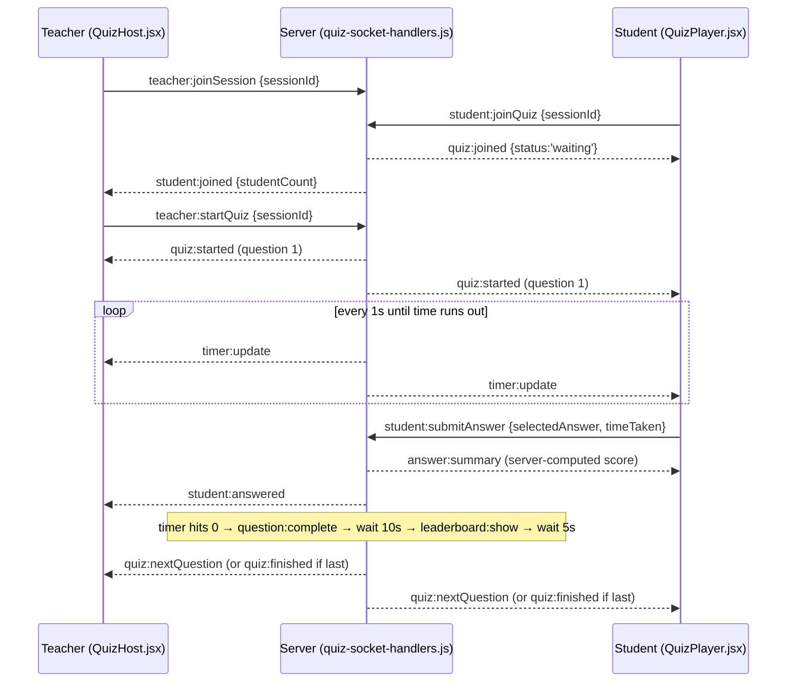
```mermaid
sequenceDiagram
    participant T as Teacher (QuizHost.jsx)
    participant S as Server (quiz-socket-handlers.js)
    participant St as Student (QuizPlayer.jsx)

    T->>S: teacher:joinSession {sessionId}
    St->>S: student:joinQuiz {sessionId}
    S-->>St: quiz:joined {status:'waiting'}
    S-->>T: student:joined {studentCount}
    T->>S: teacher:startQuiz {sessionId}
    S-->>T: quiz:started (question 1)
    S-->>St: quiz:started (question 1)
    loop every 1s until time runs out
        S-->>T: timer:update
        S-->>St: timer:update
    end
    St->>S: student:submitAnswer {selectedAnswer, timeTaken}
    S-->>St: answer:summary (server-computed score)
    S-->>T: student:answered
    Note over S: timer hits 0 → question:complete → wait 10s → leaderboard:show → wait 5s
    S-->>T: quiz:nextQuestion (or quiz:finished if last)
    S-->>St: quiz:nextQuestion (or quiz:finished if last)
```

---

# SECTION 9 — API DOCUMENTATION

All endpoints below were confirmed present (or confirmed absent, marked ❌) directly in the route source files.

## Auth (`server.js`, inline, no prefix)
| Method & Path | Auth | Notes |
|---|---|---|
| `POST /api/auth/register` | none | **Client-supplied `role` accepted with no restriction** — privilege escalation risk |
| `POST /api/auth/login` | none | Generic "Invalid credentials" (no user enumeration) |
| `POST /api/auth/student-guest-auth` | none | Register-or-sign-in by email |
| `PUT /api/auth/update-profile` | JWT | name/username/profilePhoto, no validation on photo content |

## Groups (`server.js`, inline)
| Method & Path | Auth | Notes |
|---|---|---|
| `POST /api/groups/create` | JWT (**any role** — no teacher check!) | Any authenticated user, including students, can create/own a group |
| `POST /api/groups/join` | optional JWT | PIN join, authenticated or guest |
| `GET /api/groups/my-groups` | JWT | |
| `GET /api/groups/:groupId` | JWT + membership | |
| `POST /api/groups/:groupId/end` | JWT + admin | Emits `sessionEnded` |
| `GET /api/groups/:groupId/messages` | JWT + membership | Hardcoded `limit(100)`, no pagination |
| `POST /api/upload` | JWT | 10MB cap, `jpeg|jpg|png|gif|mp4|mov|avi|pdf|doc|docx|txt` (no audio, despite frontend allowing audio selection) |

## Quiz (`routes/quiz.js`, mounted at `/api/quiz`)
| Method & Path | Auth | Notes |
|---|---|---|
| `POST /generate` | JWT + teacher + group-admin | Leaks `error.stack` to client on failure |
| `POST /generate-from-file` | JWT + teacher + group-admin | PDF/DOCX/TXT, 10MB |
| `POST /generate-from-url` | — | ❌ **Does not exist** — frontend calls it anyway |
| `PUT /:quizId` | JWT + creator | No shape validation on `questions[]` |
| `DELETE /:quizId` | JWT + creator | No cascade cleanup of related `QuizSession`/`QuizResult` |
| `GET /recent-topics` | JWT + teacher | |
| `POST /:quizId/start-session` | JWT + creator | Idempotent — reuses existing active session for the group |
| `GET /group/:groupId/active` | JWT | Real implementation (shadows a dead inline stub of the same path in `server.js`) |
| `GET /batch-history` | JWT | `groupIds` not validated as ObjectIds before `$in` query |
| `GET /group/:groupId/history` | JWT | **No membership/ownership check** — any authenticated user who knows a `groupId` can view its full quiz history |
| `POST /session/:id/begin` \| `/next` \| `/end` | — | ❌ **Do not exist** — `QuizControlPanel.jsx` calls them and gets 404s |
| `GET /session/:id/leaderboard` | — | ❌ **Does not exist** — `Leaderboard.jsx` calls it and hangs on "Loading rankings..." forever |

## Analytics (`routes/analytics.js`, mounted at `/api/analytics`)
`GET /group/:groupId/summary`, `/students`, `/top-performers`, `/needs-attention`, `/attendance`, `/quiz-performance`, `/engagement`, `/export` (all teacher+admin-gated); `GET /my-analytics/:groupId` (student, membership-gated); `POST /group/:groupId/refresh` (recalculates all members sequentially, not parallelized). **All of these return real-looking but functionally meaningless data** because the underlying `Analytics` documents are never fed real activity (Section 4/7).

## Notifications (`routes/notifications.js`, mounted at `/api/notifications`)
`GET /my-notifications`, `/unread-count`; `PUT /:id/read`, `/mark-all-read`; `DELETE /:id`, `/clear-read`; `GET /settings` (**hardcoded stub, not backed by any DB field**).

## Schedule (`routes/schedule.js`, mounted at `/api/schedule`)
`POST /draft`, `GET /drafts`, `DELETE /draft/:id`, `POST /create`, `GET /my-sessions`, `PUT /:id`, `POST /:id/emails`, `POST /:id/start` (the ScheduledSession→Group conversion), `POST /:id/cancel`, `POST /:id/verify-access`, `GET /:id/unauthorized-attempts`, `GET /available`, `POST /:id/register`, `GET /my-registrations`.

## Confirmed dead/unmounted routers
- `routes/groupRoutes.js` — never `app.use`'d.
- `routes/quiz-test.js` — `require`d in `server.js` but its `app.use` line was never added; a no-auth AI-generation route sits one edit away from going live.

---

# SECTION 10 — AUTHENTICATION

## Teacher flow
Register (password required, enforced via a `pre('validate')` hook on `User`) → login → JWT (30-day expiry, `jsonwebtoken`, secret from `process.env.JWT_SECRET`, **no fallback** in the live inline copies — an unset secret crashes requests rather than silently using a weak default) → `localStorage` persistence → socket `authenticate`.

## Student flow
Three parallel paths, all converging on the same `User` collection with `role:'student'`:
1. **PIN join, authenticated** — existing account joins a group directly.
2. **PIN join, guest** — creates a `User` with a `crypto.randomBytes(8)` random password the guest never sees or is told (unrecoverable login later via any other flow).
3. **Guest auth ("continue without joining")** — creates a `User` with a password the student chose themselves.

Paths 2 and 3 produce **incompatible accounts for the same email** if a student ever uses both — a real, live UX bug (a student who guest-joined via PIN cannot later "log in" with a password they pick, since the stored password is a random hex string they don't know).

## JWT
Signed with `jsonwebtoken`, `process.env.JWT_SECRET`, 30-day expiry, payload includes `userId`/`role`. Five different verification implementations exist across the codebase (Section 6) with inconsistent error status codes (401 vs 403) and inconsistent `req.userId` vs `req.user` attachment.

## Session / Cookies
No server-side session store, no cookies used by the frontend for auth (though `axios` is configured `withCredentials:true`, unused in practice by any cookie-based flow). Auth is 100% Bearer-token-in-header + client-stored token.

## Rejoin logic
`QuizPlayer.jsx` correctly rehydrates on remount via `student:joinQuiz`. `App.js`'s session-restore `useEffect` reads `token`/`user` from `localStorage` on every load, reconnects the socket, and re-authenticates. Group/quiz **room** membership, however, is not automatically restored on a bare socket reconnect (see Section 8).

## Security concerns (see Section 14 for the full audit)
- Client-supplied `role` on registration → self-service privilege escalation to `'teacher'`.
- `middleware/auth.js`'s hardcoded fallback secret (`'changeme123'`) is theoretical risk only since that file is dead code, but its mere presence in the repo is a footgun if ever resurrected.
- Plaintext per-student passwords in `ScheduledSession.allowedStudents[]`.
- No rate limiting on login/register/guest-auth endpoints (brute-force / credential-stuffing exposure).

---

# SECTION 11 — QUIZ SYSTEM

## Creation
`QuizCreator.jsx` (1,841 lines) supports 4 question types (multiple-choice, true/false, fill-in-blank, multiple-select), a full undo/redo history stack, a live "phone frame" preview, and 4 input methods for AI generation (topic, pasted text, file upload, URL). **The URL/YouTube path is a confirmed dead end** — no backend route exists for it, and the frontend's own fallback error message admits "This feature may not be fully implemented yet." Points-per-question has no dedicated editor UI field (set only at creation time, default 10, effectively unreachable to change after that in the editor). Settings toggles `showCorrectAnswer`/`showLeaderboard` are saved but **never actually read** by the backend gameplay code — inert configuration.

## Editing
`PUT /api/quiz/:quizId` accepts a wholesale `questions[]` array with no shape validation — a teacher could save malformed questions that break gameplay downstream.

## Hosting
**Two entirely separate, redundant teacher-hosting UIs exist simultaneously**: `QuizHost.jsx` (socket-driven, fully functional) and `QuizControlPanel.jsx` (REST-driven, **entirely non-functional** — its start/next/end actions call endpoints that don't exist and 404). Both can be open concurrently for the same session since they're reached from different entry points (`QuizCreator`'s "Start Quiz Now" vs. the `FloatingQuizButton`), maintaining separate, partially-inconsistent local state.

## Answer flow & evaluation
Server-authoritative: the server independently recomputes correctness and never trusts a client-supplied correctness flag. Fill-in-blank uses case/whitespace-insensitive string comparison. **Multiple-select uses a strict array `===` comparison, which is always `false` for distinct array instances — meaning multiple-select questions can never be marked correct.** This is a confirmed, live scoring bug.

## Scoring
Speed-tiered bonus: answering in the first third of the time limit → 2x points; middle third → 1.5x (floored); final third → 1x. Streaks are tracked and displayed but do **not** affect score (display-only). **`timeTaken` is entirely client-supplied and trusted** for the speed multiplier with no server-side cross-check against its own authoritative timer — an exploitable scoring-integrity gap.

## Leaderboard
Live in-quiz leaderboard (`leaderboard:show`) works correctly, sorted by score then correct-answer count (no further tiebreaker — ties keep array/join order). The **standalone `Leaderboard.jsx` component is fully dead**: it fetches an endpoint that doesn't exist on the backend, has no error-state UI (hangs on "Loading rankings..." forever), and isn't even mounted anywhere in `App.js`.

## Animations
A `transition: transform 0.15s` CSS rule exists on leaderboard rows but nothing ever triggers a transform, so it's inert. `FloatingQuizButton.jsx` has a real 2.5-second pulse animation when a quiz starts. No other quiz-specific animation exists.

## Missing features / gaps
- URL/YouTube generation (dead end).
- Durable per-student `QuizResult` records (badges, percentiles, fastest/slowest answer) — model fully built, never populated.
- Multiple-select scoring (broken).
- "Assign quiz to specific students" (permanently disabled UI tab, unimplemented).
- No teacher rehydration on reconnect mid-quiz.
- No `aria-live` region on any quiz countdown timer (screen-reader accessibility gap).

## Future gamification ideas
Badges (schema already exists in `QuizResult`, unused), team-mode quizzes, question banks reusable across quizzes, adaptive difficulty based on live accuracy, streak-based bonus multipliers (currently display-only), post-quiz personalized review recommendations.

---

# SECTION 12 — CHAT SYSTEM

## Lifecycle
Type → 2-second-debounced typing indicator → submit → socket `sendMessage` → server creates a `Message` document → broadcast (or direct-to-socket for private messages) → render in `ChatArea.js` with date separators, avatar-color hashing, and a **purely decorative** "✓✓" read tick (the `readBy` field and `markAsRead()` method exist on the model but are never actually invoked anywhere — no real read-receipt feature is wired end-to-end).

## Images / files
Client validates type + 10MB size; uploads via `POST /api/upload` with a **simulated progress bar** (`setInterval` incrementing a fake percentage, not real upload progress); server validates again (type allow-list, 10MB) and stores on local disk under `backend/public/uploads/`, served **completely publicly with no authentication** at `/uploads/*`. Rendering branches by MIME prefix (image/video/audio/pdf/generic download) — though audio uploads are accepted by the frontend's file-picker but **rejected server-side** (backend's `fileFilter` omits audio MIME types), a live client/server mismatch.

## Moderation
**No teacher moderation override exists at all.** Only the original sender can edit or delete their own message — a teacher (group admin) has no ability to remove a student's inappropriate message. Deletion is a hard content overwrite (`'This message was deleted'`), not merely a flag — the original text is destroyed, not just hidden, so there's no audit trail.

## Deletion
Soft-delete flag (`isDeleted`) plus destructive content overwrite. No moderation queue, no reporting mechanism.

## Realtime updates
Fully socket-driven (`newMessage`, `messageEdited`, `messageDeleted`, `userTyping`/`userStopTyping`). Chat history itself is loaded once via REST (`GET /api/groups/:groupId/messages`, hard-capped at 100 messages, **no pagination/infinite-scroll** — anything older than the last 100 messages is permanently unreachable through the UI).

## Polls-in-chat
Real, working, single mechanism is `Message.pollOptions` (embedded sub-array) — not the separate, richer, fully-dead `Poll` model/`PollComponent.js`. Voting works server-side (`votePoll` socket handler, re-votable, single-choice only), but **live vote-count propagation to other viewers appears broken** — the server emits `pollUpdated` correctly, but no listener for it was found wired into the mounted chat UI, meaning other students likely only see updated tallies after an unrelated re-render or page reload.

---

# SECTION 13 — UI/UX REVIEW

Recommendations only — no implementation performed, per instructions.

| Area | Issue | Recommendation |
|---|---|---|
| Notifications | All alerts are native `window.alert()`/`window.confirm()` throughout the app (App.js, ScheduleSession, ManageStudents, ChatArea, QuizHost) | Replace with a consistent in-app toast/modal system |
| Navigation | No URL-based routing at all — refresh always lands on the dashboard, deep-linking is impossible except for the one `?pin=` param | Introduce `react-router-dom` (already installed, unused) for real routes |
| Consistency | Two Footers, two Logins (`Login.js` vs `TeacherLogin.jsx`), two poll systems, two quiz control panels — visually and behaviorally inconsistent pairs throughout | Pick one implementation per concern and delete the other |
| Theming | Dark mode implemented via ad hoc `document.body.classList.contains('dark-mode')` checks duplicated across a dozen components | Centralize via a Theme Context |
| Accessibility | No `aria-live` regions on any countdown timer; several non-button clickable `<span>`/`<div>` elements; missing `htmlFor`/`id` label pairing on many form inputs; `NotificationCenter` still uses a stale WhatsApp-green palette inconsistent with the app's indigo/slate redesign | Systematic accessibility pass; unify design tokens |
| Responsiveness | Most quiz components (QuizCreator's "phone frame" preview, QuizControlPanel, Leaderboard) use fixed pixel widths with no responsive breakpoints; `FloatingQuizButton`'s draggable position isn't recalculated on window resize | Add responsive breakpoints; add a resize listener |
| Performance perception | Analytics dashboard has zero charting — pure numeric cards despite the "analytics" framing | Add a lightweight charting library (e.g. Recharts) once the underlying data pipeline (Section 7) is actually fed |
| Trust signals | Hardcoded developer name ("ClassVibe - sai") baked into the TeacherLogin header; placeholder social links (`YOUR_USERNAME`) in the dead Footer; a leftover "ClassConnect" brand typo on the Home page | Cosmetic cleanup pass before any public-facing launch |

---

# SECTION 14 — SECURITY AUDIT

Ranked by severity, based only on code actually read.

1. **Privilege escalation via self-registration** — `POST /api/auth/register` accepts a client-supplied `role`, letting anyone register directly as `'teacher'` with no verification step.
2. **Plaintext password storage** — `ScheduledSession.allowedStudents[].password` is stored unhashed, unlike `User.password` (bcrypt). A database read/leak exposes these directly.
3. **Publicly accessible uploads with no access control** — `/uploads/*` is served via `express.static` with zero auth; any file ever uploaded via `POST /api/upload` (chat images, documents, etc.) is fetchable forever by anyone who obtains or guesses the URL (filenames use `Date.now()+Math.random()`, not cryptographically secure, but infeasible to brute-force in practice — still, "unauthenticated but hard to guess" is not the same as "access-controlled").
4. **No rate limiting anywhere** — login, register, guest-auth, and AI quiz generation are all uncapped, exposing the app to brute-force credential attacks and (for AI generation) direct cost abuse against the Groq API key.
5. **Stack-trace leakage** — `POST /api/quiz/generate` returns `error.stack` to the client, explicitly flagged "temporary" in its own code comment but still present.
6. **Client-supplied scoring input trusted** — `student:submitAnswer`'s `timeTaken` is used directly in server-side score computation with no cross-check against the server's own timer state, letting a modified client always claim the maximum speed bonus.
7. **Dangling no-auth debug route** — `routes/quiz-test.js` (self-labeled "remove after testing") is currently unreachable only because its `app.use()` line was never added; a future edit re-enabling it would expose free, unauthenticated AI-generation calls against the app's paid Groq quota.
8. **XSS vector in notification toast** — `NotificationBell.jsx`'s `showToast()` builds a DOM toast via raw string-template `innerHTML` interpolating `notification.title`/`notification.message`. If any notification-generating code path ever echoes user-influenced text (e.g., a teacher-chosen session name) into a notification message without sanitization, this becomes a stored-XSS vector against every recipient.
9. **No teacher moderation override in chat** — combined with the lack of any reporting mechanism, there is no way for a teacher to remove an inappropriate student message.
10. **CSV injection / no escaping** — `GET /api/analytics/group/:groupId/export` builds CSV via naive string concatenation with no field quoting; a comma or quote character in a student's name corrupts the export (and, depending on the spreadsheet application, could enable formula injection if a field started with `=`/`+`/`-`/`@`).
11. **Hardcoded fallback JWT secret in dead code** — `middleware/auth.js` falls back to `'changeme123'` if `JWT_SECRET` is unset; currently harmless since the file is unused, but a landmine if resurrected without noticing.
12. **No membership check on quiz history** — `GET /api/quiz/group/:groupId/history` returns full quiz history (titles, questions, participant scores) to any authenticated user who knows/guesses a `groupId`, without verifying they were ever a member.
13. **Guest account password unrecoverable / two incompatible guest paths** — not a classic security bug, but an account-integrity issue with security-adjacent implications (a student could believe they've "created an account" via guest-auth while a PIN-join guest account for the same email already exists with an unrecoverable random password).

---

# SECTION 15 — PERFORMANCE AUDIT

## Frontend
- `App.js` is a single 2,412-line component holding all app state — every state update in this component re-renders the entire subtree unless children are memoized (none reviewed use `React.memo`/`useMemo` extensively).
- No code-splitting/lazy-loading (`React.lazy`) anywhere — `QuizCreator.jsx` alone is 1,841 lines and is bundled into the main chunk regardless of whether the user ever opens it.
- Client-side chat search re-filters the entire in-memory message array on every keystroke with no debounce (acceptable at the current 100-message cap, not scalable if pagination is ever added without also adding a debounce).
- Fake upload-progress bar (`setInterval`) gives no real feedback on actual network speed.

## Backend
- **N+1-style sequential writes**: `routes/analytics.js`'s `/group/:groupId/students` recalculates and saves every student's `Analytics` document on every GET request (a read endpoint with heavy write side effects); `/group/:groupId/refresh` loops over all group members with sequential `await`s inside a `for...of` loop rather than `Promise.all`.
- **Every single AI quiz generation call makes at least 2 Groq API requests** (one "is this model alive" probe, one real generation), up to 5 if earlier models in the fallback chain are down.
- No caching layer anywhere (no Redis, no in-memory LRU) for repeated topic generations or frequently-read group/session data.
- `GET /api/groups/:groupId/messages` hardcodes `limit(100)` with no cursor pagination — fine at small scale, a growing bottleneck (and a UX dead-end) for long-lived groups.

## Database
- Generally reasonable indexing (see Section 7), but several models declare redundant `.index()` calls on already-unique fields.
- `Analytics`'s rank computation (`GET /my-analytics/:groupId`) does a full in-memory sort of every student in the group on every single request rather than a database-level sort/aggregation — fine at classroom scale (dozens), would not scale to hundreds/thousands of students per group.

## Socket / realtime
`timer:update` broadcasts every second to every socket in every active quiz room — the single highest-frequency event in the system; with many concurrent quizzes this is the first thing to become a bottleneck, and it's also the one most sensitive to the lack of a Redis adapter if ever scaled horizontally.

## Bundle size
Not measured directly in this pass (no `frontend/build` bundle analysis performed), but `App.js` (2,412 lines, inline style objects everywhere) and `QuizCreator.jsx` (1,841 lines) are large single-file components bundled without any lazy-loading, which is the most likely single source of an oversized initial JS payload.

---

# SECTION 16 — CODE QUALITY AUDIT

## Dead code (confirmed via exhaustive grep by research agents)
- **Backend**: `routes/groupRoutes.js` + `controllers/groupController.js` (broken if resurrected), `routes/quiz-test.js` (unmounted), `models/poll.js` (never required), `testAI.js` (broken standalone script — references undefined vars).
- **Frontend**: `components/Footer.jsx`, `components/PollComponent.js`, `components/ManageStudents.jsx`, `components/UpcomingSessions.jsx`, `components/Leaderboard.jsx` (technically imported nowhere either) — all fully built, none reachable from any live UI path.
- **~9 of `api.js`'s ~19 exported functions** never imported anywhere.
- Root-level `Message.js` and both `.zip` files are stale historical artifacts with no runtime relevance.

## Duplicate code
- 5 near-identical copies of JWT `authenticateToken` (Section 6).
- Parallel/duplicated form-state shapes in `StudentJoin.jsx` (PIN-join form vs guest form).
- `App.js` reimplements ~6+ raw `fetch()` calls that already have equivalent, unused wrappers in `api.js`.
- Two independent poll systems, two independent quiz-hosting UIs, two independent Footers, two independent Logins.

## Naming inconsistencies
- Socket event naming drifted over time without full cleanup: `quiz:started` (colon) vs legacy `quizStarted` (no colon) both still referenced in places; `student:joined` (current) vs `participantJoined` (legacy, still listened for in two components that will never receive it).
- Chat-side socket errors use `{error: string}`; quiz-side socket errors use `{message: string}` — inconsistent shape for the same conceptual "error" event across two subsystems in the same file family.

## Architecture violations
- The "controller" layer (`groupController.js`) exists but is entirely bypassed — all real group logic lives inline in `server.js`, violating the MVC-ish structure the repo otherwise implies.
- REST route handlers reaching into `global.io` to emit socket events is a tight coupling between transport layers that will need to be re-architected for any horizontal-scaling effort.

## Refactoring opportunities
1. Delete confirmed-dead files outright (Section 16 above) rather than leaving them as maintenance-burden landmines.
2. Consolidate the 5 JWT middlewares into 1 (the already-existing `middleware/auth.js`, properly mounted everywhere).
3. Pick one poll system, one quiz-hosting UI, one Footer, one Login and delete the other of each pair.
4. Extract `App.js`'s ~2,400 lines into smaller feature-scoped components/hooks (it currently plays the role of router, global store, and view-layer simultaneously).

## Repository hygiene (the single largest concrete finding of this whole audit)
- **`node_modules/` is committed to git.** Confirmed: 10,343 of 10,449 total tracked files (99%) live inside `node_modules` directories (root `node_modules/`, plus a full `backend/node_modules/` embedded inside the committed `backend.zip`). `.gitignore` has no `node_modules` entry at all — only `.vercel`, `.env*.local`, `backend/.env`, `frontend/.env` are excluded.
- `.git` directory is 79MB as a direct consequence.
- `backend.zip` (9.5MB) and `frontend/src.zip` are committed historical backups with no build-time purpose.
- Git history contains at least 10 accidental `:wq` commits (Vim exit sequences committed as commit messages) — a strong signal of unfamiliarity with git tooling or rushed committing without review.

---

# SECTION 17 — DEPENDENCIES

## Backend (`backend/package.json`)
| Package | Purpose | Still needed? | Notes |
|---|---|---|---|
| `express` ^4.18.2 | HTTP server | Yes | |
| `mongoose` ^7.0.3 | MongoDB ODM | Yes | |
| `mongodb` ^6.3.0 | Driver (declared separately from mongoose's own vendored copy) | Redundant as a direct dependency — mongoose already bundles its own compatible driver | Consider removing the direct dependency unless used for raw driver calls somewhere not reviewed |
| `socket.io` ^4.6.1 | Realtime | Yes | Missing a Redis adapter for any scaling plan |
| `socket.io-client` ^4.8.3 | Present in backend too (used by `testAI.js`/dev scripts, not production server code) | Marginal | |
| `bcryptjs` ^2.4.3 | Password hashing | Yes | |
| `jsonwebtoken` ^9.0.3 | JWT | Yes | |
| `cors` ^2.8.5 | CORS | Yes | |
| `dotenv` ^16.6.1 | Env loading | Yes | |
| `multer` ^2.1.1 | File uploads | Yes | |
| `qrcode` ^1.5.3 | QR generation | Yes | |
| `pdf-parse` ^2.4.5 | PDF text extraction | Yes | |
| `mammoth` ^1.12.0 | DOCX text extraction | Yes | |
| `axios` ^1.13.5 | HTTP client (Groq API calls) | Yes | |
| `express-validator` ^7.3.1 | Declared | **Not used anywhere found** in the reviewed route files | Either start using it for the currently-manual validation, or remove |
| `nodemon` ^3.1.11 (dev) | Dev auto-restart | Yes | |

## Frontend (`frontend/package.json`)
| Package | Purpose | Still needed? | Notes |
|---|---|---|---|
| `react` / `react-dom` ^18.2.0 | UI | Yes | |
| `react-scripts` ^5.0.1 | CRA build tooling | Yes | CRA is in maintenance mode industry-wide; a future migration to Vite is worth considering (Section 20) |
| `react-router-dom` ^6.22.3 | Declared | **Not used anywhere** — zero imports found | Either adopt it for real routing (recommended, Section 13) or remove the dependency |
| `socket.io-client` ^4.8.3 | Realtime client | Yes | |
| `axios` ^1.13.2 | HTTP client | Yes | |
| `react-icons` ^5.6.0 | Icon set | Yes | |
| `web-vitals` ^2.1.4 | Perf reporting | **Effectively unused** — `reportWebVitals()` is called with no callback in `index.js`, making it a no-op | Wire up a real callback (e.g., send to an analytics endpoint) or remove |
| `@testing-library/*` | Testing | Present but essentially unexercised — only the stale CRA boilerplate test exists | Either invest in real tests or drop the packages |

## Root (`package.json`)
Declares `axios`, `mongodb`, `react-qr-reader`, `socket.io-client` with **no scripts** — appears to be leftover/unused scaffolding unrelated to either the `backend/` or `frontend/` app; `react-qr-reader` in particular is not used anywhere (the actual QR scanning in `StudentJoin.jsx` uses the native `BarcodeDetector` API, not this package). Candidate for removal.

---

# SECTION 18 — DEPLOYMENT

## Frontend — Vercel
`frontend/.vercel/project.json` links to a real Vercel project (`classvibe`). Root `.vercel/project.json` also exists and appears to be a stale/duplicate link from an earlier configuration attempt (the actual build config `{"builds":[{"src":"frontend/package.json","use":"@vercel/static-build","config":{"distDir":"build"}}]}` lives in the **root** `.vercel/project.json`, which is unusual — normally build config lives in `vercel.json`, not inside the Vercel CLI's own project-link file; no `vercel.json` exists anywhere in the repo). `.env.local` at the root (Vercel-CLI-generated) duplicates `REACT_APP_API_URL`/`REACT_APP_SOCKET_URL` and also contains a `VERCEL_OIDC_TOKEN` — the presence of this token in a file matched by `.gitignore` (`'.env*.local'`) means it is correctly excluded from version control, but its presence on disk is worth flagging for anyone auditing local secrets.

## Backend — inferred Render.com, unconfigured in-repo
No `render.yaml`, no `Procfile`, no Dockerfile, no `.github/workflows` anywhere in the repository. The **only** evidence of the hosting target is the hardcoded fallback URL `https://classvibe-backend.onrender.com` repeated throughout the frontend code (`api.js`, `ChatArea.js`, `socket.js` fallback, `QuizControlPanel.jsx`, etc.) — meaning backend deployment configuration exists entirely outside this repository, presumably configured directly in Render's dashboard (build command, start command, env vars). This is a documentation gap: a new team would have no in-repo record of the exact deploy configuration.

## Environment variables (names only — values are secrets, never printed in this report)

**Backend (`backend/.env`)**: `MONGODB_URI`, `PORT`, `JWT_SECRET`, `FRONTEND_URL`, `ENABLE_SESSION_REMINDERS`, `REMINDER_INTERVAL_MINUTES` (declared but **never read** anywhere in code — dead config), `REMINDER_ADVANCE_MINUTES` (same — dead config). **`GROQ_API_KEY` is required by `aiQuizGenerator.js` but is absent from the checked-in `backend/.env`** — either injected separately in the hosting platform, or AI quiz generation is currently non-functional in this exact checkout.

**Frontend (`frontend/.env`)**: `REACT_APP_API_URL`, `REACT_APP_SOCKET_URL`.

## Build process
Frontend: standard CRA `react-scripts build` → static `build/` directory → Vercel static hosting. Backend: `node server.js` (or `nodemon server.js` in dev) — no build step (plain Node, no TypeScript/bundling).

## Common deployment errors / recovery (inferred from code, not from any runbook — none exists)
- **Render free-tier cold starts** are explicitly handled in the frontend UI (`pingBackend()` warmup call on app mount, 12-second-wait-then-retry-once logic duplicated in both `TeacherLogin.jsx` and `StudentJoin.jsx`) — a strong signal the backend is deployed on Render's free tier, which spins down after inactivity.
- **A server restart mid-quiz permanently freezes any in-progress quiz** (Section 8) — there is no recovery runbook for this in the repo; a future team would need to manually intervene (there's no admin tool to force-complete a stuck `QuizSession`).
- **A missing `JWT_SECRET` env var** would crash every authenticated request path (the live inline `authenticateToken` copies have no fallback secret) — this would manifest as widespread 500s immediately after a bad deploy.

---

# SECTION 19 — KNOWN ISSUES

| # | Issue | Severity | Cause | Impact | Suggested fix |
|---|---|---|---|---|---|
| 1 | Multiple-select quiz questions can never be scored correct | High | Array `===` comparison in `quiz-socket-handlers.js` | Any teacher using this question type gets systematically wrong results for every student | Replace with set/array-equality comparison |
| 2 | `QuizResult` never populated | High | Quiz-completion code path never creates these documents | Durable per-student quiz history/badges/percentiles are entirely absent from the product despite full UI/model support | Wire quiz completion to create `QuizResult` docs |
| 3 | Analytics dashboard always shows "Needs Attention" / 0% participation | High | `recordMessage`/`recordQuizResult`/`recordAttendance` are never called anywhere | The flagship "teacher insights" feature is functionally decorative | Instrument the chat/quiz/join-leave code paths to call these methods |
| 4 | `QuizControlPanel.jsx`'s Start/Next/End buttons 404 | High | Backend has no `session/:id/begin|next|end` routes | A teacher reaching the quiz feature via the floating button (not via QuizCreator's "Start Quiz Now") cannot control the quiz at all | Either implement the missing REST routes or delete this redundant control surface in favor of the working `QuizHost.jsx` |
| 5 | AI quiz generation from URL/YouTube is a dead end | Medium | No backend route exists; generator methods are stubs | A fully-built UI path leads to a guaranteed failure | Implement the feature or remove the UI option |
| 6 | Client-supplied `timeTaken` trusted for score multiplier | Medium | No server-side timer cross-check | Scoring can be gamed by a modified client | Cross-check against `activeQuizTimers` server state |
| 7 | Chat file uploads are publicly, unauthenticated-ly accessible | Medium | `/uploads` static mount has no auth middleware | Anyone with (or guessing) a URL can access any uploaded file forever | Add signed URLs or an authenticated proxy route |
| 8 | Self-registration accepts client-supplied `role` | Medium | No server-side restriction on the register endpoint | Any anonymous user can become a "teacher" | Restrict role assignment server-side (e.g., invite-only teacher accounts) |
| 9 | Two incompatible guest-account creation flows | Medium | PIN-join guest path uses a random unrecoverable password; guest-auth path uses a student-chosen one | A student who uses both flows for the same email gets locked out of one | Unify into a single guest-account creation path |
| 10 | No teacher moderation override in chat | Medium | Delete/edit are sender-only checks with no admin bypass | Teachers cannot remove inappropriate student messages | Add an admin-override branch to the delete/edit socket handlers |
| 11 | Live poll vote updates likely don't reach other viewers | Medium | No confirmed frontend listener for `pollUpdated` wired into the mounted chat UI | Poll results appear frozen for everyone except the voter until an unrelated re-render | Add/verify the `pollUpdated` listener in `App.js`/`ChatArea.js` |
| 12 | `node_modules` and 9.5MB+ of zip backups committed to git | Low (but pervasive) | No `.gitignore` entry for `node_modules`; historical zips never cleaned up | 79MB `.git`, slow clones, noisy diffs | Add `node_modules` to `.gitignore`, `git rm --cached` it, delete the zip files |
| 13 | Stale, misleading test | Low | `App.test.js` still asserts CRA's default "learn react" text | `npm test` fails or is meaningless | Replace with a real smoke test or delete |
| 14 | Server restart mid-quiz permanently freezes the quiz | Medium | In-memory `activeQuizTimers` Map, no persistence/recovery | Any deploy or crash during a live quiz requires manual teacher intervention to recover | Persist timer state or add a recovery sweep on boot |
| 15 | Session-reminder env vars are dead configuration | Low | `REMINDER_INTERVAL_MINUTES`/`REMINDER_ADVANCE_MINUTES` declared in `.env`, never read in code | Operators believe these are configurable; they are not | Either wire them up or remove them from `.env`/docs |
| 16 | CSV export has no field escaping | Low | Naive string concatenation in `routes/analytics.js` | A comma/quote in a name corrupts the export | Use a proper CSV library |

---

# SECTION 20 — ROADMAP

## Immediate (days)
- Fix the multiple-select scoring bug.
- Add `.gitignore` entry for `node_modules`, purge it and the `.zip` backups from history.
- Delete or properly gate `routes/quiz-test.js`.
- Restrict client-supplied `role` on registration.
- Add basic rate limiting to auth + AI generation endpoints.

## Short-term (weeks)
- Wire `QuizResult` creation into the quiz-completion flow; retroactively activates `Analytics.recordQuizResult`/`Notification.notifyQuizResult`.
- Instrument `Analytics.recordMessage`/`recordAttendance` in the chat/join-leave code paths.
- Consolidate the 5 duplicated JWT middlewares into one.
- Decide fate of each dead-code pair (poll systems, quiz control panels, Footers, Logins) and delete the losing implementation.
- Add real pagination to chat history.

## Medium-term (1–2 quarters)
- Introduce `react-router-dom` for real URL-based navigation (already a dependency, unused).
- Add a Redis adapter for Socket.IO to unblock horizontal scaling.
- Replace `window.alert`/`confirm` with a consistent in-app notification/modal system.
- Add a charting library to the analytics dashboard once the data pipeline is real.
- Add automated tests (currently near-zero coverage on both frontend and backend).

## Long-term (2+ quarters)
- Multi-tenant/organization model for schools (Section 21).
- Billing/subscription tiers.
- Migrate off Create React App (maintenance-mode tooling) toward Vite or Next.js.
- Formal CI/CD pipeline (currently none).

---

# SECTION 21 — SaaS EXPANSION

The codebase today is single-tenant: one flat `User` collection with a `role` enum, no organization/school entity, no billing. To evolve into a real SaaS:

- **Organizations/Schools**: introduce an `Organization` model; every `User`, `Group`, and `ScheduledSession` gains an `organizationId`. This is the single largest structural change required — nearly every query in the current codebase (`Group.find(...)`, `Analytics.find(...)`, etc.) would need an organization-scoping clause added.
- **Subscriptions/Billing**: integrate Stripe (or similar) with plan tiers gating: number of concurrent live groups, AI quiz-generation quota (directly relevant since Groq calls cost money per request and are currently uncapped per user), analytics history retention, number of teacher seats.
- **Roles/Permissions**: expand beyond `teacher|student|admin` to include `school_admin` (manages teacher seats within an org), `department_head`, `parent` (see Parent Portal below).
- **Parent Portal**: a read-only view over a specific student's `Analytics`/`QuizResult` history — trivial to build once `QuizResult`/`Analytics` are actually populated (Section 19, issue #2/#3), since the data model already has the right shape.
- **Marketplace / Plugins**: a future `Quiz` "template marketplace" where teachers share/sell quiz templates across organizations — the existing `Quiz.source: 'template'` enum value already hints this was anticipated but never built out.
- **White-label support**: `Group.qrCode`/branding is currently ClassVibe-hardcoded; a white-label tier would need per-organization theming/branding fields.
- **Analytics as a real product surface**: once the write-path gap (Section 19 #3) is closed, the existing `Analytics`/`StudentAnalytics.jsx`/`StudentProfile.jsx` stack is most of the way to a genuine "engagement insights" SaaS feature.

---

# SECTION 22 — FUTURE AI FEATURES

Grounded in what the codebase already has (Groq integration, quiz generation, analytics scaffolding) and extending outward. Grouped by audience.

**Teaching Copilot**: 1) auto-summarize a chat session into a lesson recap. 2) auto-generate a follow-up quiz from that day's chat discussion. 3) suggest quiz difficulty adjustments based on live accuracy trends. 4) auto-flag students showing disengagement (via the currently-dormant `Analytics.needsAttention`, once fed real data). 5) AI co-teacher answering routine student questions in chat. 6) auto-generate session agendas from a syllabus upload. 7) real-time sentiment analysis of chat tone. 8) AI-suggested discussion prompts based on quiz miss-patterns. 9) auto-translate teacher announcements for multilingual classes. 10) AI grading assistant for the (currently absent) open-ended question type.

**Student Copilot**: 11) personalized study-plan generator from quiz history (once `QuizResult` is populated). 12) AI tutor chatbot scoped to the current class's material. 13) auto-flashcard generation from missed quiz questions. 14) spaced-repetition scheduler for weak topics. 15) AI-explained answer rationales (the `explanation` field already exists on `Quiz.questions[]` — currently populated by the generator but under-surfaced in review UI). 16) voice-input answer submission for fill-in-blank questions. 17) AI study-buddy matching students with complementary strengths. 18) personalized encouragement/gamification nudges based on streak data (already tracked, underused).

**AI Quiz Builder** (extending the existing `aiQuizGenerator.js`): 19) actually implement the stubbed YouTube/website generation. 20) auto-detect optimal question-type distribution per subject. 21) image-based question generation (diagrams, charts) — `aiSource.type:'image'` already reserved in the schema, unimplemented. 22) auto-difficulty-calibration based on historical class performance. 23) plagiarism/duplicate-question detection across a teacher's quiz history. 24) auto-generate distractors (wrong answers) that are plausible rather than random. 25) multi-language quiz generation.

**AI Attendance / Engagement Detection**: 26) infer engagement score from message frequency + quiz participation (a real, data-grounded version of `Sidebar.js`'s current crude `engagementScore` heuristic). 27) auto-detect "silent but present" students who never message but do answer quizzes, to avoid conflating chat-silence with disengagement. 28) predictive early-warning for at-risk students using multi-signal (Analytics + QuizResult) trend lines.

**Learning Gap Detection**: 29) topic-level mastery mapping from aggregated `QuizResult.answers[]` (once populated). 30) auto-cluster commonly-missed question types into remediation content suggestions. 31) cross-class benchmark ("this topic is universally hard this semester").

**Study Planner**: 32) AI-generated weekly study schedule per student based on upcoming scheduled sessions + weak topics. 33) calendar-integration reminders tuned to individual forgetting curves.

**Parent AI**: 34) natural-language weekly progress digest emailed/notified to parents (once a Parent Portal role exists). 35) AI-answered "how is my child doing" chatbot scoped to that child's data only.

**School AI**: 36) cross-teacher, cross-class aggregate reporting for school admins. 37) AI-flagged curriculum gaps at the school level. 38) automated compliance/attendance reporting exports.

**Predictive Analytics**: 39) quiz-score forecasting per student per topic. 40) session-attendance-likelihood prediction to help teachers plan around reminders (already has a reminder job to hook into). 41) churn-risk prediction (student stops attending) for intervention triggers.

**Digital Twin**: 42) a simulated "practice student" a teacher can quiz-test their own content against before running it live.

**Voice AI**: 43) voice-based quiz answering for accessibility. 44) live speech-to-text transcription of a session for students who join late or need captions. 45) AI voice narration of quiz questions.

**Vision AI**: 46) auto-grading of photographed handwritten work uploaded via the existing file-upload pipeline. 47) whiteboard-content OCR (the app already has a canvas Whiteboard in `Sidebar.js`) turned into searchable notes. 48) automatic classroom-material image-to-quiz generation (photograph a textbook page → quiz).

**Multilingual AI**: 49) real-time chat translation between teacher/student language pairs. 50) multilingual quiz generation and grading. 51) auto-detect a student's preferred language from their messages and adapt notifications.

**Additional cross-cutting ideas (52–100, condensed)**: AI-moderated chat (auto-flag profanity/bullying, addressing the current zero-moderation gap); AI-summarized notification digest instead of a raw feed; smart notification batching to reduce alert fatigue; AI-suggested optimal session scheduling times based on historical attendance; auto-generated session recap emails; AI co-pilot for writing scheduled-session descriptions; quiz-question quality scoring (flag ambiguous AI-generated questions before publishing); AI-assisted rubric generation for the currently-absent open-ended question type; classroom "vibe check" sentiment dashboard for teachers; AI-generated icebreaker questions for new groups; smart PIN-sharing suggestions (auto-detect likely students from past groups, as the current bulk-notification-on-create logic already hints at); AI-based duplicate-account detection (would directly address issue #9 in Section 19); anomaly detection for unusual quiz-answer timing patterns (would directly address issue #6's exploit); AI accessibility auto-captioning of any future audio/video features; a recommendation engine surfacing "quizzes similar teachers found effective" once a marketplace exists; AI-drafted parent-teacher conference talking points; automatic curriculum alignment tagging (standards mapping) for AI-generated quizzes; AI-based optimal group-size/breakout suggestions; a "day in review" AI summary combining chat + quiz + attendance into one narrative per student per week; AI-powered smart-search across all of a teacher's historical quiz questions; automated A/B testing of quiz question phrasing for clarity; AI co-authored session announcements; predictive "this session may need a reminder nudge" flagging based on historical no-show patterns; AI-assisted onboarding chatbot for first-time teachers; automatic detection of duplicate/near-duplicate scheduled sessions; AI-summarized unauthorized-join-attempt patterns (already logged in `ScheduledSession.unauthorizedAttempts`) to flag potential PIN-sharing abuse; smart default quiz settings based on a teacher's historical preferences; AI-generated closing/exit-ticket questions auto-appended to every session; a real-time "confusion detector" surfacing when many students answer the same question incorrectly, live, mid-quiz (the data — `student:answered` counts — already streams through the socket layer today); AI weekly digest comparing this week's engagement to the historical baseline; automatic redaction/PII-scrubbing before any data export (directly relevant given the CSV-export gap in Section 14); AI-based smart defaults for time-limits per question type/difficulty; and a "teacher AI assistant" chat surface embedded directly in the existing chat UI, reusing the existing `Message.messageType` enum pattern (adding an `ai_assistant` type alongside the existing `quiz_started`/`quiz_ended` system-message types) so it fits naturally into the architecture that already exists today.

---

# SECTION 23 — FINAL ARCHITECT REVIEW

## Would I keep this architecture?
Partially. The **real-time core** (Socket.IO room model, server-authoritative quiz scoring, JWT auth pattern) is a sound foundation for a single-tenant classroom tool and should be kept. The **data model** is well-designed at the schema level — genuinely thoughtful indexing, sensible relationships, rich instance/static methods — but roughly a third of it (`QuizResult`, `Analytics`'s write path, `Poll`) was designed and then abandoned mid-integration. That's not an architecture problem, it's an unfinished-work problem, and it's the single most fixable thing in this codebase.

## What would I redesign?
1. **The frontend's state/routing model.** A single 2,412-line component acting as router + global store + view layer will not survive a second developer joining the team. This needs real routing and a proper state layer (Context or a lightweight store) before any team scales past one person.
2. **The auth middleware sprawl.** Five copies of the same function is a correctness risk waiting to happen (a security fix applied to one copy and forgotten in the other four).
3. **The Socket.IO single-instance assumption.** `global.io` and unreplicated in-memory timers are fine for one process but are the first thing that breaks under any real load — this needs a Redis adapter and persisted timer state before scaling past a handful of concurrent classes.

## What should never change?
- The server-authoritative scoring principle (never trust client-reported correctness) — this is already done right for everything except the `timeTaken` speed-multiplier input, which should be fixed to match the same principle, not abandoned.
- The PIN/QR low-friction join model — it's the product's core differentiator and is implemented well.
- The Mongoose schema design itself (field choices, relationships, indexing) — it's better than the integration code that sits on top of it.

## Technical debt inventory (see Sections 16/19 for full detail)
Committed `node_modules` and zip backups; 5x duplicated auth middleware; 2x each of poll systems, quiz-control UIs, Footers, Logins; a fully-designed-but-dormant `QuizResult`/`Analytics` write path; a broken `multiple_select` scoring path; an env-var-driven reminder config that doesn't actually read its env vars.

## What breaks at scale

| Scale | What breaks first |
|---|---|
| 10 schools | Nothing structural yet — single-tenant assumption is annoying (manual per-school setup) but survivable manually. |
| 100 schools | The lack of an `Organization` model becomes the primary blocker — data isolation between schools has to be enforced entirely by convention (careful `groupId` scoping) rather than a real tenant boundary, which is a data-leak risk waiting to happen. Manual Render/Vercel env-var management per deployment stops being viable. |
| 1,000 schools | The single in-memory Socket.IO instance (no Redis adapter) becomes a hard wall — one Node process cannot hold that many concurrent socket connections, and rooms won't work correctly across multiple instances without the adapter. The `activeQuizTimers` in-memory Map becomes a severe reliability risk (any restart during peak hours freezes every concurrent quiz in the country). |
| 10,000 schools | The entire architecture needs to be a distributed system: a real multi-tenant data layer, horizontally-scaled Socket.IO with Redis (or a managed realtime service), a proper billing/metering layer for the AI-generation cost surface (currently fully uncapped per-user), and a real observability stack (there is currently zero logging/metrics infrastructure beyond `console.log`). |
| 1,000,000 users | This would require a full platform rewrite of the realtime layer (likely a dedicated realtime service rather than a single Socket.IO process), a proper event-sourcing or CQRS approach to the Analytics rollups (rather than the current recalculate-on-every-read pattern), and dedicated infrastructure engineering the current single-developer codebase shows no evidence of having been built toward. This is not a criticism of the current code — it is simply a different problem than the one this MVP was built to solve. |

## Bottom line
ClassVibe is a genuinely well-thought-out product concept with a real, working core loop (join → chat → live quiz), built rapidly by a single developer who clearly iterated fast and left a trail of half-finished ambitions (analytics, durable quiz results, a richer poll system, a cleaner group/auth refactor) alongside the parts that ship. The most valuable next six months of work is not new features — it is **closing the gaps this document identifies**: wire the dormant integrations, delete the dead code, consolidate the duplicated implementations, and fix the two or three concrete bugs (multiple-select scoring, client-trusted timing, unmounted access control) that currently make parts of the product lie about what it's actually doing.

---

# APPENDIX — DEEP DIAGRAMS, DEPENDENCY MAPS & DESIGN SYSTEM

The sections below add the visual/structural layer requested on top of Sections 1–23: complete end-to-end flow diagrams per feature, granular data-flow traces, a component dependency map, sequence diagrams, per-model database lifecycles, an API dependency tree, a full UI hierarchy, a future-architecture placement map, a design-system extraction (grounded in actual colors/spacing found in the code, not invented), and a SaaS business-architecture hierarchy. Every diagram distinguishes **working paths** from **broken/dead paths** (marked ❌ or dotted) — this codebase has enough of the latter that pretending otherwise would make the diagrams misleading.

---

# SECTION 24 — COMPLETE FEATURE FLOW DIAGRAMS

## 24.1 Teacher — full lifecycle (login → hosting → reports)

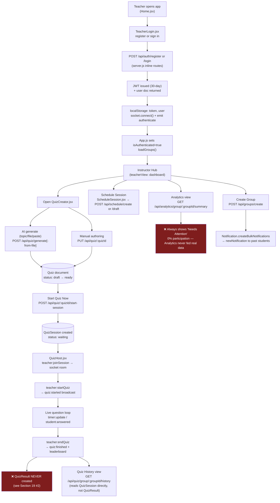
```mermaid
flowchart TD
    A["Teacher opens app<br/>(Home.jsx)"] --> B["TeacherLogin.jsx<br/>register or sign in"]
    B --> C["POST /api/auth/register or /login<br/>(server.js inline routes)"]
    C --> D["JWT issued (30-day)<br/>+ user doc returned"]
    D --> E["localStorage: token, user<br/>socket.connect() + emit authenticate"]
    E --> F["App.js sets isAuthenticated=true<br/>loadGroups()"]
    F --> G["Instructor Hub<br/>(teacherView: dashboard)"]
    G --> H["Create Group<br/>POST /api/groups/create"]
    G --> I["Schedule Session<br/>ScheduleSession.jsx → POST /api/schedule/create or /draft"]
    G --> J["Open QuizCreator.jsx"]
    J --> K["AI generate (topic/file/paste)<br/>POST /api/quiz/generate[-from-file]"]
    J --> L["Manual authoring<br/>PUT /api/quiz/:quizId"]
    K --> M[("Quiz document<br/>status: draft → ready")]
    L --> M
    M --> N["Start Quiz Now<br/>POST /api/quiz/:quizId/start-session"]
    N --> O[("QuizSession created<br/>status: waiting")]
    O --> P["QuizHost.jsx<br/>teacher:joinSession → socket room"]
    P --> Q["teacher:startQuiz<br/>→ quiz:started broadcast"]
    Q --> R["Live question loop<br/>timer:update / student:answered"]
    R --> S["teacher:endQuiz<br/>→ quiz:finished + leaderboard"]
    S --> T["❌ QuizResult NEVER created<br/>(see Section 19 #2)"]
    S --> U["Quiz History view<br/>GET /api/quiz/group/:groupId/history<br/>(reads QuizSession directly, not QuizResult)"]
    G --> V["Analytics view<br/>GET /api/analytics/group/:groupId/summary"]
    V --> W["❌ Always shows 'Needs Attention'<br/>0% participation — Analytics never fed real data"]
    H --> X["Notification.createBulkNotifications<br/>→ newNotification to past students"]
    style T fill:#7f1d1d,color:#fff
    style W fill:#7f1d1d,color:#fff
```

## 24.2 Student — full lifecycle (join → quiz play → results)

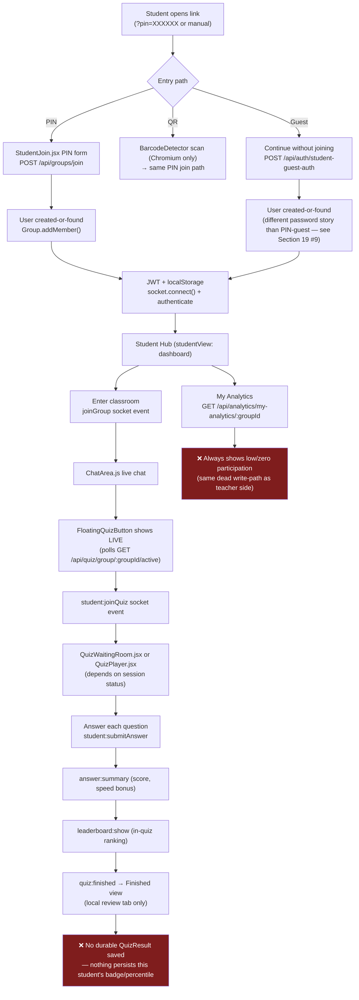
```mermaid
flowchart TD
    A["Student opens link<br/>(?pin=XXXXXX or manual)"] --> B{"Entry path"}
    B -->|PIN| C["StudentJoin.jsx PIN form<br/>POST /api/groups/join"]
    B -->|QR| D["BarcodeDetector scan (Chromium only)<br/>→ same PIN join path"]
    B -->|Guest| E["Continue without joining<br/>POST /api/auth/student-guest-auth"]
    C --> F["User created-or-found<br/>Group.addMember()"]
    E --> G["User created-or-found<br/>(different password story than PIN-guest — see Section 19 #9)"]
    F --> H["JWT + localStorage<br/>socket.connect() + authenticate"]
    G --> H
    H --> I["Student Hub (studentView: dashboard)"]
    I --> J["Enter classroom<br/>joinGroup socket event"]
    J --> K["ChatArea.js live chat"]
    K --> L["FloatingQuizButton shows LIVE<br/>(polls GET /api/quiz/group/:groupId/active)"]
    L --> M["student:joinQuiz socket event"]
    M --> N["QuizWaitingRoom.jsx or QuizPlayer.jsx<br/>(depends on session status)"]
    N --> O["Answer each question<br/>student:submitAnswer"]
    O --> P["answer:summary (score, speed bonus)"]
    P --> Q["leaderboard:show (in-quiz ranking)"]
    Q --> R["quiz:finished → Finished view<br/>(local review tab only)"]
    R --> S["❌ No durable QuizResult saved<br/>— nothing persists this student's badge/percentile"]
    I --> T["My Analytics<br/>GET /api/analytics/my-analytics/:groupId"]
    T --> U["❌ Always shows low/zero participation<br/>(same dead write-path as teacher side)"]
    style S fill:#7f1d1d,color:#fff
    style U fill:#7f1d1d,color:#fff
```

## 24.3 Chat message — full lifecycle

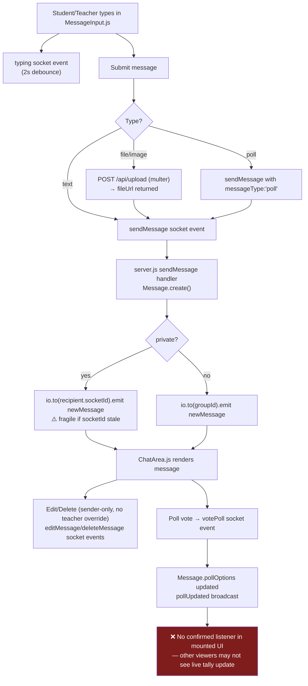
```mermaid
flowchart TD
    A["Student/Teacher types in MessageInput.js"] --> B["typing socket event<br/>(2s debounce)"]
    A --> C["Submit message"]
    C --> D{"Type?"}
    D -->|text| E["sendMessage socket event"]
    D -->|file/image| F["POST /api/upload (multer)<br/>→ fileUrl returned"]
    D -->|poll| G["sendMessage with messageType:'poll'"]
    F --> E
    G --> E
    E --> H["server.js sendMessage handler<br/>Message.create()"]
    H --> I{"private?"}
    I -->|yes| J["io.to(recipient.socketId).emit newMessage<br/>⚠️ fragile if socketId stale"]
    I -->|no| K["io.to(groupId).emit newMessage"]
    J --> L["ChatArea.js renders message"]
    K --> L
    L --> M["Edit/Delete (sender-only, no teacher override)<br/>editMessage/deleteMessage socket events"]
    L --> N["Poll vote → votePoll socket event"]
    N --> O["Message.pollOptions updated<br/>pollUpdated broadcast"]
    O --> P["❌ No confirmed listener in mounted UI<br/>— other viewers may not see live tally update"]
    style P fill:#7f1d1d,color:#fff
```

## 24.4 Scheduled session — full lifecycle

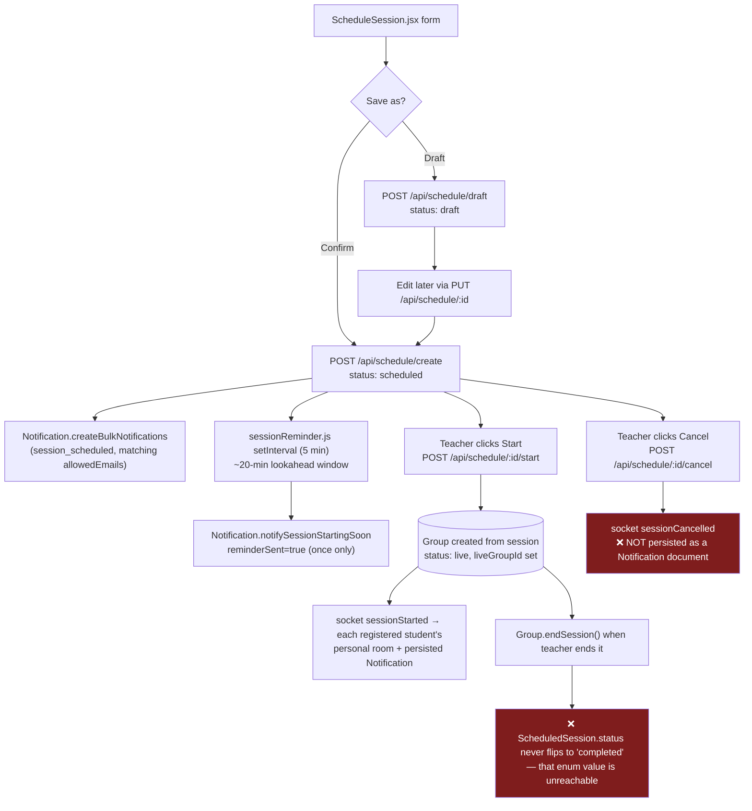
```mermaid
flowchart TD
    A["ScheduleSession.jsx form"] --> B{"Save as?"}
    B -->|Draft| C["POST /api/schedule/draft<br/>status: draft"]
    B -->|Confirm| D["POST /api/schedule/create<br/>status: scheduled"]
    D --> E["Notification.createBulkNotifications<br/>(session_scheduled, matching allowedEmails)"]
    C --> F["Edit later via PUT /api/schedule/:id"]
    F --> D
    D --> G["sessionReminder.js setInterval (5 min)<br/>~20-min lookahead window"]
    G --> H["Notification.notifySessionStartingSoon<br/>reminderSent=true (once only)"]
    D --> I["Teacher clicks Start<br/>POST /api/schedule/:id/start"]
    I --> J[("Group created from session<br/>status: live, liveGroupId set")]
    J --> K["socket sessionStarted → each registered student's<br/>personal room + persisted Notification"]
    J --> L["Group.endSession() when teacher ends it"]
    L --> M["❌ ScheduledSession.status never flips to 'completed'<br/>— that enum value is unreachable"]
    D --> N["Teacher clicks Cancel<br/>POST /api/schedule/:id/cancel"]
    N --> O["socket sessionCancelled<br/>❌ NOT persisted as a Notification document"]
    style M fill:#7f1d1d,color:#fff
    style O fill:#7f1d1d,color:#fff
```

## 24.5 Notification — full lifecycle

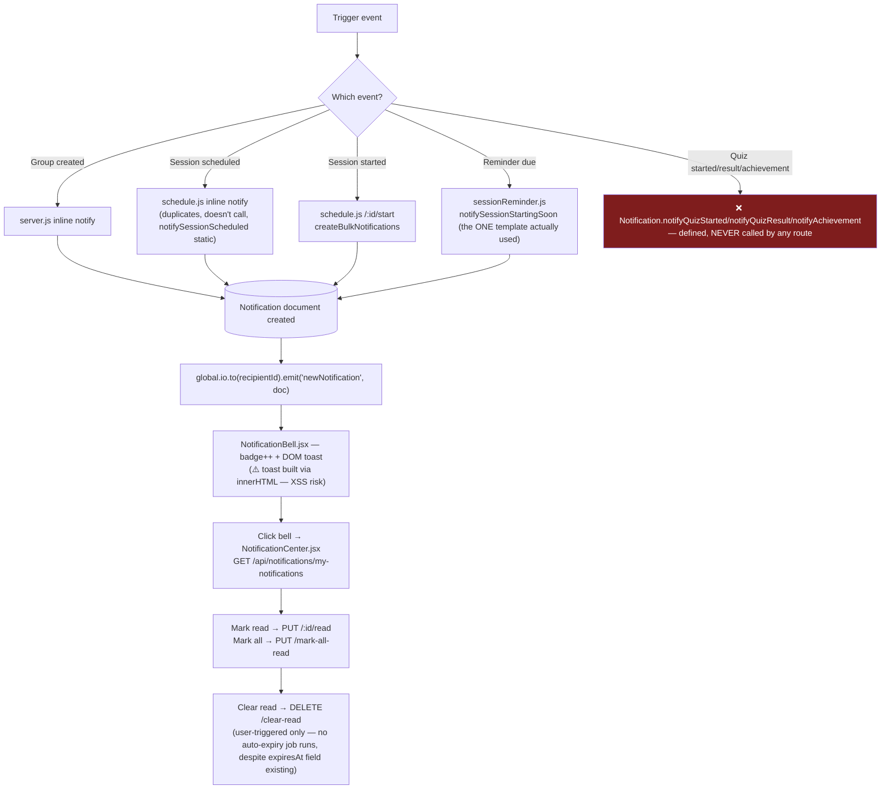
```mermaid
flowchart TD
    A["Trigger event"] --> B{"Which event?"}
    B -->|Group created| C["server.js inline notify"]
    B -->|Session scheduled| D["schedule.js inline notify<br/>(duplicates, doesn't call, notifySessionScheduled static)"]
    B -->|Session started| E["schedule.js /:id/start<br/>createBulkNotifications"]
    B -->|Reminder due| F["sessionReminder.js<br/>notifySessionStartingSoon (the ONE template actually used)"]
    B -->|Quiz started/result/achievement| G["❌ Notification.notifyQuizStarted/notifyQuizResult/notifyAchievement<br/>— defined, NEVER called by any route"]
    C --> H[("Notification document created")]
    D --> H
    E --> H
    F --> H
    H --> I["global.io.to(recipientId).emit('newNotification', doc)"]
    I --> J["NotificationBell.jsx — badge++ + DOM toast<br/>(⚠️ toast built via innerHTML — XSS risk)"]
    J --> K["Click bell → NotificationCenter.jsx<br/>GET /api/notifications/my-notifications"]
    K --> L["Mark read → PUT /:id/read<br/>Mark all → PUT /mark-all-read"]
    L --> M["Clear read → DELETE /clear-read<br/>(user-triggered only — no auto-expiry job runs, despite expiresAt field existing)"]
    style G fill:#7f1d1d,color:#fff
```

---

# SECTION 25 — GRANULAR DATA FLOW TRACES

## 25.1 Student submits a quiz answer (the canonical realtime write path)

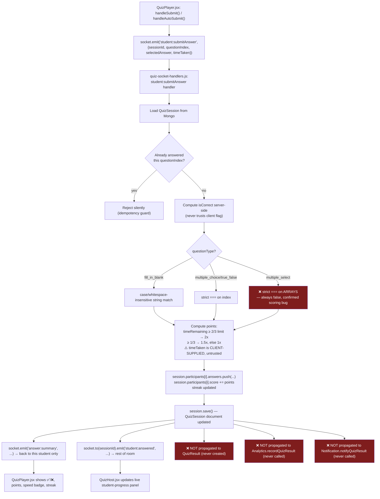
```mermaid
flowchart TD
    A["QuizPlayer.jsx: handleSubmit() / handleAutoSubmit()"] --> B["socket.emit('student:submitAnswer',<br/>{sessionId, questionIndex, selectedAnswer, timeTaken})"]
    B --> C["quiz-socket-handlers.js:<br/>student:submitAnswer handler"]
    C --> D["Load QuizSession from Mongo"]
    D --> E{"Already answered<br/>this questionIndex?"}
    E -->|yes| F["Reject silently (idempotency guard)"]
    E -->|no| G["Compute isCorrect server-side<br/>(never trusts client flag)"]
    G --> H{"questionType?"}
    H -->|fill_in_blank| I["case/whitespace-insensitive string match"]
    H -->|multiple_choice/true_false| J["strict === on index"]
    H -->|multiple_select| K["❌ strict === on ARRAYS<br/>— always false, confirmed scoring bug"]
    I --> L["Compute points:<br/>timeRemaining ≥ 2/3 limit → 2x<br/>≥ 1/3 → 1.5x, else 1x<br/>⚠️ timeTaken is CLIENT-SUPPLIED, untrusted"]
    J --> L
    K --> L
    L --> M["session.participants[i].answers.push(...)<br/>session.participants[i].score += points<br/>streak updated"]
    M --> N["session.save() — QuizSession document updated"]
    N --> O["socket.emit('answer:summary', ...) → back to this student only"]
    N --> P["socket.to(sessionId).emit('student:answered', ...) → rest of room"]
    N --> Q["❌ NOT propagated to QuizResult (never created)"]
    N --> R["❌ NOT propagated to Analytics.recordQuizResult (never called)"]
    N --> S["❌ NOT propagated to Notification.notifyQuizResult (never called)"]
    P --> T["QuizHost.jsx updates live student-progress panel"]
    O --> U["QuizPlayer.jsx shows ✅/❌, points, speed badge, streak"]
    style K fill:#7f1d1d,color:#fff
    style Q fill:#7f1d1d,color:#fff
    style R fill:#7f1d1d,color:#fff
    style S fill:#7f1d1d,color:#fff
```

**This is the single most important data-flow diagram in the whole report.** It shows exactly where the "intended" pipeline (submit → score → session → result → analytics → notification → history → future AI recommendation) gets cut off in the real codebase: everything up through "QuizSession document updated" is real and working; everything after that (QuizResult, Analytics, Notification, and by extension any future "AI recommendation" feature that would read from those) has no data to read because nothing writes to it.

## 25.2 Teacher creates an AI-generated quiz

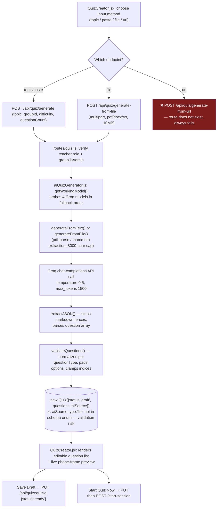
```mermaid
flowchart TD
    A["QuizCreator.jsx: choose input method<br/>(topic / paste / file / url)"] --> B{"Which endpoint?"}
    B -->|topic/paste| C["POST /api/quiz/generate {topic, groupId, difficulty, questionCount}"]
    B -->|file| D["POST /api/quiz/generate-from-file<br/>(multipart, pdf/docx/txt, 10MB)"]
    B -->|url| E["❌ POST /api/quiz/generate-from-url<br/>— route does not exist, always fails"]
    C --> F["routes/quiz.js: verify teacher role + group.isAdmin"]
    D --> F
    F --> G["aiQuizGenerator.js: getWorkingModel()<br/>probes 4 Groq models in fallback order"]
    G --> H["generateFromText() or generateFromFile()<br/>(pdf-parse / mammoth extraction, 8000-char cap)"]
    H --> I["Groq chat-completions API call<br/>temperature 0.5, max_tokens 1500"]
    I --> J["extractJSON() — strips markdown fences,<br/>parses question array"]
    J --> K["validateQuestions() — normalizes per<br/>questionType, pads options, clamps indices"]
    K --> L[("new Quiz({status:'draft', questions, aiSource})<br/>⚠️ aiSource.type:'file' not in schema enum — validation risk")]
    L --> M["QuizCreator.jsx renders editable question list<br/>+ live phone-frame preview"]
    M --> N["Save Draft → PUT /api/quiz/:quizId {status:'ready'}"]
    M --> O["Start Quiz Now → PUT then POST /start-session"]
    style E fill:#7f1d1d,color:#fff
```

## 25.3 File upload in chat

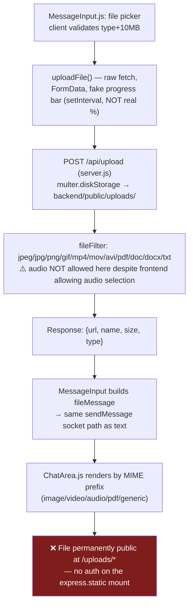
```mermaid
flowchart TD
    A["MessageInput.js: file picker<br/>client validates type+10MB"] --> B["uploadFile() — raw fetch,<br/>FormData, fake progress bar (setInterval, NOT real %)"]
    B --> C["POST /api/upload (server.js)<br/>multer.diskStorage → backend/public/uploads/"]
    C --> D["fileFilter: jpeg/jpg/png/gif/mp4/mov/avi/pdf/doc/docx/txt<br/>⚠️ audio NOT allowed here despite frontend allowing audio selection"]
    D --> E["Response: {url, name, size, type}"]
    E --> F["MessageInput builds fileMessage<br/>→ same sendMessage socket path as text"]
    F --> G["ChatArea.js renders by MIME prefix<br/>(image/video/audio/pdf/generic)"]
    G --> H["❌ File permanently public at /uploads/*<br/>— no auth on the express.static mount"]
    style H fill:#7f1d1d,color:#fff
```

---

# SECTION 26 — COMPONENT DEPENDENCY MAP

Built from confirmed import/render relationships (not just co-location in the folder) found across all six research passes.


```mermaid
graph TD
    Index["index.js"] --> App["App.js (2,412 lines —<br/>router + global state + view layer)"]

    App --> Home["pages/Home.jsx"]
    App --> TeacherLogin["pages/TeacherLogin.jsx"]
    App --> StudentJoin["pages/StudentJoin.jsx"]
    App --> LoginLegacy["components/Login.js<br/>⚠️ legacy, unreachable in normal flow"]
    Home --> PgFooter["pages/Footer.jsx (REAL, rendered)"]
    TeacherLogin --> PgFooter
    StudentJoin --> PgFooter
    App -.->|"imported, never rendered"| CompFooter["components/Footer.jsx ❌ DEAD"]

    App --> Header["components/Header.js"]
    Header --> NotifBell1["NotificationBell.jsx (brand row instance)"]
    Header --> NotifBell2["NotificationBell.jsx (session-bar instance)<br/>⚠️ NOT synced with instance #1"]
    NotifBell1 --> NotifCenter["NotificationCenter.jsx"]
    NotifBell2 --> NotifCenter

    App --> Sidebar["components/Sidebar.js"]
    Sidebar --> Settings["Settings panel (inline sub-component)"]
    Sidebar --> Whiteboard["Whiteboard canvas (inline sub-component)"]

    App --> ChatArea["components/ChatArea.js"]
    App --> MessageInput["components/MessageInput.js"]
    ChatArea -.->|"quiz-notification cards inside chat"| WindowEvt1(("window CustomEvent:<br/>openWaitingRoom"))

    App --> QuizCreator["components/QuizCreator.jsx (1,841 lines)"]
    App --> QuizHost["components/QuizHost.jsx (✅ working socket path)"]
    App --> QuizWaitingRoom["components/QuizWaitingRoom.jsx"]
    App --> QuizPlayer["components/QuizPlayer.jsx"]
    App --> FloatingBtn["components/FloatingQuizButton.jsx"]
    FloatingBtn --> QuizControlPanel["components/QuizControlPanel.jsx<br/>❌ REST actions 404 (redundant with QuizHost)"]
    QuizWaitingRoom -.->|"dispatches, no confirmed listener"| WindowEvt2(("window CustomEvent:<br/>startQuiz ❌"))

    App -.->|"not imported anywhere"| Leaderboard["components/Leaderboard.jsx ❌ DEAD<br/>(fetches nonexistent endpoint)"]
    App -.->|"not imported anywhere"| PollComp["components/PollComponent.js ❌ DEAD"]
    App -.->|"not imported anywhere"| ManageStudents["components/ManageStudents.jsx ❌ DEAD<br/>(backend routes work, UI unreachable)"]
    App -.->|"not imported anywhere"| UpcomingSessions["components/UpcomingSessions.jsx ❌ DEAD<br/>(backend routes work, UI unreachable)"]

    App --> StudentAnalytics["components/StudentAnalytics.jsx"]
    StudentAnalytics --> StudentProfile["components/StudentProfile.jsx"]

    App --> ScheduleSession["components/ScheduleSession.jsx"]

    style CompFooter fill:#7f1d1d,color:#fff
    style Leaderboard fill:#7f1d1d,color:#fff
    style PollComp fill:#7f1d1d,color:#fff
    style ManageStudents fill:#7f1d1d,color:#fff
    style UpcomingSessions fill:#7f1d1d,color:#fff
    style QuizControlPanel fill:#7f1d1d,color:#fff
    style WindowEvt2 fill:#7f1d1d,color:#fff
```

**Reading this map**: `App.js` is the root of everything — there is no nested router, so every component in the tree is a direct or one-level-removed child of `App.js`. Four components (`Footer` duplicate, `Leaderboard`, `PollComponent`, `ManageStudents`, `UpcomingSessions` — five, technically) are fully built but structurally disconnected from this tree entirely.

---

# SECTION 27 — SEQUENCE DIAGRAMS PER MAJOR FEATURE

(Section 8 already contains the live-quiz-question sequence diagram; the ones below cover the other major features end to end.)

## 27.1 Teacher login

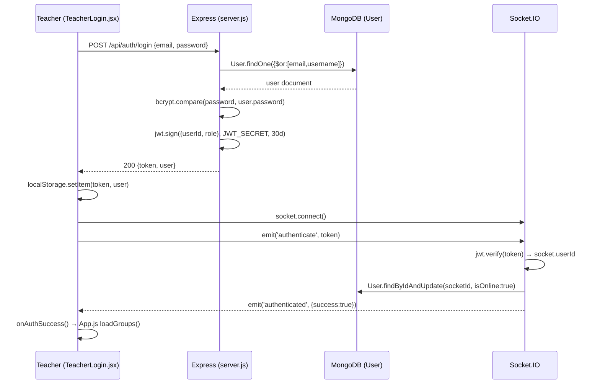
```mermaid
sequenceDiagram
    participant T as Teacher (TeacherLogin.jsx)
    participant S as Express (server.js)
    participant DB as MongoDB (User)
    participant Sock as Socket.IO

    T->>S: POST /api/auth/login {email, password}
    S->>DB: User.findOne({$or:[email,username]})
    DB-->>S: user document
    S->>S: bcrypt.compare(password, user.password)
    S->>S: jwt.sign({userId, role}, JWT_SECRET, 30d)
    S-->>T: 200 {token, user}
    T->>T: localStorage.setItem(token, user)
    T->>Sock: socket.connect()
    T->>Sock: emit('authenticate', token)
    Sock->>Sock: jwt.verify(token) → socket.userId
    Sock->>DB: User.findByIdAndUpdate(socketId, isOnline:true)
    Sock-->>T: emit('authenticated', {success:true})
    T->>T: onAuthSuccess() → App.js loadGroups()
```

## 27.2 Student PIN join

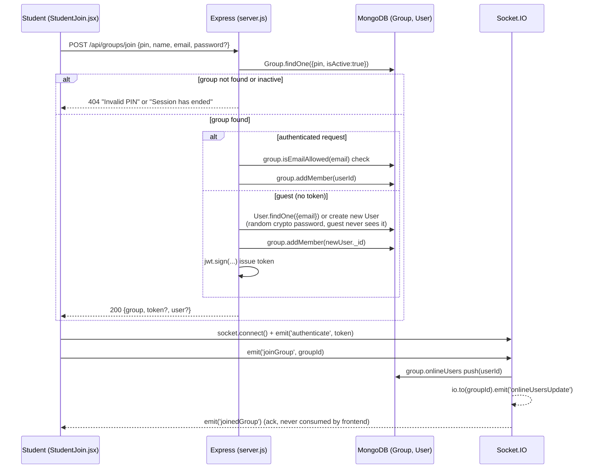
```mermaid
sequenceDiagram
    participant St as Student (StudentJoin.jsx)
    participant S as Express (server.js)
    participant DB as MongoDB (Group, User)
    participant Sock as Socket.IO

    St->>S: POST /api/groups/join {pin, name, email, password?}
    S->>DB: Group.findOne({pin, isActive:true})
    alt group not found or inactive
        S-->>St: 404 "Invalid PIN" or "Session has ended"
    else group found
        alt authenticated request
            S->>DB: group.isEmailAllowed(email) check
            S->>DB: group.addMember(userId)
        else guest (no token)
            S->>DB: User.findOne({email}) or create new User<br/>(random crypto password, guest never sees it)
            S->>DB: group.addMember(newUser._id)
            S->>S: jwt.sign(...) issue token
        end
        S-->>St: 200 {group, token?, user?}
    end
    St->>Sock: socket.connect() + emit('authenticate', token)
    St->>Sock: emit('joinGroup', groupId)
    Sock->>DB: group.onlineUsers push(userId)
    Sock-->>Sock: io.to(groupId).emit('onlineUsersUpdate')
    Sock-->>St: emit('joinedGroup') (ack, never consumed by frontend)
```

## 27.3 Scheduled session going live

```mermaid
sequenceDiagram
    participant T as Teacher (ScheduleSession.jsx / dashboard)
    participant S as Express (routes/schedule.js)
    participant DB as MongoDB (ScheduledSession, Group, User, Notification)
    participant Sock as Socket.IO

    T->>S: POST /api/schedule/:sessionId/start
    S->>DB: ScheduledSession.findById + ownership check
    S->>S: generate/reuse PIN, generate QR (qrcode lib)
    S->>DB: new Group({groupName, admin:teacher, allowedEmails}) .save()
    S->>DB: session.status='live'; session.liveGroupId=group._id; .save()
    S->>DB: Notification.createBulkNotifications(registeredStudents, 'session_started')
    loop for each registered student
        S->>Sock: io.to(student.userId).emit('sessionStarted', {groupId, pin})
    end
    S-->>T: 200 {group, session}
    Note over Sock: registered students who are online<br/>and have joined their personal room<br/>receive sessionStarted in real time
```

## 27.4 Notification delivery (session-started example)

```mermaid
sequenceDiagram
    participant Job as sessionReminder.js / schedule.js route
    participant Model as Notification model (static)
    participant DB as MongoDB
    participant Sock as Socket.IO (global.io)
    participant St as Student (NotificationBell.jsx)

    Job->>Model: Notification.createBulkNotifications(recipients, data)
    Model->>DB: insertMany(notification docs)
    Model->>Sock: for each recipient: io.to(recipientId).emit('newNotification', doc)
    Sock-->>St: newNotification event (only if St's socket has<br/>joined its personal room via 'authenticate')
    St->>St: unreadCount++ ; showToast() via innerHTML ⚠️ XSS risk
    St->>St: (later) click bell → GET /api/notifications/my-notifications
    St->>Model: PUT /:id/read on click
    Model->>DB: notification.isRead=true, readAt=now
```

---

# SECTION 28 — DATABASE LIFECYCLE PER MODEL

## User

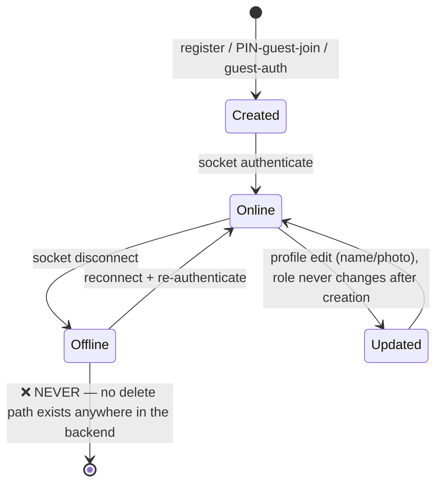
```mermaid
stateDiagram-v2
    [*] --> Created: register / PIN-guest-join / guest-auth
    Created --> Online: socket authenticate
    Online --> Offline: socket disconnect
    Offline --> Online: reconnect + re-authenticate
    Online --> Updated: profile edit (name/photo), role never changes after creation
    Updated --> Online
    Offline --> [*]: ❌ NEVER — no delete path exists anywhere in the backend
```

## Group

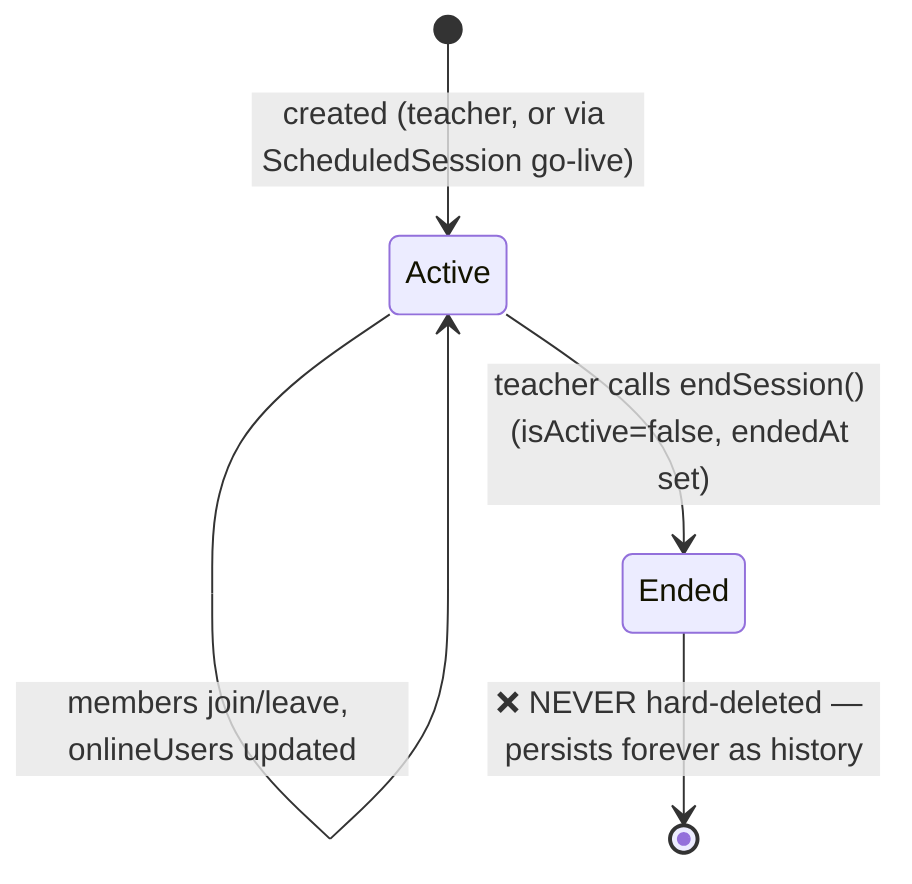
```mermaid
stateDiagram-v2
    [*] --> Active: created (teacher, or via ScheduledSession go-live)
    Active --> Active: members join/leave, onlineUsers updated
    Active --> Ended: teacher calls endSession() (isActive=false, endedAt set)
    Ended --> [*]: ❌ NEVER hard-deleted — persists forever as history
```

## Message

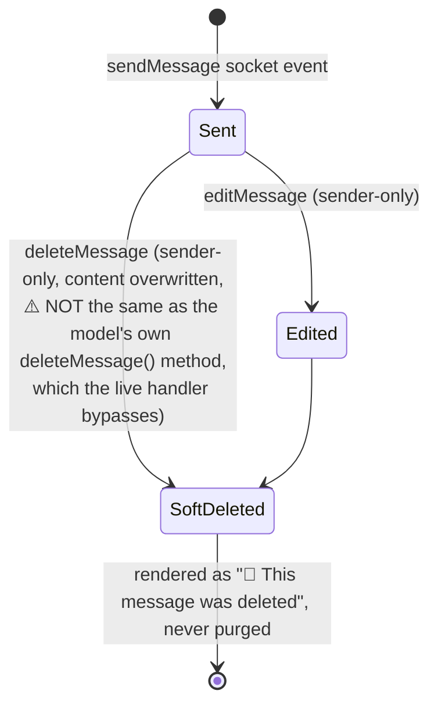
```mermaid
stateDiagram-v2
    [*] --> Sent: sendMessage socket event
    Sent --> Edited: editMessage (sender-only)
    Sent --> SoftDeleted: deleteMessage (sender-only, content overwritten,<br/>⚠️ NOT the same as the model's own deleteMessage() method,<br/>which the live handler bypasses)
    Edited --> SoftDeleted
    SoftDeleted --> [*]: rendered as "🚫 This message was deleted", never purged
```

## Quiz

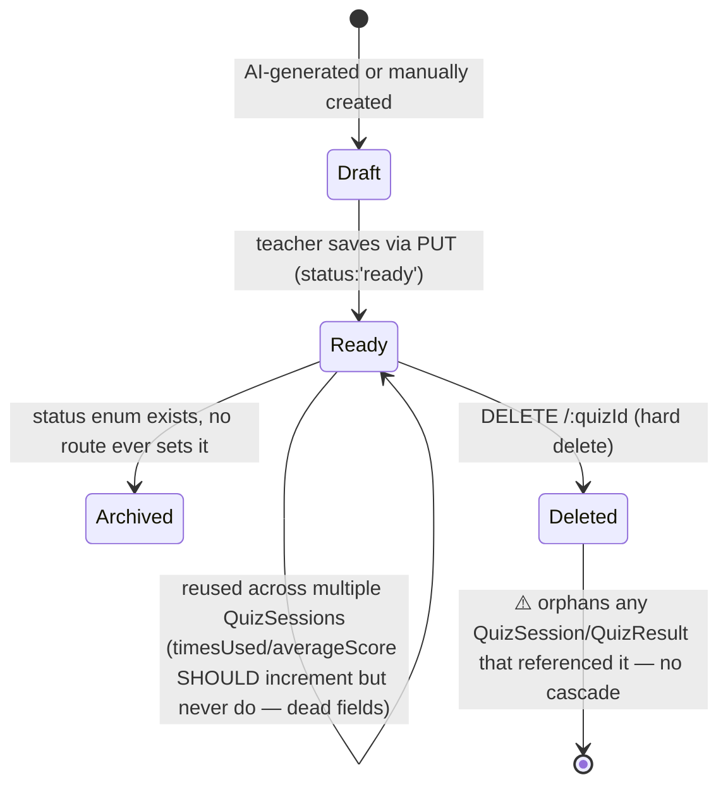
```mermaid
stateDiagram-v2
    [*] --> Draft: AI-generated or manually created
    Draft --> Ready: teacher saves via PUT (status:'ready')
    Ready --> Ready: reused across multiple QuizSessions<br/>(timesUsed/averageScore SHOULD increment but never do — dead fields)
    Ready --> Archived: status enum exists, no route ever sets it
    Ready --> Deleted: DELETE /:quizId (hard delete)
    Deleted --> [*]: ⚠️ orphans any QuizSession/QuizResult that referenced it — no cascade
```

## QuizSession (the real quiz engine)

```mermaid
stateDiagram-v2
    [*] --> Waiting: POST /:quizId/start-session (idempotent — reuses existing active session)
    Waiting --> Active: teacher:startQuiz
    Active --> Active: question loop (timer:update, student:submitAnswer)
    Active --> Paused: pause() model method exists — no UI wired to call it
    Paused --> Active: resume()
    Active --> Completed: teacher:endQuiz OR last question auto-completes
    Completed --> [*]: ❌ should feed QuizResult/Analytics/Notification here — none of that happens.<br/>Document persists forever, readable only via QuizSession history queries.
```

## QuizResult

```mermaid
stateDiagram-v2
    [*] --> NeverCreated: ❌ zero documents ever created anywhere in this codebase
    NeverCreated --> [*]: fully designed (calculateMetrics, assignBadge, getPerformanceLevel,<br/>getQuizAnalytics, getGlobalLeaderboard) — entirely dormant
```

## ScheduledSession

```mermaid
stateDiagram-v2
    [*] --> Draft: POST /draft (relaxed required fields)
    Draft --> Scheduled: teacher confirms (edits via PUT, or direct POST /create)
    Draft --> [*]: DELETE /draft/:id (the ONLY hard-delete path for this model)
    Scheduled --> Live: POST /:id/start → converts to a Group
    Scheduled --> Cancelled: POST /:id/cancel
    Live --> Completed: ❌ enum value exists, NO code path ever sets it —<br/>ending the derived Group does not flip this session's status back
    Cancelled --> [*]: persists forever
    Completed --> [*]: unreachable in practice
```

## Analytics

```mermaid
stateDiagram-v2
    [*] --> LazilyCreated: getOrCreate() on first analytics-route touch for a student+group pair
    LazilyCreated --> Recalculated: EVERY read-route recalculates + saves<br/>(calculateParticipation, evaluatePerformance)
    Recalculated --> Recalculated: but recordMessage()/recordQuizResult()/recordAttendance()<br/>are NEVER CALLED — underlying counters are permanently 0
    Recalculated --> [*]: ❌ never deleted; deterministically always evaluates to<br/>"Needs Attention" / 0% participation regardless of real activity
```

## Notification

```mermaid
stateDiagram-v2
    [*] --> Created: one of several disparate call sites (not centralized)
    Created --> Delivered: global.io.to(recipientId).emit('newNotification')<br/>(only if recipient's socket joined its personal room)
    Delivered --> Read: PUT /:id/read or /mark-all-read
    Read --> Deleted: DELETE /:id or /clear-read (user-triggered only)
    Created --> Expired: expiresAt field is set...
    Expired --> [*]: ❌ ...but no TTL index exists and isExpired() is never called — nothing actually expires
```

## Poll (dead model)

```mermaid
stateDiagram-v2
    [*] --> NeverInstantiated: ❌ never require()'d anywhere in the backend
    NeverInstantiated --> [*]: has a real MongoDB TTL index (expireAfterSeconds:0) —<br/>the ONLY model in the app with genuine auto-expiry, entirely unused
```

---

# SECTION 29 — API DEPENDENCY TREE

Frontend caller → HTTP call → Backend route → Model(s) touched → Socket event fired (if any). "❌" marks a call that targets a route confirmed **not to exist**.

| Frontend caller | API call | Backend route | Model(s) | Socket emitted |
|---|---|---|---|---|
| `TeacherLogin.jsx` | `register()`, `login()` (api.js) | `POST /api/auth/register`, `/login` | `User` | — |
| `StudentJoin.jsx` | `joinGroup()`, `studentGuestAuth()` | `POST /api/groups/join`, `/api/auth/student-guest-auth` | `User`, `Group` | — |
| `App.js` (`handleCreateInstantSession`) | raw `fetch` (bypasses api.js) | `POST /api/groups/create` | `Group`, `User`, `Notification` | — |
| `App.js` (`selectGroup`) | `getGroupDetails()`, `getMessages()` | `GET /api/groups/:id`, `/:id/messages` | `Group`, `Message` | `joinGroup` (client emits after) |
| `MessageInput.js` | `uploadFile()` (raw fetch) | `POST /api/upload` | none (filesystem) | — |
| `ChatArea.js`/`App.js` | — (all socket, no REST) | — | `Message` | `sendMessage`, `editMessage`, `deleteMessage`, `votePoll` |
| `QuizCreator.jsx` | `POST /api/quiz/generate`, `/generate-from-file` | `routes/quiz.js` | `Quiz` | — |
| `QuizCreator.jsx` | ❌ `POST /api/quiz/generate-from-url` | **does not exist** | — | — |
| `QuizCreator.jsx` | `PUT /api/quiz/:quizId`, `POST /:quizId/start-session` | `routes/quiz.js` | `Quiz`, `QuizSession` | `quizStarted` (REST-triggered) |
| `QuizCreator.jsx` | `GET /api/quiz/recent-topics` | `routes/quiz.js` | `Quiz` | — |
| `QuizHost.jsx` | — (all socket) | — | `QuizSession` | `teacher:joinSession`, `teacher:startQuiz`, `teacher:nextQuestion`, `teacher:endQuiz` |
| `QuizPlayer.jsx` | — (all socket) | — | `QuizSession` | `student:joinQuiz`, `student:submitAnswer` |
| `QuizControlPanel.jsx` | `GET /api/quiz/group/:groupId/active`, `/history` | `routes/quiz.js` | `QuizSession` | listens only, never emits gameplay events itself |
| `QuizControlPanel.jsx` | ❌ `POST /session/:id/begin`, `/next`, `/end` | **do not exist** | — | — |
| `Leaderboard.jsx` | ❌ `GET /api/quiz/session/:id/leaderboard` | **does not exist** | — | — |
| `FloatingQuizButton.jsx` | `GET /api/quiz/group/:groupId/active` | `routes/quiz.js` | `QuizSession` | `student:joinQuiz` (student click) |
| `StudentAnalytics.jsx` | `GET /api/analytics/group/:groupId/summary`, `/students` | `routes/analytics.js` | `Analytics` (always zero) | — |
| `StudentProfile.jsx` | `GET /api/analytics/student/:studentId/group/:groupId` | `routes/analytics.js` | `Analytics`, `QuizResult` (always empty) | — |
| `StudentAnalytics.jsx` (export) | `GET /api/analytics/group/:groupId/export` | `routes/analytics.js` | `Analytics` | — |
| `ScheduleSession.jsx` | `POST /api/schedule/draft`, `/create`, `GET /drafts`, `PUT /:id` | `routes/schedule.js` | `ScheduledSession` | — |
| `ManageStudents.jsx` (dead UI, live backend) | `POST /api/schedule/:id/emails` | `routes/schedule.js` | `ScheduledSession` | — |
| `UpcomingSessions.jsx` (dead UI, live backend) | `GET /api/schedule/available`, `POST /:id/register` | `routes/schedule.js` | `ScheduledSession` | — |
| `NotificationBell.jsx` | `GET /api/notifications/unread-count` | `routes/notifications.js` | `Notification` | listens `newNotification` |
| `NotificationCenter.jsx` | `GET /my-notifications`, `PUT /:id/read`, `/mark-all-read`, `DELETE /:id`, `/clear-read` | `routes/notifications.js` | `Notification` | — |
| `Sidebar.js` (Settings) | `PUT /api/auth/update-profile` | `server.js` inline | `User` | — |
| `api.js` exports (`createGroup`, `createScheduledSession`, `saveSessionDraft`, `getSessionDrafts`, `deleteSessionDraft`, `getMySessions`, `verifySessionAccess`, `getAvailableSessions`, `getUnauthorizedAttempts`) | wired to real, working backend routes | various | various | — |  *(❌ but none of these 9 functions are ever called from any component — the routes work, the frontend wrapper is simply dead)* |

---

# SECTION 30 — UI HIERARCHY (screens, modals, popups, buttons, navigation, states)

```
Root (App.js — no URL router; everything below is a state-driven view swap)
│
├── UNAUTHENTICATED (authScreen)
│   ├── "home" → Home.jsx
│   │   ├── Button: "Start as Teacher" → authScreen='teacher'
│   │   ├── Button: "Join as Student" → authScreen='student'
│   │   ├── Theme toggle (🌙/☀️ span, not a real button)
│   │   └── Footer (pages/Footer.jsx)
│   ├── "teacher" → TeacherLogin.jsx
│   │   ├── Toggle: Register ⇄ Sign In (isRegisterMode)
│   │   ├── Button: "Back to Home" → authScreen='home'
│   │   └── Footer (pages/Footer.jsx)
│   └── "student" → StudentJoin.jsx
│       ├── Card: "Enter PIN" → showPinForm
│       │   ├── PIN input (6-digit, auto-strip non-digits)
│       │   ├── Optional password field (private sessions)
│       │   └── Button: "Join"
│       ├── Card: "Scan QR Code" → scanning=true (camera view)
│       │   └── Fallback panel if BarcodeDetector unsupported (showQRHelp)
│       ├── Card: "Continue without joining" → showGuestForm
│       └── Footer (pages/Footer.jsx)
│
└── AUTHENTICATED (isAuthenticated===true)
    ├── Header.js (always rendered)
    │   ├── Brand row (outside a session): logo, user avatar/name/role, NotificationBell, hamburger (mobile sidebar toggle)
    │   ├── Session sub-header (inside a session): LIVE badge, "View PIN & QR" modal trigger, role-specific actions
    │   │   ├── Teacher: "📊 Live Analytics", "🔴 End Session"
    │   │   └── Student: "SESSION ACTIVE • N PARTICIPANTS", "Leave"
    │   └── Modal: PIN/QR viewer (fallback if parent doesn't supply onViewPin)
    │       └── Button: "Open Full Size" → new window via document.write (deprecated API)
    │
    ├── Sidebar.js (slide-in panel, right side)
    │   ├── Participants list (online/offline dots)
    │   ├── (Teacher only) Engagement panel — crude client-computed participation %
    │   ├── (Teacher only) Nav item: Whiteboard → full-screen canvas overlay
    │   ├── Nav item: Settings → full-screen Settings overlay
    │   │   ├── Username edit
    │   │   ├── Profile photo upload (base64, client-side only — no /api/upload used here)
    │   │   └── Read-only email/password display
    │   └── Bottom bar (student only): "Leave session", "Logout"
    │
    ├── Main content — three mutually exclusive states:
    │   │
    │   ├── STATE A: no currentGroup, role=teacher → Instructor Hub (teacherView)
    │   │   ├── "dashboard" — group cards (Live / Scheduled / Ended tabs implied by card badges)
    │   │   │   ├── Card menu (⋮) → openMenuId dropdown: Manage / Delete / View Details
    │   │   │   ├── Modal: "Manage Session" (scheduled cards)
    │   │   │   └── Modal: "Session Details" (ended cards) — tabs: Members / Quiz History
    │   │   ├── "schedule" → ScheduleSession.jsx (modal-like full view)
    │   │   ├── "quizhistory" → per-group quiz history list
    │   │   ├── "analytics" → StudentAnalytics.jsx (❌ hollow data)
    │   │   └── "settings" → shared Settings panel
    │   │
    │   ├── STATE B: no currentGroup, role=student → Student Hub (studentView)
    │   │   ├── "dashboard" — PIN quick-join box, joined-groups list
    │   │   ├── "live" / "participants" — triggered by joinSession/openWaitingRoom window events
    │   │   ├── "schedule" → available-sessions browsing (⚠️ intended UI is UpcomingSessions.jsx, but it's DEAD — this path likely falls back to a simpler inline list in App.js)
    │   │   ├── "quizzes" → student's quiz list
    │   │   ├── "sessionlist" → joined-session history
    │   │   └── "settings" → shared Settings panel
    │   │
    │   └── STATE C: currentGroup set → Chat View
    │       ├── ChatArea.js (message list, date separators, context-menu: Copy/Edit/Delete)
    │       │   ├── Poll render (inline vote bars)
    │       │   ├── Quiz-notification card ("Join Quiz" button)
    │       │   ├── File/image/video/PDF render (click → fullscreen viewer)
    │       │   └── Collapsible leaderboard bar (quiz-in-progress)
    │       ├── MessageInput.js
    │       │   ├── "+" menu: Image/Video/Document/Audio/Poll
    │       │   ├── Poll-creation modal (question + 2–10 options)
    │       │   └── Fake upload-progress bar
    │       └── FloatingQuizButton.jsx (draggable, only when group.isActive)
    │           ├── Teacher click, no session → opens QuizCreator.jsx (full modal)
    │           ├── Teacher click, session exists → QuizControlPanel.jsx (❌ broken control actions)
    │           └── Student click, session exists → emits student:joinQuiz, opens QuizPlayer/QuizWaitingRoom
    │
    └── Quiz overlays (conditionally rendered above everything else)
        ├── QuizCreator.jsx — tabs: Essentials / Questions / Settings / "Assign" (❌ permanently disabled)
        ├── QuizHost.jsx — views: preview → active → finished
        ├── QuizWaitingRoom.jsx — participant grid, static tips list
        └── QuizPlayer.jsx — views: loading → waiting|question|quizEnded → question ⇄ answerSummary ⇄ leaderboard → finished (tabs: leaderboard/review)
```

---

# SECTION 31 — FUTURE ARCHITECTURE PLACEMENT

Where Subscription/Billing, a Parent App, an AI Tutor, and a School Dashboard would attach to the *existing* architecture from Section 2 — shown as additions, not a rewrite, since most of the current core (auth, groups, sockets) can be extended rather than replaced.

```mermaid
flowchart TB
    subgraph Existing["EXISTING (Sections 1–23)"]
        FE["React SPA"]
        BE["Express + Socket.IO"]
        DB[("MongoDB — User/Group/Quiz/etc.")]
        AI_Existing["Groq — AI quiz generation"]
    end

    subgraph NewOrg["NEW: Organization / Tenant Layer"]
        OrgModel[("Organization model<br/>(schools, districts)")]
        Billing["Billing service<br/>(Stripe or similar)<br/>Subscription/Plan tier"]
        Perms["Permissions layer<br/>school_admin / dept_head roles"]
    end

    subgraph NewParent["NEW: Parent App"]
        ParentFE["Parent-facing read-only SPA<br/>(reuses existing design system)"]
        ParentAPI["New /api/parent/* routes<br/>read-only over Analytics + QuizResult"]
    end

    subgraph NewAITutor["NEW: AI Tutor"]
        TutorFE["Chat-style tutor UI<br/>(reuses Message.messageType pattern —<br/>add 'ai_assistant' enum value)"]
        TutorBE["New AI service layer<br/>(same Groq integration point as aiQuizGenerator.js)"]
    end

    subgraph NewSchoolDash["NEW: School Dashboard"]
        SchoolFE["Cross-teacher, cross-class aggregate views<br/>(built on TOP OF the fixed Analytics pipeline —<br/>see Section 19 #3 prerequisite)"]
    end

    FE --> BE
    BE --> DB
    BE --> AI_Existing

    OrgModel -->|"scopes every query"| DB
    Billing -->|"gates feature flags"| BE
    Perms -->|"extends existing role enum"| DB

    ParentFE --> ParentAPI --> DB
    TutorFE --> TutorBE --> AI_Existing
    TutorBE --> DB
    SchoolFE --> DB

    FE -.->|"shared design system (Section 32)"| ParentFE
    FE -.->|"shared design system"| SchoolFE
```

**Key prerequisite dependency**: both the Parent App and the School Dashboard are only meaningful once the `QuizResult`/`Analytics` write-path gap (Section 19, issues #2/#3) is closed — building either of these two features on top of the *current* data pipeline would just surface the same "always zero" numbers to a new audience. The AI Tutor and Organization/Billing layer, by contrast, have no such prerequisite and could be started independently today.

---

# SECTION 32 — DESIGN SYSTEM (extracted from actual code, not invented)

The codebase has **no formal design-system file, no CSS variables/tokens, no styled-components/Tailwind config, and no shared theme object** — every component defines its own inline `style={{...}}` objects (or, for the older pre-auth pages, standalone `.css` files) with hardcoded hex values repeated across files. What follows is what the *as-built* palette and patterns actually are (extracted via a repo-wide scan of literal hex codes and inline style properties), followed by a recommended consolidated token set.

## 32.1 Colors as actually used (frequency-ranked, from a full-repo hex scan)

| Hex | Approx. role observed | Where |
|---|---|---|
| `#4F46E5` / `#6366f1` / `#818cf8` | **Primary indigo** — buttons, active states, links, quiz UI accents (this is the dominant, current brand color) | Everywhere in `App.js`, `QuizCreator.jsx`, `QuizPlayer.jsx`, `Header.js`, `Sidebar.js` |
| `#c7d2fe` / `#EEF2FF` / `#eef2ff` | Light indigo tints — hover backgrounds, badges | Quiz components, dashboards |
| `#1e293b` / `#334155` / `#475569` / `#64748b` / `#94a3b8` | **Slate gray scale** — dark-mode surfaces, secondary text | Nearly all newer components |
| `#e2e8f0` / `#f1f5f9` / `#f8fafc` / `#0f172a` | Light-mode surfaces / dark-mode background | Same |
| `#25D366` / `#075E54` | **Legacy WhatsApp green** — still present in `NotificationCenter.jsx` and older `StudentAnalytics.jsx` styling, visually inconsistent with the indigo/slate redesign everywhere else | `NotificationCenter.jsx`, parts of analytics components |
| `#10B981` / `#4CAF50` / `#D1FAE5` | **Success green** (distinct from the legacy WhatsApp green above — a second, newer green exists in parallel) | Buttons, success states |
| `#ef4444` / `#DC2626` / `#F44336` / `#FCA5A5` | **Danger red** — destructive actions, errors, "Below Average"/"Needs Attention" badges | Throughout |
| `#FFA500` / `#FEF3C7` / `#92400E` | **Warning amber** — "Average" performance badge, caution states | `StudentAnalytics.jsx` |
| `#111827` / `#1a1a1a` / `#0a111f` | Near-black text/background | Various dark surfaces |
| `#fff` / `#ffffff` / `#f8f9fa` / `#fafafa` | White / near-white surfaces | Everywhere |
| `#666` / `#333` / `#999` | Legacy plain grays (older components, e.g. `Login.js`) | `Login.js`, some early CSS files |

**Finding**: there are effectively **two competing palettes in production simultaneously** — a modern indigo/slate system (most components) and a leftover WhatsApp-green system (`NotificationCenter.jsx`, `Login.js`, fragments of the analytics UI) from an earlier design pass that was never fully migrated.

## 32.2 Typography
No custom font is loaded — the entire app inherits the browser/OS default stack declared once in `index.css`:
```css
font-family: -apple-system, BlinkMacSystemFont, 'Segoe UI', 'Roboto', 'Oxygen',
  'Ubuntu', 'Cantarell', 'Fira Sans', 'Droid Sans', 'Helvetica Neue', sans-serif;
```
Every component that sets `fontFamily` inline does so as `'inherit'` — there is no type scale (no defined heading sizes, weights, or line-heights as reusable tokens); font sizes are set ad hoc per component in pixels.

## 32.3 Spacing & radii (as actually used, frequency-ranked)
- **Border-radius**: `10px` and `12px` are the most common (cards, buttons), followed by `8px` (smaller elements), `6px` (inputs), `20px` (pills/badges), `16px` (modals), `4px` (tight elements). No consistent 4px/8px spacing-scale multiplier system — values are chosen per-component.
- **Shadows**: recurring patterns include `0 8px 32px rgba(0,0,0,0.3)` and `0 20px 60px rgba(0,0,0,0.3)` (large modal/overlay shadows), `0 4px 12px rgba(79,70,229,0.3)` (indigo-tinted shadow on primary buttons — a nice, intentional touch), `0 4px 12px rgba(16,185,129,0.3)` (green-tinted shadow on success buttons), `0 8px 24px rgba(0,0,0,0.12)` and `0 2px 8px rgba(0,0,0,0.05)` (subtler card elevation).

## 32.4 Component patterns observed (not formal "design system" components, but recurring shapes)
- **Card patterns**: group/session cards in the Instructor/Student Hub (rounded 10–12px, subtle shadow, colored left-border or badge indicating Live/Scheduled/Ended), quiz-question editor cards in `QuizCreator.jsx`, student stat cards in `StudentAnalytics.jsx` (colored by `performanceLevel`), leaderboard rows (rank badge + avatar + score, ⚠️ no consistent "Leaderboard Card" component — implemented separately and slightly differently in `QuizPlayer.jsx`'s inline leaderboard view vs. the dead standalone `Leaderboard.jsx`).
- **Buttons**: no shared `<Button>` component exists anywhere — every "primary" (indigo, filled) and "secondary" (outlined/gray) button is a one-off `<button style={{...}}>` with the color values above repeated inline, meaning a global button-style change today requires editing dozens of files individually.
- **Modals**: no shared `<Modal>` wrapper — `QuizCreator`, `ScheduleSession`, "Manage Session," "Session Details," the PIN/QR viewer, and `NotificationCenter` each implement their own fixed-position overlay + backdrop independently, with inconsistent corner-radius/shadow values as a direct result.
- **Badges**: performance-level badges (`Excellent`/`Good`/`Average`/`Below Average`/`Needs Attention`) and quiz badges (🥇🥈🥉) each hardcode their own color mapping locally rather than referencing a shared badge-color token.

## 32.5 Recommended consolidated token set (proposal — does not exist in code today)
This is a proposal for what a real design system extracted from the above should converge on — not a description of anything currently implemented:

```
COLOR TOKENS
  --color-primary:        #4F46E5   (consolidate #6366f1/#818cf8 as tints of this)
  --color-primary-tint:   #EEF2FF
  --color-success:        #10B981   (retire the legacy #25D366/#075E54 WhatsApp green entirely)
  --color-warning:        #FFA500
  --color-danger:         #EF4444
  --color-surface-light:  #FFFFFF
  --color-surface-dark:   #0F172A
  --color-text-primary:   #1E293B
  --color-text-secondary: #64748B
  --color-border:         #E2E8F0

SPACING SCALE (4px base)
  --space-1: 4px   --space-2: 8px   --space-3: 12px
  --space-4: 16px  --space-5: 24px  --space-6: 32px

RADIUS SCALE
  --radius-sm: 6px   --radius-md: 10px   --radius-lg: 16px   --radius-pill: 20px

COMPONENTS TO FORMALIZE AS SHARED REACT COMPONENTS
  <Button variant="primary|secondary|danger" size="sm|md|lg" />
  <Card variant="teacher|student|quiz|leaderboard" />
  <Modal /> (single shared overlay+backdrop implementation)
  <Badge variant="performance|rank|status" />
  <Toast /> (to replace every window.alert()/window.confirm() call sitewide)
```

---

# SECTION 33 — BUSINESS ARCHITECTURE (SaaS hierarchy)

None of the hierarchy below exists in the current data model (today there is only `User.role ∈ {teacher, student, admin}` and a flat `Group`) — this section makes the target org-chart explicit as a companion to Section 21's narrative.

```mermaid
flowchart TD
    Org[("Organization / School<br/>❌ NEW MODEL — does not exist today")]
    Org --> Sub[("Subscription<br/>plan tier, seat count, feature flags<br/>❌ NEW — no billing code exists")]
    Sub --> Billing[("Billing<br/>Stripe customer/invoice records<br/>❌ NEW")]
    Org --> Perms[("Permissions<br/>school_admin, dept_head, teacher, student, parent<br/>⚠️ EXTENDS existing User.role enum")]
    Org --> Teachers[("Teachers<br/>✅ EXISTING User.role='teacher', now scoped to Org")]
    Teachers --> Classes[("Classes / Groups<br/>✅ EXISTING Group model, needs organizationId added")]
    Classes --> Students[("Students<br/>✅ EXISTING User.role='student', now scoped to Org")]
    Students --> Parents[("Parents<br/>❌ NEW role + read-only link to a Student's data")]
    Org --> Analytics[("Analytics (org-wide rollup)<br/>⚠️ BLOCKED until the per-student Analytics<br/>write-path gap — Section 19 #3 — is fixed first")]
    Org --> Marketplace[("Marketplace<br/>quiz template sharing/selling across orgs<br/>❌ NEW — though Quiz.source:'template' enum<br/>value already hints this was anticipated")]

    style Org fill:#1e293b,color:#fff
    style Sub fill:#7f1d1d,color:#fff
    style Billing fill:#7f1d1d,color:#fff
    style Parents fill:#7f1d1d,color:#fff
    style Marketplace fill:#7f1d1d,color:#fff
    style Analytics fill:#92400E,color:#fff
```

## Layer-by-layer notes
- **Organization**: the single biggest structural gap — every existing query (`Group.find(...)`, `Analytics.find(...)`, `Quiz.find(...)`) would need an `organizationId` scoping clause added; this is a migration across essentially every model in Section 7.
- **Subscription/Billing**: no code exists today. The natural metering hooks are already visible in the codebase even though unimplemented: AI quiz-generation calls (currently fully uncapped per user — a direct cost surface), number of concurrent live `Group`s per organization, and `Analytics` history retention window.
- **Permissions**: today's flat `role` enum (`teacher|student|admin`) needs to become organization-scoped (`school_admin`, `department_head`) rather than global.
- **Teachers → Classes → Students**: this chain already exists almost as-is (`User` --admin--> `Group` --members--> `User`); it mainly needs an `organizationId` added at each level, not a redesign.
- **Parents**: entirely new — a read-only role attached to one or more specific `Student` `User` documents, consuming the same `Analytics`/`QuizResult` endpoints a teacher already uses today (once those endpoints have real data behind them).
- **Analytics (org-wide)**: explicitly gated behind fixing the per-student write-path gap first (Section 19 #3) — there is no point building an organization-level rollup on top of a per-student pipeline that is currently always zero.
- **Marketplace**: the `Quiz.source` enum already includes a `'template'` value that no code path currently produces or consumes — a small, telling sign that a marketplace concept was at least imagined during the original schema design, even though nothing was built toward it.

