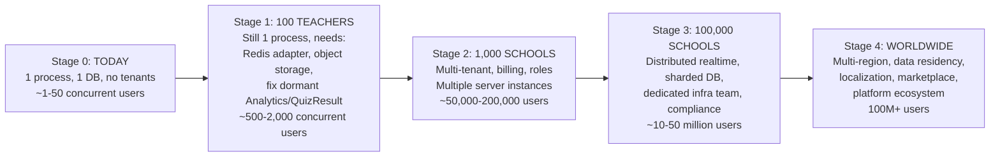
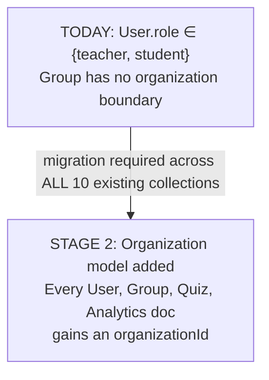
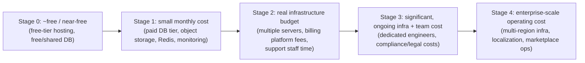

# ClassVibe — SAAS_EVOLUTION.md

**How ClassVibe grows: Today → 100 Teachers → 1,000 Schools → 100,000 Schools → Worldwide.**

This document maps the concrete technical, organizational, and business changes required at each growth stage, grounded in the actual current codebase (see `SYSTEM_ARCHITECTURE.md`, `DATABASE_BIBLE.md`) — not a generic SaaS playbook. Every "what breaks" claim below ties back to a specific limitation already documented elsewhere in this repo's documentation set.

---

## Table of Contents

1. The Growth Curve at a Glance
2. Stage 0 — Today (single-classroom MVP)
3. Stage 1 — ~100 Teachers (early adoption / pilot)
4. Stage 2 — ~1,000 Schools (multi-tenant SaaS)
5. Stage 3 — ~100,000 Schools (national/enterprise scale)
6. Stage 4 — Worldwide (global platform)
7. Cross-Stage Migration Checklist
8. Cost Curve (qualitative)
9. What Never Has to Change

---

# 1. The Growth Curve at a Glance

Each stage is roughly a **10–100x jump in concurrent load**, and each jump breaks a different, specific layer of the current architecture — not everything breaks at once. This is good news: the team doesn't need to build for Stage 4 today, but it does need to know exactly which wall it will hit first.

---

# 2. Stage 0 — Today (single-classroom MVP)

**What exists right now** (see `SYSTEM_ARCHITECTURE.md` for full detail):
- 1 Node.js process running Express + Socket.IO together.
- 1 MongoDB database (assumed Atlas free/shared tier, based on env var naming).
- Local disk file storage, no CDN.
- No organization/tenant concept — every teacher and student is a flat row in one `User` collection.
- No billing, no plans, free to use.
- No CI/CD, manual deploys.

**Ceiling**: comfortably handles one classroom, or a handful of classrooms run by the same small group of teachers, at a time. The known blockers (in-memory quiz timers, no Redis adapter, unpopulated Analytics) don't matter yet because there's only ever one server instance and load is low.

**What to fix even before Stage 1** (these are correctness/trust fixes, not scale fixes):
- Wire up `QuizResult`/`Analytics` (currently every student shows "Needs Attention" regardless of real behavior — see `DATABASE_BIBLE.md` §11).
- Fix the `multiple_select` quiz-scoring bug.
- Fix the self-service teacher role-escalation gap (`MASTER_PROJECT_REPORT.md` §14).
- Add basic rate limiting to login/AI-generation endpoints.

---

# 3. Stage 1 — ~100 Teachers (early adoption / pilot)

**Trigger for this stage**: a handful of schools or an ed-tech accelerator/pilot program brings on ~100 teachers, each running their own classes, largely independently (not yet organized under "schools" as billing entities).

**What breaks first**: still just **one server process** — at 100 teachers with overlapping class times, concurrent Socket.IO connections and concurrent live quizzes start to matter. Two specific existing limitations become visible:
1. **In-memory quiz timers** (`activeQuizTimers` Map) — if the single server process ever restarts (a deploy, a crash, or Render's free-tier auto-sleep) while multiple quizzes are running across different teachers, *all of them* freeze at once instead of just one.
2. **Local disk file storage** — with more teachers uploading files/images, disk space on a single small server becomes a real constraint, and there's still no access control on uploaded files (anyone with a URL can view them).

**What to add**:
- **Object storage** (e.g., S3-compatible) for uploads, replacing local disk — this also is the natural point to finally add access control to file URLs.
- **A Redis instance** — even before you need multiple server processes, Redis pays for itself here by (a) persisting quiz-timer state so a restart doesn't freeze every live quiz, and (b) giving you a place to put rate-limiting counters.
- **A proper background-job runner** (or a managed cron feature from your host) replacing the in-process `setInterval` reminder job, so job execution doesn't compete with web traffic on the same event loop.
- **Basic operational tooling**: real logging (not just `console.log`), an uptime/error monitor (e.g., a free tier of Sentry), so when something breaks among 100 teachers you find out before they email you.
- **A real, upgraded MongoDB tier** — Atlas's free/shared tier has hard limits (connection count, storage size, no dedicated resources); 100 active teachers is usually the point where you outgrow it (see Section 8 for a plain-language explanation of this specific question).

**What does NOT need to change yet**: still no multi-tenant `Organization` model required — 100 independent teachers can still each just be a `User` with `role:'teacher'`, same as today. Still no billing required if this stage is a free pilot.

---

# 4. Stage 2 — ~1,000 Schools (multi-tenant SaaS)

**Trigger for this stage**: you're now selling to *schools*, not individual teachers — a school administrator wants to manage multiple teachers, see aggregate reporting, and pay one invoice for the whole school rather than each teacher signing up separately.

**What breaks**: everything that assumes a flat, single-tenant `User`/`Group` model.

**What to add**:
- **`Organization` model** (schools/districts) — see `DATABASE_BIBLE.md` §17 for the proposed schema. Every existing collection needs an `organizationId` field added and every query needs an organization-scoping clause — this is the single biggest one-time migration in the whole roadmap.
- **Billing** (Stripe or similar) — plan tiers, seat limits, invoicing. This is also the natural point to finally put a **cap on AI-generation usage per organization**, since Groq API calls cost real money per request and today are completely uncapped per user.
- **Roles beyond teacher/student** — `school_admin` (manages the school's teachers/seats), `department_head`.
- **Multiple server instances behind a load balancer** — at 1,000 schools you genuinely need more than one server process for both capacity and reliability. This *requires* the Redis adapter for Socket.IO added in Stage 1 to actually work correctly (otherwise a teacher and their students landing on different server instances would never see each other's live chat/quiz events).
- **A real support/ops process** — at this scale, someone needs to be watching dashboards and responding to incidents; this is no longer "the developer notices something's wrong and fixes it."
- **Basic security hardening that becomes non-optional at this scale**: rate limiting (if it wasn't already added), audit logging (who did what, especially for account/billing actions), and — directly answering your question 1 below — this is realistically the stage where you'd add extra login protection, discussed in Section "the plain-language answers" further down.

---

# 5. Stage 3 — ~100,000 Schools (national/enterprise scale)

**Trigger**: national rollout, government/ministry-of-education partnerships, or a major country-wide ed-tech distribution deal.

**What breaks**: the assumption that "a few server instances behind a load balancer" is enough, and the assumption that one MongoDB database can hold everyone's data with acceptable performance.

**What to add**:
- **Database sharding or read-replica architecture** — one MongoDB instance, however large, eventually can't serve reads/writes fast enough for tens of millions of documents across analytics/quiz-history/chat collections; data needs to be partitioned (commonly by `organizationId`) across multiple database shards.
- **A dedicated realtime infrastructure** — at this scale, "Socket.IO + Redis adapter" is still workable but increasingly benefits from being its own dedicated service/cluster, separate from the API servers, so a spike in quiz traffic doesn't degrade regular API response times.
- **A dedicated platform/infrastructure engineering team** — this is no longer a side-project scale; you need people whose full-time job is keeping this running (SRE/DevOps roles), not a single generalist developer.
- **Compliance work**: at national scale, especially for K-12 education, you will run into requirements like COPPA/FERPA (US), GDPR (EU), or local equivalents (student data privacy laws vary a lot by country) — this typically requires a formal data-processing agreement, an actual privacy policy (the current app's Footer links to one that isn't confirmed to exist as a real page), and often a data-residency story (see Stage 4).
- **Formal CI/CD and staging environments** — at this scale you cannot deploy by pushing straight to production; you need automated tests, a staging environment that mirrors production, and a gated release process.

---

# 6. Stage 4 — Worldwide (global platform)

**Trigger**: expansion beyond one country/region — different languages, different data-residency laws, different school-system structures.

**What to add**:
- **Multi-region deployment** — servers and databases physically located in multiple regions (e.g., US, EU, Asia) both for latency (a student in India shouldn't have their quiz timer lag because the server is in the US) and for **data residency law compliance** (many countries require certain citizen/student data to stay within that country's borders).
- **Localization/internationalization** — the current UI has zero i18n infrastructure (all text is hardcoded English strings); this becomes a real product requirement at global scale.
- **A marketplace/ecosystem layer** — once you have this many schools, third-party content creators (curriculum publishers, individual teachers) may want to sell/share quiz templates — this is the point where the already-reserved-but-unused `Quiz.source:'template'` field (see `DATABASE_BIBLE.md` §17.5) would actually get built out into a real marketplace.
- **Enterprise features**: single sign-on (SSO) integration for large school districts' existing identity systems, white-labeling for large customers, dedicated account management.

---

# 7. Cross-Stage Migration Checklist

| Item | Needed by Stage |
|---|---|
| Object storage for uploads | 1 |
| Redis (timers, rate limits, caching) | 1 |
| Fix Analytics/QuizResult write-path | 1 (should really be Stage 0) |
| Real background-job runner | 1 |
| Basic monitoring/alerting | 1 |
| `Organization` model + billing | 2 |
| Multiple server instances + load balancer | 2 |
| Extended roles (`school_admin`, etc.) | 2 |
| Rate limiting, audit logs, stronger login security | 2 |
| Database sharding/read replicas | 3 |
| Dedicated realtime infrastructure | 3 |
| Dedicated infra/SRE team | 3 |
| Compliance program (COPPA/FERPA/GDPR-equivalent) | 3 |
| Formal CI/CD + staging | 3 |
| Multi-region deployment | 4 |
| Localization/i18n | 4 |
| Marketplace | 4 |
| SSO / enterprise features | 4 |

---

# 8. Cost Curve (qualitative — no exact numbers, since actual pricing depends on providers chosen)

The cost curve is **not linear with user count** — each stage transition (especially 0→1 and 1→2) tends to be a step-change because you're adding entire new categories of cost (a paid database tier, a billing platform's percentage fee, a first full-time hire) rather than just "a bit more server."

---

# 9. What Never Has to Change

Reassuring note, since a lot of this document is about what breaks: the **core product idea and most of the current code do not need to be thrown away** at any stage.
- The PIN/QR-join model, the chat system, and the live-quiz engine's fundamental design are all sound and scale conceptually fine — they just need the infrastructure underneath them (Redis, object storage, multi-tenancy) upgraded, not rewritten.
- The database schema is well-designed at the field/relationship level (see `DATABASE_BIBLE.md`) — the growth stages mostly add new collections and new scoping fields, they don't require redesigning the existing ones.
- React + Express + MongoDB + Socket.IO remain reasonable technology choices even at very large scale (all four are used by major, large-scale products) — no framework needs to be abandoned because of growth alone.

---

*End of SAAS_EVOLUTION.md. For AI-specific roadmap and provider-swap architecture, see `AI_ROADMAP.md`. For the underlying technical detail behind every "what breaks" claim, see `SYSTEM_ARCHITECTURE.md` and `DATABASE_BIBLE.md`.*
