# ClassVibe — SYSTEM_ARCHITECTURE.md

**Architecture-only reference.** This document deliberately excludes feature walkthroughs, UI/UX detail, and per-field database schema (see `UI_UX_ARCHITECTURE.md` and `DATABASE_BIBLE.md` for those). Everything here is about *how the system is put together*: layers, boundaries, data flow at the architectural level, coupling, scaling limits, and the architectural decisions (explicit or accidental) embedded in the code.

Every claim is grounded in the actual repository at `C:\ClassVibe` as of 2026-07-05. Where the architecture is inconsistent, duplicated, or incomplete, this document says so — an architecture document that hides the real shape of the system is worse than useless to the team that inherits it.

---

## Table of Contents

1. Architectural Style & Guiding Constraints
2. System Topology
3. Process & Runtime Model
4. Frontend Architecture
5. Backend Architecture
6. Realtime (Socket.IO) Architecture
7. Data Architecture (structural view)
8. AI/ML Integration Architecture
9. File Storage Architecture
10. Authentication & Authorization Architecture
11. Notification Architecture
12. Scheduling / Background Job Architecture
13. Cross-Cutting Concerns (error handling, logging, validation, rate limiting)
14. Deployment Architecture
15. Scaling Architecture & Hard Limits
16. Security Architecture
17. Observability Architecture
18. Coupling & Dependency Analysis
19. Architecture Decision Records (reconstructed from evidence)
20. Anti-Pattern Catalog
21. Target Future Architecture
22. Appendix: Full Middleware & Router Registration Order

---

# 1. Architectural Style & Guiding Constraints

## 1.1 Style
ClassVibe is a **monolithic client-server application with an embedded realtime layer**:
- One Express process serves REST + Socket.IO from the same Node runtime, sharing the same MongoDB connection pool and the same in-process memory space.
- One React single-page application (no server-side rendering, no static-site generation) consumes both the REST API and the Socket.IO connection.
- There is no service boundary, no API gateway, no message broker, no separate realtime service, and no background-worker process distinct from the web process itself (the one "job," `sessionReminder.js`, runs as a `setInterval` inside the same process that serves HTTP requests).

This is a **reasonable, conventional architecture for an MVP at classroom scale** — the problems documented below are not "monolith is wrong," they are specific implementation gaps (missing Redis adapter, in-memory-only quiz timers, duplicated auth logic) layered on top of an otherwise sound choice of style.

## 1.2 Guiding constraints actually observed in the code (not stated anywhere, but inferable)
- **Zero-friction join** was clearly prioritized over strict access control: PIN/QR/guest-auth all exist specifically to minimize account-creation friction for students. This constraint shapes almost every other architectural decision (e.g., why `User` documents can be created with no password, why JWTs are issued to anonymous guests, why `optionalAuth` exists as a distinct middleware tier).
- **Free-tier hosting economics** visibly shaped the architecture: the Render.com cold-start handling (`pingBackend()` warmup, 12-second retry-with-backoff logic duplicated in two login components) is a first-class architectural concern baked directly into the frontend, not an edge case.
- **Solo-developer velocity** over long-term maintainability: the near-total absence of shared abstractions (5 copies of JWT middleware, 2 independent poll systems, 2 independent quiz-hosting UIs) is consistent with rapid, sequential feature-by-feature development without refactoring passes.

## 1.3 What this system is *not*
- Not a microservices architecture (single deployable backend unit).
- Not an event-sourced system (state is mutated in place; no event log/audit trail beyond ad hoc `unauthorizedAttempts` arrays).
- Not multi-tenant (Section 21 of `MASTER_PROJECT_REPORT.md` and Section 21 below cover the gap).
- Not horizontally scalable in its current form (Section 15).

---

# 2. System Topology

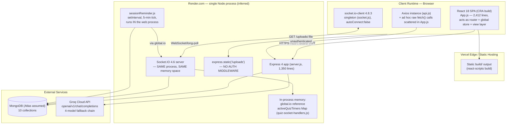

## 2.1 Physical deployment units
| Unit | Where | Confirmed by |
|---|---|---|
| Frontend static bundle | Vercel (`frontend/.vercel/project.json`, `projectName: "classvibe"`) | Committed Vercel project link; `@vercel/static-build` config with `distDir: "build"` |
| Backend Node process | Assumed Render.com | No `render.yaml`/Dockerfile/Procfile exists in-repo; inferred entirely from the hardcoded fallback URL `https://classvibe-backend.onrender.com` repeated in `api.js`, `socket.js`, `ChatArea.js`, `QuizControlPanel.jsx` |
| Database | Assumed MongoDB Atlas | `MONGODB_URI` env var name is the only evidence; no connection-string host is visible in the checked-in `.env` (values are secrets, not printed in this document) |
| AI provider | Groq Cloud | `aiQuizGenerator.js` hits `https://api.groq.com/openai/v1/chat/completions` directly |

## 2.2 What's conspicuously absent from the topology
- No CDN configuration beyond whatever Vercel provides by default for static assets.
- No reverse proxy / API gateway layer (Express receives requests directly).
- No message queue / event bus (all cross-cutting effects — e.g., "group created → notify past students" — happen synchronously, inline, in the same request that created the group).
- No dedicated cache layer (no Redis, no in-memory LRU) anywhere in the stack.
- No container orchestration evidence (no Dockerfile, no `docker-compose.yml`, no Kubernetes manifests).
- No CI/CD pipeline (no `.github/workflows`, no other CI config file of any kind).

---

# 3. Process & Runtime Model

## 3.1 The backend is a single Node.js event-loop process
Everything — REST request handling, Socket.IO connection handling, the session-reminder timer loop, and all in-memory quiz-timer state — executes on **one event loop, in one process**. Concretely:

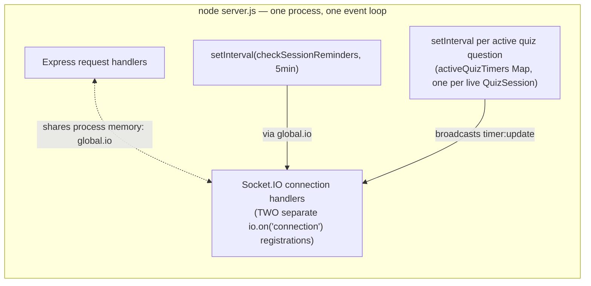

Consequences of this design:
- **A CPU-heavy request (e.g., a slow Mongoose aggregation in `analytics.js`) blocks the event loop for every concurrent socket connection** — there is no worker-thread offload anywhere in the codebase.
- **A process crash or restart destroys every piece of in-memory state at once**: all active Socket.IO connections drop, and — critically — the `activeQuizTimers` Map (holding live `setInterval` handles for every in-progress quiz question) is wiped with no persistence and no recovery sweep on boot. Every quiz that was mid-question at the moment of restart is permanently stuck (`QuizSession.status` remains `'active'` in Mongo forever, with no running timer and no way to auto-advance).
- **Session-reminder ticks and quiz-timer ticks compete for the same event loop** as regular HTTP/socket traffic — at current classroom scale this is a non-issue, but it is a structural single point of contention that would need addressing before any significant scale-up.

## 3.2 Startup sequence (as literally written in `server.js`)
```mermaid
sequenceDiagram
    participant Node
    participant Express
    participant Mongo
    participant SocketIO

    Node->>Express: dotenv.config()
    Node->>Express: build corsHandler, register CORS + preflight
    Node->>SocketIO: new Server(server, {cors, transports})
    Express->>Express: app.set('io', io); global.io = io
    Express->>Express: register GET /health (before body parsers!)
    Express->>Express: express.json() / urlencoded()
    Express->>Express: mount /api/quiz, /api/analytics, /api/notifications
    Express->>Express: conditionally startSessionReminderJob()
    Express->>SocketIO: io.on('connection') #1 — quiz handlers only
    Express->>Express: process.on('SIGTERM') registered (1st of 2 times)
    Express->>Express: request-logging middleware (only covers routes AFTER this point)
    Express->>Express: bootstrap uploads dir + express.static('/uploads') — no auth
    Express->>Express: configure generic multer (/api/upload)
    Express->>Mongo: connectDB() — NOT awaited at call site
    Express->>Express: ~20 inline routes (auth/groups/messages/upload)
    Express->>Express: multer error-handling middleware
    Express->>Express: mount /api/schedule (much later than the other 3 routers)
    Express->>Express: more inline group/message routes
    Express->>SocketIO: io.on('connection') #2 — chat/presence handlers
    Express->>Node: server.listen(PORT, "0.0.0.0")
    Express->>Express: process.on('SIGTERM') registered again (2nd time — BOTH fire)
```

This sequence itself is architecturally significant: **`connectDB()` is fired but not awaited**, meaning `server.listen()` can complete and start accepting traffic before the MongoDB connection is actually established — any request arriving in that narrow startup window would hit Mongoose's default buffering behavior (which queues operations until connected, generally masking the race in practice, but it is not an explicit "wait for DB before serving traffic" design).

## 3.3 Shutdown sequence
`SIGTERM` is registered **twice** (`server.js` line ~131 and again near line ~1337) — both handlers fire on shutdown, since Node allows multiple listeners per signal. The second, fuller handler calls `server.close()` and stops the reminder job's `setInterval`. **Neither handler calls `cleanupQuizTimers()`** (a function that exists in `quiz-socket-handlers.js`, is imported into `server.js`, but is never invoked) — meaning any live quiz `setInterval` handles are simply killed by process exit rather than cleanly torn down. This is functionally harmless (the process is exiting anyway) but reflects the same "the intended integration exists, the wiring was never finished" pattern that recurs throughout the codebase (Section 20 below, and Section 19 of `MASTER_PROJECT_REPORT.md`).

---

# 4. Frontend Architecture

## 4.1 Build & tooling architecture
- **Create React App (`react-scripts` 5.0.1)** — a conventional, unmodified CRA setup (no `craco`/`react-app-rewired` ejection found, no custom webpack config). This means the project inherits CRA's default code-splitting behavior (route-based lazy loading), except **the app never uses `React.lazy`/`Suspense` anywhere**, so in practice the entire app — including the 1,841-line `QuizCreator.jsx` — ships in one initial bundle regardless of whether a given user ever opens the quiz-creation UI.
- **No TypeScript** — the entire frontend is plain JavaScript/JSX with no static type-checking layer.
- **No CSS-in-JS library, no CSS Modules, no Tailwind** — styling is either (a) inline `style={{}}` objects computed per-render, or (b) legacy standalone `.css` files for the three pre-auth pages (`Home.css`, `TeacherLogin.css`, `StudentJoin.css`) and `App.css`.

## 4.2 Application-shell architecture (the "no-router router")
`react-router-dom` 6.22.3 is a declared dependency and is **never imported anywhere in `frontend/src`**. In its place, `App.js` implements a hand-rolled, state-driven view-swap architecture:

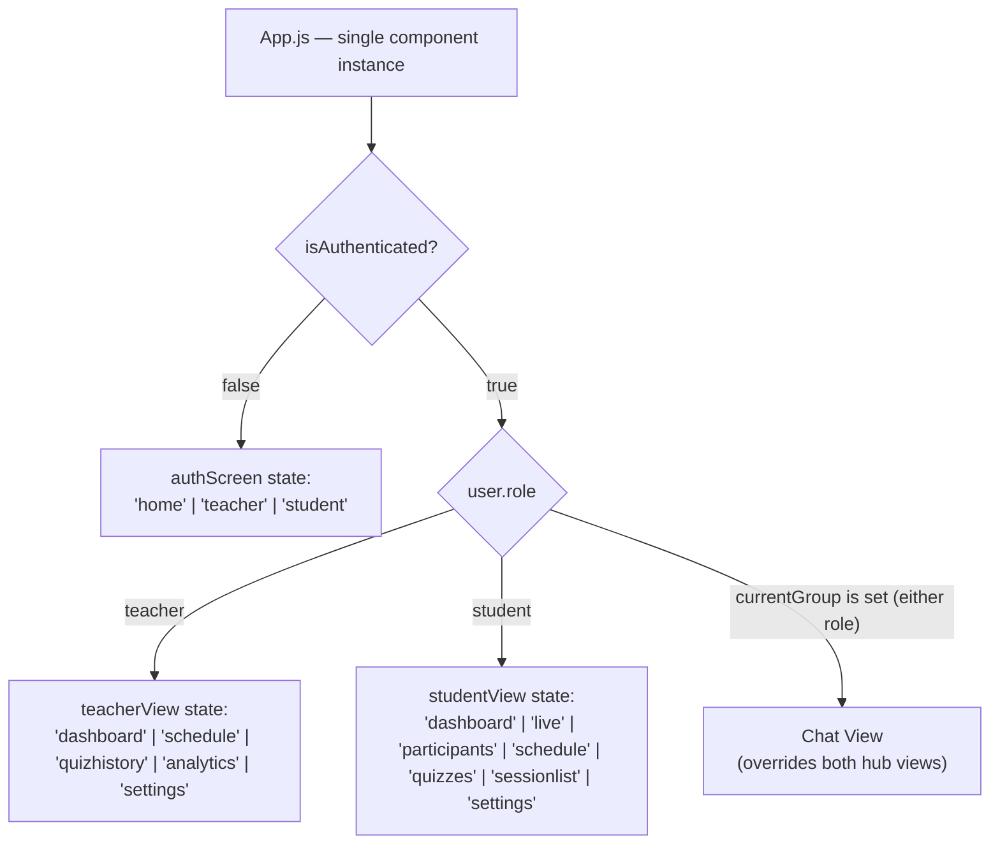

**Architectural consequence**: there is no URL that identifies any of these states. `window.location` is never touched (except reading `?pin=` once, on initial mount, for deep-linking into the student-join screen). A browser refresh always re-derives `isAuthenticated`/`user` from `localStorage` and drops back to whatever the *default* value of `teacherView`/`studentView`/`authScreen` is — in-app navigation position is not preserved across a reload. This also means: no shareable deep links to a specific dashboard tab, no browser back-button support, no server-side route-based code-splitting.

## 4.3 State management architecture
**No Context API, no Redux/Zustand/Recoil, no custom global store.** All application state — auth, current group, chat messages, quiz session, scheduled sessions, every modal's visibility flag — lives as `useState` inside the single `App.js` component (roughly 25+ distinct pieces of state enumerated in `MASTER_PROJECT_REPORT.md` Section 5) and is passed down via props. A few `useRef`s exist specifically to avoid stale-closure bugs in socket-event callbacks (`currentGroupRef`, `selectGroupRef`) — a common workaround pattern when a large component's effects need to reference "the latest" version of state/functions without re-subscribing socket listeners on every state change.

**Cross-component signaling escape hatch**: three custom `window` `CustomEvent`s (`openWaitingRoom`, `startQuiz`, `joinSession`) are dispatched from deeply-nested components (chat message click handlers, notification-center item clicks) and consumed via `window.addEventListener` in `App.js`. This exists specifically because there is no Context/global-store mechanism for a deeply nested component to trigger a change in top-level state without either prop-drilling a callback down many levels or reaching outside React entirely — the team chose the latter.

## 4.4 Component architecture layers
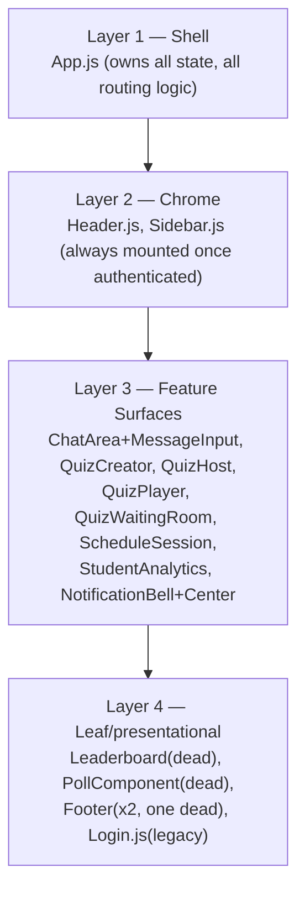

There is no formal "container vs. presentational component" split, no custom hooks abstraction layer (no `hooks/` directory exists), and no shared component library (`components/` is a flat directory of 20 files with no sub-grouping by feature).

## 4.5 API access architecture
Two parallel, inconsistent access patterns coexist:
1. **`api.js`** — a single Axios instance with request/response interceptors (auto-attach Bearer token, auto-logout on 401/403). Hardcodes its base URL to the production backend, ignoring `process.env.REACT_APP_API_URL` (an inconsistency relative to `socket.js`, which does read the env var correctly).
2. **Raw `fetch()` calls scattered directly inside `App.js`** — used for roughly 6+ call sites that duplicate logic already exported (unused) from `api.js`, each independently re-reading `localStorage.getItem('token')` and re-computing the same `process.env.REACT_APP_API_URL || 'https://classvibe-backend.onrender.com'` fallback expression.

This split is not principled (e.g., "reads go through api.js, writes go through fetch") — it is simply incremental accretion, with `api.js` functions written early and then bypassed later as `App.js` grew.

## 4.6 Realtime access architecture (frontend side)
A single Socket.IO client instance (`socket.js`) is exported and imported by name across the app (`App.js`, `Login.js`, `TeacherLogin.jsx`, and every quiz/chat component that needs live events) — there is exactly one WebSocket connection per browser tab, shared by every feature. `autoConnect: false` — the connection is deliberately deferred until an explicit `socket.connect()` call (post-login, post-guest-join, or on session restore), immediately followed by `socket.emit('authenticate', token)`.

---

# 5. Backend Architecture

## 5.1 Layering as designed vs. layering as actually executed

The repository's folder structure *implies* a layered architecture:

```
routes/  →  controllers/  →  models/
              ↑
         middleware/
```

**This layering is real for exactly one subsystem (auth's canonical middleware) and is otherwise bypassed everywhere else.** The actual, executed architecture looks like this:

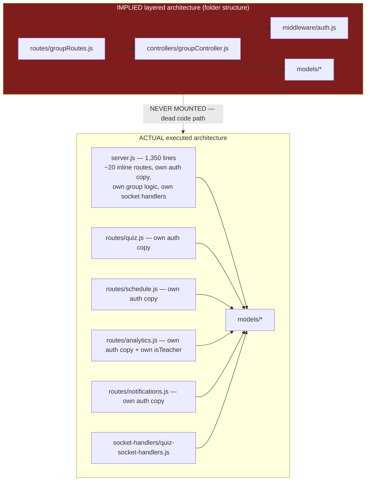

**This is the single most important architectural fact about the backend**: the "clean" layered path (`groupRoutes.js` → `groupController.js` → `middleware/auth.js`) that the folder structure suggests is the intended architecture is entirely dead code — never `require`d, never `app.use`'d, and would throw immediately if resurrected (most of `groupController.js`'s referenced functions don't exist in the file; `middleware/auth.js`'s consumers don't exist either). The architecture that actually runs in production is monolithic-inline: `server.js` plus four route files, each independently re-implementing the same authentication middleware.

## 5.2 Backend module map

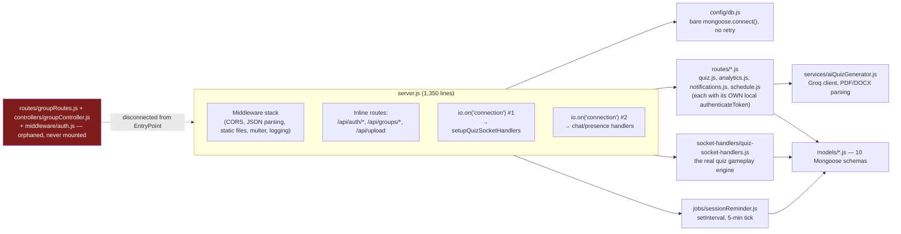

## 5.3 Middleware pipeline architecture
See Section 22 (Appendix) for the exact line-by-line registration order. Architecturally significant properties of this pipeline:
- **CORS is evaluated per-request via a custom predicate function** (`isAllowedOrigin`), not a static allow-list — this is more flexible (supports arbitrary LAN IPs for dev) but also means CORS policy is imperative code rather than declarative configuration, harder to audit at a glance.
- **The request-logging middleware is positioned after several routers are already mounted**, meaning it structurally cannot observe traffic to `/api/quiz`, `/api/analytics`, or `/api/notifications` — an ordering bug baked into the pipeline itself, not a one-off oversight.
- **Static file serving (`/uploads`) has no middleware in front of it at all** — it is the only "route" in the entire application with zero authentication or authorization gate.
- **Two separate Multer instances exist** (generic uploader in `server.js`, quiz-file uploader in `routes/quiz.js`) with different storage directories, different filename schemes, different allowed-type lists, and different lifecycle (generic uploads persist forever; quiz-source files are always deleted after processing) — architecturally, file-upload handling is not a shared service, it is reimplemented per use case.

## 5.4 Service layer
Only one true "service" module exists: `services/aiQuizGenerator.js`. It encapsulates the Groq API client, the model-fallback probing strategy, PDF/DOCX/TXT text extraction, and LLM-output validation/normalization. Architecturally this is the **one part of the backend that follows conventional service-layer separation** — routes call into it, it has no direct dependency on Express request/response objects, and it's independently testable in principle (though no tests exist for it in practice).

## 5.5 Controller layer
Functionally does not exist in the live system. `groupController.js` is the only file in `controllers/`, and it is dead code (Section 5.1). Every other "controller"-shaped responsibility (validating input, orchestrating model calls, shaping the response) is inlined directly into route handler functions across `server.js` and the four route files.

---

# 6. Realtime (Socket.IO) Architecture

## 6.1 Connection & room architecture

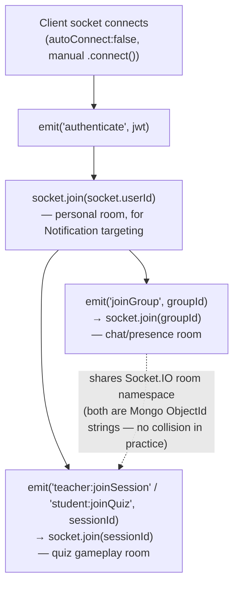

Three room families exist, all keyed by MongoDB ObjectId strings, all sharing Socket.IO's single flat room namespace (Socket.IO does not scope rooms per "family" — a `groupId` and a `sessionId` room are indistinguishable from the framework's perspective except by the string value used).

## 6.2 Handler registration architecture (a structural smell)
`server.js` registers **two separate `io.on('connection', ...)` blocks** — one thin one (near the top of the file) that exists solely to call `setupQuizSocketHandlers(io, socket)`, and one large one (near the bottom, ~850 lines later) containing all chat/presence/auth socket events. Both fire for every connecting socket, because Socket.IO permits multiple listeners on the same event. This works correctly today, but it means:
- The full picture of "what happens when a socket connects" cannot be read top-to-bottom in one place — it's split across two locations roughly 850 lines apart in the same file.
- Any future third socket subsystem would likely repeat this pattern rather than consolidate into one connection handler, compounding the fragmentation.

## 6.3 Event-driven architecture map

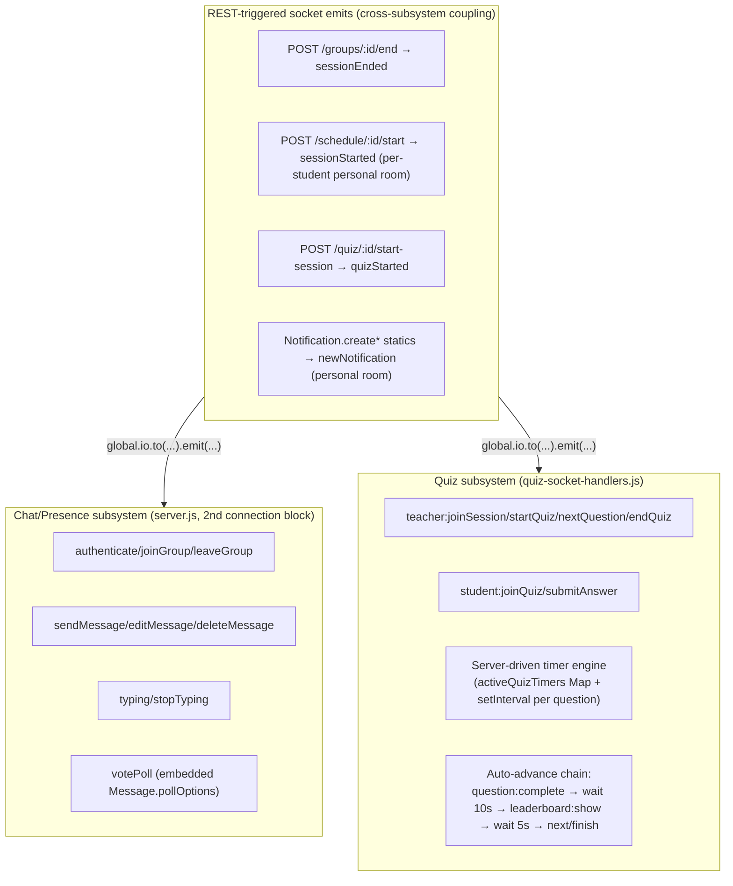

**Architectural note on `RestTriggered`**: this is the one place where REST (stateless, request/response) and Socket.IO (stateful, connection-oriented) are directly coupled — an Express route handler reaches into the global `io` reference to push a realtime event. This pattern only works because everything is one process; it is also the single largest reason horizontal scaling requires a Redis adapter (Section 15) rather than being a drop-in change.

## 6.4 In-memory state inventory (the parts that don't survive a restart)
| State | Location | Lifetime | Recovery on restart |
|---|---|---|---|
| `activeQuizTimers` (Map: sessionId → {interval, timeRemaining, questionIndex}) | `quiz-socket-handlers.js`, module scope | Life of the process | ❌ None — every in-progress quiz question freezes permanently until a teacher manually clicks Next/End |
| `global.io` reference | `server.js` | Life of the process | N/A — recreated on boot, but any REST handler mid-flight during a restart loses its reference |
| Socket.IO's own internal room membership | Socket.IO library internals | Per-connection | Rebuilt automatically as clients reconnect and re-run `authenticate`/`joinGroup`/`joinSession` — **except** clients do not automatically re-run `joinGroup`/`joinSession` on a bare reconnect (only on component remount), so this recovery is partial in practice |

## 6.5 Reconnection architecture
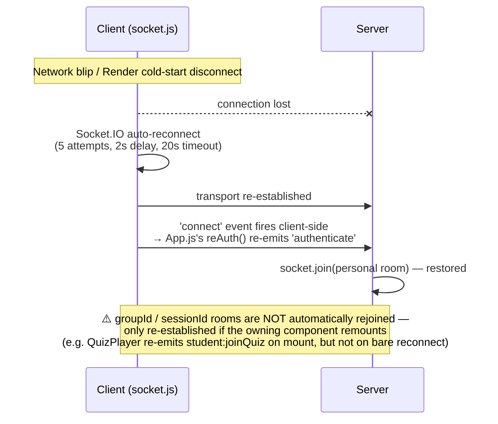

This is a partial, not full, reconnection architecture — the personal-notification-room path is robust; the chat/quiz room paths are not.

---

# 7. Data Architecture (structural view)

(Full per-field schema detail lives in `DATABASE_BIBLE.md`. This section covers only the *structural* role each collection plays in the architecture.)

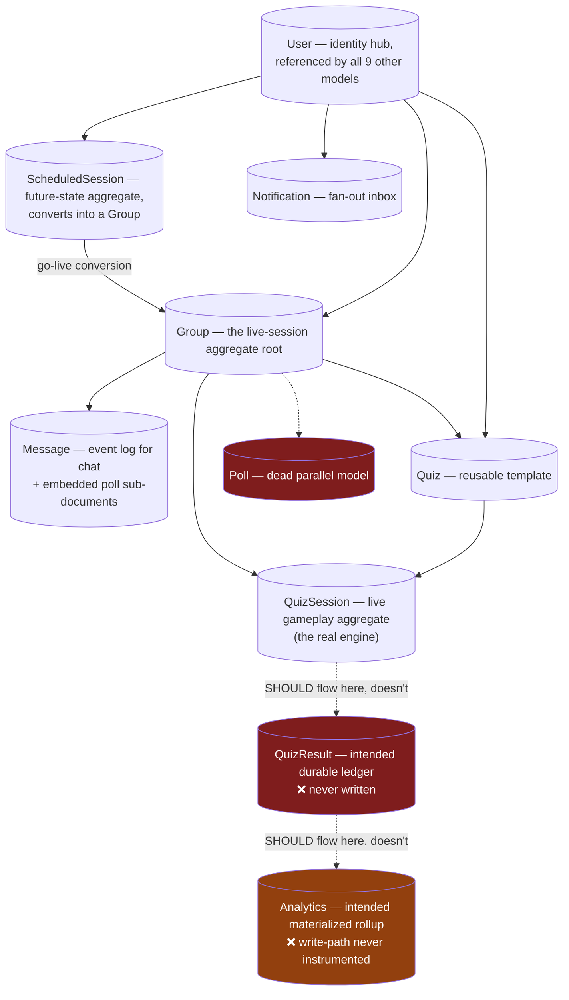

## 7.1 Aggregate-root analysis
In DDD terms (applied loosely, since the codebase itself has no domain-driven design vocabulary), the natural aggregate roots are:
- **`User`** — identity; referenced everywhere, never itself contains other aggregates.
- **`Group`** — the "live session" aggregate; owns `members[]`/`onlineUsers[]` as embedded references (not embedded documents) to `User`.
- **`QuizSession`** — the "live game" aggregate; genuinely embeds its child entities (`participants[].answers[]`) as true sub-documents rather than separate collections — this is the one place in the schema where embedding (vs. referencing) was chosen deliberately and it works well for the access pattern (always read/write the whole session at once during gameplay).
- **`ScheduledSession`** — the "planned session" aggregate; embeds `allowedStudents[]`/`registeredStudents[]`/`unauthorizedAttempts[]` as sub-documents.

## 7.2 Denormalization points
- `ScheduledSession.allowedEmails[]` is a denormalized projection of `allowedStudents[].email`, manually kept in sync by application code on every create/update — a classic denormalization-consistency risk (nothing prevents these two arrays from drifting apart if a future code path updates one without the other).
- `QuizSession.sessionSettings` is a **deliberate, correct** denormalization: a snapshot copy of `Quiz.settings` taken at session-creation time, specifically so that editing the `Quiz` template later does not retroactively alter an already-running session. This is the one clear example of intentional, well-reasoned denormalization in the schema.

## 7.3 Read/write pattern architecture
- **Chat** (`Message`): high write frequency (every message), read via a single bounded query (`limit(100)`, no pagination) — a "recent window" access pattern with no support for historical paging.
- **Analytics**: read-heavy in *design intent* (dashboards), but every read route also *writes* (recalculates and saves the document) — an unusual "read-triggers-write" pattern that makes these endpoints non-idempotent from a caching perspective, and which is moot in practice since the underlying counters are never fed real data (see `DATABASE_BIBLE.md`).
- **QuizSession**: write-heavy during gameplay (every answer submission triggers a full document save), read-heavy afterward (history views) — a single collection serving two very different access patterns without any read-model/write-model separation (no CQRS).

---

# 8. AI/ML Integration Architecture

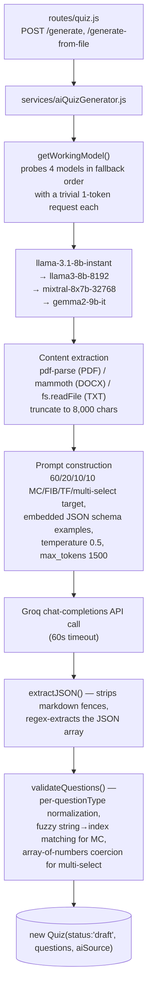

## 8.1 Architectural properties of this integration
- **Every single generation request costs at least 2 Groq API calls** (one liveness probe + one real generation), and up to 5 if earlier models in the fallback chain are unavailable — this is a deliberate reliability-over-cost tradeoff, but it is not configurable (no flag to skip probing and just try the primary model with a shorter timeout-and-retry instead).
- **No caching layer** — identical topics generate a fresh LLM call every time; no memoization of recent generations exists.
- **No rate limiting or per-user quota** at the Express layer — the AI-generation cost surface is fully uncapped per authenticated teacher (and, via the dead-but-dangerously-close-to-live `quiz-test.js` route, was at one point reachable with no auth at all).
- **Two unimplemented integration stubs already reserved in the architecture**: `generateFromYouTube`/`generateFromWebsite` exist as named methods on the service that immediately throw — the frontend UI for URL-based generation is fully built against an endpoint (`/generate-from-url`) that was never added to `routes/quiz.js`, making this a complete, coherent, but entirely non-functional vertical slice of the architecture.
- **Fragile parsing boundary**: `extractJSON()` relies on string manipulation (strip code fences, regex-extract the first `[...]`/`{...}`) rather than the LLM provider's structured-output/function-calling mode — the architecture has no schema-enforcement guarantee from the model side, only post-hoc validation on the response.

---

# 9. File Storage Architecture

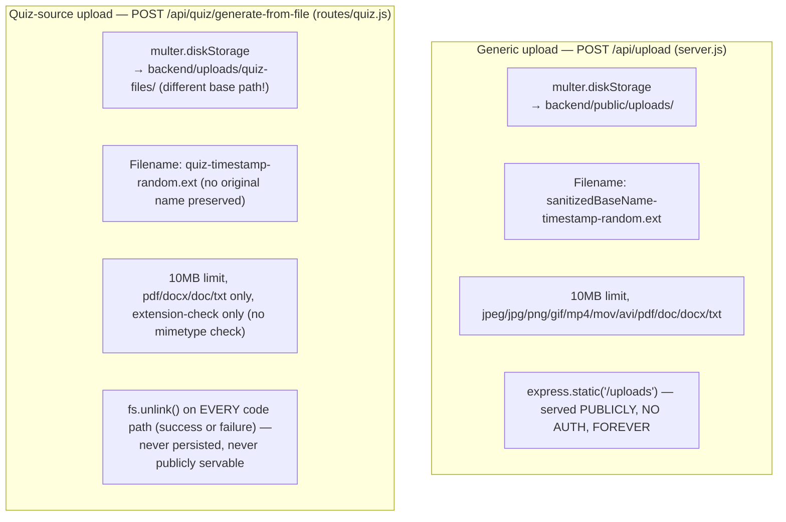

Architecturally, file storage is **not a shared service** — it is two independently-implemented Multer configurations with different destination directories, different filename schemes, different validation rules, and diametrically opposite persistence/access-control postures (one persists forever and is public; the other is always deleted and never exposed). There is no object-storage integration (no S3/GCS/Azure Blob) anywhere — all files live on the same local disk as the Node process, which is itself an architectural constraint worth flagging: **any horizontal scaling of the backend (Section 15) would immediately break file access for uploads that landed on a different instance's disk**, since there is no shared/networked file store.

---

# 10. Authentication & Authorization Architecture

## 10.1 The five-implementation problem

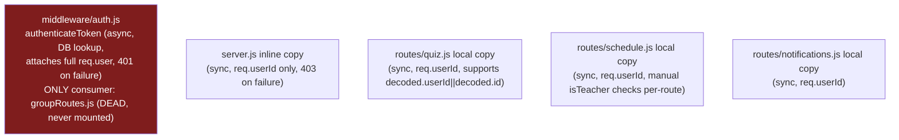

The architecturally "correct" version (async, real DB lookup verifying the user still exists, full `req.user` object) is the one version nothing in production actually uses. Every live code path uses a leaner, synchronous, DB-lookup-free copy that trusts the JWT payload alone (meaning a token for a since-deleted user would still pass auth in every live route, since none of them re-verify existence — only the dead canonical version does that check).

## 10.2 Authorization model
There is no RBAC/ABAC framework — authorization is a flat `role` string (`teacher|student|admin`) checked ad hoc, per-route, via one of two patterns:
1. **Ownership checks** (`group.isAdmin(userId)`, `quiz.creator.toString() === userId`, `session.host.toString() === userId`) — consistently applied and generally correct.
2. **Role checks** (`role !== 'teacher'` → 403) — re-implemented independently in `analytics.js` (dedicated `isTeacher` middleware), `schedule.js` (manual inline check per route), `quiz.js` (manual inline check per route) — three separate implementations of the same concept, none sharing code with each other or with the dead canonical `isTeacher` in `middleware/auth.js`.

## 10.3 Trust boundary map

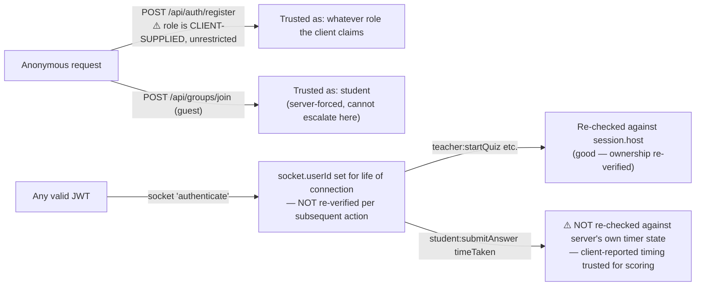

The architecture is **inconsistent about what it re-verifies and what it trusts once established**: quiz *host* identity is correctly re-checked against the database on every privileged action; quiz *timing* (used for scoring) is not cross-checked at all, despite the server having its own authoritative timer state (`activeQuizTimers`) sitting right there.

---

# 11. Notification Architecture

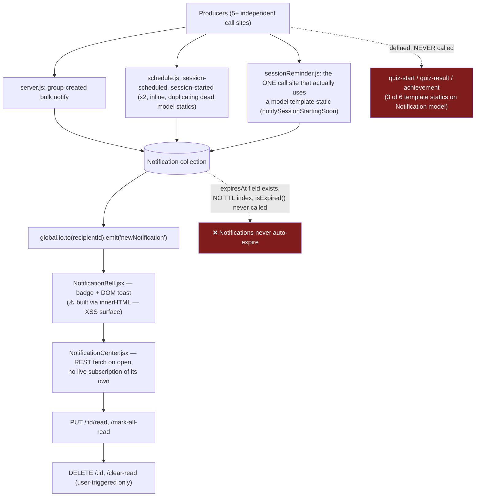

Architecturally, this is a **fan-out-on-write** notification system (the write path directly pushes to connected sockets) with **no fan-out-on-read fallback batching** and **no durable delivery guarantee** — if a recipient's socket isn't connected to this exact process at the moment of emission, the realtime portion of the notification is simply lost (the `Notification` document itself does persist in Mongo, so it is recoverable the next time the user opens the Notification Center, just not delivered as a live toast).

---

# 12. Scheduling / Background Job Architecture

Exactly one background job exists: `jobs/sessionReminder.js`. Its architecture:

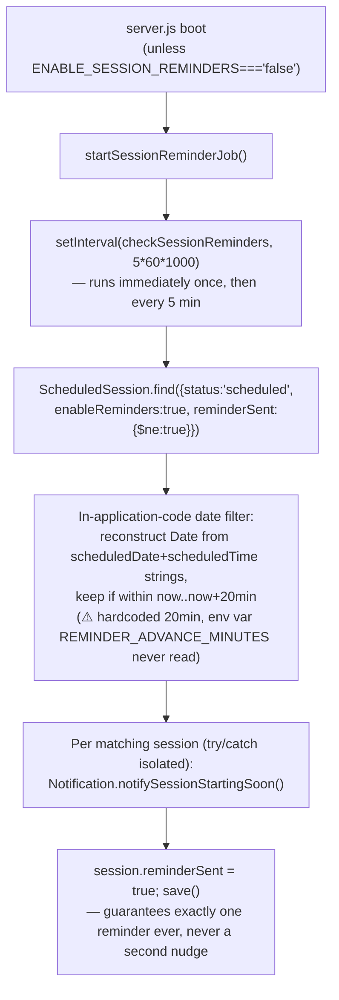

This is a **naive polling architecture** (not a real scheduler like `node-cron`/`agenda`/`bull`), running inside the same process as the web server, with no persistence of its own beyond the `reminderSent` flag on the target documents. It has no distributed-lock mechanism — if this codebase were ever run as multiple instances without the accompanying Socket.IO/Redis fix, **every instance would independently run this same 5-minute loop and could send duplicate reminders** (the `reminderSent` flag mitigates this at the database level via a check-then-set race, but there is a window where two instances could both read `reminderSent:false` before either writes `true`).

---

# 13. Cross-Cutting Concerns

## 13.1 Error handling architecture
No centralized error-handling middleware pattern beyond one narrow Multer-specific 4-arg handler in `server.js` (positioned so it does *not* catch errors from routes mounted after it, an ordering issue noted in Section 22). Individual routes handle errors with local `try/catch`, with **inconsistent response shapes**: some return `{error: string}`, one (`POST /api/quiz/generate`) returns `{error, details, stack}` (leaking the stack trace, self-flagged in-code as "temporary"), and uncaught `CastError`s from malformed ObjectId route params fall through to Express's default 500 handler rather than a friendly 400.

## 13.2 Logging architecture
`console.log`/`console.error` only, no structured logging (no Winston/Pino/Bunyan), no correlation IDs, no log levels, no external log aggregation (no Sentry/Datadog/LogRocket integration found in either `package.json`). Several log statements are debug-artifact-shaped (emoji-prefixed, logging full request bodies or API-key presence) rather than intentional operational logging.

## 13.3 Validation architecture
`express-validator` is declared as a dependency and **not used anywhere found in the reviewed route files** — all validation is manual, ad hoc, per-route (`if (!field) return res.status(400)...`), with wildly inconsistent thoroughness (the AI-generation path validates/normalizes output questions rigorously via `validateQuestions()`; the manual-edit path `PUT /api/quiz/:quizId` accepts a wholesale `questions[]` array with zero shape validation).

## 13.4 Rate limiting architecture
**None exists anywhere.** No `express-rate-limit`, no token-bucket, no sliding-window counter, at any layer (login, registration, guest-auth, AI generation, file upload). This is a structural gap across the entire API surface, not a per-endpoint oversight.

---

# 14. Deployment Architecture

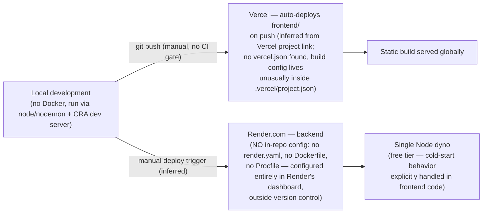

**There is no CI/CD pipeline anywhere in this repository** — no `.github/workflows`, no `.gitlab-ci.yml`, no Jenkinsfile, nothing. Deploys are presumed to be push-to-deploy on both platforms with **zero automated gating** (no test run, no lint check, no build-verification step) between a commit and it reaching production. This is consistent with the git history's evidence of very rapid, unreviewed iteration (many placeholder `:wq` commits — accidental Vim-exit sequences committed as messages).

## 14.1 Environment variable architecture
Configuration is split across two `.env` files (`backend/.env`, `frontend/.env`) with no schema/validation of required variables at boot (a missing `JWT_SECRET` would only surface as a crash the first time a request tries to sign/verify a token, not as a clear startup-time error). Two backend env vars (`REMINDER_INTERVAL_MINUTES`, `REMINDER_ADVANCE_MINUTES`) are declared but never read by any code — dead configuration surface that misleads anyone auditing the `.env` file into believing the reminder timing is adjustable.

---

# 15. Scaling Architecture & Hard Limits

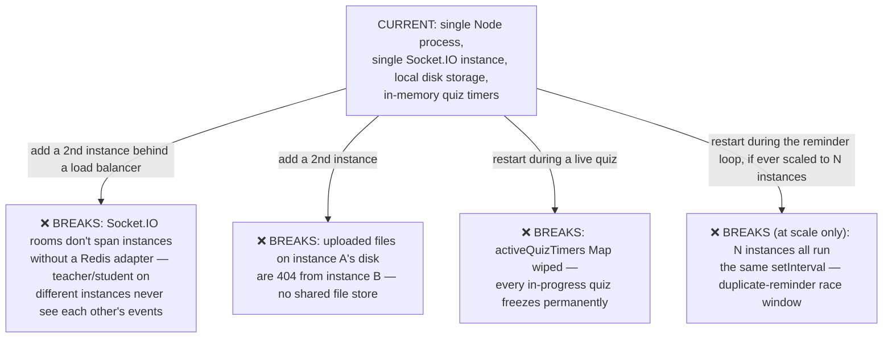

## 15.1 What would need to change, in order, to remove each blocker
1. **Redis adapter for Socket.IO** (`@socket.io/redis-adapter`) — unblocks multi-instance room broadcasting. This is additive (no rewrite required), but every `global.io.to(...).emit(...)` call site (REST routes reaching into the socket layer) needs to keep working identically, which the adapter is designed to preserve.
2. **Externalize file storage** (S3-compatible object storage) — replaces both Multer `diskStorage` configurations' destination with a cloud upload, and the `/uploads` static-file route with a redirect/proxy to signed URLs (this is also the natural point to finally add access control to the currently-public uploads, Section 16 of `MASTER_PROJECT_REPORT.md`).
3. **Persist quiz-timer state** — either move `activeQuizTimers` into Redis (with a lightweight lock per session) or add a boot-time recovery sweep that finds `QuizSession.status==='active'` documents with no corresponding live timer and either resumes or gracefully force-completes them.
4. **Distributed lock or single-designated-instance for the reminder job** — trivial once Redis is already in the stack for reason #1 (a simple Redis-based lock, or moving the job to a dedicated worker/cron service, e.g. Render's own Cron Jobs feature).

## 15.2 What does *not* need to change to scale from "one classroom" to "moderate multi-classroom" load
The database schema, the REST API shape, and the core Socket.IO event protocol are all reasonable as-is for scaling within a single-instance ceiling — the four blockers above are specifically about *horizontal* scaling (multiple server instances), not about the data model or API design being wrong at a conceptual level.

---

# 16. Security Architecture

(Full ranked findings live in `MASTER_PROJECT_REPORT.md` Section 14; this section covers only the *architectural* shape of the security posture.)

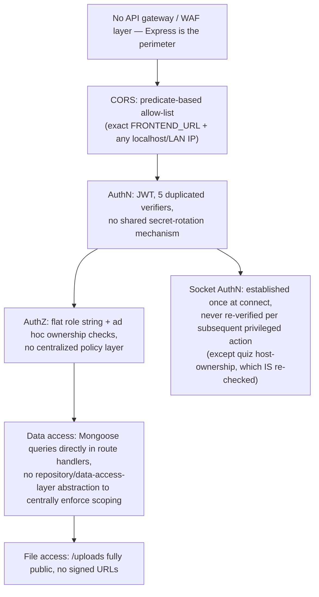

The architecture has **no centralized policy-enforcement point** — every route and every socket handler independently decides what to check, which is exactly why the specific gaps cataloged in `MASTER_PROJECT_REPORT.md` Section 14 (self-service role escalation, untrusted client timing data, unauthenticated file access) exist: there is no single choke point where "is this request/socket-event allowed" is decided once, consistently, for the whole system.

---

# 17. Observability Architecture

There effectively is none, beyond `console.log`. No metrics (no Prometheus/StatsD), no distributed tracing, no APM, no structured/queryable logs, no uptime/alerting configuration found in-repo (any such configuration, if it exists, lives entirely in the Render/Vercel dashboards, outside this codebase). The only "health" signal is a trivial `GET /health` returning static text `"OK"` with no dependency checks (it does not verify the MongoDB connection is alive, for instance) — so it is a liveness check, not a readiness check, architecturally speaking.

---

# 18. Coupling & Dependency Analysis

```mermaid
flowchart LR
    subgraph HighCoupling["Tightly coupled (change one, must check the other)"]
        A["server.js inline auth copy"] <--> B["routes/quiz.js auth copy"]
        B <--> C["routes/schedule.js auth copy"]
        C <--> D["routes/notifications.js auth copy"]
        E["QuizHost.jsx socket protocol"] <--> F["quiz-socket-handlers.js event names"]
        G["REST routes emitting via global.io"] <--> H["Socket.IO connection handlers"]
    end
    subgraph LowCoupling["Well-isolated"]
        I["services/aiQuizGenerator.js"] -.->|"clean interface, no Express deps"| J["routes/quiz.js"]
        K["models/*.js schemas"] -.->|"Mongoose is the only real interface"| L["everything else"]
    end
```

The **JWT-verification logic is the highest-risk coupling point** in the codebase: because it is duplicated five times rather than centralized, any future security fix (e.g., adding token-revocation checking, or fixing the inconsistent 401-vs-403 status codes) must be applied in five places, and there is no structural safeguard (no shared test suite, no lint rule) that would catch a fix applied to only four of the five.

The **quiz socket protocol** is the second-highest-risk coupling point: event names are string literals repeated across `quiz-socket-handlers.js` (server) and five different frontend components (`QuizHost.jsx`, `QuizPlayer.jsx`, `QuizWaitingRoom.jsx`, `QuizControlPanel.jsx`, `FloatingQuizButton.jsx`), with no shared constants file — this is precisely how the confirmed event-naming drift (`participantJoined` vs `student:joined`, `quizEnded` vs `quiz:finished`) happened, and how it will keep happening without a shared source of truth for event names.

---

# 19. Architecture Decision Records (reconstructed from evidence)

These were not written contemporaneously (no ADR files exist in the repo) — they are reconstructed here from what the code itself demonstrates was decided, to give a future team the "why" behind load-bearing choices.

### ADR-001: Single Node process for REST + Socket.IO
**Decision (implicit)**: run Express and Socket.IO in the same process, sharing `global.io`.
**Evidence**: `app.set('io', io); global.io = io;` in `server.js`, consumed directly by REST route handlers and Mongoose model statics.
**Consequence**: simplest possible realtime integration for an MVP; the direct cause of the horizontal-scaling blocker in Section 15.

### ADR-002: No client-side router
**Decision (implicit)**: manage all navigation via component-swap state in one root component rather than `react-router-dom` (despite it being installed).
**Evidence**: zero imports of `react-router-dom` anywhere in `frontend/src`; `App.js`'s `authScreen`/`teacherView`/`studentView` state machine.
**Consequence**: no deep-linking, no back-button support, but a simpler mental model for a single developer to hold in their head while iterating quickly.

### ADR-003: JWT-only auth, no server-side session store
**Decision (implicit)**: stateless auth via Bearer tokens in `localStorage`, no session/cookie store.
**Evidence**: `jsonwebtoken` used throughout; `axios` configured `withCredentials:true` but no cookie-based flow actually implemented.
**Consequence**: simple to scale statelessly in principle (any instance can verify any token) — ironically, this is one part of the architecture that *is* already horizontal-scaling-friendly, unlike the Socket.IO layer.

### ADR-004: Guest accounts are real `User` documents, not a separate ephemeral concept
**Decision (implicit)**: rather than model "guest" as a distinct, session-scoped entity, guests get a full `User` document with `role:'student'` and either a self-chosen or randomly-generated password.
**Evidence**: `User` schema's `password` field is optional specifically to accommodate this; two independent guest-creation code paths exist (PIN-join vs. guest-auth).
**Consequence**: simplifies the data model (one `User` collection, no parallel "Guest" collection) at the cost of the two-incompatible-flows bug documented in `MASTER_PROJECT_REPORT.md` Section 19 #9.

### ADR-005: Embed quiz gameplay state directly in `QuizSession`, defer durable results to a separate never-finished model
**Decision (implicit)**: model live gameplay as one mutable aggregate (`QuizSession.participants[].answers[]`), with a separate `QuizResult` collection intended for durable, denormalized, per-attempt history.
**Evidence**: `QuizResult.js`'s rich method set (`calculateMetrics`, `assignBadge`) clearly anticipates being populated from a completed `QuizSession`; nothing in `quiz-socket-handlers.js` ever performs that population.
**Consequence**: architecturally sound *intent* (separate the "live, mutable, ephemeral" representation from the "durable, historical, read-optimized" one) that was never finished — this is the clearest example in the whole codebase of a correct architectural instinct left incomplete.

### ADR-006: AI generation via a model-fallback chain rather than a single provider/model
**Decision (implicit)**: probe 4 Groq models in priority order before every real generation call, rather than hard-committing to one model with a simple retry.
**Evidence**: `getWorkingModel()` in `aiQuizGenerator.js`.
**Consequence**: improved resilience against any single model being temporarily rate-limited or deprecated, at the cost of doubling-to-quintupling API call volume per quiz generation.

---

# 20. Anti-Pattern Catalog

| Anti-pattern | Where | Architectural risk |
|---|---|---|
| **Shotgun-surgery auth** | 5 copies of JWT middleware | A security fix applied to 4 of 5 leaves a live gap |
| **God component** | `App.js`, 2,412 lines | Every state change risks re-rendering the entire app tree; impossible for a second developer to safely modify in isolation |
| **Dead-but-present architecture** | `groupRoutes.js`/`groupController.js`/`middleware/auth.js` | Misleads any new engineer reading the folder structure into believing this is the real request path |
| **Silent redundant implementations** | 2 quiz-hosting UIs, 2 poll systems, 2 Footers, 2 Logins | Doubles the maintenance surface for the same feature, with only one half actually working |
| **REST-to-socket backdoor coupling** | `global.io.to(...).emit(...)` from Express routes and Mongoose statics | Blocks horizontal scaling; makes the realtime layer's true dependency graph invisible from the socket-handler files alone |
| **Unenforced schema settings** | `Quiz.settings.showCorrectAnswer/showLeaderboard/allowLateJoin` stored but never read by gameplay code | Configuration that silently does nothing — a trap for anyone debugging "why didn't this setting take effect" |
| **Read-triggers-write endpoints** | `routes/analytics.js` GET routes that recalculate-and-save on every call | Breaks the assumption that GET is safe/idempotent; complicates any future caching layer |
| **String-literal event contracts with no shared constants** | Socket.IO event names duplicated as literals across 6+ files | Root cause of the confirmed event-naming drift bugs |
| **Env vars that do nothing** | `REMINDER_INTERVAL_MINUTES`, `REMINDER_ADVANCE_MINUTES` | Operators believe they can tune behavior that is actually hardcoded |
| **Committed build artifacts / backups** | `node_modules/` (99% of tracked files), `backend.zip`, `frontend/src.zip` | Bloats the repo, slows clones, and — for the zips — embeds an entire second copy of `node_modules` inside version control |

---

# 21. Target Future Architecture

Building on Section 15 (scaling) and Section 21 of `MASTER_PROJECT_REPORT.md` (SaaS expansion), the following is the recommended target-state architecture — an evolution, not a rewrite, of what exists today.

```mermaid
flowchart TB
    subgraph Today["TODAY"]
        T1["1 Node process<br/>REST + Socket.IO + in-memory state"]
        T2["Local disk uploads"]
        T3["Flat, single-tenant User/Group model"]
    end

    subgraph Target["TARGET"]
        R1["N Node processes behind a load balancer<br/>+ Redis adapter for Socket.IO<br/>+ Redis-backed quiz-timer state"]
        R2["Object storage (S3-compatible)<br/>+ signed URLs for access-controlled uploads"]
        R3["Organization-scoped multi-tenant data model<br/>(every query gains an organizationId clause)"]
        R4["Centralized auth middleware<br/>(consolidate the 5 copies into 1, actually mounted)"]
        R5["Shared Socket.IO event-constants module<br/>(single source of truth for event names,<br/>imported by both frontend and backend)"]
        R6["A real background-job runner<br/>(e.g. a dedicated cron/worker service)<br/>replacing the in-process setInterval reminder job"]
        R7["Actual QuizResult + Analytics write-path,<br/>closing the loop from gameplay → durable history → dashboards"]
    end

    Today --> Target
```

This target architecture requires **no framework replacement** (Express, Socket.IO, Mongoose, React all remain fit-for-purpose at the scale a multi-school SaaS would first need) — it is a matter of finishing the integrations that were already designed into the schema (`QuizResult`, `Analytics`), removing the duplicated/dead implementations, and adding the three infrastructure pieces (Redis, object storage, multi-tenancy) that the current single-classroom-scale MVP never needed.

---

# 22. Appendix: Full Middleware & Router Registration Order

(Reproduced here for architecture-document completeness — see `MASTER_PROJECT_REPORT.md` Section 6 for the same list presented alongside feature-level commentary.)

1. `dotenv.config()`
2. `app.options('*', cors(...))` — explicit preflight handler
3. `app.use(cors(...))` — `corsHandler` predicate (no-Origin, exact `FRONTEND_URL`, any `localhost`/`127.0.0.1`, any `192.168.x.x`)
4. `new Server(server, {...})` — Socket.IO construction, same CORS handler
5. `app.set('io', io); global.io = io;`
6. `GET /health` — before body parsers
7. `express.json()` / `express.urlencoded({extended:true})`
8. `app.use('/api/quiz', ...)`, `app.use('/api/analytics', ...)`, `app.use('/api/notifications', ...)` (in that order)
9. Conditional `startSessionReminderJob()`
10. `io.on('connection')` block #1 → `setupQuizSocketHandlers`
11. `process.on('SIGTERM', ...)` — 1st registration
12. Request-logging middleware (only covers routes registered after this line)
13. Uploads directory bootstrap + `express.static('/uploads', ...)` — no auth
14. Generic Multer configuration
15. `connectDB()` — fired, not awaited
16. ~20 inline REST routes (auth, groups, messages, upload)
17. Multer error-handling middleware (4-arg)
18. `app.use('/api/schedule', ...)`
19. More inline group/message routes
20. `io.on('connection')` block #2 → chat/presence handlers
21. `server.listen(PORT, "0.0.0.0", ...)`
22. `process.on('SIGTERM', ...)` — 2nd registration (both fire)

---

*End of SYSTEM_ARCHITECTURE.md. For feature-level narrative and the full audit findings, see `MASTER_PROJECT_REPORT.md`. For screen/state/animation detail, see `UI_UX_ARCHITECTURE.md`. For full per-field schema documentation, see `DATABASE_BIBLE.md`.*
