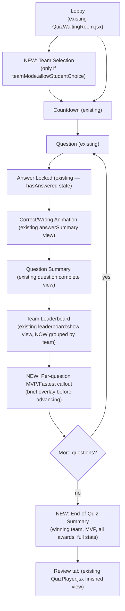
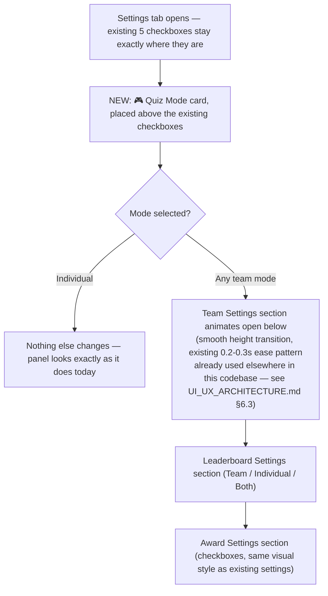

# ClassVibe — TEAM_MODE_DESIGN.md

**Feature design spec: Team Mode for the Live Quiz system.**

This is a **build-ready blueprint, not code**. It is grounded in the actual current codebase (`backend/models/Quiz.js`, `QuizSession.js`, `QuizResult.js`, `backend/socket-handlers/quiz-socket-handlers.js`, `frontend/src/components/QuizCreator.jsx`, `QuizHost.jsx`, `QuizPlayer.jsx`) as documented in `DATABASE_BIBLE.md` and `SYSTEM_ARCHITECTURE.md`, and it is deliberately designed to avoid two specific bug patterns already confirmed to exist in this codebase (see Section 10, "Engineering Checklist") — this section is the most important part of the document and should be read before anyone starts implementation.

**Origin**: this design grew out of a product conversation about adding team-based competition to the live quiz feature, refined here into something that fits the actual data model and real-time architecture already in production.

---

## Table of Contents

1. Goals & Design Principles
2. Quiz Modes
3. Team Settings
4. Scoring System (Individual — unchanged; Team — new)
5. Leaderboard & the Live "Momentum Bar"
6. Awards System (Team mode and Individual mode)
7. Quiz Flow (Lobby → ... → End of Quiz)
8. Quiz Summary & Quiz History (and why this depends on an existing fix)
9. Data Model Changes
10. Engineering Checklist — Definition of Done (read this before building anything)
11. Socket Event Additions
12. UI/UX Spec — the Quiz Settings Panel
13. AI-Readiness Notes
14. Rollout Plan
15. Open Questions

---

# 1. Goals & Design Principles

- **Optional**: a teacher explicitly chooses Individual or Team mode per quiz — nothing changes for a teacher who never touches this setting. Individual mode remains the default, exactly as it is today.
- **Balanced**: team scoring must never reward team size. A 25-student team must not automatically beat a 10-student team just by having more players.
- **Transparent to students, not to formulas**: students see simple numbers (`🚀 Nova — 94`), never the underlying weighted formula.
- **Fun but professional**: subtle animation, not arcade-game flashiness — consistent with the existing indigo/slate design language documented in `UI_UX_ARCHITECTURE.md` §12.
- **Low-regression-risk**: reuse the existing, working individual-scoring engine wherever possible rather than replacing it — every new formula introduced is additive risk that needs its own tests (see Section 10).

---

# 2. Quiz Modes

A single new field, `Quiz.settings.quizMode`, controls everything below. Exactly one mode is active per quiz.

| Mode | Description | Team assignment |
|---|---|---|
| **Individual** (default — today's only mode) | Every student competes independently. Standard leaderboard, individual winner. Best for exams/assessments/practice. | N/A |
| **Team Battle** | Students compete as teacher-defined teams (2–4). Team leaderboard shown after every question; winning team announced at the end. | Teacher-defined teams, students self-select or are assigned (Section 3) |
| **Random Teams** | Teacher picks only a team count (2, 3, or 4); the system auto-distributes students as evenly as possible. | System-assigned at quiz start (or at lobby-close), rebalanced if students join late — see Section 3 |
| **School House Mode** | Same mechanics as Team Battle, pre-seeded with a school's existing house names/colors (e.g., 🔴 Red House, 🔵 Blue House), renameable by the teacher. | Same as Team Battle |
| **Custom Teams** | Teacher names 2–4 teams, picks a color and optional icon per team. | Same as Team Battle |

**Implementation note**: School House Mode and Custom Teams are *the same underlying mechanism* (teacher-named teams with color/icon) — School House Mode is simply Custom Teams with a pre-filled default preset. This should be one code path, not two, to avoid the "two implementations of the same concept" pattern already present elsewhere in this codebase (two poll systems, two quiz-hosting UIs — see `MASTER_PROJECT_REPORT.md` §16).

---

# 3. Team Settings

Shown only when a team-based mode is selected (progressive disclosure — see Section 12).

| Setting | Field | Behavior |
|---|---|---|
| Allow students to choose their team | `settings.teamMode.allowStudentChoice` (Boolean) | If `true`: students pick a team on the lobby/waiting-room screen (`QuizWaitingRoom.jsx`, extended). If `false`: teacher assigns teams before start, or Random Teams mode auto-assigns. |
| Balance teams automatically | `settings.teamMode.autoBalance` (Boolean) | If `true`, the server rejects/redirects a student's team choice once a team is full relative to others, keeping team sizes within 1 of each other. |
| Maximum players per team | `settings.teamMode.maxPerTeam` (Number \| `'auto'`) | `'auto'` = `ceil(totalExpectedStudents / teamCount)`, recalculated live as students join the lobby. |
| Lock teams before quiz starts | `settings.teamMode.lockOnStart` (Boolean) | If `true`, team assignment is frozen the moment the teacher clicks Start — a late joiner (allowed if `Quiz.settings.allowLateJoin` is true — see Section 10 for why this existing flag matters here) is auto-assigned to the smallest team rather than choosing. |

---

# 4. Scoring System

## 4.1 Individual scoring — **unchanged, reused as-is**
The existing per-student scoring engine in `quiz-socket-handlers.js`'s `student:submitAnswer` handler already does the right thing and should not be replaced: base points (`Quiz.questions[].points`, default 10) × a speed multiplier (2x if answered in the first third of the time limit, 1.5x in the middle third, 1x in the final third), with `streak` tracked as a display stat. **Team Mode reuses this exact same per-student score — it does not introduce a second, parallel scoring formula for individual answers.** This is a deliberate choice to minimize regression risk: the only new logic is *aggregating* already-correct individual scores into a team number, not recomputing individual correctness/points differently.

*(A more elaborate point-breakdown — e.g., separate "time bonus," "streak bonus," and "perfect answer bonus" as independent additive components — was considered and explicitly rejected for v1, in favor of reusing the proven formula. It can be revisited in a later phase once the simpler version has shipped and been observed in real classrooms.)*

## 4.2 Team scoring — new
**Team Score for a question** = sum of that question's points earned by every team member who answered (identical inputs to what already flows through `student:answered` today — no new per-answer computation needed).

**Team Score for the whole quiz** = sum of team-member scores across all questions (this is just `QuizSession.participants[].score` summed by `teamId` — a pure aggregation over data that already exists).

**Why NOT raw total for the leaderboard display**: a 25-student team will out-total a 10-student team purely by headcount. Instead, the leaderboard displays:

```
Average Team Score = Team Total Score ÷ Number of team members who answered at least one question
```

**Team Rating** (used for final ranking, not shown to students as a formula):
```
Team Rating = (0.70 × Average Team Score, normalized to 0–100)
            + (0.20 × Average Speed Bonus, normalized to 0–100)
            + (0.10 × Participation Rate, 0–100)
```
Students only ever see the resulting number and rank (`🚀 Nova — 96 🔥`), never the formula — consistent with the transparency principle in Section 1 ("transparent to students, not to formulas").

## 4.3 Worked example (for QA/test-writing reference)
| Team | Members answered | Total score | Avg score | Avg speed bonus | Participation | Team Rating |
|---|---|---|---|---|---|---|
| 🚀 Nova | 25 | 2,500 | 100 | 78 | 100% | 70(1.0) + 20(0.78) + 10(1.0) = **95.6** |
| ☄️ Comet | 10 | 1,300 | 130 | 82 | 100% | 70(1.0, capped) + 20(0.82) + 10(1.0) = **96.4** — Comet wins despite fewer total points, because per-student performance was stronger |

This table should become the first fixture in a real unit test (see Section 10) — it is the exact scenario that motivated moving away from raw-total scoring.

---

# 5. Leaderboard & the Live "Momentum Bar"

In addition to the standard post-question team leaderboard (reusing the existing `leaderboard:show` event and `QuizPlayer.jsx`/`QuizHost.jsx` leaderboard views, extended to group by team), add an **always-visible momentum bar** at the top of the quiz screen during Team Battle/Random Teams/School House/Custom Teams modes:

```
🚀 Nova ████████████░░░░ 58%
☄️ Comet ██████████░░░░░ 42%
```

- Recomputed after **every individual answer** (not just after each full question), since `student:answered` already broadcasts per-answer today — this needs no new real-time plumbing, only a new client-side render reacting to an event that already exists.
- The bar animates smoothly (CSS `transition: width` — already an established pattern in this codebase, used today for the question-timer bar and the answer-progress bar in `QuizControlPanel.jsx`/`QuizPlayer.jsx`) toward the leading team on each update, rather than jump-cutting.
- Percentage = each team's *current Average Team Score* as a share of the sum of all teams' current Average Team Scores (not raw totals, for the same fairness reason as Section 4).

---

# 6. Awards System

Shown after the final leaderboard, at end-of-quiz. Each award is independently toggleable by the teacher (progressive-disclosure setting, off by default until Team/Individual awards are explicitly enabled).

| Award | Team mode | Individual mode | Computed from |
|---|---|---|---|
| ⭐ MVP | The single highest-individual-scorer, regardless of team | N/A (redundant with 1st place) | `QuizSession.participants[].score`, max |
| ⚡ Fastest Thinker | Same, cross-team | Same | Lowest average `timeTaken` among correct answers |
| 🎯 Best Accuracy | Same, cross-team | Same | Highest `correctAnswers / totalAnswered` ratio |
| 🔥 Longest Streak | Same, cross-team | Same | Max `QuizSession.participants[].streak` reached during the quiz |
| 🏅 Most Improved | Compares this student's `QuizResult` history to their own past attempts on quizzes with the same or a related `Quiz.tags` | Same | **Depends on `QuizResult` history existing — see Section 8** |
| 🤝 Team Spirit | Team with the smallest score-gap between its highest and lowest contributing member (rewards teams where everyone contributed, not just one star player) | N/A | Per-team score variance |

**Answering "tell to that individual players same"**: Individual mode gets the exact same award set *minus* Team Spirit (which is structurally team-only) and with MVP folded into "1st place" (since there's no team to be MVP *of* — the distinction is meaningless in individual mode, so the UI simply doesn't show a separate MVP badge when `quizMode === 'individual'`, to avoid a redundant, confusing duplicate of "1st place"). Every other award (Fastest Thinker, Best Accuracy, Longest Streak, Most Improved) works identically for both modes since they're all computed from the same underlying per-student data, not from team aggregation.

---

# 7. Quiz Flow

Reuses and extends the flow already implemented in `QuizPlayer.jsx`/`QuizHost.jsx` (documented in `MASTER_PROJECT_REPORT.md` §11 and the state machine in `UI_UX_ARCHITECTURE.md` §8.1) — no flow steps are removed, three are added (marked **NEW**):



This is intentionally close to Kahoot's well-proven flow, per the original product conversation — no reinvention needed here.

---

# 8. Quiz Summary & Quiz History

**This is the most important dependency in this entire document.**

The request to "store this in quiz history" is **not a new feature to build from scratch** — it is the natural completion of a gap that already exists in this codebase today: `backend/models/QuizResult.js` is a fully-designed, fully-indexed, fully-method-equipped model (with `calculateMetrics()`, `assignBadge()`, `getPerformanceLevel()` already implemented) that **currently has zero documents ever created**, confirmed by exhaustive grep across the entire backend (see `DATABASE_BIBLE.md` §9). Quiz history today reads directly off the live `QuizSession` document instead, which is why per-student badges, percentiles, and historical trend data are permanently empty in the current product.

**Design decision**: Team Mode's "Quiz Summary" must be built as **the fix for this existing gap, not a second parallel history mechanism.** Concretely:
1. At quiz completion (in `quiz-socket-handlers.js`'s completion logic — the same place that already computes the final leaderboard), create one `QuizResult` document per participant, using `QuizResult`'s own already-correct `calculateMetrics()`/`assignBadge()` methods.
2. Add new fields to `QuizResult` for team context (Section 9).
3. `Quiz History` UI (`QuizControlPanel.jsx`'s History tab, and any future teacher/student history views) should be migrated to read from `QuizResult` instead of directly from `QuizSession`, once this exists.
4. This single change, which Team Mode now gives a concrete reason to finally do, **also retroactively fixes** the Individual-mode quiz-history gap that exists today — Team Mode's requirement and the pre-existing bug fix are the same piece of work.

**What gets stored** (per the "AI Ready" section of the original spec, reproduced here with concrete field mapping — see Section 9):
- Team results (final rank, Team Rating, roster)
- Individual results (existing `QuizResult` fields — score, percentage, correctAnswers, badge)
- Average accuracy, average time, participation (existing `QuizResult` fields, already computed by `calculateMetrics()`)
- Per-question breakdown (existing `QuizResult.answers[]`)
- Awards earned (new field, Section 9)
- Final rankings (individual — existing `rank` field; team — new field, Section 9)

---

# 9. Data Model Changes

*(Additive only — no existing field is removed or renamed, minimizing migration risk on the already-live `Quiz`/`QuizSession`/`QuizResult` collections.)*

## 9.1 `Quiz.settings` — new sub-object
```js
settings: {
  // ...existing fields (totalTimeLimit, shuffleQuestions, shuffleOptions,
  //    showCorrectAnswer, showLeaderboard, allowLateJoin) — UNCHANGED

  quizMode: { type: String, enum: ['individual','team_battle','random_teams','school_house','custom_teams'], default: 'individual' },
  teamMode: {
    teamCount: { type: Number, min: 2, max: 4 },
    teams: [{ name: String, color: String, icon: String }], // pre-filled for school_house, teacher-defined for custom_teams
    allowStudentChoice: { type: Boolean, default: true },
    autoBalance: { type: Boolean, default: true },
    maxPerTeam: { type: Schema.Types.Mixed, default: 'auto' }, // Number | 'auto'
    lockOnStart: { type: Boolean, default: true }
  },
  awards: {
    mvp: { type: Boolean, default: true },
    fastestThinker: { type: Boolean, default: true },
    bestAccuracy: { type: Boolean, default: true },
    longestStreak: { type: Boolean, default: true },
    mostImproved: { type: Boolean, default: false }, // off by default — depends on QuizResult history existing (Section 8)
    teamSpirit: { type: Boolean, default: true } // only meaningful/shown in team modes
  },
  saveCompleteSummary: { type: Boolean, default: true } // gates QuizResult creation — see Section 10
}
```

## 9.2 `QuizSession.participants[]` — new field
```js
participants: [{
  // ...existing fields (user, joinedAt, score, answers, streak, completedAt) — UNCHANGED
  teamId: { type: String, default: null } // references settings.teamMode.teams[].name, or null in individual mode
}]
```

## 9.3 `QuizResult` — new fields
```js
{
  // ...existing fields — UNCHANGED
  teamId: { type: String, default: null },
  teamRank: { type: Number, default: null },
  teamRating: { type: Number, default: null },
  awardsEarned: [{ type: String }] // e.g. ['mvp', 'fastestThinker']
}
```

## 9.4 New model: `QuizTeamResult` (one row per team per session, parallel to `QuizResult`'s one-row-per-student)
```js
QuizTeamResult {
  session: ObjectId ref QuizSession, required
  quiz: ObjectId ref Quiz, required
  group: ObjectId ref Group, required
  teamId: String, required
  teamName: String
  memberCount: Number
  totalScore: Number
  averageScore: Number
  averageSpeedBonus: Number
  participationRate: Number
  teamRating: Number
  rank: Number
  createdAt
}
```
Modeled deliberately as its own collection (not embedded inside `QuizSession`) so that, like `QuizResult`, it survives independently as durable history once a `QuizSession` is old — same pattern already established and already correct in this codebase for the student-level equivalent.

---

# 10. Engineering Checklist — Definition of Done

**Read this before writing any code for this feature.** Every item below exists specifically because this exact codebase has already shipped this exact class of bug once (documented in `MASTER_PROJECT_REPORT.md` and `DATABASE_BIBLE.md`) — this checklist is how Team Mode avoids repeating it.

- [ ] **Every new `Quiz.settings.*` field added in Section 9.1 has a corresponding `if` check inside `quiz-socket-handlers.js`.** Precedent: `showCorrectAnswer`, `showLeaderboard`, and `allowLateJoin` are already stored in the schema today and **already never read** by the live gameplay engine — they are pure decoration. Do not add a fourth generation of this bug. If a setting doesn't have a corresponding code path by the time this feature ships, either wire it in or remove it from the UI — never ship a toggle that does nothing.
- [ ] **Team score aggregation has unit tests, including the worked example in Section 4.3, before merge.** Precedent: `multiple_select` question scoring has a live, confirmed bug (array `===` comparison, always false) that a single unit test would have caught immediately. Aggregation math (sums, averages, weighted ratings) is exactly as easy to get subtly wrong.
- [ ] **`QuizResult`/`QuizTeamResult` creation is added to the quiz-completion code path as part of this feature, not deferred.** Precedent: `QuizResult` has existed, fully built, since before this feature was proposed, and has zero documents in production today because nobody wired up the write path. Team Mode is the forcing function to finally do this — don't let it slip to "later" a second time.
- [ ] **Team assignment race conditions are handled server-side.** Multiple students choosing the same team simultaneously in the lobby must be resolved atomically (e.g., an atomic `findOneAndUpdate` with a team-size check), not via a client-side check-then-write that two students could both pass at once.
- [ ] **Late-join + team-lock interaction is explicitly tested.** What happens when `settings.teamMode.lockOnStart` is true and a student joins after start (only possible if `settings.allowLateJoin` is also true) — this is a genuine edge case at the intersection of two existing/new settings and needs an explicit decision (recommendation: auto-assign to smallest team, per Section 3), not an accidental default.
- [ ] **Disconnected students during Team Mode are handled.** The existing codebase already has a known gap: a disconnected quiz participant is never removed from `QuizSession.participants[]` (see `DATABASE_BIBLE.md` §8.6). In Team Mode, this also means a disconnected student's team continues being scored as if they might still answer — decide and document the intended behavior (recommendation: no change to existing behavior, just be aware it now affects team fairness too, not just individual scores).
- [ ] **The `Analytics` model's write-path gap does not block this feature, but should be noted as a related fix.** `Analytics.recordQuizResult()` already exists and is never called (see `DATABASE_BIBLE.md` §11) — once `QuizResult` creation is wired up for this feature, wiring that one extra call at the same time is nearly free and closes a second existing gap for the cost of one line of code.

---

# 11. Socket Event Additions

Following the existing naming convention (`namespace:action`, colon-delimited, as already used for `teacher:*`/`student:*`/`quiz:*` events — see `SYSTEM_ARCHITECTURE.md` §6.3 for why consistent naming matters, given this codebase's confirmed history of event-name drift bugs):

| Event | Direction | Payload | Purpose |
|---|---|---|---|
| `student:selectTeam` | C→S | `{sessionId, teamId}` | Student picks a team in the lobby (only if `allowStudentChoice`) |
| `team:assigned` | S→C | `{userId, teamId, teamRosterCounts}` | Confirms assignment, broadcasts updated counts to the lobby |
| `team:full` | S→C | `{teamId}` | Rejects a selection if `autoBalance` would be violated |
| `team:momentumUpdate` | S→C | `{teams: [{teamId, percentage}]}` | Drives the live momentum bar (Section 5), fired alongside the existing `student:answered` broadcast |
| `quiz:awardsRevealed` | S→C | `{awards: [{type, userId or teamId, value}]}` | End-of-quiz awards reveal (Section 6) |

**No existing event is renamed or removed** — this is purely additive to the event catalogue documented in `SYSTEM_ARCHITECTURE.md` §6.3 and `MASTER_PROJECT_REPORT.md` §8.

---

# 12. UI/UX Spec — the Quiz Settings Panel

Extends the existing **Settings tab** inside `QuizCreator.jsx` (documented in `UI_UX_ARCHITECTURE.md` §3.6/§7.7) — per the explicit design direction, **no new page or modal is created.**

## 12.1 Layout principle: progressive disclosure


## 12.2 Quiz Mode card
A single card, radio-button-style (exactly one selectable), titled **"🎮 Quiz Mode"**, listing the five modes from Section 2 with a one-line description each — matching the existing card visual pattern already used elsewhere in `QuizCreator.jsx` (rounded 10–12px corners, subtle shadow, per `UI_UX_ARCHITECTURE.md` §12.3).

## 12.3 Team Settings (conditional, Section 3's four toggles) + Custom Teams sub-form
For `custom_teams`/`school_house`: a small repeating row per team (name input, color swatch picker, optional icon picker), 2–4 rows, add/remove controlled by the chosen team count.

## 12.4 Design requirement, restated
Per the original product direction: a first-time teacher must understand every option **without reading documentation**, and be able to configure it **in under one minute**. This is achieved by (a) hiding everything except the mode picker until a team mode is chosen, and (b) giving every team mode a one-line plain-English description instead of requiring the teacher to infer behavior from a setting name alone.

---

# 13. AI-Readiness Notes

Consistent with `AI_ROADMAP.md`, this feature is designed so future AI capabilities can consume its data **without any UI or schema change**:
- Team history (`QuizTeamResult`) and individual history (`QuizResult`, once populated per Section 8) are exactly the data a future "AI Analytics Insight Agent" (`AI_ROADMAP.md` §4, Agent A6) would read.
- "Most Improved" and future difficulty-calibration AI features (`AI_ROADMAP.md` §2.3) both depend on the same `QuizResult` history this feature finally activates.
- No AI call is required to *ship* Team Mode itself — the scoring, awards, and momentum bar are all deterministic math, not LLM-generated. AI involvement here is a strictly future, additive layer (e.g., an AI-written plain-language recap of "why Comet won"), not a Team Mode dependency.

---

# 14. Rollout Plan

| Phase | Scope | Depends on |
|---|---|---|
| **Phase 1** | `QuizResult`/`QuizTeamResult` write-path (Section 8) — ships even before Team Mode UI exists, as a standalone fix, since Individual mode benefits immediately too | Nothing new — this is finishing existing, already-designed work |
| **Phase 2** | Individual mode gets its own new awards (Fastest Thinker, Best Accuracy, Longest Streak, Most Improved) and a real End-of-Quiz Summary screen, using Phase 1's data | Phase 1 |
| **Phase 3** | Team Battle mode only (the simplest team mode — teacher-defined teams, manual assignment) | Phase 1, Section 9.1–9.3 schema changes, Section 11 socket events |
| **Phase 4** | Random Teams, School House, Custom Teams (all share the same underlying mechanism per Section 2) | Phase 3 |
| **Phase 5** | Live momentum bar, per-question MVP callout, full awards reveal animation | Phase 3 |

This phasing deliberately ships the highest-value, lowest-risk piece (fixing the existing dormant `QuizResult` pipeline) first and independently of the more novel team-mechanics work, so value is delivered even if later phases take longer than expected.

---

# 15. Open Questions

- Should "Most Improved" compare against the student's history on quizzes covering the *same topic/tag*, or any quiz at all? (Depends on `Quiz.tags` existing — currently not part of the schema; see `DATABASE_BIBLE.md` §7.8 future-field proposals.)
- Should a teacher be able to change `quizMode` after a quiz has already started? (Recommendation: no — lock it at `teacher:startQuiz`, same as the existing `sessionSettings` snapshot pattern already used for `Quiz.settings` more broadly, per `DATABASE_BIBLE.md` §8.1.)
- Should Team Spirit and Most Improved be on by default, or opt-in? (Current recommendation in Section 9.1: Most Improved off by default since it depends on history existing across multiple quizzes, which a brand-new teacher/class won't have yet; everything else on by default.)

---

*End of TEAM_MODE_DESIGN.md. This is a design document only — no code has been written or modified. For the underlying data model this builds on, see `DATABASE_BIBLE.md`. For the real-time architecture this extends, see `SYSTEM_ARCHITECTURE.md`. For the bugs this design deliberately avoids repeating, see `MASTER_PROJECT_REPORT.md` §19 and `FINAL_PROJECT_AUDIT.md` C-6/C-7.*
