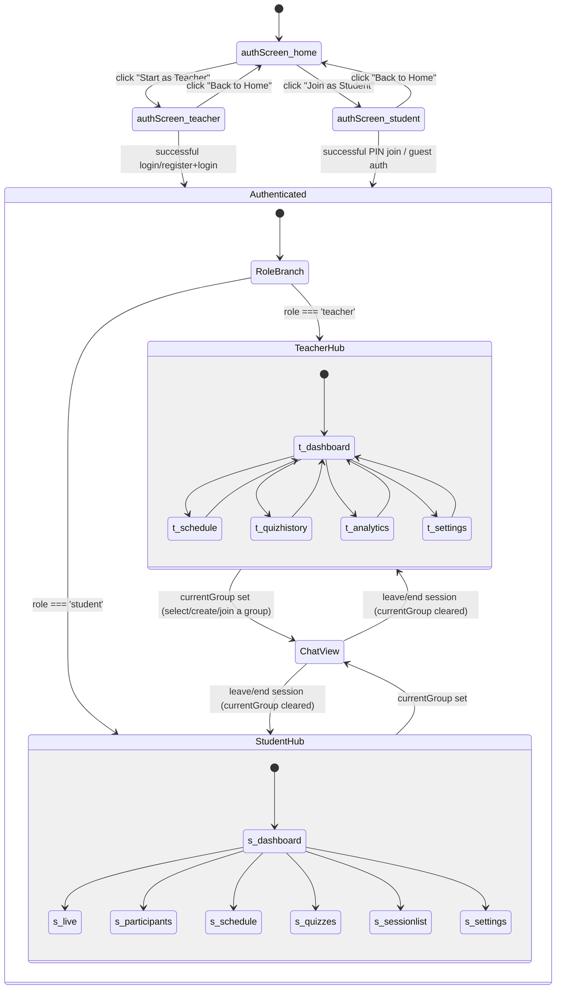
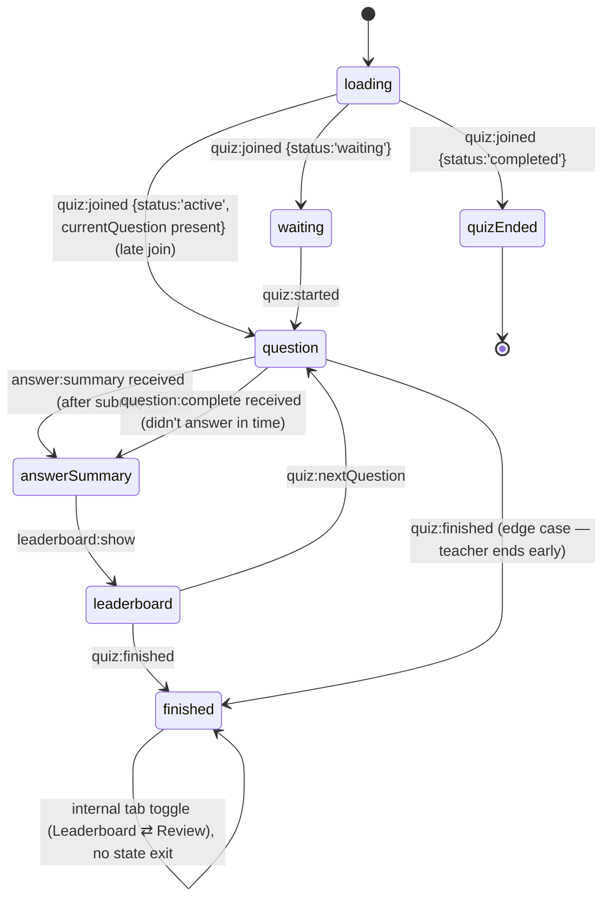
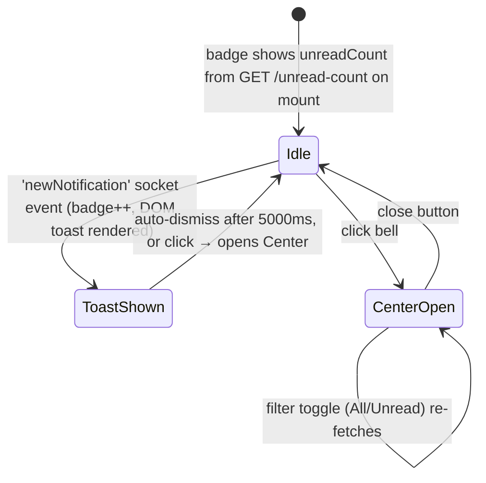
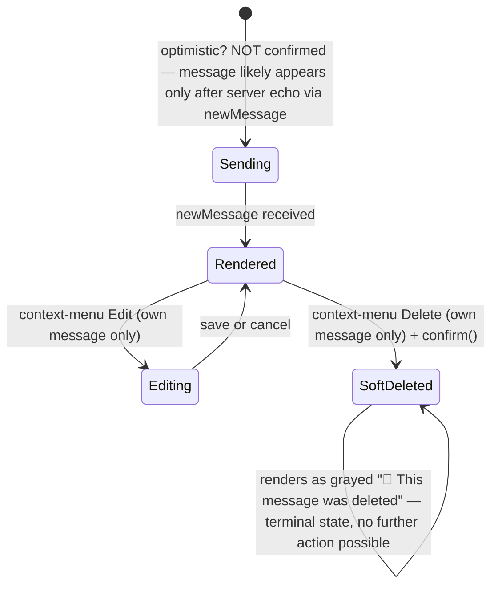

# ClassVibe — UI_UX_ARCHITECTURE.md

**UI/UX-only reference.** Every screen, every popup/modal, every UI state (loading/empty/error/success/disabled), every animation, and every transition found in the codebase, cataloged exhaustively. This document deliberately excludes backend/database/socket architecture (see `SYSTEM_ARCHITECTURE.md`) and feature-level business logic narrative (see `MASTER_PROJECT_REPORT.md`) except where needed to explain *why* a screen behaves the way it does.

All content is grounded in `frontend/src` as of 2026-07-05, including a repo-wide scan for `@keyframes`, `transition:`, and `animation:` declarations to ensure the animation/transition catalog (Section 6) reflects what is actually in the code rather than what a typical app "should" have.

---

## Table of Contents

1. UX Philosophy & Current-State Assessment
2. Navigation Architecture (the state-machine "router")
3. Complete Screen Inventory
4. Complete Modal / Popup / Overlay Inventory
5. Complete UI State Catalog (loading / empty / error / success / disabled)
6. Complete Animation & Transition Catalog
7. Button & Action Inventory (per screen)
8. Feature UI State Machines (quiz, chat, notifications)
9. Dark Mode Implementation Audit
10. Responsive / Breakpoint Audit
11. Accessibility Audit (per screen)
12. Design Tokens (colors, spacing, radii, shadows, typography)
13. Interaction Pattern Catalog
14. Cross-Screen Consistency Audit
15. UI/UX Roadmap

---

# 1. UX Philosophy & Current-State Assessment

ClassVibe's UI was built **incrementally, screen by screen, by a single developer, with no shared component library and no design tool handoff** — there is no Figma reference, no design-tokens file, no Storybook, and no shared `<Button>`/`<Card>`/`<Modal>` component anywhere in `frontend/src`. Every screen re-implements its own buttons, cards, and modals as inline `style={{}}` objects. This is not unusual for an MVP, but it means the UI has drifted into **two visually distinct eras** living side by side today:

- **Era 1 (legacy)**: `Login.js`, parts of `NotificationCenter.jsx`, fragments of `StudentAnalytics.jsx` — WhatsApp-green palette (`#25D366`/`#075E54`), Bootstrap-blue buttons (`#007bff`), plain gray backgrounds (`#f0f2f5`).
- **Era 2 (current)**: `App.js`, `QuizCreator.jsx`, `QuizPlayer.jsx`, `Header.js`, `Sidebar.js`, `TeacherLogin.jsx`, `StudentJoin.jsx` — an indigo/slate palette (`#4F46E5`/`#6366f1` primary, `#1e293b`/`#64748b` slate grays), rounded 10–12px cards, softer shadows.

A user moving from the login screen (Era 2, if they use `TeacherLogin.jsx`) to the notification center (Era 1 styling) experiences a visible, if subtle, brand inconsistency mid-session.

---

# 2. Navigation Architecture (the state-machine "router")

There is no URL-addressable route in this application (confirmed: `react-router-dom` is installed, never imported). Every "screen" is a value of one of four state variables owned by `App.js`. The full navigable state graph:



**Key navigation facts:**
- A **browser refresh** at any point inside `Authenticated` always resets `teacherView`/`studentView` to their default (`'dashboard'`) and clears `currentGroup` unless it's re-derived — the user always lands back on their hub dashboard, never on the specific tab/chat they were viewing.
- The **only URL-driven navigation** in the entire app is reading `?pin=XXXXXX` once on initial mount to auto-open the student-join screen with the PIN pre-filled (deep-link support for QR-code-generated URLs).
- **Three cross-cutting `window` CustomEvents** (`openWaitingRoom`, `startQuiz`, `joinSession`) act as a secondary, out-of-band navigation mechanism — dispatched from deeply nested components (a quiz-notification card inside chat, a notification-center item) to force a jump to a specific overlay/view without prop-drilling.

---

# 3. Complete Screen Inventory

## 3.1 Pre-authentication screens

| Screen | Component | Entry condition | Exit actions |
|---|---|---|---|
| Landing / Home | `pages/Home.jsx` | `authScreen==='home'` (default) | "Start as Teacher" → Teacher Login; "Join as Student" → Student Join |
| Teacher Login/Register | `pages/TeacherLogin.jsx` | `authScreen==='teacher'` | Successful auth → Authenticated shell; "Back to Home" → Home |
| Student Join | `pages/StudentJoin.jsx` | `authScreen==='student'` | Successful PIN join or guest auth → Authenticated shell; "Back to Home" → Home |
| (Legacy, effectively unreachable) Generic Login | `components/Login.js` | Only reachable via a dead fallback branch in `App.js`'s pre-auth render logic | Same as TeacherLogin, older styling |

## 3.2 Authenticated shell — always-present chrome

| Element | Component | Notes |
|---|---|---|
| Top header | `components/Header.js` | Two layouts: "brand row" (no active group) vs. "session bar" (active group) |
| Slide-in sidebar | `components/Sidebar.js` | Right-side panel, toggled by hamburger in Header |

## 3.3 Teacher Hub screens (`teacherView` state)

| View | Content | Key sub-elements |
|---|---|---|
| `dashboard` | Group cards (Live / Scheduled / Ended, inferred from card badges) | Card "⋮" menu → Manage / Delete / View Details |
| `schedule` | Full `ScheduleSession.jsx` view | Tabs: Details form / Drafts list |
| `quizhistory` | Per-group quiz history list | Reads `QuizSession` history (not `QuizResult`, which is never populated) |
| `analytics` | `StudentAnalytics.jsx` | ⚠️ Always shows "Needs Attention"/0% — data pipeline never fed (see `MASTER_PROJECT_REPORT.md` §19) |
| `settings` | Shared Settings panel (rendered from `Sidebar.js`) | Username edit, profile photo, whiteboard access toggle context |

## 3.4 Student Hub screens (`studentView` state)

| View | Content |
|---|---|
| `dashboard` | PIN quick-join box, list of joined groups |
| `live` | Entered via `joinSession`/`openWaitingRoom` window events — transitional state toward the Chat View or quiz overlays |
| `participants` | Roster view for the active session |
| `schedule` | Available/registered sessions (intended `UpcomingSessions.jsx`, which is a dead/unmounted component — the actual rendering source for this tab was not confirmed to be that component, suggesting either a simpler inline fallback exists in `App.js` or this tab is thinner than intended) |
| `quizzes` | Student's own quiz list |
| `sessionlist` | Joined-session history |
| `settings` | Shared Settings panel |

## 3.5 Chat View (either role, `currentGroup` set)

| Element | Component |
|---|---|
| Message list | `components/ChatArea.js` |
| Composer | `components/MessageInput.js` |
| Floating quiz-launch button | `components/FloatingQuizButton.jsx` (only when `currentGroup.isActive`) |

## 3.6 Full-screen overlay "screens" (technically modals, but occupy the entire viewport)

| Overlay | Component | Trigger |
|---|---|---|
| Quiz authoring | `QuizCreator.jsx` | "Create Quiz"/"AI Quiz" button (teacher, dashboard or chat) |
| Quiz hosting (working) | `QuizHost.jsx` | After "Start Quiz Now" in `QuizCreator` |
| Quiz hosting (broken REST path) | `QuizControlPanel.jsx` | Clicking `FloatingQuizButton` as teacher |
| Quiz waiting room | `QuizWaitingRoom.jsx` | Student, session status `'waiting'` |
| Quiz play | `QuizPlayer.jsx` | Student, session status `'active'` |
| Settings | Inline in `Sidebar.js` | Sidebar nav "Settings" |
| Whiteboard | Inline in `Sidebar.js` | Sidebar nav "Whiteboard" (teacher only) |

---

# 4. Complete Modal / Popup / Overlay Inventory

Every fixed-position/overlay UI element found, with its trigger, dismiss method, and z-index/stacking behavior where determinable.

| # | Modal/Popup | Component | Trigger | Dismiss | Notes |
|---|---|---|---|---|---|
| 1 | PIN/QR viewer | `Header.js` (built-in fallback) | "View Session PIN & QR" | Close button / backdrop click | Only renders if parent doesn't supply its own `onViewPin` handler |
| 2 | "Open Full Size" QR window | `Header.js` | Button inside modal #1 | Closing the new browser window/tab | Uses deprecated `document.write()` into a blank popup window |
| 3 | "Manage Session" modal | Inline in `App.js` (Instructor Hub, Scheduled card menu) | Card "⋮" → "Manage" | Close button, or auto-close via `setTimeout` after a success message | |
| 4 | "Session Details" modal | Inline in `App.js` (Instructor Hub, Ended card menu) | Card "⋮" → "View Details" | Close button | Tabs: Members / Quiz History |
| 5 | Settings overlay | `Sidebar.js` (`Settings` sub-component) | Sidebar nav "Settings" | Close button | Fixed, full-screen, `zIndex:3000` |
| 6 | Whiteboard overlay | `Sidebar.js` (`Whiteboard` sub-component) | Sidebar nav "Whiteboard" (teacher only) | Close button | Fixed, full-screen, `zIndex:3000` |
| 7 | Poll-creation modal | `MessageInput.js` | "+" menu → "Poll" | Cancel / submit | Question + 2–10 options form |
| 8 | Fullscreen image/video/PDF viewer | `ChatArea.js` | Click a file/image message | Close button / backdrop | Zoom 0.5×–3× for images |
| 9 | Context menu (right-click) | `ChatArea.js` | Right-click a message | Click elsewhere | Copy / Edit / Delete (Edit/Delete only if own, non-deleted message) |
| 10 | Notification Center | `NotificationBell.jsx` → `NotificationCenter.jsx` | Click bell icon | Close button | Filter tabs: All / Unread |
| 11 | DOM toast (not a React component) | `NotificationBell.jsx` `showToast()` | `newNotification` socket event | Auto-dismiss after 5000ms, or click | Built via raw `document.createElement`+`innerHTML` — outside React's render tree entirely |
| 12 | QuizCreator (full-screen) | `QuizCreator.jsx` | "Create Quiz"/"AI Quiz" | Close/cancel button | Internally tabbed: Essentials / Questions / Settings / Assign(disabled) |
| 13 | QuizHost (full-screen) | `QuizHost.jsx` | Post quiz-creation "Start Quiz Now" | Only via quiz completion + "Close" | No manual early-exit path found other than ending the quiz |
| 14 | QuizControlPanel (full-screen) | `QuizControlPanel.jsx` | `FloatingQuizButton` click (teacher) | Close button | Internally tabbed: Control / History |
| 15 | QuizWaitingRoom (full-screen) | `QuizWaitingRoom.jsx` | Student, session `'waiting'` | Auto-transitions on `quiz:started` | No manual exit found |
| 16 | QuizPlayer (full-screen) | `QuizPlayer.jsx` | Student, session `'active'` | Auto-transitions through views; "Close"/back after `finished` | Internally tabbed on the finished screen: Leaderboard / Review |
| 17 | Guest-login inline form | `StudentJoin.jsx` | "Continue without joining" card | Cancel / back to card grid | A parallel, separately-coded form from the PIN-join form |
| 18 | QR-camera-scan view | `StudentJoin.jsx` | "Scan QR Code" card | Cancel button, stops camera stream | Falls back to a text-help panel (`showQRHelp`) if `BarcodeDetector` is unsupported |
| 19 | Native browser `alert()` | Dozens of call sites across `App.js`, `ScheduleSession.jsx`, `ManageStudents.jsx`, `ChatArea.js`, `QuizHost.jsx`, `QuizPlayer.jsx`, `FloatingQuizButton.jsx` | Various (success/error messaging) | User must click OK | Blocking, unstyled, not part of the design system at all |
| 20 | Native browser `confirm()` | `App.js` (end session, leave meeting), `ChatArea.js` (delete message), `ScheduleSession.jsx`/`ManageStudents.jsx` (remove email), `QuizHost.jsx` (start with 0 students, end quiz) | Various destructive actions | OK / Cancel | Same as above — blocking, unstyled |

**Architectural note**: there is no single `<Modal>` wrapper component — items 1, 3, 4, 5, 6, 7, 8, 10, 12–16 each implement their own fixed-position backdrop + panel independently, which is why their corner-radius, shadow, and backdrop-opacity values are inconsistent across the list (see Section 12).

---

# 5. Complete UI State Catalog (loading / empty / error / success / disabled)

For every screen/feature, the states that exist and — critically — the ones that **don't** (a gap worth flagging as strongly as a present-but-broken state).

| Screen/Feature | Loading state | Empty state | Error state | Success state | Disabled state |
|---|---|---|---|---|---|
| Home.jsx | N/A (static) | N/A | N/A | N/A | N/A |
| TeacherLogin.jsx | "Please wait..." button text, button disabled | N/A | Combined message string (`role="status"` div), red styling | Green success message (register→switch to sign-in) | Submit button disabled while `loading` |
| StudentJoin.jsx (PIN form) | "Joining..." button text | N/A | Inline red message div | Inline green message div | Submit disabled while loading |
| StudentJoin.jsx (guest form) | "Please wait..." (separate `guestLoading` state, parallel implementation) | N/A | Separate `guestMessage`/`guestMessageType` | Separate success message | Submit disabled while `guestLoading` |
| StudentJoin.jsx (QR scan) | N/A | N/A | "QR scanning not supported..." fallback panel (`showQRHelp`) if `BarcodeDetector` missing | N/A | N/A |
| Teacher/Student Hub dashboards | `groupsLoading` — skeleton/loading flag on initial group fetch | Implied (no groups yet) — exact empty-state copy not confirmed in this pass, but the loading flag exists distinctly from an empty-array render | Not explicitly modeled — network failures fall back to `alert()` in several `App.js` call sites | Toast-less — most successes are silent UI updates or `alert()` | Card action buttons implicitly disabled during in-flight requests in some flows (Manage/Details modals show `manageLoading`/`detailsLoading`) |
| StudentAnalytics.jsx | Full-screen overlay "Loading analytics..." text | Not modeled — always renders card grid, which will just show all-zero/"Needs Attention" data rather than a true empty state | Not modeled — a failed fetch is not distinguished from an empty result in the reviewed code | N/A | N/A |
| StudentProfile.jsx | "Loading profile..." full-screen text | N/A | Explicit red box: "Failed to load student data" | N/A | N/A |
| NotificationCenter.jsx | Plain "Loading..." text | 🔔 icon + "No Notifications Yet" / "You're all caught up." | Not modeled — a failed fetch would silently show 0 notifications | Optimistic UI update on mark-read/mark-all-read/clear (no separate confirmation toast) | Filter buttons stay enabled always |
| UpcomingSessions.jsx (dead component, but internally complete) | Loading spinner + text | 📭 icon + empty-state text | Red error box | "✓ Registered" badge replaces the Register button | "Full" (disabled) button when `spotsLeft===0`; "Waiting for session to start..." (disabled) once registered |
| ManageStudents.jsx (dead component, but internally complete) | Not explicitly modeled | Not explicitly modeled (empty allowed-emails list would just render an empty grid) | `alert()`-based errors (bulk-add invalid-email list) | `alert('Email added successfully!')` | Add button implicitly gated by client-side validation |
| QuizCreator.jsx | Spinner during AI generation (`loading` state, button text changes) | "Cannot delete the last question!" `alert()` acts as a soft empty-state guard (never actually reaches 0 questions) | Inline error text per input method (e.g., "This feature may not be fully implemented yet." for the URL method) | Implicit (form advances to the next tab / question list populates) | Generate button disabled unless required fields for the active input method are filled |
| QuizHost.jsx | Not modeled as a distinct visual state (transitions are fast/socket-driven) | "No students have joined yet" is only surfaced via a `window.confirm()` gate on Start, not a persistent empty-state visual | `error` socket event → `alert()` | Implicit (view transitions preview→active→finished) | "Next Question" hidden/replaced by "End Quiz" on the last question |
| QuizPlayer.jsx | Dedicated `loadingSpinner` (CSS spin animation) + "loading" view | N/A (a quiz always has ≥1 question by the time a student can join) | `quizEnded` view: "Quiz Already Ended... You cannot rejoin a finished quiz." | `answerSummary` view (✅/❌, points, badges) | Option buttons and the fill-in-blank input both get `disabled={hasAnswered}` after submission |
| QuizWaitingRoom.jsx | Implicit (short-lived by design) | N/A | Not modeled | N/A | N/A |
| QuizControlPanel.jsx | Dedicated spinner (CSS `spin` keyframe) | "No active quiz" full render with a "+ Create New Quiz" button | `alert(d.error \|\| 'Failed to start quiz')` / `alert('Network error starting quiz')` — fires on every action since the underlying REST routes 404 | N/A (this control surface's primary actions never actually succeed against the current backend) | N/A |
| Leaderboard.jsx (dead/unmounted) | "Loading rankings..." text, **never resolves to an error state — it just hangs**, since the fetch always fails against a nonexistent endpoint and the `catch` block only logs, never sets an error-visible state | Would show an empty rankings array if it ever did resolve | ❌ No error UI exists for this component at all | N/A | N/A |
| ChatArea.js | Not modeled (messages either exist or the array is empty) | Not explicitly confirmed — likely just an empty message list with no dedicated "start the conversation" prompt | Not modeled — failed sends aren't visually distinguished from successful ones in the reviewed code | N/A (messages simply appear) | Edit/Delete menu items conditionally hidden (not disabled) if not the message owner or already deleted |
| MessageInput.js (file upload) | Fake progress bar (`setInterval`-driven, not real network progress) | N/A | `alert()` on oversized/invalid file type | Attachment preview appears pre-send | Send button implicitly disabled while `message` is empty and no attachment is staged |
| ScheduleSession.jsx | `savingDraft`/`loading` flags disable relevant buttons | Drafts tab shows nothing if `drafts` array is empty (no confirmed dedicated empty-state copy) | Red `errorBox` above the form (shared by validation and network errors) | Implicit — modal closes or switches tabs on success | Confirm button gated by full client-side `validate()` |

---

# 6. Complete Animation & Transition Catalog

Extracted via a repo-wide scan for `@keyframes`, `animation:`, and `transition:` across `frontend/src`. This is the exhaustive list — nothing beyond what's below exists in the codebase.

## 6.1 Keyframe animations defined

| Keyframe name | Defined in | Motion | Used by |
|---|---|---|---|
| `cv-shimmer` | `App.css:93` | Shimmer/skeleton-loading sweep | Likely a loading-skeleton effect in the dashboard (exact consumer class not traced in this pass — declared in the app's global stylesheet) |
| `fadeIn` | `App.css:678` | Opacity 0→1 | General-purpose fade, used by various `App.css`-styled elements |
| `slideIn` | `App.css:689` | Translate-based entrance | General-purpose slide-in |
| `bounce` (global) | `App.css:700` | Vertical bounce | Shared bounce definition at the app-CSS level |
| `pulse` (global) | `App.css:709` | Scale/opacity pulse | Shared pulse definition at the app-CSS level |
| `spin` (global) | `App.css:718` | 360° rotation | Shared spinner definition at the app-CSS level |
| `bounce` (local re-declaration) | `ChatArea.js:745` | `0%,60%,100%: translateY(0); 30%: translateY(-5px)` | The 3-dot "typing…" indicator bubble |
| `fbFloat` | `FloatingQuizButton.jsx:282` | Gentle idle float | `FloatingQuizButton`'s resting/idle state (`3s ease-in-out infinite`) |
| `fbPulse` | `FloatingQuizButton.jsx:286` | Attention pulse | Fires for exactly `1s ease-in-out 2` (2 iterations) when a quiz just started — the button's one "something changed" animation |
| `toastSlideIn` | `NotificationBell.jsx:92` | Slide-in entrance | The raw-DOM notification toast (`0.3s ease`) |
| `spin` (local re-declaration) | `QuizControlPanel.jsx:681`, `QuizPlayer.jsx:808` | 360° rotation | Loading spinners local to these two components (each redefines its own copy rather than reusing a shared one) |
| `pulse` (local re-declaration) | `QuizCreator.jsx:1832`, `QuizPlayer.jsx:809`, `QuizWaitingRoom.jsx:117` | Scale/opacity pulse | Countdown-timer "running low" warning states, waiting-room idle pulse |
| `bounce` (local re-declaration, distinct motion) | `QuizPlayer.jsx:810` | `translateY(-20px)` at 50% — a much larger bounce than ChatArea's typing-dot version | The "waiting for quiz to start" icon (`waitingIcon` style) |

**Finding**: `spin`, `pulse`, and `bounce` are each independently re-declared 2–4 times across different files with **slightly different keyframe values** (e.g., `ChatArea.js`'s `bounce` moves 5px, `QuizPlayer.jsx`'s `bounce` moves 20px) rather than sharing one definition — a direct symptom of having no shared animation/design-token file.

## 6.2 Where each animation is actually applied (semantic catalog)

| UI moment | Animation used | Component |
|---|---|---|
| Countdown timer has ≤10 seconds remaining | `pulse 1s infinite` on the timer display | `QuizCreator.jsx` (preview timer), `QuizPlayer.jsx` (live timer) |
| Quiz just started (teacher-side floating button) | `fbPulse 1s ease-in-out 2` | `FloatingQuizButton.jsx` |
| Floating button idle/resting | `fbFloat 3s ease-in-out infinite` | `FloatingQuizButton.jsx` |
| Someone is typing in chat | `bounce 1.4s infinite ease-in-out both` on each of 3 dots (staggered, implied by sequential dot elements) | `ChatArea.js` |
| A new notification toast appears | `toastSlideIn 0.3s ease` | `NotificationBell.jsx` (raw DOM, outside React) |
| Any loading spinner (quiz control panel, quiz player, generic overlays) | `spin 1s linear infinite` | `QuizControlPanel.jsx`, `QuizPlayer.jsx` (multiple spinner instances: `loadingSpinner`, `waitingSpinner`, `waitSpinner`) |
| "Waiting for quiz to start" icon | `bounce 2s infinite` | `QuizPlayer.jsx` |
| Waiting-room central pulse graphic | `pulse 2s infinite` / `pulse 2s ease-in-out infinite` | `QuizPlayer.jsx`, `QuizWaitingRoom.jsx` |
| Live/active session indicator dot (green dot next to "LIVE") | `pulse 2s infinite` on a `10px` circle (`activePulse` style, `App.js:211`) | `App.js` |
| Quiz-control-panel status dot when a quiz is active | `pulse 1.5s infinite` (else `'none'`) | `QuizControlPanel.jsx` |

## 6.3 CSS transitions inventory (non-keyframe, property-interpolation based)

| Transition | Frequency | Where used |
|---|---|---|
| `transition: 'all 0.2s'` | 16 occurrences | General hover/press feedback across many components |
| `transition: 'background 0.15s'` | 11 occurrences | Hover background changes (menu items, list rows) |
| `transition:'all 0.18s ease'` | 4 occurrences | Button/card hover |
| `transition: 'all .2s'` | 4 occurrences | Same family as above, inconsistent quoting/formatting (evidence of copy-paste rather than a shared constant) |
| `transition:'width 0.22s ease'` / `'width 0.3s'` / `'width 0.3s ease'` / `'width 0.4s ease'` / `'width .5s ease'` / `'width 0.5s'` | ~9 occurrences total | Progress bars: quiz question timer bar, answer-progress bar, upload progress bar (the fake one), poll result bars |
| `transition:'right 0.28s ease'` | 1 | Sidebar slide-in (`right: isOpen ? '0' : '-100vw'`) |
| `transition:'left 0.2s'` | 1 | Likely a complementary slide-panel positioned from the left |
| `transition: 'transform 0.2s'` / `'transform 0.15s'` | 2 | `Leaderboard.jsx`'s rank-row transform (declared but **inert** — nothing ever changes the transform property, so this transition never visibly fires) and one other transform-based hover effect |
| `transition: 'color 0.3s'` | 1 | `Footer.jsx`'s link hover color change, implemented via `onMouseEnter`/`onMouseLeave` JS handlers rather than a CSS `:hover` pseudo-class (necessary because styles are inline objects, not CSS classes) |

## 6.4 Notable animation gaps
- **No page/view transition animations at all** — switching between `teacherView`/`studentView` tabs, or between the pre-auth screens, is an instant hard-cut render swap with no fade/slide.
- **No skeleton-loading UI** confirmed in active use despite a `cv-shimmer` keyframe existing in `App.css` — the actual loading states cataloged in Section 5 are almost all plain text ("Loading...") rather than skeleton placeholders.
- **No micro-interaction feedback on button press** beyond the generic `all 0.2s` hover transitions — no scale-down-on-click, no ripple effect.
- **The one genuinely bug-worthy animation finding**: `Leaderboard.jsx` declares a `transition: 'transform 0.15s'` on its rank rows, but since this component is never mounted anywhere (Section 3 of the Appendix in `MASTER_PROJECT_REPORT.md`), this transition never executes in the live product at all.

---

# 7. Button & Action Inventory (per screen)

## 7.1 Home.jsx
| Button | Action |
|---|---|
| "Start as Teacher" | `authScreen='teacher'` |
| "Join as Student" | `authScreen='student'` |
| Theme toggle (🌙/☀️, a `<span onClick>`, not a real `<button>`) | Toggle `darkMode`, dispatch `classvibe-theme` window event |
| Nav anchors (`#features`, `#how-it-works`, `#roles`, `#faq`) | Scroll to section — **`#faq` has no matching section, a broken link** |

## 7.2 TeacherLogin.jsx
| Button | Action |
|---|---|
| Register/Sign In toggle | Flip `isRegisterMode` |
| Submit (Register or Sign In label depending on mode) | `register()`/`login()` API call; disabled + "Please wait..." while `loading` |
| "Back to Home" | `onBack()` → `authScreen='home'` |

## 7.3 StudentJoin.jsx
| Button | Action |
|---|---|
| "Enter PIN" card (+ nested button) | Opens PIN form (`showPinForm`) — double-clickable target (outer div `onClick` + inner button `onClick` with `stopPropagation`) |
| "Scan QR Code" card (+ nested button) | Starts camera (`scanning=true`) — same double-clickable pattern |
| "Continue without joining" card | Opens guest form (`showGuestForm`) |
| PIN-form submit | `joinGroup()` API call |
| Guest-form submit | `studentGuestAuth()` API call |
| "Back to Home" | `authScreen='home'` |

## 7.4 Header.js
| Button | Action |
|---|---|
| Hamburger (☰) | Toggle `Sidebar` open |
| 🔍 search icon | Dispatch `toggleChatSearch` window event (consumed by `ChatArea.js`) |
| NotificationBell (🔔, up to 2 instances) | Open `NotificationCenter` |
| "View Session PIN & QR" | Open PIN/QR modal |
| "📊 Live Analytics" (teacher) | `onOpenAnalytics()` |
| "🔴 End Session" (teacher) | `onEndSession()`, guarded by `window.confirm` in the parent |
| "Leave" (student) | `onLeaveMeeting()`, guarded by `window.confirm` |
| Theme toggle | `onToggleTheme()` |

## 7.5 Sidebar.js
| Button | Action |
|---|---|
| Nav item: Dashboard | `onDashboard()` |
| Nav item: Live Session | `onLiveSession()` |
| Nav item: Whiteboard (teacher only) | Open Whiteboard overlay |
| Nav item: Settings | Open Settings overlay |
| "Leave session" (student, bottom bar) | `onLeaveMeeting()` |
| "Logout" (bottom bar) | `onLogout()` |
| Settings overlay: profile photo upload | `FileReader.readAsDataURL`, 5MB client cap, stored as base64 |
| Settings overlay: Save | `PUT /api/auth/update-profile` |
| Whiteboard: pen/eraser tool buttons, 9 color swatches, 4 brush-size options, Undo/Redo | Canvas drawing state, `ImageData` history snapshots |

## 7.6 ChatArea.js / MessageInput.js
| Button | Action |
|---|---|
| Context menu: Copy | Copy message text to clipboard |
| Context menu: Edit (own, non-deleted only) | `startEdit()` |
| Context menu: Delete (own, non-deleted only) | `window.confirm('Delete this message?')` → `deleteMsg()` |
| Poll option buttons | `handlePollVote()` |
| Quiz-notification card: "Join Quiz" | `student:joinQuiz` emit + `openWaitingRoom` window event |
| Scroll-to-bottom (↓) floating button | Appears when scrolled up >100px; scrolls to latest message |
| "+" attachment menu: Image/Video/Document/Audio/Poll | Opens file picker or poll-creation modal |
| Send | `handleSendMessage()` |

## 7.7 Quiz components (consolidated)
| Button | Component | Action |
|---|---|---|
| "🚀 Start Quiz Now" | `QuizHost.jsx` | `teacher:startQuiz` emit (with a `window.confirm` gate if 0 students joined) |
| "Next Question →" | `QuizHost.jsx` | `teacher:nextQuestion` emit |
| "🔴 End Quiz" (header + footer, same handler) | `QuizHost.jsx` | `teacher:endQuiz` emit, `window.confirm` gated |
| "🔄 Create Again Quiz" | `QuizHost.jsx` | `onCreateAgain` prop |
| "Close" | `QuizHost.jsx` | Dismiss overlay |
| Answer option buttons (MC/TF) | `QuizPlayer.jsx` | Select answer, disabled once `hasAnswered` |
| Multiple-select checkboxes | `QuizPlayer.jsx` | Toggle selection, alerts if none selected on submit |
| Fill-in-blank text input + Enter-key shortcut | `QuizPlayer.jsx` | Submit typed answer |
| "Submit" | `QuizPlayer.jsx` | `handleSubmit()` |
| Finished-screen tabs: Leaderboard / Review | `QuizPlayer.jsx` | Local tab switch, no network call |
| "Start Quiz Now" / "Next Question →" / "End Quiz" (REST, broken) | `QuizControlPanel.jsx` | 404s against the current backend — see `MASTER_PROJECT_REPORT.md` §19 #4 |
| "+ Create New Quiz" (empty state) | `QuizControlPanel.jsx` | `onStartQuiz` prop → opens `QuizCreator` |
| Generate button (4 input methods) | `QuizCreator.jsx` | Disabled unless required fields for the active method are filled |
| "Save Draft" / "Save & Start Quiz Now" | `QuizCreator.jsx` | `PUT /:quizId` (+ `POST /start-session` for the latter) |
| Delete-question (per question) | `QuizCreator.jsx` | Blocked with `alert()` if it's the last remaining question |
| Undo / Redo | `QuizCreator.jsx` | Pops/pushes the in-memory history stack |

## 7.8 NotificationCenter.jsx
| Button | Action |
|---|---|
| Filter: All / Unread | Re-fetch with `?unreadOnly=true` |
| Notification item click | Mark as read (if unread) + type-specific navigation (`session_started` → `joinSession` window event; `quiz_started` → `openWaitingRoom` window event) |
| "Mark all read" | `PUT /mark-all-read` |
| "Clear read" | `window.confirm` → `DELETE /clear-read` |

---

# 8. Feature UI State Machines

## 8.1 Quiz Player — the most complex single-component state machine in the app



## 8.2 Notification Bell / Center



## 8.3 Chat message lifecycle (per-message UI state)



---

# 9. Dark Mode Implementation Audit

- **No ThemeProvider/Context** — dark mode is a single boolean (`isDark` in `App.js`, mirrored as `darkMode` locally in `Home.jsx`/`TeacherLogin.jsx`/`StudentJoin.jsx`) synced via `localStorage['theme']` and a custom `window` event (`classvibe-theme`) so pre-auth pages and the authenticated shell agree on theme without a full reload.
- **Every component that needs to render differently in dark mode does its own conditional branch** — either by receiving `isDark` as a prop and branching inline (`App.js`'s `getD(isDark)`/`getM(isDark)`/`getSD(isDark)` helper functions returning whole style objects), or, in several older components, by directly checking `document.body.classList.contains('dark-mode')` at render time rather than accepting a prop — meaning **dark mode is implemented via at least two different mechanisms simultaneously** (prop-driven vs. DOM-class-driven) depending on which era of the codebase a given component belongs to.
- **`QuizPlayer.jsx` is the only quiz component with a real `@media (prefers-color-scheme: dark)` CSS rule** (for the fill-in-blank input's background/text color) — every other component's dark-mode support is JS-computed inline styles, not CSS media queries, meaning it does not respond to the OS-level dark-mode preference at all outside that one input field; it only responds to the app's own explicit toggle.
- **Dark mode toggle UI itself is inconsistent**: `Home.jsx` has a visible toggle (non-keyboard-accessible `<span>`); `TeacherLogin.jsx`/`StudentJoin.jsx` read the persisted value but expose no toggle control of their own; the authenticated shell's toggle lives in `Header.js`.

---

# 10. Responsive / Breakpoint Audit

| Component | Responsive behavior found |
|---|---|
| `QuizPlayer.jsx` | One real `@media (max-width: 600px)` rule — forces the fill-in-blank input to `font-size: 16px !important` specifically to prevent iOS Safari's auto-zoom-on-focus behavior. This is the **only** deliberate mobile-specific CSS fix found anywhere in the quiz components. |
| `Sidebar.js` | Fixed `360px` width panel; no media query adjusting this for narrow viewports — at typical phone widths, 360px approaches full-screen width without an explicit breakpoint accounting for it. |
| `QuizCreator.jsx` | The "phone frame" live-preview panel is a **fixed** `320px × 640px` decorative mock, not a real responsive component — it does not resize with the viewport, it's simply styled to *look like* a phone. |
| `QuizControlPanel.jsx`, `Leaderboard.jsx`, most modals | Fixed pixel `maxWidth` values (e.g., `900px`) with no breakpoint-based narrowing found. |
| `FloatingQuizButton.jsx` | Draggable position is clamped to viewport bounds **at drag time and at initial mount only** — there is no `window.resize` listener, so resizing the browser after the button has been positioned does not re-clamp it; it can end up partially or fully off-screen. |
| `Home.jsx`/`TeacherLogin.jsx`/`StudentJoin.jsx` | Have dedicated `.css` files (`Home.css`, `TeacherLogin.css`, `StudentJoin.css`) which is the most likely place for real breakpoints to exist, though the exact media-query rules within them were not exhaustively enumerated in this pass — these are the most conventionally-built (CSS-file-based, not inline-style-based) screens in the app and therefore the most likely to have decent responsive behavior by construction. |

**Overall assessment**: responsive design is handled deliberately in exactly one place (the iOS zoom-prevention fix) and is otherwise either inherited "for free" from flexible layouts (where components happen to use percentage/flex sizing) or simply absent (fixed-pixel-width modals and panels).

---

# 11. Accessibility Audit (per screen)

| Screen/Component | Findings |
|---|---|
| Home.jsx | Theme toggle is a non-keyboard-focusable `<span onClick>` — no `role="button"`, `tabIndex`, or `aria-label`. One `alt` attribute is present but semantically mismatched (`alt="qr code"` on a non-QR icon). |
| TeacherLogin.jsx | Error/success message region has `role="status"` (a genuine accessibility positive — screen readers will announce it), but the message is a single combined string, not per-field. |
| StudentJoin.jsx | No `htmlFor`/`id` pairing found between any `<label>` and its `<input>` (they are JSX siblings, not `<label>`-wrapped or `id`-linked). Both the "Enter PIN" and "Scan QR Code" cards use a `<div onClick>` wrapping a nested `<button onClick>` with `stopPropagation` — a redundant, potentially confusing double-interactive-target pattern for assistive tech. |
| QuizPlayer.jsx | The **only** component in the entire frontend with confirmed `aria-label`/`aria-disabled` usage (`aria-label="Fill in the blank answer"`, `aria-disabled={hasAnswered}` on the FIB input). **No `aria-live` region exists on the countdown timer anywhere in the app** — a screen-reader user gets no announcement that time is running out, in a feature where time pressure is core to the mechanic. |
| Header.js | Confirmed `aria-label` usage on the hamburger and search icon buttons (a rare accessibility positive in this codebase). |
| NotificationBell.jsx | The DOM-toast (raw `innerHTML`) is entirely outside React's accessibility tree — no `role="alert"`, no `aria-live`, and (separately, a security concern covered in `MASTER_PROJECT_REPORT.md` §14) it's an XSS vector since it interpolates notification text directly into `innerHTML`. |
| ChatArea.js / MessageInput.js | No confirmed ARIA roles on the context menu (right-click) — likely reachable only via mouse, not keyboard, since no keyboard-trigger equivalent was found. |
| General | No focus-trapping found in any modal/overlay (a keyboard user tabbing through an open modal can likely tab back out into the page behind it). No skip-links. No confirmed systematic color-contrast audit — several badge combinations (e.g., amber `#FEF3C7` background with `#92400E` text) appear reasonable by inspection but were not measured against WCAG ratios in this pass. |

---

# 12. Design Tokens (colors, spacing, radii, shadows, typography)

*(Extracted from a full-repo hex/style scan — see `MASTER_PROJECT_REPORT.md` §32 for the condensed version; this is the fuller reference.)*

## 12.1 Color palette as actually used, by role

| Role | Hex values found | Consistency |
|---|---|---|
| Primary (current brand) | `#4F46E5` (86 occurrences — the single most common color in the codebase), `#6366f1` (48), `#818cf8`, `#c7d2fe`, `#EEF2FF`/`#eef2ff` | High — this is the dominant, coherent brand color |
| Slate grays (current brand, surfaces/text) | `#1e293b`, `#334155`, `#475569`, `#64748b`, `#94a3b8`, `#e2e8f0`, `#f1f5f9`, `#f8fafc`, `#0f172a` | High — a coherent slate scale |
| Legacy WhatsApp green | `#25D366` (31 occurrences), `#075E54` | Confined mostly to `NotificationCenter.jsx` and older analytics fragments — inconsistent with the rest of the app |
| Success (newer, separate from the above) | `#10B981`, `#4CAF50`, `#D1FAE5` | A **second**, more modern green exists in parallel with the legacy WhatsApp green — the app effectively has two unrelated "green" systems |
| Danger | `#ef4444`/`#EF4444`, `#DC2626`, `#F44336`, `#FCA5A5` | Reasonably consistent within the "danger" family, though 4 distinct reds are used rather than 1 |
| Warning | `#FFA500`, `#FEF3C7`, `#92400E` | Used for "Average" performance badges and caution states |
| Legacy plain grays | `#666`, `#333`, `#999`, `#ddd`, `#eee` | Found in `Login.js` and other older CSS — visually flatter/less refined than the slate scale used elsewhere |

## 12.2 Typography
No custom web font is loaded. The entire app relies on the OS/browser default font stack declared once, globally, in `index.css`:
```
-apple-system, BlinkMacSystemFont, 'Segoe UI', 'Roboto', 'Oxygen', 'Ubuntu',
'Cantarell', 'Fira Sans', 'Droid Sans', 'Helvetica Neue', sans-serif
```
Every component-level `fontFamily` declaration found is simply `'inherit'` — there is no defined type scale (no named heading/body/caption sizes as reusable tokens); font sizes are chosen ad hoc, in raw pixels, per component.

## 12.3 Spacing & radius (frequency-ranked from a repo-wide scan)
- **Border-radius**: `10px` (most common) and `12px` (cards/buttons), `8px` (smaller elements), `6px` (inputs), `20px` (pills/badges/rounded buttons), `16px` (modals), `4px` (tight elements, small badges).
- **No 4px/8px multiplier spacing scale is consistently applied** — margin/padding values are chosen per-component rather than drawn from a shared scale.

## 12.4 Shadows (elevation system, informal)
| Shadow | Use |
|---|---|
| `0 20px 60px rgba(0,0,0,0.3)` | Largest — full-screen overlay backdrops (quiz overlays, settings/whiteboard) |
| `0 8px 32px rgba(0,0,0,0.3)` | Large modals |
| `0 4px 20px rgba(0,0,0,0.4)` / `0 4px 16px rgba(0,0,0,0.3)` | Medium popovers/dropdowns |
| `0 8px 24px rgba(0,0,0,0.12)` | Cards (subtler, lighter elevation) |
| `0 4px 12px rgba(79,70,229,0.3)` | Indigo-tinted shadow specifically on primary (brand-colored) buttons — an intentional, well-executed touch |
| `0 4px 12px rgba(16,185,129,0.3)` | Green-tinted shadow on success buttons — same pattern, different accent |
| `0 2px 8px rgba(0,0,0,0.05)` | Subtlest — minor row/list-item elevation |

## 12.5 Recommended token consolidation (proposal, not current state)
See `MASTER_PROJECT_REPORT.md` §32.5 for the proposed `--color-*`/`--space-*`/`--radius-*` token set and the shared-component list (`<Button>`, `<Card>`, `<Modal>`, `<Badge>`, `<Toast>`) recommended to formalize what today are dozens of independent inline-style implementations of the same visual concepts.

---

# 13. Interaction Pattern Catalog

| Pattern | Where | Implementation detail |
|---|---|---|
| Right-click context menu | `ChatArea.js` | Custom-built, not the native browser context menu (native menu is presumably suppressed via `preventDefault`) |
| Click-outside-to-close | `App.js` (card "⋮" dropdown menus) | `mousedown` window listener + ref comparison |
| Drag-and-drop positioning | `FloatingQuizButton.jsx` | Full mouse + touch event implementation (`onMouseDown/Move/Up`, `onTouchStart/Move/End`), distinguishes click-vs-drag via a `moved` ref flag, clamps to viewport bounds at drag time |
| Debounced input | `MessageInput.js` (typing indicator only) | 2-second `setTimeout`-based debounce before firing `stopTyping` |
| Non-debounced search filter | `ChatArea.js` (message search) | Re-filters the entire in-memory message array on every keystroke — acceptable only because the message list itself is capped at 100 |
| Keyboard shortcut | `QuizPlayer.jsx` (fill-in-blank) | Enter key submits the answer |
| Auto-focus with delay | `QuizPlayer.jsx` | Fill-in-blank input auto-focuses 150ms after the question type changes (a deliberate delay, likely to let a transition/render settle first) |
| Optimistic UI update | `NotificationCenter.jsx` | Mark-as-read updates local state immediately, before/alongside the network call resolving |
| Simulated (fake) progress | `MessageInput.js` (file upload) | `setInterval` incrementing a percentage by 10% every 200ms up to 90%, then jumping to 100% on response — not tied to actual network progress events |
| Undo/redo history stack | `QuizCreator.jsx` | Deep-clones the entire question array via `JSON.parse(JSON.stringify(...))` on every mutation — simple but not memory-efficient for very large quizzes |
| Canvas freehand drawing with undo/redo | `Sidebar.js` (Whiteboard) | `ImageData` snapshots pushed to a `historyRef` array; mouse + touch event handlers |
| Deep-link auto-fill | `StudentJoin.jsx` | Reads `?pin=` from the URL on mount, strips non-digits, auto-opens the PIN form pre-filled |
| Cross-component signaling via native browser events | `App.js`, `ChatArea.js`, `QuizWaitingRoom.jsx`, `NotificationCenter.jsx` | `window.dispatchEvent(new CustomEvent(...))` / `window.addEventListener(...)` for `openWaitingRoom`, `startQuiz`, `joinSession`, `toggleChatSearch`, `classvibe-theme` — a deliberate escape hatch around the lack of a Context/global-store layer |

---

# 14. Cross-Screen Consistency Audit

| Inconsistency | Screens involved |
|---|---|
| Two unrelated Footer implementations, only one ever rendered | `pages/Footer.jsx` (live) vs. `components/Footer.jsx` (dead, imported-but-unrendered in `App.js`) |
| Two unrelated Login implementations | `pages/TeacherLogin.jsx` (current, polished) vs. `components/Login.js` (legacy, Bootstrap-blue, effectively unreachable) |
| Two unrelated poll systems | Embedded `Message.pollOptions` (live) vs. `PollComponent.js` + `Poll` model (fully dead) |
| Two unrelated teacher quiz-hosting UIs | `QuizHost.jsx` (works) vs. `QuizControlPanel.jsx` (broken REST calls) |
| Two unrelated color palettes in simultaneous use | Indigo/slate (current, most screens) vs. WhatsApp-green (`NotificationCenter.jsx`, fragments of analytics, `Login.js`) |
| Inconsistent alert/confirm usage vs. inline UI messaging | Some screens show inline `errorBox`/`messageType` state (TeacherLogin, StudentJoin, ScheduleSession); many others fall back to native `window.alert()`/`confirm()` for the same conceptual "tell the user something happened" need |
| Inconsistent dark-mode detection mechanism | Prop-driven (`isDark` passed down, `App.js`'s style-generator functions) vs. DOM-class-driven (`document.body.classList.contains('dark-mode')` checked directly inside individual components) |
| Inconsistent double-clickable-target pattern | `StudentJoin.jsx`'s role-selection cards (`<div onClick>` wrapping a `<button onClick>` with `stopPropagation`) — not found replicated elsewhere in this exact shape, but indicative of ad hoc interactive-element construction rather than a shared "clickable card" component |

---

# 15. UI/UX Roadmap

(Cross-referenced with `MASTER_PROJECT_REPORT.md` §13 and §20 — this is the UI/UX-specific slice of that roadmap.)

**Immediate**: fix the broken `#faq` anchor and mismatched `alt` text on Home.jsx; remove the hardcoded developer credit from `TeacherLogin.jsx`; add `aria-live` to the quiz countdown timer.

**Short-term**: replace every `window.alert()`/`window.confirm()` with a consistent in-app toast/confirmation-dialog component; consolidate the duplicated `spin`/`pulse`/`bounce` keyframes into one shared stylesheet; add `htmlFor`/`id` pairing to all form labels across `StudentJoin.jsx`/`TeacherLogin.jsx`.

**Medium-term**: build the shared `<Button>`/`<Card>`/`<Modal>`/`<Badge>`/`<Toast>` component set proposed in Section 12.5 and migrate screens onto it one at a time, retiring inline styles; unify the two color palettes (retire the legacy WhatsApp green entirely); add real URL-based routing (`react-router-dom`, already installed) so browser back/forward and deep links work.

**Long-term**: introduce a proper design-token file (CSS custom properties or a JS theme object) consumed by a shared component library, ideally paired with a visual regression testing setup (e.g., Storybook + Chromatic) so future consistency doesn't rely on manual review.

---

*End of UI_UX_ARCHITECTURE.md. For system/backend/database architecture, see `SYSTEM_ARCHITECTURE.md` and `DATABASE_BIBLE.md`. For the full feature-level audit and findings, see `MASTER_PROJECT_REPORT.md`.*
